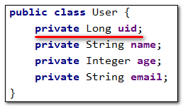
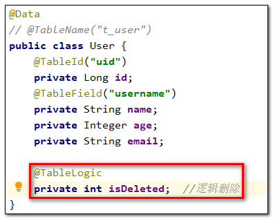
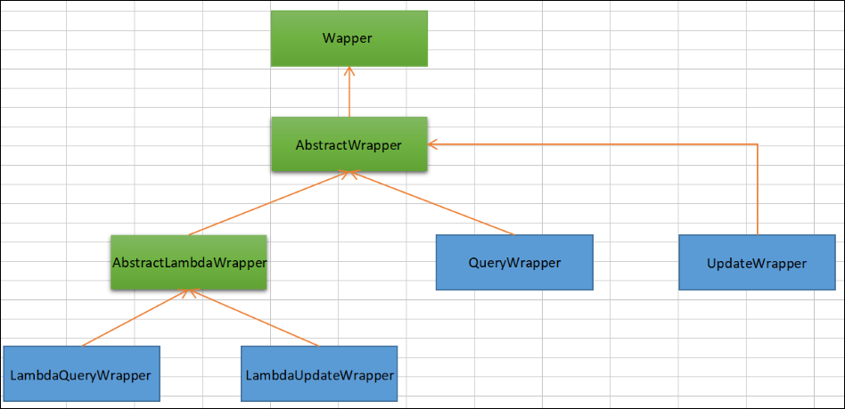
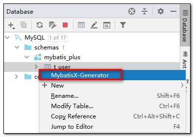
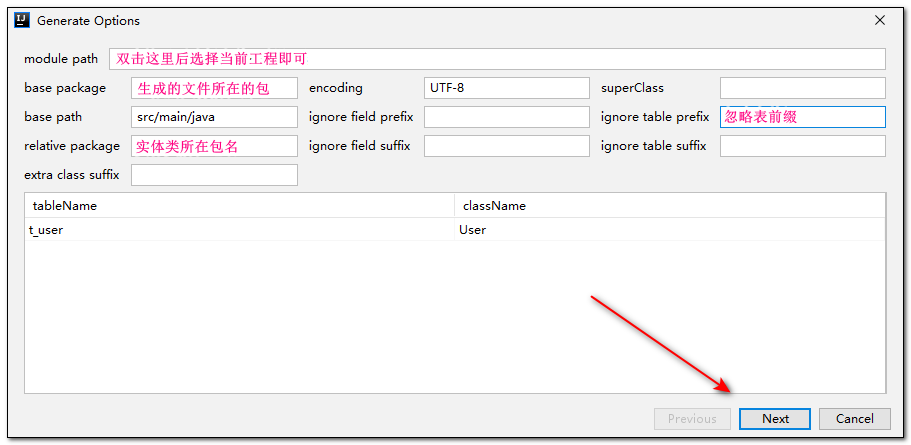
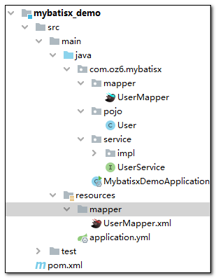
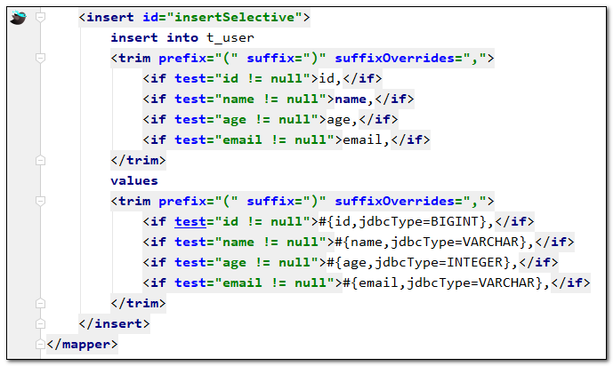

# 一、MyBatis-Plus(官网)

## 1.简介

[MyBatis-Plus (opens new window)](https://github.com/baomidou/mybatis-plus)（简称 MP）是一个 [MyBatis (opens new window)](https://www.mybatis.org/mybatis-3/)的增强工具，在 MyBatis 的基础上只做增强不做改变，为简化开发、提高效率而生。

> 我们的愿景是成为 MyBatis 最好的搭档，就像 [魂斗罗](https://baomidou.com/img/contra.jpg) 中的 1P、2P，基友搭配，效率翻倍。


## 2.特性

- **无侵入**：只做增强不做改变，引入它不会对现有工程产生影响，如丝般顺滑
- **损耗小**：启动即会自动注入基本 CURD，性能基本无损耗，直接面向对象操作
- **强大的 CRUD 操作**：内置通用 Mapper、通用 Service，仅仅通过少量配置即可实现单表大部分 CRUD 操作，更有强大的条件构造器，满足各类使用需求
- **支持 Lambda 形式调用**：通过 Lambda 表达式，方便的编写各类查询条件，无需再担心字段写错
- **支持主键自动生成**：支持多达 4 种主键策略（内含分布式唯一 ID 生成器 - Sequence），可自由配置，完美解决主键问题
- **支持 ActiveRecord 模式**：支持 ActiveRecord 形式调用，实体类只需继承 Model 类即可进行强大的 CRUD 操作
- **支持自定义全局通用操作**：支持全局通用方法注入（ Write once, use anywhere ）
- **内置代码生成器**：采用代码或者 Maven 插件可快速生成 Mapper 、 Model 、 Service 、 Controller 层代码，支持模板引擎，更有超多自定义配置等您来使用
- **内置分页插件**：基于 MyBatis 物理分页，开发者无需关心具体操作，配置好插件之后，写分页等同于普通 List 查询
- **分页插件支持多种数据库**：支持 MySQL、MariaDB、Oracle、DB2、H2、HSQL、SQLite、Postgre、SQLServer 等多种数据库
- **内置性能分析插件**：可输出 SQL 语句以及其执行时间，建议开发测试时启用该功能，能快速揪出慢查询
- **内置全局拦截插件**：提供全表 delete 、 update 操作智能分析阻断，也可自定义拦截规则，预防误操作


## 3.支持数据库

> 任何能使用 `MyBatis` 进行 CRUD, 并且支持标准 SQL 的数据库，具体支持情况如下，如果不在下列表查看分页部分教程 PR 您的支持。
>

- MySQL，Oracle，DB2，H2，HSQL，SQLite，PostgreSQL，SQLServer，Phoenix，Gauss ，ClickHouse，Sybase，OceanBase，Firebird，Cubrid，Goldilocks，csiidb
- 达梦数据库，虚谷数据库，人大金仓数据库，南大通用(华库)数据库，南大通用数据库，神通数据库，瀚高数据库


##  4.框架结构


## 5.官方地址

> **官方网站：**https://baomidou.com/
>
> **官方文档：**https://baomidou.com/pages/24112f/


# 二、入门案例

## 1.开发环境

- **IDE：IDEA 2019.3.5**
- **JDK：JDK8+**
- **构建工具：Maven 3.5.4**
- **MySQL：MySQL 8.0.24**
- **Navicat：Navicat Premium 15**
- **Spring Boot：2.6.7**
- **MyBatis-Plus：3.5.1**


## 2.建库建表

- **打开Navicat运行以下SQL脚本进行建库建表**

  ```sql
  CREATE DATABASE `mybatis_plus` /*!40100 DEFAULT CHARACTER SET utf8mb4 */; 
  use `mybatis_plus`; 
  CREATE TABLE `user` ( 
      `id` bigint(20) NOT NULL COMMENT '主键ID', 
      `name` varchar(30) DEFAULT NULL COMMENT '姓名', 
      `age` int(11) DEFAULT NULL COMMENT '年龄', 
      `email` varchar(50) DEFAULT NULL COMMENT '邮箱', 
      PRIMARY KEY (`id`) 
  ) ENGINE=InnoDB DEFAULT CHARSET=utf8;
  ```

- **插入几条测试数据**

  ```sql
  INSERT INTO user (id, name, age, email) VALUES 
  (1, 'Jone', 18, 'test1@baomidou.com'), 
  (2, 'Jack', 20, 'test2@baomidou.com'), 
  (3, 'Tom', 28, 'test3@baomidou.com'), 
  (4, 'Sandy', 21, 'test4@baomidou.com'), 
  (5, 'Billie', 24, 'test5@baomidou.com');
  ```

  

## 3.创建工程

- **使用`Spring Initializer`快速初始化一个 Spring Boot 工程**

  

  

  

  

- **引入`MyBatis-Plus`的依赖**

  ```xml
  <dependency>
      <groupId>com.baomidou</groupId>
      <artifactId>mybatis-plus-boot-starter</artifactId>
      <version>3.5.1</version>
  </dependency>
  ```

- **安装`Lombok`插件**(较新的idea已经内置lombok)

  


## 4.配置编码

- **配置`application.yml`文件**

  ```yml
  #配置端口
  server:
    port: 80
  
  spring:
    #配置数据源
    datasource:
      #配置数据源类型
      type: com.zaxxer.hikari.HikariDataSource
      #配置连接数据库的信息
      driver-class-name: com.mysql.cj.jdbc.Driver
      url: jdbc:mysql://localhost:3306/mybatis_plus?characterEncoding=utf-8&useSSL=false
      username: root
      password: 123456
  
  #MyBatis-Plus相关配置
  mybatis-plus:
    configuration:
      #配置日志
      log-impl: org.apache.ibatis.logging.stdout.StdOutImpl
  ```

- **在 Spring Boot 启动类中添加 `@MapperScan` 注解，扫描 Mapper 文件夹**

  ```java
  @SpringBootApplication
  @MapperScan("指定Mapper接口所在的包")
  public class MybatisPlusDemoApplication {
  	public static void main(String[] args) {
  		SpringApplication.run(MybatisPlusDemoApplication.class, args);
  	}
  }
  ```

- **编写实体类 `User.java`（此处使用了 Lombok 简化代码）**

  ```java
  @Data
  public class User {
      private Long id;
      private String name;
      private Integer age;
      private String email;
  }
  ```

- **编写 Mapper 包下的 `UserMapper`接口**

  ```java
  public interface UserMapper extends BaseMapper<User> {}
  ```


## 5.测试查询

- **编写一个测试类`MyBatisPlusTest.java`**

  ```java
  @SpringBootTest
  public class MyBatisPlusTest {
      @Resource
      private UserMapper userMapper;
  
      /**
       * 测试查询所有数据
       */
      @Test
      void testSelectList(){
          //通过条件构造器查询一个list集合，若没有条件，则可以设置null为参数
          List<User> users = userMapper.selectList(null);
          users.forEach(System.out::println);
      }
  }
  ```

- **控制台打印查询结果**

  


# 三、增删改查

## 1.BaseMapper&lt;T&gt;

> 说明:
>
> - 通用 CRUD 封装BaseMapper 接口，为 `Mybatis-Plus` 启动时自动解析实体表关系映射转换为 `Mybatis` 内部对象注入容器
> - 泛型 `T` 为任意实体对象
> - 参数 `Serializable` 为任意类型主键 `Mybatis-Plus` 不推荐使用复合主键约定每一张表都有自己的唯一 `id` 主键
> - 对象 `Wrapper` 为条件构造器

MyBatis-Plus中的基本CRUD在内置的BaseMapper中都已得到了实现，因此我们继承该接口以后可以直接使用。

本次演示的CRUD操作不包含参数带有条件构造器的方法，关于条件构造器将单独在一个章节进行演示。

---

> **BaseMapper中提供的CRUD方法：**

- **增加：Insert**

  ```java
  // 插入一条记录
  int insert(T entity);
  ```

- **删除：Delete**

  ```java
  // 根据 entity 条件，删除记录
  int delete(@Param(Constants.WRAPPER) Wrapper<T> wrapper);
  // 删除（根据ID 批量删除）
  int deleteBatchIds(@Param(Constants.COLLECTION) Collection<? extends Serializable> idList);
  // 根据 ID 删除
  int deleteById(Serializable id);
  // 根据 columnMap 条件，删除记录
  int deleteByMap(@Param(Constants.COLUMN_MAP) Map<String, Object> columnMap);
  ```

- **修改：Update**

  ```java
  // 根据 whereWrapper 条件，更新记录
  int update(@Param(Constants.ENTITY) T updateEntity, @Param(Constants.WRAPPER) Wrapper<T> whereWrapper);
  // 根据 ID 修改
  int updateById(@Param(Constants.ENTITY) T entity);
  ```

- **查询：Selete**

  ```java
  // 根据 ID 查询
  T selectById(Serializable id);
  // 根据 entity 条件，查询一条记录
  T selectOne(@Param(Constants.WRAPPER) Wrapper<T> queryWrapper);
  
  // 查询（根据ID 批量查询）
  List<T> selectBatchIds(@Param(Constants.COLLECTION) Collection<? extends Serializable> idList);
  // 根据 entity 条件，查询全部记录
  List<T> selectList(@Param(Constants.WRAPPER) Wrapper<T> queryWrapper);
  // 查询（根据 columnMap 条件）
  List<T> selectByMap(@Param(Constants.COLUMN_MAP) Map<String, Object> columnMap);
  // 根据 Wrapper 条件，查询全部记录
  List<Map<String, Object>> selectMaps(@Param(Constants.WRAPPER) Wrapper<T> queryWrapper);
  // 根据 Wrapper 条件，查询全部记录。注意： 只返回第一个字段的值
  List<Object> selectObjs(@Param(Constants.WRAPPER) Wrapper<T> queryWrapper);
  
  // 根据 entity 条件，查询全部记录（并翻页）
  IPage<T> selectPage(IPage<T> page, @Param(Constants.WRAPPER) Wrapper<T> queryWrapper);
  // 根据 Wrapper 条件，查询全部记录（并翻页）
  IPage<Map<String, Object>> selectMapsPage(IPage<T> page, @Param(Constants.WRAPPER) Wrapper<T> queryWrapper);
  // 根据 Wrapper 条件，查询总记录数
  Integer selectCount(@Param(Constants.WRAPPER) Wrapper<T> queryWrapper);
  ```


## 2.调用Mapper层实现CRUD

### 2.1	插入

---

> **最终执行的结果，所获取的id为1527206783590903810**
>
> **这是因为MyBatis-Plus在实现插入数据时，会默认基于雪花算法的策略生成id**

```java
/**
  * 测试插入一条数据
  * MyBatis-Plus在实现插入数据时，会默认基于雪花算法的策略生成id
  */
@Test
public void testInsert(){
    User user = new User();
    user.setName("Vz");
    user.setAge(21);
    user.setEmail("vz@oz6.cn");
    int result = userMapper.insert(user);
    System.out.println(result > 0 ? "添加成功！" : "添加失败！");
    System.out.println("受影响的行数为：" + result);
    //1527206783590903810（当前 id 为雪花算法自动生成的id）
    System.out.println("id自动获取" + user.getId());
}
```


### 2.2	删除

---

#### a、根据ID删除数据

> **调用方法：int deleteById(Serializable id);**

```java
/**
  * 测试根据id删除一条数据
  */
@Test
public void testDeleteById(){
    int result = userMapper.deleteById(1527206783590903810L);
    System.out.println(result > 0 ? "删除成功！" : "删除失败！");
    System.out.println("受影响的行数为：" + result);
}
```


#### b、根据ID批量删除数据

> **调用方法：int deleteBatchIds(@Param(Constants.COLLECTION) Collection<? extends Serializable> idList);**

```java
/**
  * 测试通过id批量删除数据
  */
@Test
public void testDeleteBatchIds(){
    List<Long> ids = Arrays.asList(6L,7L,8L);
    int result = userMapper.deleteBatchIds(ids);
    System.out.println(result > 0 ? "删除成功！" : "删除失败！");
    System.out.println("受影响的行数为：" + result);
}
```


#### c、根据Map条件删除数据

> **调用方法：int deleteByMap(@Param(Constants.COLUMN_MAP) Map<String, Object> columnMap);**

```java
/**
   * 测试根据Map集合中所设置的条件删除数据
   */
@Test
public void testDeleteByMap(){
    //当前演示为根据name和age删除数据
    //执行SQL为：DELETE FROM user WHERE name = ? AND age = ?
    Map<String,Object> map = new HashMap<>();
    map.put("name","Vz");
    map.put("age",21);
    int result = userMapper.deleteByMap(map);
    System.out.println(result > 0 ? "删除成功！" : "删除失败！");
    System.out.println("受影响的行数为：" + result);
}
```


### 2.3	修改

> **调用方法：int updateById(@Param(Constants.ENTITY) T entity);**

```java
/**
  * 测试根据id修改用户信息
  */
@Test
public void testUpdateById(){
    //执行SQL为： UPDATE user SET name=?, age=?, email=? WHERE id=?
    User user = new User();
    user.setId(6L);
    user.setName("VzUpdate");
    user.setAge(18);
    user.setEmail("Vz@sina.com");
    int result = userMapper.updateById(user);
    System.out.println(result > 0 ? "修改成功！" : "修改失败！");
    System.out.println("受影响的行数为：" + result);
}
```


### 2.4	查询

---

#### a、根据ID查询用户信息

> **调用方法：T selectById(Serializable id);**

```java
/**
  * 测试根据id查询用户数据
  */
@Test
public void testSelectById(){
    User user = userMapper.selectById(1L);
    System.out.println(user);
}
```


#### b、根据多个ID查询多个用户信息

> **调用方法：List<T> selectBatchIds(@Param(Constants.COLLECTION) Collection<? extends Serializable> idList);**

```java
/**
  * 根据多个id查询用户数据
  */
@Test
public void testSelectBatchIds(){
    //执行SQL为：SELECT id,name,age,email FROM user WHERE id IN ( ? , ? , ? )
    List<Long> ids = Arrays.asList(1L,2L,3L);
    List<User> users = userMapper.selectBatchIds(ids);
    users.forEach(System.out::println);
}
```


#### c、根据Map条件查询用户信息

> **调用方法：List<T> selectByMap(@Param(Constants.COLUMN_MAP) Map<String, Object> columnMap);**

```java
/**
  * 根据Map所设置的条件查询用户
  */
@Test
public void testSelectByMap(){
    //执行SQL为：SELECT id,name,age,email FROM user WHERE age = ?
    Map<String,Object> map = new HashMap<>();
    map.put("age",18);
    List<User> users = userMapper.selectByMap(map);
    users.forEach(System.out::println);
}
```


#### d、查询所有用户信息

> **调用方法：List<T> selectList(@Param(Constants.WRAPPER) Wrapper<T> queryWrapper);**

```java
/**
  * 测试查询所有数据
  */
@Test
void testSelectList(){
    List<User> users = userMapper.selectList(null);
    users.forEach(System.out::println);
}
```


## 3.通用Service

> 说明:
>
> - 通用 Service CRUD 封装`IService`接口，进一步封装 CRUD 采用 `get 查询单行` `remove 删除` `list 查询集合` `page 分页` 前缀命名方式区分 `Mapper` 层避免混淆，
> - 泛型 `T` 为任意实体对象
> - 建议如果存在自定义通用 Service 方法的可能，请创建自己的 `IBaseService` 继承 `Mybatis-Plus` 提供的基类
> - 对象 `Wrapper` 为 条件构造器

MyBatis-Plus中有一个接口 **`IService`**和其实现类 **`ServiceImpl`**，封装了常见的业务层逻辑，详情查看源码IService和ServiceImpl

因此我们在使用的时候仅需在自己定义的**`Service`**接口中继承**`IService`**接口，在自己的实现类中实现自己的Service并继承**`ServiceImpl`**即可

---

> **IService中的CRUD方法**

- **增加：Save、SaveOrUpdate**

  ```java
  // 插入一条记录（选择字段，策略插入）
  boolean save(T entity);
  // 插入（批量）
  boolean saveBatch(Collection<T> entityList);
  // 插入（批量）
  boolean saveBatch(Collection<T> entityList, int batchSize);
  
  // TableId 注解存在更新记录，否插入一条记录
  boolean saveOrUpdate(T entity);
  // 根据updateWrapper尝试更新，否继续执行saveOrUpdate(T)方法
  boolean saveOrUpdate(T entity, Wrapper<T> updateWrapper);
  // 批量修改插入
  boolean saveOrUpdateBatch(Collection<T> entityList);
  // 批量修改插入
  boolean saveOrUpdateBatch(Collection<T> entityList, int batchSize);
  ```

- **删除：Remove**

  ```java
  // 根据 entity 条件，删除记录
  boolean remove(Wrapper<T> queryWrapper);
  // 根据 ID 删除
  boolean removeById(Serializable id);
  // 根据 columnMap 条件，删除记录
  boolean removeByMap(Map<String, Object> columnMap);
  // 删除（根据ID 批量删除）
  boolean removeByIds(Collection<? extends Serializable> idList);
  ```

- **修改：Update**

  ```java
  // 根据 UpdateWrapper 条件，更新记录 需要设置sqlset
  boolean update(Wrapper<T> updateWrapper);
  // 根据 whereWrapper 条件，更新记录
  boolean update(T updateEntity, Wrapper<T> whereWrapper);
  // 根据 ID 选择修改
  boolean updateById(T entity);
  // 根据ID 批量更新
  boolean updateBatchById(Collection<T> entityList);
  // 根据ID 批量更新
  boolean updateBatchById(Collection<T> entityList, int batchSize);
  ```

- **查询：Get、List、Count**

  ```java
  // 根据 ID 查询
  T getById(Serializable id);
  // 根据 Wrapper，查询一条记录。结果集，如果是多个会抛出异常，随机取一条加上限制条件 wrapper.last("LIMIT 1")
  T getOne(Wrapper<T> queryWrapper);
  // 根据 Wrapper，查询一条记录
  T getOne(Wrapper<T> queryWrapper, boolean throwEx);
  // 根据 Wrapper，查询一条记录
  Map<String, Object> getMap(Wrapper<T> queryWrapper);
  // 根据 Wrapper，查询一条记录
  <V> V getObj(Wrapper<T> queryWrapper, Function<? super Object, V> mapper);
  
  
  // 查询所有
  List<T> list();
  // 查询列表
  List<T> list(Wrapper<T> queryWrapper);
  // 查询（根据ID 批量查询）
  Collection<T> listByIds(Collection<? extends Serializable> idList);
  // 查询（根据 columnMap 条件）
  Collection<T> listByMap(Map<String, Object> columnMap);
  // 查询所有列表
  List<Map<String, Object>> listMaps();
  // 查询列表
  List<Map<String, Object>> listMaps(Wrapper<T> queryWrapper);
  // 查询全部记录
  List<Object> listObjs();
  // 查询全部记录
  <V> List<V> listObjs(Function<? super Object, V> mapper);
  // 根据 Wrapper 条件，查询全部记录
  List<Object> listObjs(Wrapper<T> queryWrapper);
  // 根据 Wrapper 条件，查询全部记录
  <V> List<V> listObjs(Wrapper<T> queryWrapper, Function<? super Object, V> mapper);
  
  // 查询总记录数
  int count();
  // 根据 Wrapper 条件，查询总记录数
  int count(Wrapper<T> queryWrapper);
  ```

- **分页：Page**

  ```java
  // 根据 ID 查询
  T getById(Serializable id);
  // 根据 Wrapper，查询一条记录。结果集，如果是多个会抛出异常，随机取一条加上限制条件 wrapper.last("LIMIT 1")
  T getOne(Wrapper<T> queryWrapper);
  // 根据 Wrapper，查询一条记录
  T getOne(Wrapper<T> queryWrapper, boolean throwEx);
  // 根据 Wrapper，查询一条记录
  Map<String, Object> getMap(Wrapper<T> queryWrapper);
  // 根据 Wrapper，查询一条记录
  <V> V getObj(Wrapper<T> queryWrapper, Function<? super Object, V> mapper);
  ```

  

## 4.调用Service层操作数据

> 我们在自己的Service接口中通过继承MyBatis-Plus提供的IService接口，不仅可以获得其提供的CRUD方法，而且还可以使用自身定义的方法。

- **创建`UserService`并继承`IService`**

  ```java
  /**
    * UserService继承IService模板提供的基础功能 
    */
  public interface UserService extends IService<User> {}
  ```

- **创建`UserService`的实现类并继承`ServiceImpl`**

  ```java
  /**
    * ServiceImpl实现了IService，提供了IService中基础功能的实现 
    * 若ServiceImpl无法满足业务需求，则可以使用自定的UserService定义方法，并在实现类中实现
    */
  @Service
  public class UserServiceImpl extends ServiceImpl<UserMapper,User> implements UserService{}
  ```

- **测试查询记录数**

  > **调用方法：int count();**

  ```java
  @Test
  public void testGetCount(){
      //查询总记录数
      //执行的SQL为：SELECT COUNT( * ) FROM user
      long count = userService.count();
      System.out.println("总记录数：" + count);
  }
  ```

- **测试批量插入数据**

  > **调用方法：boolean saveBatch(Collection<T> entityList);**

  ```java
  @Test
  public void test(){
      List<User> list = new ArrayList<>();
      for (int i = 1; i <= 10; i++) {
          User user = new User();
          user.setName("Vz"+i);
          user.setAge(20+i);
          list.add(user);
      }
      boolean b = userService.saveBatch(list);
      System.out.println(b ? "添加成功！" : "添加失败！");
  }
  ```


# 四、常用注解

> MyBatis-Plus提供的注解可以帮我们解决一些数据库与实体之间相互映射的问题。


## 1.@TableName

> 经过以上的测试，在使用MyBatis-Plus实现基本的CRUD时，我们并没有指定要操作的表，只是在Mapper接口继承BaseMapper时，设置了泛型User，而操作的表为user表，由此得出结论，MyBatis-Plus在确定操作的表时，由BaseMapper的泛型决定，即实体类型决定，且默认操作的表名和实体类型的类名一致。


### 1.1	引出问题

---

> **若实体类类型的类名和要操作的表的表名不一致，会出现什么问题？**

- 我们将表`user`更名为`t_user`，测试查询功能

  

- 程序抛出异常，**Table 'mybatis_plus.user' doesn't exist**，因为现在的表名为`t_user`，而默认操作的表名和实体类型的类名一致，即`user`表

  


### 1.2	解决问题

---


#### a、使用注解解决问题

> **在实体类类型上添加`@TableName("t_user")`，标识实体类对应的表，即可成功执行SQL语句**

```java
@Data
@TableName("t_user")
public class User {
    private Long id;
    private String name;
    private Integer age;
    private String email;
}
```


#### b、使用全局配置解决问题

> **在开发的过程中，我们经常遇到以上的问题，即实体类所对应的表都有固定的前缀，例如 `t_` 或 `tbl_` 此时，可以使用MyBatis-Plus提供的全局配置，为实体类所对应的表名设置默认的前缀，那么就不需要在每个实体类上通过@TableName标识实体类对应的表**

```yml
mybatis-plus:
  global-config:
    db-config:
      # 设置实体类所对应的表的统一前缀
      table-prefix: t_
```


## 2.@TableId

> **经过以上的测试，MyBatis-Plus在实现CRUD时，会默认将id作为主键列，并在插入数据时，默认基于雪花算法的策略生成id**


### 2.1	引出问题

---

> **若实体类和表中表示主键的不是id，而是其他字段，例如uid，MyBatis-Plus会自动识别uid为主键列吗？**

- 我们实体类中的属性`id`改为`uid`，将表中的字段`id`也改为`uid`，测试添加功能

  

  

- 程序抛出异常，**Field 'uid' doesn't have a default value**，说明MyBatis-Plus没有将`uid`作为主键赋值

  


### 2.2	解决问题

---

> **在实体类中uid属性上通过`@TableId`将其标识为主键，即可成功执行SQL语句**

```java
@Date
public class User {
    @TableId
    private Long uid;
    private String name;
    private Integer age;
    private String email;
}
```

```
备注:  关于@TableId使用的三种情况:
		1、实体类中主键为id,数据库主键也为id,此时可以不用声明@TableId,因为mybatis-plus默认会使用id作为主键
		2、当实体类主键和数据库主键名一致,但不是id,需要声明@TableId即可
		3、当实体类主键和数据库主键名不一致时,需要声明@TableId("数据库主键名"),此时注解的值需要写上数据库主键的名
```


### 2.3	@TableId的value属性

---

> 若实体类中主键对应的属性为id，而表中表示主键的字段为uid，此时若只在属性id上添加注解@TableId，则抛出异常**Unknown column 'id' in 'field list'**，即MyBatis-Plus仍然会将id作为表的主键操作，而表中表示主键的是字段uid此时需要通过@TableId注解的value属性，指定表中的主键字段，`@TableId("uid")`或`@TableId(value="uid")`


### 2.4	@TableId的type属性

---

> **type属性用来定义主键策略：默认雪花算法**

**常用的主键策略：**

|            值            |                             描述                             |
| :----------------------: | :----------------------------------------------------------: |
| IdType.ASSIGN_ID（默认） |   基于雪花算法的策略生成数据id，与数据库id是否设置自增无关   |
|       IdType.AUTO        | 使用数据库的自增策略，注意，该类型请确保数据库设置了id自增， |


**配置全局主键策略：**

```yml
#MyBatis-Plus相关配置
mybatis-plus:
  configuration:
    #配置日志
    log-impl: org.apache.ibatis.logging.stdout.StdOutImpl
  global-config:
    db-config:
      #配置mp的主键策略为自增
      id-type: auto
      # 设置实体类所对应的表的统一前缀
      table-prefix: t_
```


## 3.@TbaleField

> 经过以上的测试，我们可以发现，MyBatis-Plus在执行SQL语句时，要保证实体类中的属性名和表中的字段名一致
>
> 如果实体类中的属性名和字段名不一致的情况，会出现什么问题呢？


### 3.1	情况一

---

若实体类中的属性使用的是驼峰命名风格，而表中的字段使用的是下划线命名风格

例如实体类属性`userName`，表中字段`user_name`

此时MyBatis-Plus会自动将下划线命名风格转化为驼峰命名风格

相当于在MyBatis中配置


### 3.2	情况二

---

> 若实体类中的属性和表中的字段不满足情况1
>
> 例如实体类属性`name`，表中字段`username`
>
> 此时需要在实体类属性上使用`@TableField("username")`设置属性所对应的字段名

```java
public class User {
    @TableId("uid")
    private Long id;
    @TableField("username")
    private String name;
    private Integer age;
    private String email;
}
```


## 4.@TableLogic


### 4.1	逻辑删除

---

> 物理删除：真实删除，将对应数据从数据库中删除，之后查询不到此条被删除的数据
>
> 逻辑删除：假删除，将对应数据中代表是否被删除字段的状态修改为“被删除状态”，之后在数据库中仍旧能看到此条数据记录
>
> 使用场景：可以进行数据恢复


### 4.2	实现逻辑删除

---

- **数据库中创建逻辑删除状态列，设置默认值为0**

  

- **实体类中添加逻辑删除属性**

  

- **测试删除功能，真正执行的是修改**

  ```java
  public void testDeleteById(){
      int result = userMapper.deleteById(1527472864163348482L);
      System.out.println(result > 0 ? "删除成功！" : "删除失败！");
      System.out.println("受影响的行数为：" + result);
  }
  ```

  

- **此时执行查询方法，查询的结果为自动添加条件`is_deleted=0`**

  


# 五、条件构造器

## 1.Wrapper介绍



- `Wrapper` ： 条件构造抽象类，最顶端父类

  - `AbstractWrapper `： 用于查询条件封装，生成 sql 的 where 条件

    - `QueryWrapper `： 查询条件封装

    - `UpdateWrapper `： Update 条件封装

    - `AbstractLambdaWrapper `： 使用Lambda 语法

      - `LambdaQueryWrapper `：用于Lambda语法使用的查询Wrapper

      - `LambdaUpdateWrapper `： Lambda 更新封装Wrapper


## 2.QueryWrapper

- **组装查询条件**

  > **执行SQL：**SELECT uid AS id,username AS name,age,email,is_deleted FROM t_user WHERE is_deleted=0 AND (username LIKE ? AND age BETWEEN ? AND ? AND email IS NOT NULL)

  ```java
  public void test01(){
      //查询用户名包含a，年龄在20到30之间，邮箱信息不为null的用户信息
      QueryWrapper<User> queryWrapper = new QueryWrapper<>();
      queryWrapper.like("username","a").between("age",20,30).isNotNull("email");
      List<User> users = userMapper.selectList(queryWrapper);
      users.forEach(System.out::println);
  }
  ```

- **组装排序条件**

  > **执行SQL：**SELECT uid AS id,username AS name,age,email,is_deleted FROM t_user WHERE is_deleted=0 ORDER BY age DESC,id ASC

  ```java
  public void test02(){
      //查询用户信息，按照年龄的降序排序，若年龄相同，则按照id升序排序
      QueryWrapper<User> queryWrapper = new QueryWrapper<>();
      queryWrapper.orderByDesc("age").orderByAsc("id");
      List<User> users = userMapper.selectList(queryWrapper);
      users.forEach(System.out::println);
  }
  ```

- **组装删除条件**

  > **执行SQL：**UPDATE t_user SET is_deleted=1 WHERE is_deleted=0 AND (email IS NULL)

  ```java
  public void test03(){
      //删除邮箱地址为null的用户信息
      QueryWrapper<User> queryWrapper = new QueryWrapper<>();
      queryWrapper.isNull("email");
      int result = userMapper.delete(queryWrapper);
      System.out.println(result > 0 ? "删除成功！" : "删除失败！");
      System.out.println("受影响的行数为：" + result);
  }
  ```

- **条件的优先级**

  > **执行SQL：**UPDATE t_user SET user_name=?, email=? WHERE is_deleted=0 AND (age > ? AND user_name LIKE ? OR email IS NULL)

  ```java
  public void test04(){
      //将（年龄大于20并且用户名中包含有a）或邮箱为null的用户信息修改
      UpdateWrapper<User> updateWrapper = new UpdateWrapper<>();
      updateWrapper.gt("age",20).like("username","a").or().isNull("email");
      User user = new User();
      user.setName("Oz");
      user.setEmail("test@oz6.com");
  
      int result = userMapper.update(user, updateWrapper);
      System.out.println(result > 0 ? "修改成功！" : "修改失败！");
      System.out.println("受影响的行数为：" + result);
  }
  ```

  > **执行SQL：**UPDATE t_user SET username=?, email=? WHERE is_deleted=0 AND (username LIKE ? AND (age > ? OR email IS NULL))

  ```java
  public void test05(){
      //将用户名中包含有a并且（年龄大于20或邮箱为null）的用户信息修改
      UpdateWrapper<User> updateWrapper = new UpdateWrapper<>();
      updateWrapper.like("username","a").and(i->i.gt("age",20).or().isNull("email"));
      User user = new User();
      user.setName("Vz7797");
      user.setEmail("test@ss8o.com");
  
      int result = userMapper.update(user, updateWrapper);
      System.out.println(result > 0 ? "修改成功！" : "修改失败！");
      System.out.println("受影响的行数为：" + result);
  }
  ```

- **组装select子句**

  > **执行SQL：**SELECT username,age,email FROM t_user WHERE is_deleted=0

  ```java
  public void test06(){
      //查询用户的用户名、年龄、邮箱信息
      QueryWrapper<User> queryWrapper = new QueryWrapper<>();
      queryWrapper.select("username","age","email");
      List<Map<String, Object>> maps = userMapper.selectMaps(queryWrapper);
      maps.forEach(System.out::println);
  }
  ```

- **实现子查询**

  > **执行SQL：**SELECT uid AS id,user_name AS name,age,email,is_deleted FROM t_user WHERE is_deleted=0 AND (uid IN (select uid from t_user where uid <= 100))

  ```java
  public void test07(){
      //查询id小于等于100的用户信息
      QueryWrapper<User> queryWrapper = new QueryWrapper<>();
      queryWrapper.inSql("uid", "select uid from t_user where uid <= 100");
      List<User> list = userMapper.selectList(queryWrapper);
      list.forEach(System.out::println);
  }
  ```

  

## 3.UpdateWrapper

> UpdateWrapper不仅拥有QueryWrapper的组装条件功能，还提供了set方法进行修改对应条件的数据库信息

```java
public void test08(){
    //将用户名中包含有a并且（年龄大于20或邮箱为null）的用户信息修改
    UpdateWrapper<User> updateWrapper = new UpdateWrapper<>();
    updateWrapper.like("username","a").and( i -> i.gt("age",20).or().isNull("email")).set("email","svip@qq.com");
    int result = userMapper.update(null, updateWrapper);
    System.out.println(result > 0 ? "修改成功！" : "修改失败！");
    System.out.println("受影响的行数为：" + result);
}
```


## 4.condition

> 在真正开发的过程中，组装条件是常见的功能，而这些条件数据来源于用户输入，是可选的，因此我们在组装这些条件时，必须先判断用户是否选择了这些条件，若选择则需要组装该条件，若没有选择则一定不能组装，以免影响SQL执行的结果


- **思路一**

  > **执行SQL：**SELECT uid AS id,user_name AS name,age,email,is_deleted FROM t_user WHERE is_deleted=0 AND (user_name LIKE ? AND age <= ?)

  ```java
   public void test09(){
       String username = "a";
       Integer ageBegin = null;
       Integer ageEnd = 30;
       QueryWrapper<User> queryWrapper = new QueryWrapper<>();
       if(StringUtils.isNotBlank(username)){
           //isNotBlank判断某个字符创是否不为空字符串、不为null、不为空白符
           queryWrapper.like("user_name", username);
       }
       if(ageBegin != null){
           queryWrapper.ge("age", ageBegin);
       }
       if(ageEnd != null){
           queryWrapper.le("age", ageEnd);
       }
       List<User> list = userMapper.selectList(queryWrapper);
       list.forEach(System.out::println);
   }
  ```

- **思路二**

  > 上面的实现方案没有问题，但是代码比较复杂，我们可以使用带condition参数的重载方法构建查询条件，简化代码的编写

  ```java
  public void test10(){
      String username = "a";
      Integer ageBegin = null;
      Integer ageEnd = 30;
      QueryWrapper<User> queryWrapper = new QueryWrapper<>();
      queryWrapper.like(StringUtils.isNotBlank(username), "user_name", username)
          .ge(ageBegin != null, "age", ageBegin)
          .le(ageEnd != null, "age", ageEnd);
      List<User> list = userMapper.selectList(queryWrapper);
      list.forEach(System.out::println);
  }
  ```

  

## 5.LambdaQueryWrapper(推荐)

> 功能等同于QueryWrapper，提供了Lambda表达式的语法可以避免填错列名。

```java
public void test11(){
    String username = "a";
    Integer ageBegin = null;
    Integer ageEnd = 30;
    LambdaQueryWrapper<User> queryWrapper = new LambdaQueryWrapper<>();
    queryWrapper.like(StringUtils.isNotBlank(username), User::getName, username)
        .ge(ageBegin != null, User::getAge, ageBegin)
        .le(ageEnd != null, User::getAge, ageEnd);
    List<User> list = userMapper.selectList(queryWrapper);
    list.forEach(System.out::println);
}
```


## 6.LambdaUpdateWrapper(推荐)

> 功能等同于UpdateWrapper，提供了Lambda表达式的语法可以避免填错列名。

```java
public void test12(){
    //将用户名中包含有a并且（年龄大于20或邮箱为null）的用户信息修改
    LambdaUpdateWrapper<User> updateWrapper = new LambdaUpdateWrapper<>();
    updateWrapper.like(User::getName, "a")
        .and(i -> i.gt(User::getAge, 20).or().isNull(User::getEmail));
    updateWrapper.set(User::getName, "小黑").set(User::getEmail,"abc@atguigu.com");
    int result = userMapper.update(null, updateWrapper);
    System.out.println("result："+result);
}
```

```
备注: 1、QueryWrapper和UpdateWrapper中的字段都是写死的,而LambdaQueryWrapper和LambdaUpdateWrapper是动态的选择列名,因此比较推荐后两者
	 2、利用Wrapper可以方便地实现对数据的 查、删、改
```


# 六、常用插件

## 1.分页插件

> MyBatis Plus自带分页插件，只要简单的配置即可实现分页功能

- **添加配置类`MyBatisPlusConfig`**

  ```java
  @Configuration
  @MapperScan("com.atguigu.mybatisplus.mapper")
  public class MyBatisPlusConfig {
      // MybatisPlusInterceptor中配置插件,springboot笔记中也有
      @Bean
      public MybatisPlusInterceptor mybatisPlusInterceptor(){
          MybatisPlusInterceptor interceptor = new MybatisPlusInterceptor();
          //添加分页插件
          interceptor.addInnerInterceptor(new PaginationInnerInterceptor(DbType.MYSQL));
          return interceptor;
      }
  }
  ```

- **编写测试方法**

  ```java
  @Test
  public void testPage(){
      //new Page()中的两个参数分别是当前页码，每页显示数量
      Page<User> page = userMapper.selectPage(new Page<>(1, 2), null);
      List<User> users = page.getRecords();
      users.forEach(System.out::println);
  }
  ```

  

## 2.自定义分页

> 上面调用的是MyBatis-Plus提供的带有分页的方法，那么我们自己定义的方法如何实现分页呢？

- **在`UserMapper`接口中定义一个方法**

  ```java
  /**
    * 根据年龄查询用户列表，分页显示 
    * @param page 分页对象,xml中可以从里面进行取值,传递参数 Page 即自动分页,必须放在第一位 
    * @param age 年龄 
    * @return 
    */
  Page<User> selectPageVo(@Param("page") Page<User> page,@Param("age") Integer age);
  ```

- **在`UserMapper.xml`中编写SQL实现该方法**

  ```xml
  <select id="selectPageVo" resultType="User">
      select id,username as name,age,email from t_user where age > #{age}
  </select>
  ```

- **编写测试方法**

  ```java
  @Test
  public void testPageVo(){
      Page<User> page = userMapper.selectPageVo(new Page<User>(1,2), 20);
      List<User> users = page.getRecords();
      users.forEach(System.out::println);
  }
  ```


## 3.乐观锁

> **作用：当要更新一条记录的时候，希望这条记录没有被别人更新**

乐观锁的实现方式：

- 取出记录时，获取当前 version
- 更新时，带上这个 version
- 执行更新时， set version = newVersion where version = oldVersion
- 如果 version 不对，就更新失败


### 3.1	场景

---

- 一件商品，成本价是80元，售价是100元。老板先是通知小李，说你去把商品价格增加50元。小李正在玩游戏，耽搁了一个小时。正好一个小时后，老板觉得商品价格增加到150元，价格太高，可能会影响销量。又通知小王，你把商品价格降低30元。
- 此时，小李和小王同时操作商品后台系统。小李操作的时候，系统先取出商品价格100元；小王也在操作，取出的商品价格也是100元。小李将价格加了50元，并将100+50=150元存入了数据库；小王将商品减了30元，并将100-30=70元存入了数据库。是的，如果没有锁，小李的操作就完全被小王的覆盖了。
- 现在商品价格是70元，比成本价低10元。几分钟后，这个商品很快出售了1千多件商品，老板亏1万多。


### 3.2	乐观锁与悲观锁

---

- 上面的故事，如果是乐观锁，小王保存价格前，会检查下价格是否被人修改过了。如果被修改过了，则重新取出的被修改后的价格，150元，这样他会将120元存入数据库。
- 如果是悲观锁，小李取出数据后，小王只能等小李操作完之后，才能对价格进行操作，也会保证最终的价格是120元。

```
备注: 乐观锁 => 加一个版本号, 悲观锁 => 常见的方式(比如将方法改为同步方法)
```


### 3.3	模拟修改冲突

---

- **数据库中增加商品表**

  ```sql
  CREATE TABLE t_product ( 
      id BIGINT(20) NOT NULL COMMENT '主键ID', 
      NAME VARCHAR(30) NULL DEFAULT NULL COMMENT '商品名称', 
      price INT(11) DEFAULT 0 COMMENT '价格', 
      VERSION INT(11) DEFAULT 0 COMMENT '乐观锁版本号', 
      PRIMARY KEY (id) 
  );
  ```

- **添加一条数据**

  ```sql
  INSERT INTO t_product (id, NAME, price) VALUES (1, '外星人笔记本', 100);
  ```

- **添加一个实体类`Product`**

  ```java
  @Data
  public class Product {
      private Long id;
      private String name;
      private Integer price;
      private Integer version;
  }
  ```

- **添加一个Mapper接口`ProductMapper`**

  ```java
  public interface ProductMapper extends BaseMapper<Product> {}
  ```

- **测试方法**

  ```java
  @Test
  public void testProduct01(){
      //1.小李获取商品价格
      Product productLi = productMapper.selectById(1);
      System.out.println("小李获取的商品价格为：" + productLi.getPrice());
  
      //2.小王获取商品价格
      Product productWang = productMapper.selectById(1);
      System.out.println("小李获取的商品价格为：" + productWang.getPrice());
  
      //3.小李修改商品价格+50
      productLi.setPrice(productLi.getPrice()+50);
      productMapper.updateById(productLi);
  
      //4.小王修改商品价格-30
      productWang.setPrice(productWang.getPrice()-30);
      productMapper.updateById(productWang);
  
      //5.老板查询商品价格
      Product productBoss = productMapper.selectById(1);
      System.out.println("老板获取的商品价格为：" + productBoss.getPrice());
  }
  ```

- **执行结果**

  


### 3.4	乐观锁解决问题

---

- **实体类`version`字段添加注解`@Version`**

  ```java
  @Data
  public class Product {
      private Long id;
      private String name;
      private Integer price;
      @Version
      private Integer version;
  }
  ```

- **添加乐观锁插件配置**

  ```java
  @Bean
  public MybatisPlusInterceptor mybatisPlusInterceptor(){
      MybatisPlusInterceptor interceptor = new MybatisPlusInterceptor();
      //添加分页插件
      interceptor.addInnerInterceptor(new PaginationInnerInterceptor(DbType.MYSQL));
      //添加乐观锁插件
      interceptor.addInnerInterceptor(new OptimisticLockerInnerInterceptor());
      return interceptor;
  }
  ```

- **再次执行测试方法**

  > 小李查询商品信息：
  >
  > ​	SELECT id,name,price,version FROM t_product WHERE id=?
  >
  > 小王查询商品信息：
  >
  > ​	SELECT id,name,price,version FROM t_product WHERE id=?
  >
  > 小李修改商品价格，自动将version+1
  >
  > ​	UPDATE t_product SET name=?, price=?, version=? WHERE id=? AND version=?
  >
  > ​	Parameters: 外星人笔记本(String), 150(Integer), 1(Integer), 1(Long), 0(Integer)
  >
  > 小王修改商品价格，此时version已更新，条件不成立，修改失败
  >
  > ​	UPDATE t_product SET name=?, price=?, version=? WHERE id=? AND version=?
  >
  > ​	Parameters: 外星人笔记本(String), 70(Integer), 1(Integer), 1(Long), 0(Integer)
  >
  > 最终，小王修改失败，查询价格：150
  >
  > ​	SELECT id,name,price,version FROM t_product WHERE id=?

- **优化执行流程**

  ```java
  @Test
  public void testProduct01(){
      //1.小李获取商品价格
      Product productLi = productMapper.selectById(1);
      System.out.println("小李获取的商品价格为：" + productLi.getPrice());
  
      //2.小王获取商品价格
      Product productWang = productMapper.selectById(1);
      System.out.println("小李获取的商品价格为：" + productWang.getPrice());
  
      //3.小李修改商品价格+50
      productLi.setPrice(productLi.getPrice()+50);
      productMapper.updateById(productLi);
  
      //4.小王修改商品价格-30
      productWang.setPrice(productWang.getPrice()-30);
      int result = productMapper.updateById(productWang);
      if(result == 0){
          //操作失败，重试
          Product productNew = productMapper.selectById(1);
          productNew.setPrice(productNew.getPrice()-30);
          productMapper.updateById(productNew);
      }
  
      //5.老板查询商品价格
      Product productBoss = productMapper.selectById(1);
      System.out.println("老板获取的商品价格为：" + productBoss.getPrice());
  }
  ```

  

  
  
  

# 七、通用枚举

> 表中的有些字段值是固定的，例如性别（男或女），此时我们可以使用MyBatis-Plus的通用枚举来实现

- **数据库表添加字段`sex`**

  

- **创建通用枚举类型**

  ```java
  @Getter
  public enum SexEnum {
      MALE(1, "男"),
      FEMALE(2, "女");
  
      @EnumValue //将注解所标识的属性的值存储到数据库中
      private int sex;
      private String sexName;
  
      SexEnum(Integer sex, String sexName) {
          this.sex = sex;
          this.sexName = sexName;
      }
  }
  ```

- **User实体类中添加属性sex**

  ```java
  public class User {
      private Long id;
      @TableField("username")
      private String name;
      private Integer age;
      private String email;
  
      @TableLogic
      private int isDeleted;  //逻辑删除
  
      private SexEnum sex;
  }
  ```

- **配置扫描通用枚举**(type-enums-package)

  ```yml
  #MyBatis-Plus相关配置
  mybatis-plus:
    #指定mapper文件所在的地址
    mapper-locations: classpath:mapper/*.xml
    configuration:
      #配置日志
      log-impl: org.apache.ibatis.logging.stdout.StdOutImpl
    global-config:
      banner: off
      db-config:
        #配置mp的主键策略为自增
        id-type: auto
        # 设置实体类所对应的表的统一前缀
        table-prefix: t_
    #配置类型别名所对应的包
    type-aliases-package: com.atguigu.mybatisplus.pojo
    # 扫描通用枚举的包
    type-enums-package: com.atguigu.mybatisplus.enums
  ```

- **执行测试方法**

  ```java
  @Test
  public void test(){
      User user = new User();
      user.setName("admin");
      user.setAge(33);
      user.setSex(SexEnum.MALE);
      int result = userMapper.insert(user);
      System.out.println("result:"+result);
  }
  ```

  

# 八、多数据源

> 适用于多种场景：纯粹多库、 读写分离、 一主多从、 混合模式等

场景说明：

我们创建两个库，分别为：`mybatis_plus`（以前的库不动）与`mybatis_plus_1`（新建），将mybatis_plus库的`product`表移动到mybatis_plus_1库，这样每个库一张表，通过一个测试用例分别获取用户数据与商品数据，如果获取到说明多库模拟成功


## 1.创建数据库及表

- **创建数据库`mybatis_plus_1`和表`product**

  ```sql
  CREATE DATABASE `mybatis_plus_1` /*!40100 DEFAULT CHARACTER SET utf8mb4 */;
  use `mybatis_plus_1`; 
  CREATE TABLE product ( 
      id BIGINT(20) NOT NULL COMMENT '主键ID', 
      name VARCHAR(30) NULL DEFAULT NULL COMMENT '商品名称', 
      price INT(11) DEFAULT 0 COMMENT '价格', 
      version INT(11) DEFAULT 0 COMMENT '乐观锁版本号', 
      PRIMARY KEY (id) 
  );
  ```

- **添加测试数据**

  ```sql
  INSERT INTO product (id, NAME, price) VALUES (1, '外星人笔记本', 100);
  ```

- **删除`mybatis_plus`库中的`product`表** 

  ```sql
  use mybatis_plus; 
  DROP TABLE IF EXISTS product;
  ```


## 2.新建工程引入依赖

> **自行新建一个Spring Boot工程并选择MySQL驱动及Lombok依赖**

**引入MyBaits-Plus的依赖及多数据源的依赖**

```xml
<dependency>
    <groupId>com.baomidou</groupId>
    <artifactId>mybatis-plus-boot-starter</artifactId>
    <version>3.5.1</version>
</dependency>

<dependency>
    <groupId>com.baomidou</groupId>
    <artifactId>dynamic-datasource-spring-boot-starter</artifactId>
    <version>3.5.0</version>
</dependency>
```


## 3.编写配置文件

```yml
spring:
  # 配置数据源信息
  datasource:
    dynamic:
      # 设置默认的数据源或者数据源组,默认值即为master
      primary: master
      # 严格匹配数据源,默认false.true未匹配到指定数据源时抛异常,false使用默认数据源
      strict: false
      datasource:
        master:
          url: jdbc:mysql://localhost:3306/mybatis_plus?characterEncoding=utf-8&useSSL=false
          driver-class-name: com.mysql.cj.jdbc.Driver
          username: root
          password: 132537
        slave_1:
          url: jdbc:mysql://localhost:3306/mybatis_plus_1?characterEncoding=utf-8&useSSL=false
          driver-class-name: com.mysql.cj.jdbc.Driver
          username: root
          password: 132537
```


## 4.创建实体类

- 新建一个`User`实体类（如果数据库表名有t_前缀记得配置）

  ```java
  @Data
  public class User {
      private Long id;
      private String name;
      private Integer age;
      private String email;
  }
  ```

- 新建一个实体类`Product`

  ```java
  @Data
  public class Product {
      private Long id;
      private String name;
      private Integer price;
      private Integer version;
  }
  ```


## 5.创建Mapper及Service

- 新建接口`UserMapper`

  ```java
  public interface UserMapper extends BaseMapper<User> {}
  ```

- 新建接口`ProductMapper`

  ```java
  public interface ProductMapper extends BaseMapper<Product> {}
  ```

- 新建Service接口`UserService`指定操作的数据源

  ```java
  @DS("master") //指定操作的数据源，master为user表
  public interface UserService extends IService<User> {}
  ```

- 新建Service接口`ProductService`指定操作的数据源

  ```java
  @DS("slave_1")
  public interface ProductService extends IService<Product> {}
  ```

- 自行建立Service的实现类

  ```java
  ...
  ```

  

## 6.编写测试方法

> **记得在启动类中添加注解`@MapperScan()`**

```java
class TestDatasourceApplicationTests {
	@Resource
	UserService userService;

	@Resource
	ProductService productService;

	@Test
	void contextLoads() {
		User user = userService.getById(1L);
		Product product = productService.getById(1L);
		System.out.println("User = " + user);
		System.out.println("Product = " + product);
	}

}
```


# 九、MyBatisX插件

> MyBatis-Plus为我们提供了强大的mapper和service模板，能够大大的提高开发效率。
>
> 但是在真正开发过程中，MyBatis-Plus并不能为我们解决所有问题，例如一些复杂的SQL，多表联查，我们就需要自己去编写代码和SQL语句，我们该如何快速的解决这个问题呢，这个时候可以使用MyBatisX插件。
>
> MyBatisX一款基于 IDEA 的快速开发插件，为效率而生。


## 1.安装MyBatisX插件

> **打开IDEA，File-> Setteings->Plugins->MyBatisX，搜索栏搜索MyBatisX然后安装。**


## 2.快速生成代码

- 新建一个Spring Boot项目引入依赖（创建工程时记得勾选lombok及mysql驱动）

  ```xml
  <dependency>
      <groupId>com.baomidou</groupId>
      <artifactId>mybatis-plus-boot-starter</artifactId>
      <version>3.5.1</version>
  </dependency>
  
  <dependency>
      <groupId>com.baomidou</groupId>
      <artifactId>dynamic-datasource-spring-boot-starter</artifactId>
      <version>3.5.0</version>
  </dependency>
  ```

- 配置数据源信息

  ```yml
  spring:
    datasource:
      type: com.zaxxer.hikari.HikariDataSource
      driver-class-name: com.mysql.cj.jdbc.Driver
      url: jdbc:mysql://localhost:3306/mybatis_plus?characterEncoding=utf-8&useSSL=false
      username: root
      password: 132537
  ```

- 在IDEA中与数据库建立链接

  

- 填写数据库信息并保存

  

- 找到我们需要生成的表点击右键

  

- 填写完信息以后下一步

  

- 继续填写信息

  

- **大功告成（真特么好用yyds）**

  


## 3.快速生成CRUD

> MyBaitsX可以根据我们在Mapper接口中输入的方法名快速帮我们生成对应的sql语句





# 十、致谢

感谢尚硅谷杨博超老师：https://www.bilibili.com/video/BV12R4y157Be?p=1

感谢MyBatis-Plus作者苞米豆：https://baomidou.com/

感谢自己又坚持学习了一门课程：https://www.oz6.cn/
