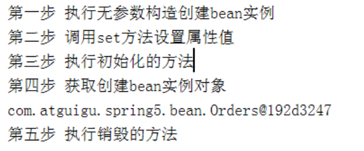
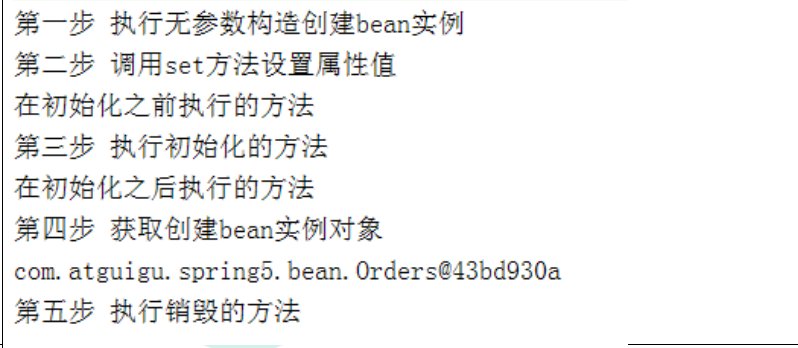
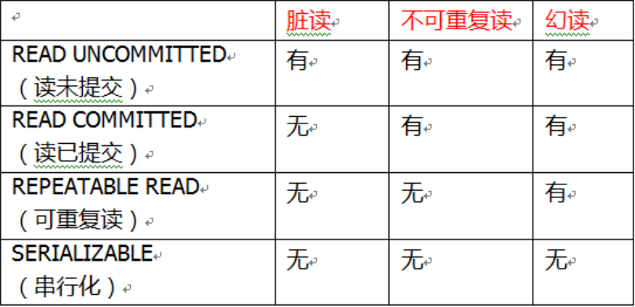
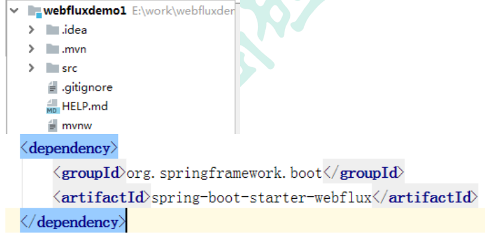

# 笔记

## 内容介绍

1、Spring 框架概述

2、IOC 容器

（1）IOC 底层原理

（2）IOC 接口（BeanFactory） 

（3）IOC 操作 Bean 管理（基于 xml） 

（4）IOC 操作 Bean 管理（基于注解）

3、Aop

4、JdbcTemplate

5、事务管理

6、Spring5 新特性

## spring5框架概述

1、Spring 是轻量级的开源的 JavaEE 框架

2、Spring 可以解决企业应用开发的复杂性

3、Spring 有两个核心部分：IOC 和 Aop

（1）IOC：控制反转，把创建对象过程交给 Spring 进行管理

（2）Aop：面向切面，不修改源代码进行功能增强

4、Spring 特点

（1）方便解耦，简化开发

（2）Aop 编程支持

（3）方便程序测试

（4）方便和其他框架进行整合

（5）方便进行事务操作

（6）降低 API 开发难度

## IOC 

### 概念和原理

1、什么是 IOC

（1）控制反转，把对象创建和对象之间的调用过程，交给 Spring 进行管理

（2）使用 IOC 目的：为了耦合度降低

（3）做入门案例就是 IOC 实现

2、IOC 底层原理

（1）xml 解析、工厂模式、反射

### IOC（BeanFactory 接口）

1、IOC 思想基于 IOC 容器完成，IOC 容器底层就是对象工厂

2、Spring 提供 IOC 容器实现两种方式：（两个接口）

（1）BeanFactory：IOC 容器基本实现，是 Spring 内部的使用接口，不提供开发人员进行使用

 加载配置文件时候不会创建对象，在获取对象（使用）才去创建对象

（2）ApplicationContext：BeanFactory 接口的子接口，提供更多更强大的功能，一般由开发人

员进行使用

 加载配置文件时候就会把在配置文件对象进行创建

### IOC 操作 Bean 管理（概念）

1、什么是 Bean 管理

（0）Bean 管理指的是两个操作

（1）Spring 创建对象

（2）Spirng 注入属性

2、Bean 管理操作有两种方式

（1）基于 xml 配置文件方式实现(了解)

（2）基于注解方式实现(重点)

#### IOC 操作 Bean 管理（基于 xml 方式)

在xml文件中写bean标签,通过set方法、有参无参构造、p名称空间注入等方式注入bean

注入类型除普通bean外,也包含字面量、外部bean、数组、集合等

#### IOC 操作 Bean 管理（FactoryBean）

1、Spring 有两种类型 bean，一种普通 bean，另外一种工厂 bean（FactoryBean） 

2、普通 bean：在配置文件中定义 bean 类型就是返回类型

3、工厂 bean：在配置文件定义 bean 类型可以和返回类型不一样

​	第一步 创建类，让这个类作为工厂 bean，实现接口 FactoryBean

​	第二步 实现接口里面的方法，在实现的方法中定义返回的 bean 类型

#### IOC 操作Bean管理（bean作用域）

1、在 Spring 里面，设置创建 bean 实例是单实例还是多实例

2、在 Spring 里面，默认情况下，bean 是单实例对象

3、如何设置单实例还是多实例

（1）在 spring 配置文件 bean 标签里面有属性（scope）用于设置单实例还是多实例

（2）scope 属性值

​		第一个值 默认值，singleton，表示是单实例对象

​		第二个值 prototype，表示是多实例对象

（3）singleton 和 prototype 区别

​		第一 singleton 单实例，prototype 多实例

​		第二 设置 scope 值是 singleton 时候，加载 spring 配置文件时候就会创建单实例对象

​		设置 scope 值是 prototype 时候，不是在加载 spring 配置文件时候创建 对象，在调用

​		getBean 方法时候创建多实例对象

#### IOC 操作 Bean 管理（bean 生命周期）

1、生命周期

（1）从对象创建到对象销毁的过程

2、bean 生命周期

（1）通过构造器创建 bean 实例（无参数构造）

（2）为 bean 的属性设置值和对其他 bean 引用（调用 set 方法）

（3）调用 bean 的初始化的方法（需要进行配置初始化的方法）

（4）bean 可以使用了（对象获取到了）

（5）当容器关闭时候，调用 bean 的销毁的方法（需要进行配置销毁的方法）

3、演示 bean 生命周期

```
public class Orders { //无参数构造

     public Orders() {

        System.out.println("第一步 执行无参数构造创建 bean 实例");

     }

     private String oname;

     public void setOname(String oname) {

     	this.oname = oname;

     System.out.println("第二步 调用 set 方法设置属性值");

     }

     //创建执行的初始化的方法

     public void initMethod() {

     	System.out.println("第三步 执行初始化的方法");

     }

     //创建执行的销毁的方法

     public void destroyMethod() {

     	System.out.println("第五步 执行销毁的方法");

     } 

}
// xml中:

<bean id="orders" class="com.atguigu.spring5.bean.Orders" init-
method="initMethod" destroy-method="destroyMethod">
<property name="oname" value="手机"></property>
</bean>

// test中:

@Test
public void testBean3() {

    // ApplicationContext context =

    // new ClassPathXmlApplicationContext("bean4.xml");

     ClassPathXmlApplicationContext context =

     new ClassPathXmlApplicationContext("bean4.xml");

     Orders orders = context.getBean("orders", Orders.class);

     System.out.println("第四步 获取创建 bean 实例对象");

     System.out.println(orders);

     //手动让 bean 实例销毁

     context.close();

 } 
```


输出:




4、bean 的后置处理器，bean 生命周期有七步

（1）通过构造器创建 bean 实例（无参数构造）

（2）为 bean 的属性设置值和对其他 bean 引用（调用 set 方法）

（3）把 bean 实例传递 bean 后置处理器的方法 postProcessBeforeInitialization 

（4）调用 bean 的初始化的方法（需要进行配置初始化的方法）

（5）把 bean 实例传递 bean 后置处理器的方法 postProcessAfterInitialization

（6）bean 可以使用了（对象获取到了）

（7）当容器关闭时候，调用 bean 的销毁的方法（需要进行配置销毁的方法）

5、演示添加后置处理器效果

（1）创建类，实现接口 BeanPostProcessor，创建后置处理器

```
public class MyBeanPost implements BeanPostProcessor {

     @Override
	public Object postProcessBeforeInitialization(Object bean, String beanName) throws BeansException {
		System.out.println("在初始化之前执行的方法");
		return bean;
 }
 
     @Override
	public Object postProcessAfterInitialization(Object bean, String beanName) 
    throws BeansException {
         System.out.println("在初始化之后执行的方法");
         return bean;
     } 
}

<!--配置后置处理器--> 

<bean id="myBeanPost" class="com.atguigu.spring5.bean.MyBeanPost"></bean>
```

输出:



#### IOC 操作 Bean 管理（xml 自动装配）

1、什么是自动装配

（1）根据指定装配规则（属性名称或者属性类型），Spring 自动将匹配的属性值进行注入

2、演示自动装配过程(了解)

（1）根据属性名称自动注入

```
<!--实现自动装配

 bean 标签属性 autowire，配置自动装配

 autowire 属性常用两个值：

 byName 根据属性名称注入 ，注入值 bean 的 id 值和类属性名称一样

 byType 根据属性类型注入

-->

<bean id="emp" class="com.atguigu.spring5.autowire.Emp" autowire="byName">
```

（2）根据属性类型自动注入

```
<!--实现自动装配

 bean 标签属性 autowire，配置自动装配

 autowire 属性常用两个值：

 byName 根据属性名称注入 ，注入值 bean 的 id 值和类属性名称一样

 byType 根据属性类型注入

-->

<bean id="emp" class="com.atguigu.spring5.autowire.Emp" autowire="byType">

 <!--<property name="dept" ref="dept"></property>-->

</bean> 
```

#### IOC操作Bean管理(外部属性文件) (了解)

1.可在xml中直接配置数据库信息

2.先创建jdbc.properties格式文件写好数据库信息,再引入到xml中

#### IOC 操作 Bean 管理(基于注解方式) (重点)

1、什么是注解

（1）注解是代码特殊标记，格式：@注解名称(属性名称=属性值, 属性名称=属性值..)

（2）使用注解，注解作用在类上面，方法上面，属性上面

（3）使用注解目的：简化 xml 配置

2、Spring 针对 Bean 管理中创建对象提供注解

（1）@Component

（2）@Service

（3）@Controller

（4）@Repository

​	上面四个注解功能是一样的，都可以用来创建 bean 实例

3、基于注解方式实现对象创建

第一步 引入依赖

第二步 开启组件扫描

<!--开启组件扫描

 1 如果扫描多个包，多个包使用逗号隔开

 2 扫描包上层目录

-->

<context:component-scan base-package="com.atguigu"> </ context:component-scan>

第三步 创建类，在类上面添加创建对象注解

```
//在注解里面 value 属性值可以省略不写，
//默认值是类名称，首字母小写
//UserService -- userService

@Component(value = "userService")    //此处等价于xml中<bean id="userService" class=".."/>
public class UserService {

    public void add() {
    	System.out.println("service add.......");
    } 

}
```

4、开启组件扫描细节配置

```
<!--示例 1
 use-default-filters="false" 表示现在不使用默认 filter，自己配置 filter
 context:include-filter ，设置扫描哪些内容
--><context:component-scan base-package="com.atguigu" use-defaultfilters="false">
 <context:include-filter type="annotation" 
 
expression="org.springframework.stereotype.Controller"/>
</context:component-scan>
<!--示例 2
 下面配置扫描包所有内容
 context:exclude-filter： 设置哪些内容不进行扫描
--><context:component-scan base-package="com.atguigu">
 <context:exclude-filter type="annotation" 
 
expression="org.springframework.stereotype.Controller"/>
</context:component-scan>
```

5、基于注解方式实现属性注入(重点)

（1）@Autowired：根据属性类型进行自动装配

```
 @Autowired 
 private UserDao userDao;
```

（2）@Qualifier：根据名称进行注入,这个@Qualifier 注解的使用，和上面@Autowired 一起使用

​			使用场景: 	当接口有多个实现类时,且多个实现类上存在注解时,此时使用注解@Autowired无法指定到某一具体实现类,所以需要@Qualifier配合来指定属性名称

```
@Autowired //根据类型进行注入
@Qualifier(value = "userDaoImpl1") //根据名称进行注入
private UserDao userDao; 
```

（3）@Resource：可以根据类型注入，可以根据名称注入

```
//@Resource //根据类型进行注入
@Resource(name = "userDaoImpl1") //根据名称进行注入
private UserDao userDao;
备注:  @Resource不属于Spring框架注解,而是jdk中的注解(javax扩展包中),所以spring官方更推荐上面两个
```

（4）@Value：注入普通类型属性

```
@Value(value = "abc")
private String name; 
```

6、完全注解开发 (springboot原型)

（1）创建配置类，替代 xml 配置文件

```
@Configuration //作为配置类，替代 xml 配置文件
@ComponentScan(basePackages = {"com.atguigu"}) //开始扫描(扫描注入bean的四种注解)
public class SpringConfig {

}
```

（2）编写测试类

```
	@Test
    public void testService2() {

     //加载配置类
     ApplicationContext context
     = new AnnotationConfigApplicationContext(SpringConfig.class);

     UserService userService = context.getBean("userService", UserService.class);

     System.out.println(userService);

     userService.add();

}
```

## AOP

### 概念和底层原理

1、什么是 AOP

（1）面向切面编程（方面），利用 AOP 可以对业务逻辑的各个部分进行隔离，从而使得

业务逻辑各部分之间的耦合度降低，提高程序的可重用性，同时提高了开发的效率。

（2）通俗描述：不通过修改源代码方式，在主干功能里面添加新功能

2、AOP 底层使用动态代理

（1）有两种情况动态代理

​	第一种 有接口情况，使用 JDK 动态代理

​	⚫ 创建接口实现类代理对象，增强类的方法

​	第二种 没有接口情况，使用 CGLIB 动态代理

​	⚫ 创建子类的代理对象，增强类的方法

3、AOP（JDK 动态代理）

​	1、使用 JDK 动态代理，使用 Proxy 类里面的方法创建代理对象

​		调用 newProxyInstance 方法

​		方法有三个参数：

​		第一参数，类加载器

​		第二参数，增强方法所在的类，这个类实现的接口，支持多个接口

​		第三参数，实现这个接口 InvocationHandler，创建代理对象，写增强的部分

​	2、编写 JDK 动态代理代码

```
（1）创建接口，定义方法
    public interface UserDao {
     public int add(int a,int b);
     public String update(String id);
    }
（2）创建接口实现类，实现方法
    public class UserDaoImpl implements UserDao {
         @Override
         public int add(int a, int b) {
            return a+b;
         }
         @Override
         public String update(String id) {
            return id;
         }
    }
 （3）使用 Proxy 类创建接口代理对象
    public class JDKProxy {
		public static void main(String[] args) {
         //创建接口实现类代理对象
			Class[] interfaces = {UserDao.class};
            UserDaoImpl userDao = new UserDaoImpl();
            UserDao dao = 
            (UserDao)Proxy.newProxyInstance(JDKProxy.class.getClassLoader(), interfaces, 
            new UserDaoProxy(userDao));
            int result = dao.add(1, 2);
            System.out.println("result:"+result);
    	}
	}
    //创建代理对象代码
    class UserDaoProxy implements InvocationHandler {
         //1 把创建的是谁的代理对象，把谁传递过来
         //有参数构造传递
         private Object obj;
         public UserDaoProxy(Object obj) {
            this.obj = obj;
         }
         //增强的逻辑
         @Override
         public Object invoke(Object proxy, Method method, Object[] args) throws 
         Throwable {
             //方法之前
             System.out.println("方法之前执行...."+method.getName()+" :传递的参
             数..."+ Arrays.toString(args));
             //被增强的方法执行
             Object res = method.invoke(obj, args);
             //方法之后
             System.out.println("方法之后执行...."+obj);
             return res;
		} 
	}
```

### AOP（术语）

1.连接点

​	类里面哪些方法可以被增强，这些方法称为连接点

2.切入点

​	实际被真正增强的方法，称为切入点

3.通知(增强)

​	(1)实际增强的逻辑部分成为通知(增强)

​	(2)通知有多种类型

- 前置通知
- 后置通知
- 环绕通知
- 异常通知
- 最终通知

4.切面

​	是动作

​	切面是把通知应用到切入点的一个动作(/过程)

### AOP 操作（准备工作） 

1、Spring 框架一般都是基于 AspectJ 实现 AOP 操作

（1）AspectJ 不是 Spring 组成部分，独立 AOP 框架，一般把 AspectJ 和 Spirng 框架一起使

用，进行 AOP 操作

2、基于 AspectJ 实现 AOP 操作

（1）基于注解方式实现（使用）(重点)

（2）基于 xml 配置文件实现 (略)

3、在项目工程里面引入 AOP 相关依赖

4、切入点表达式

（1）切入点表达式作用：知道对哪个类里面的哪个方法进行增强

（2）语法结构： execution([权限修饰符] [返回类型] [类全路径] [方法名称] ([参数列表]) )

​    举例 1：对 com.atguigu.dao.BookDao 类里面的 add 进行增强

```
 execution(* com.atguigu.dao.BookDao.add(..))
```

​    举例 2：对 com.atguigu.dao.BookDao 类里面的所有的方法进行增强

```
 execution(* com.atguigu.dao.BookDao.* (..))
```

​	举例 3：对 com.atguigu.dao 包里面所有类，类里面所有方法进行增强

```
 execution(* com.atguigu.dao.* .* (..))
```

​	举例 4：对 com.atguigu.dao 包里面所有类，类里面多个方法进行增强

```
 execution(* com.atguigu.dao.*.add(..)) || execution(* com.atguigu.dao.*.delete(..))
 或
 execution(* com.ruoyi.jgpt.controller.*Controller.list(..)) || 
 execution(* com.ruoyi.jgpt.controller.*Controller.export(..))
```

```
备注: 1.举例3的第一个*表示包括四种权限修饰符,第二个*表示所有类,第三个*表示所有方法,(..)表示参数列表
	 2.返回类型可以省略不写,类全路径+方法名称+参数列表可以合在一起写
	 3.指定多个方法且并且全部方法可以用 || 连接
```

### AOP 操作（基于注解）(重点)

1、创建类，在类里面定义方法

```
public class User {

    public void add() {
    	System.out.println("add.......");
    } 

}
```

2、创建增强类（编写增强逻辑）

（1）在增强类里面，创建方法，让不同方法代表不同通知类型

*//增强的类*

```
public class UserProxy {

    public void before() {*//前置通知*
    	System.out.println("before......");
    } 

}
```

3、进行通知的配置

（1）在 spring 配置文件中，开启注解扫描 (了解)

 	*<!-- 开启注解扫描 -->*

​	<context:component-scan base-package="com.atguigu.spring5.aopanno"></ context:component-scan> 

（2）使用注解创建 User 和 UserProxy 对象

​		通过类上面添加@Component来注入

（3）在增强类上面添加注解 @Aspect

```
    @Component
    @Aspect *//生成代理对象*
    public class UserProxy {
```

（4）在 spring 配置文件中开启生成代理对象 (了解)

<!-- 开启 Aspect 生成代理对象-->*

<aop:aspectj-autoproxy ></ aop:aspectj-autoproxy> 

4、配置不同类型的通知

（1）在增强类的里面，在作为通知方法上面添加通知类型注解，使用切入点表达式配置

```
@Component
@Aspect *//生成代理对象*
public class UserProxy {

    *//前置通知*
    @Before(value = "execution(* com.atguigu.spring5.aopanno.User.add(..))")
    public void before() {
    	System.out.println("before.........");
 	}

    *//后置通知（返回通知）*
    @AfterReturning(value = "execution(* com.atguigu.spring5.aopanno.User.add(..))")
    public void afterReturning() {
    	System.out.println("afterReturning.........");
    }

    *//最终通知*
    @After(value = "execution(* com.atguigu.spring5.aopanno.User.add(..))")
    public void after() {
    	System.out.println("after.........");
    }

    *//异常通知*
    @AfterThrowing(value = "execution(* com.atguigu.spring5.aopanno.User.add(..))")
    public void afterThrowing() {
    	System.out.println("afterThrowing.........");
    }

    *//环绕通知*
    @Around(value = "execution(* com.atguigu.spring5.aopanno.User.add(..))")
    public void around(ProceedingJoinPoint proceedingJoinPoint) throws Throwable {
    
        System.out.println("环绕之前.........");
        
        *//被增强的方法执行* (执行原方法)
        proceedingJoinPoint.proceed();
        
        System.out.println("环绕之后.........");
        
    } 
}
备注: 1.每种通知对应的方法都可以接受ProceedingJoinPoint参数,用来操作原方法等
	 2.方法名任意,通知类型决定于注解,而不是方法名
```

5、相同的切入点抽取

```
@Pointcut(value = "execution(* com.atguigu.spring5.aopanno.User.add(..))")
public void pointdemo() {

}

*//前置通知
@Before(value = "pointdemo()")
public void before() {
System.out.println("before.........");
	
}

备注: 1.切入点抽取适用于多个通知存在且切入点相同的情况
	 2.上例中 "pointdemo()" 等价于 "execution(* com.atguigu.spring5.aopanno.User.add(..))"
```

6、有多个增强类多同一个方法进行增强，设置增强类优先级 (了解)

​		在增强类上面添加注解 @Order(数字类型值)，数字类型值越小优先级越高

```
@Component
@Aspect
@Order(1)
public class PersonProxy{
	...
}

@Component
@Aspect
@Order(3)
public class PersonProxy{
	...
}
```

7、完全使用注解开发  (重点)

​		创建配置类，不需要创建 xml 配置文件 

```
@Configuration
@ComponentScan(basePackages = {"com.atguigu"})
@EnableAspectJAutoProxy(proxyTargetClass = true)
public class ConfigAop {

}
```

### AOP 操作（基于xml）(略)

## JDBCTemplate对数据库的操作(了解)

1. 引入jar包

2. 配置数据库配置信息

3. 注入bean对象

   使用: 

   ```
       *//注入 JdbcTemplate*
       @Autowired
       private JdbcTemplate jdbcTemplate; 
   ```

   增删改都使用update方法:

   int update = jdbcTemplate.update(sql,args);

   针对增删改的批量操作: (此时参数传入为数组)

   ```
    String sql = "insert into t_book values(?,?,?)";
    int[] ints = jdbcTemplate.batchUpdate(sql, batchArgs);
   ```

   查询:

   1.查询某个值:

   ```
       String sql = "select *count*(*) from t_book";
       Integer count = jdbcTemplate.queryForObject(sql, Integer.class);
   ```

   2.查询对象:

   ```
       String sql = "select * from t_book where user_id=?";
       *//调用方法*
       Book book = jdbcTemplate.queryForObject(sql, new 
       BeanPropertyRowMapper<Book>(Book.class), id);
   ```

   3.查询集合:

   ```
       String sql = "select * from t_book";
       *//调用方法*
       List<Book> bookList = jdbcTemplate.query(sql, new 
       BeanPropertyRowMapper<Book>(Book.class));
   ```

## 事务

### 事务概念

1、什么事务

（1）事务是数据库操作最基本单元，逻辑上一组操作，要么都成功，如果有一个失败所有操

​	作都失败

（2）典型场景：银行转账

\* lucy 转账 100 元 给 mary

\* lucy 少 100，mary 多 100

2、事务四个特性（ACID） 

（1）原子性

（2）一致性

（3）隔离性

（4）持久性

3. 模拟问题

   ```
   public void accoutMoney() {
   
       userDao.reduceMoney();
   
       int i = 10/0;
   
       userDao.addMoney();
   }
   ```

### Spring 事务管理介绍

1、事务添加到 JavaEE 三层结构里面 Service 层（业务逻辑层）

2、在 Spring 进行事务管理操作

​	  有两种方式：编程式事务管理和声明式事务管理（使用）

3、声明式事务管理

（1）基于注解方式（使用）

（2）基于 xml 配置文件方式(略)

4、在 Spring 进行声明式事务管理，底层使用 AOP 原理

5、Spring 事务管理 API

（1）提供一个接口，代表事务管理器，这个接口针对不同的框架提供不同的实现类

### 注解声明式事务管理

1、在 service 类上面（或者 service 类里面方法上面）添加事务注解

（1）@Transactional，这个注解添加到类上面，也可以添加方法上面

（2）如果把这个注解添加类上面，这个类里面所有的方法都添加事务

（3）如果把这个注解添加方法上面，为这个方法添加事务

```
    @Service
    @Transactional
    public class UserService {
```

### 声明式事务管理参数配置

1、在service类上面添加注解@Transactional，在这个注解里面可以配置事务相关参数

2、propagation：事务传播行为

事务的传播行为可以由传播属性指定,Spring定义了7种传播行为(如REQUIRED,REQUIRED_NEW等)

        @Service
        @Transactional(propagation = Propagation.REQUIRED)
        public class UserService {
3、ioslation：事务隔离级别

（1）事务有特性成为隔离性，多事务操作之间不会产生影响。不考虑隔离性产生很多问题

（2）有三个读问题：脏读、不可重复读、虚（幻）读

（3）脏读：一个未提交事务读取到另一个未提交事务的数据

（4）不可重复读：一个未提交事务读取到另一提交事务修改数据

（5）虚读：一个未提交事务读取到另一提交事务添加数据

（6）解决：通过设置事务隔离级别，解决读问题

​		

```
    @Service
    @Transactional(propagation=Propagation.REQUIRED,isolation=Isolation.REPEATABLE_READ)
    public class UserService {
```

4、timeout：超时时间

（1）事务需要在一定时间内进行提交，如果不提交进行回滚

（2）默认值是 -1 ，设置时间以秒单位进行计算

5、readOnly：是否只读

（1）读：查询操作，写：添加修改删除操作

（2）readOnly 默认值 false，表示可以查询，可以添加修改删除操作

（3）设置 readOnly 值是 true，设置成 true 之后，只能查询

6、rollbackFor：回滚

（1）设置出现哪些异常进行事务回滚

7、noRollbackFor：不回滚

（1）设置出现哪些异常不进行事务回滚

### XML 声明式事务管理(略)

### 完全注解声明式事务管理

1、创建配置类，使用配置类替代 xml 配置文件

```
@Configuration *//配置类*
@ComponentScan(basePackages = "com.atguigu") *//组件扫描*
@EnableTransactionManagement *//开启事务*
public class TxConfig {

     *//创建数据库连接池*
     @Bean
     public DruidDataSource getDruidDataSource() {
         DruidDataSource dataSource = new DruidDataSource();
         dataSource.setDriverClassName("com.mysql.jdbc.Driver");
         dataSource.setUrl("jdbc:mysql:///user_db");
         dataSource.setUsername("root");
         dataSource.setPassword("root");
         return dataSource;
     }
     
    *//创建 JdbcTemplate 对象*
    @Bean
    public JdbcTemplate getJdbcTemplate(DataSource dataSource) {
        *//到 ioc 容器中根据类型找到 dataSource*
        JdbcTemplate jdbcTemplate = new JdbcTemplate();
        *//注入 dataSource*
        jdbcTemplate.setDataSource(dataSource); 
        return jdbcTemplate;
    }

    *//创建事务管理器*
    @Bean
    public DataSourceTransactionManager 
        getDataSourceTransactionManager(DataSource dataSource) {
        DataSourceTransactionManager transactionManager = new 
        DataSourceTransactionManager();
        transactionManager.setDataSource(dataSource);
        return transactionManager;
    } 

}
```

## Spring5框架新功能

1、整个Spring5框架的代码基于Java8，运行时兼容JDK9，许多不建议使用的类和方法在代码库中删除

2、Spring 5.0 框架自带了通用的日志封装

（1）Spring5 已经移除 Log4jConfigListener，官方建议使用 Log4j2

（2）Spring5 框架整合 Log4j2

3、Spring5框架核心容器支持@Nullable注解

（1）@Nullable 注解可以使用在方法上面，属性上面，参数上面，表示方法返回可以为空，属性值可以

为空，参数值可以为空

（2）注解用在方法上面，方法返回值可以为空

（3）注解使用在方法参数里面，方法参数可以为空

（4）注解使用在属性上面，属性值可以为空

4、Spring5核心容器支持函数式风格GenericApplicationContext

5、Spring5支持整合JUnit5

### Spring Webflux(初识)

0、学习Webflux需要前置知识 spring -> spring mvc  -> springboot -> lambda表达式,stream流 -> spring webflux

1、SpringWebflux 介绍

（1）是 Spring5 添加新的模块，用于 web 开发的，功能和 SpringMVC 类似的，Webflux 使用

当前一种比较流程响应式编程出现的框架。

（2）使用传统 web 框架，比如 SpringMVC，这些基于 Servlet 容器，Webflux 是一种异步非阻

塞的框架，异步非阻塞的框架在 Servlet3.1 以后才支持，核心是基于 Reactor 的相关 API 实现

的。

（3）解释什么是异步非阻塞

\* 异步和同步

\* 非阻塞和阻塞

 上面都是针对对象不一样

*\* 异步和同步针对调用者，调用者发送请求，如果等着对方回应之后才去做其他事情就是同

步，如果发送请求之后不等着对方回应就去做其他事情就是异步

 阻塞和非阻塞针对被调用者，被调用者受到请求之后，做完请求任务之后才给出反馈就是阻

塞，受到请求之后马上给出反馈然后再去做事情就是非阻塞

```
大神解释:	面试结束后,如果只等结果出来叫同步,不等结果出来去面别的公司就叫异步;面试结束刚结束时,面试官说等通知就是阻塞,直接发offer录取就是非阻塞。 --评论区
```

（4）Webflux 特点：

第一 非阻塞式：在有限资源下，提高系统吞吐量和伸缩性，以 Reactor 为基础实现响应式编程

第二 函数式编程：Spring5 框架基于 java8，Webflux 使用 Java8 函数式编程方式实现路由请求

（5）比较 SpringMVC

第一 两个框架都可以使用注解方式，都运行在 Tomet 等容器中

第二 SpringMVC 采用命令式编程，Webflux 采用异步响应式编程

2、响应式编程（Java实现）

（1）什么是响应式编程

响应式编程是一种面向数据流和变化传播的编程范式。

（2）Java8 及其之前版本

\* 提供的观察者模式两个类 Observer 和 Observable

```
public class ObserverDemo extends Observable {
     public static void main(String[] args) {
         ObserverDemo observer = new ObserverDemo();
         //添加观察者
         observer.addObserver((o,arg)->{
         	System.out.println("发生变化");
         });
         
         observer.addObserver((o,arg)->{
         	System.out.println("手动被观察者通知，准备改变");
         });
         
         observer.setChanged(); //数据变化
         observer.notifyObservers(); //通知
 	} 
 }
```

3、响应式编程（Reactor实现)

（1）响应式编程操作中，Reactor 是满足 Reactive 规范框架

（2）Reactor 有两个核心类，Mono 和 Flux，这两个类实现接口 Publisher，提供丰富操作

符。Flux 对象实现发布者，返回 N 个元素；Mono 实现发布者，返回 0 或者 1 个元素

（3）Flux 和 Mono 都是数据流的发布者，使用 Flux 和 Mono 都可以发出三种数据信号：

元素值，错误信号，完成信号，错误信号和完成信号都代表终止信号，终止信号用于告诉

订阅者数据流结束了，错误信号终止数据流同时把错误信息传递给订阅者

（4）代码演示 Flux 和 Mono

```
第一步 引入依赖
<dependency>
 <groupId>io.projectreactor</groupId>
 <artifactId>reactor-core</artifactId>
 <version>3.1.5.RELEASE</version>
</dependency>
第二步 编程代码
public static void main(String[] args) {
     //just 方法直接声明
     Flux.just(1,2,3,4);
     Mono.just(1);
     //其他的方法
     Integer[] array = {1,2,3,4};
     Flux.fromArray(array);

     List<Integer> list = Arrays.asList(array);
     Flux.fromIterable(list);
     Stream<Integer> stream = list.stream();
     Flux.fromStream(stream);
}
```

（5）三种信号特点

\* 错误信号和完成信号都是终止信号，不能共存的

\* 如果没有发送任何元素值，而是直接发送错误或者完成信号，表示是空数据流

\* 如果没有错误信号，没有完成信号，表示是无限数据流

（6）调用 just 或者其他方法只是声明数据流，数据流并没有发出，只有进行订阅之后才会触

发数据流，不订阅什么都不会发生的

Flux.just(1,2,3,4).subscribe(System.out::print)

Mono.just(1).subscribe(System.out::print)

（7）操作符

* 对数据流进行一道道操作，成为操作符，比如工厂流水线

第一 map 元素映射为新元素

第二 flatMap 元素映射为流

⚫ 把每个元素转换流，把转换之后多个流合并大的流

4、SpringWebflux 执行流程和核心 API

SpringWebflux 基于 Reactor，默认使用容器是 Netty，Netty 是高性能的 NIO 框架，异步非阻

塞的框架

（1）Netty

\* BIO 

   NIO

（2）SpringWebflux 执行过程和 SpringMVC 相似的

\* SpringWebflux 核心控制器 DispatchHandler，实现接口 WebHandler

\* 接口 WebHandler 有一个方法

（3）SpringWebflux 里面 DispatcherHandler，负责请求的处理

\* HandlerMapping：请求查询到处理的方法

\* HandlerAdapter：真正负责请求处理

\* HandlerResultHandler：响应结果处理

（4）SpringWebflux 实现函数式编程，两个接口：RouterFunction（路由处理）

和 HandlerFunction（处理函数）

5、SpringWebflux（基于注解编程模型）

SpringWebflux 实现方式有两种：注解编程模型和函数式编程模型

使用注解编程模型方式，和之前 SpringMVC 使用相似的，只需要把相关依赖配置到项目中，

SpringBoot 自动配置相关运行容器，默认情况下使用 Netty 服务器

第一步 创建 SpringBoot 工程，引入 Webflux 依赖



第二步 配置启动端口号(可省)

```
server.port=8081
```

第三步 创建包和相关类

⚫ 实体类

```
@Data
public class User {
    private String name;
    private String gender;
    private String age;
}
```

⚫ 创建接口定义操作的方法

```
//用户操作接口
public interface UserService {
     //根据 id 查询用户
     Mono<User> getUserById(int id);
     //查询所有用户
     Flux<User> getAllUser();
     //添加用户
     Mono<Void> saveUserInfo(Mono<User> user);
}
```

⚫ 接口实现类

```
public class UserServiceImpl implements UserService {
     //创建 map 集合存储数据
     private final Map<Integer,User> users = new HashMap<>();
     public UserServiceImpl() {
     this.users.put(1,new User("lucy","nan",20));
     this.users.put(2,new User("mary","nv",30));
     this.users.put(3,new User("jack","nv",50));
     }
     //根据 id 查询
     @Override
     public Mono<User> getUserById(int id) {
     return Mono.justOrEmpty(this.users.get(id));
     }
     //查询多个用户
     @Override
     public Flux<User> getAllUser() {
     return Flux.fromIterable(this.users.values());
     }
      //添加用户
     @Override
     public Mono<Void> saveUserInfo(Mono<User> userMono) {
     return userMono.doOnNext(person -> {
     //向 map 集合里面放值
     int id = users.size()+1;
     users.put(id,person);
     }).thenEmpty(Mono.empty());
 	 } 
 }
```

⚫ 创建 controller

```
@RestController
public class UserController {
     //注入 service
     @Autowired
     private UserService userService;
     //id 查询
     @GetMapping("/user/{id}")
     public Mono<User> geetUserId(@PathVariable int id) {
     	return userService.getUserById(id);
     }
     //查询所有
     @GetMapping("/user")
     public Flux<User> getUsers() {
     	return userService.getAllUser();
     }
     //添加
     @PostMapping("/saveuser")
     public Mono<Void> saveUser(@RequestBody User user) {
     	Mono<User> userMono = Mono.just(user);
     	return userService.saveUserInfo(userMono);
     } 
 }
```

⚫ 说明

SpringMVC 方式实现，同步阻塞的方式，基于 SpringMVC+Servlet+Tomcat

SpringWebflux 方式实现，异步非阻塞 方式，基于 SpringWebflux+Reactor+Netty

6、SpringWebflux（基于函数式编程模型） (比较繁琐,了解了解)

（1）在使用函数式编程模型操作时候，需要自己初始化服务器

（2）基于函数式编程模型时候，有两个核心接口：RouterFunction（实现路由功能，请求转发

给对应的 handler）和 HandlerFunction（处理请求生成响应的函数）。核心任务定义两个函数

式接口的实现并且启动需要的服务器。

（ 3 ） SpringWebflux 请 求 和 响 应 不 再 是 ServletRequest 和 ServletResponse ，而是

ServerRequest 和 ServerResponse

第一步 把注解编程模型工程复制一份 ，保留 entity 和 service 内容

第二步 创建 Handler（具体实现方法）

```
public class UserHandler {
    private final UserService userService;
    public UserHandler(UserService userService) {
    this.userService = userService;
    }
    //根据 id 查询
    public Mono<ServerResponse> getUserById(ServerRequest request) {
        //获取 id 值
        int userId = Integer.valueOf(request.pathVariable("id"));
        //空值处理
        Mono<ServerResponse> notFound = ServerResponse.notFound().build();
        //调用 service 方法得到数据
        Mono<User> userMono = this.userService.getUserById(userId);
        //把 userMono 进行转换返回
        //使用 Reactor 操作符 flatMap
        return 
        userMono
        .flatMap(person -> 
        ServerResponse.ok().contentType(MediaType.APPLICATION_JSON)
        .body(fromObject(person)))
        .switchIfEmpty(notFound);
    }
    //查询所有
    public Mono<ServerResponse> getAllUsers() {
        //调用 service 得到结果
        Flux<User> users = this.userService.getAllUser();
        return 
        ServerResponse.ok().contentType(MediaType.APPLICATION_JSON).body(users,User.cl
        ass);
        }
        //添加
        public Mono<ServerResponse> saveUser(ServerRequest request) {
        //得到 user 对象
        Mono<User> userMono = request.bodyToMono(User.class);
        return 
        ServerResponse.ok().build(this.userService.saveUserInfo(userMono));
    } 
 }
```

第三步 初始化服务器，编写 Router

⚫ 创建路由的方法

```
//1 创建 Router 路由
public RouterFunction<ServerResponse> routingFunction() {
    //创建 hanler 对象
    UserService userService = new UserServiceImpl();
    UserHandler handler = new UserHandler(userService);
    //设置路由
    return RouterFunctions.route(

    GET("/users/{id}").and(accept(APPLICATION_JSON)),handler::getUserById)
    .andRoute(GET("/users").and(accept(APPLICATION_JSON)),handler::get
    AllUsers);
}
```

⚫ 创建服务器完成适配

```
//2 创建服务器完成适配
public void createReactorServer() {
    //路由和 handler 适配
    RouterFunction<ServerResponse> route = routingFunction();
    HttpHandler httpHandler = toHttpHandler(route);
    ReactorHttpHandlerAdapter adapter = new 
    ReactorHttpHandlerAdapter(httpHandler);
    //创建服务器
    HttpServer httpServer = HttpServer.create();
    httpServer.handle(adapter).bindNow();
}
```

⚫ 最终调用 

```
public static void main(String[] args) throws Exception{
    Server server = new Server();
    server.createReactorServer();
    System.out.println("enter to exit");
    System.in.read();
}
```

（4）使用 WebClient 调用

```
public class Client {
    public static void main(String[] args) {
    //调用服务器地址
    WebClient webClient = WebClient.create("http://127.0.0.1:5794");
    //根据 id 查询
    String id = "1";
    User userresult = webClient.get().uri("/users/{id}", id)
    .accept(MediaType.APPLICATION_JSON).retrieve().bodyToMono(User
    .class)
    .block();
    System.out.println(userresult.getName());
    //查询所有
    Flux<User> results = webClient.get().uri("/users")
    .accept(MediaType.APPLICATION_JSON).retrieve().bodyToFlux(User
    .class);
    results.map(stu -> stu.getName())
    .buffer().doOnNext(System.out::println).blockFirst();
    } 
}
```

## 课程总结

1、Spring 框架概述

（1）轻量级开源 JavaEE 框架，为了解决企业复杂性，两个核心组成：IOC 和 AOP

（2）Spring5.2.6 版本

2、IOC 容器

（1）IOC 底层原理（工厂、反射等）

（2）IOC 接口（BeanFactory） 

（3）IOC 操作 Bean 管理（基于 xml） 

（4）IOC 操作 Bean 管理（基于注解）

3、Aop

（1）AOP 底层原理：动态代理，有接口（JDK 动态代理），没有接口（CGLIB 动态代理）

（2）术语：切入点、增强（通知）、切面

（3）基于 AspectJ 实现 AOP 操作

4、JdbcTemplate

（1）使用 JdbcTemplate 实现数据库 curd 操作

（2）使用 JdbcTemplate 实现数据库批量操作

5、事务管理

（1）事务概念

（2）重要概念（传播行为和隔离级别）

（3）基于注解实现声明式事务管理

（4）完全注解方式实现声明式事务管理

6、Spring5 新功能

（1）整合日志框架

（2）@Nullable 注解

（3）函数式注册对象

（4）整合 JUnit5 单元测试框架

（5）SpringWebflux 使用