# SpringBoot2核心技术与响应式编程

## 一、Spring与SpringBoot(基础入门)

 

### 1、spring能做什么 

 

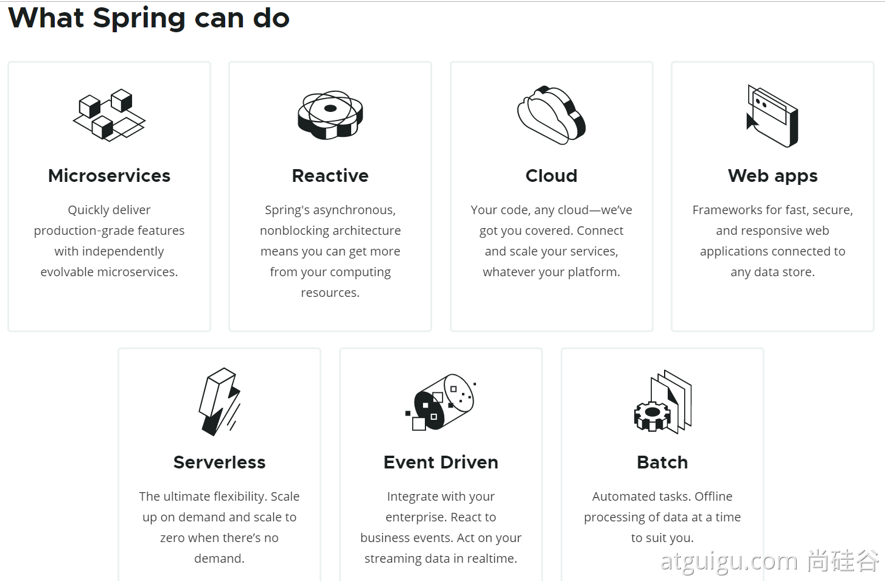

​	微服务 - 响应式 - 云 - app - 无服务器 - 事件驱动 - 批处理

### 2、spring的生态

 

https://spring.io/projects/spring-boot


覆盖了：

web开发

数据访问

安全控制

分布式

消息服务

移动开发

批处理

......


3、Spring5重大升级

3.1、内部源码设计


1.3.2、内部源码设计

基于Java8的一些新特性，如：接口默认实现。重新设计源码架构。

### 3、为什么用springboot

3.1、SpringBoot优点

- Create stand-alone Spring applications

- - 创建独立Spring应用

- Embed Tomcat, Jetty or Undertow directly (no need to deploy WAR files)

- - 内嵌web服务器

- Provide opinionated 'starter' dependencies to simplify your build configuration

- - 自动starter依赖，简化构建配置

- Automatically configure Spring and 3rd party libraries whenever possible

- - 自动配置Spring以及第三方功能

- Provide production-ready features such as metrics, health checks, and externalized configuration

- - 提供生产级别的监控、健康检查及外部化配置

- Absolutely no code generation and no requirement for XML configuration

- - 无代码生成、无需编写XML


SpringBoot是整合Spring技术栈的一站式框架

SpringBoot是简化Spring技术栈的快速开发脚手架


3.2、SpringBoot缺点

- 人称版本帝，迭代快，需要时刻关注变化
- 封装太深，内部原理复杂，不容易精通

### 4、时代背景

4.1、微服务

[James Lewis and Martin Fowler (2014)](https://martinfowler.com/articles/microservices.html)  提出微服务完整概念。https://martinfowler.com/microservices/

- 微服务是一种架构风格
- 一个应用拆分为一组小型服务
- 每个服务运行在自己的进程内，也就是可独立部署和升级
- 服务之间使用轻量级HTTP交互
- 服务围绕业务功能拆分
- 可以由全自动部署机制独立部署
- 去中心化，服务自治。服务可以使用不同的语言、不同的存储技术

4.2、分布式


分布式的困难：

- 远程调用
- 服务发现
- 负载均衡
- 服务容错
- 配置管理
- 服务监控
- 链路追踪
- 日志管理
- 任务调度
- ......

分布式的解决：

- SpringBoot + SpringCloud

### 5、云原生

原生应用如何上云。 Cloud Native

上云的困难：

- 服务自愈
- 弹性伸缩
- 服务隔离
- 自动化部署
- 灰度发布
- 流量治理
- ......

上云的解决：

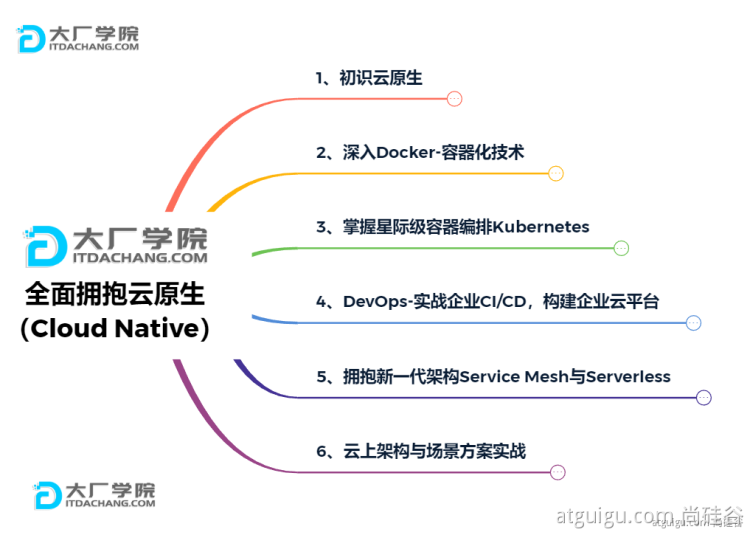

备注：1.springboot官方文档： https://spring.io/projects/spring-boot

​			2.查看springboot版本新特性： https://github.com/spring-projects/spring-boot/wiki#release-notes

## 二、Springboot2入门(基础入门)

### 1、系统要求

- [Java 8](https://www.java.com/) & 兼容java14 .
- Maven 3.3+
- idea 2019.1.2

maven设置：

```
<mirrors>
      <mirror>
        <id>nexus-aliyun</id>
        <mirrorOf>central</mirrorOf>
        <name>Nexus aliyun</name>
        <url>http://maven.aliyun.com/nexus/content/groups/public</url>
      </mirror>
  </mirrors>

  <profiles>
         <profile>
              <id>jdk-1.8</id>
              <activation>
                <activeByDefault>true</activeByDefault>
                <jdk>1.8</jdk>
              </activation>
              <properties>
                <maven.compiler.source>1.8</maven.compiler.source>
                <maven.compiler.target>1.8</maven.compiler.target>
                <maven.compiler.compilerVersion>1.8</maven.compiler.compilerVersion>
              </properties>
         </profile>
  </profiles>
```

### 2、HelloWorld（使用maven快速搭建后端接口)(了解)

需求：浏览发送/hello请求，响应 Hello，Spring Boot 2 

2.1、创建maven工程(创建前检查maven配置)

2.2、引入依赖


    // 创建父工程 自动管理子工程的版本
    <parent>
        <groupId>org.springframework.boot</groupId>
        <artifactId>spring-boot-starter-parent</artifactId>
        <version>2.3.4.RELEASE</version>
    </parent>
    // 引入spring-boot-starter-web后,自动导入一大堆spring、web-mvc、json、tomcat等jar包不用单个引入
    <dependencies>
        <dependency>
            <groupId>org.springframework.boot</groupId>
            <artifactId>spring-boot-starter-web</artifactId>
        </dependency>
    
    </dependencies>
2.3、创建主程序

```
/**
    主程序类
    @SpringBootApplication：这是一个SpringBoot应用
*/
@SpringBootApplication
public class MainApplication {

    public static void main(String[] args) {
        SpringApplication.run(MainApplication.class,args);
    }
}
```

2.4、编写业务

```
@RestController
public class HelloController {

    @RequestMapping("/hello")
    public String handle01(){
        return "Hello, Spring Boot 2!";
    }

}
```

2.5、测试

1. 直接运行main方法，

2. 浏览器访问： localhost:8080/hello

2.6、简化配置

application.properties

```
server.port=8888
```

2.7、简化部署

```
 // 此配置可以将项目打成一个可直接执行的jar包，如果报错可以加上<version>2.3.4.RELEASE</version>试试
 	<build>
        <plugins>
            <plugin>
                <groupId>org.springframework.boot</groupId>
                <artifactId>spring-boot-maven-plugin</artifactId>
            </plugin>
        </plugins>
    </build>
```

把项目打成jar包，直接在目标服务器执行即可。

注意点：

1.直接java -jar xxx.jar 就可以运行(window下也可运行)

2.如果window下运行，右键cmd窗口，取消掉cmd的快速编辑模式

3.如果报错可加上<version>2.3.4.RELEASE</version>试试

备注：实际开发使用spring initializr新建项目，直接初始化springboot开发，更加方便

## 三、了解自动配置原理(基础入门)

### 1、SpringBoot特点

#### 1.1、依赖管理

- 父项目做依赖管理

```
依赖管理    
<parent>
        <groupId>org.springframework.boot</groupId>
        <artifactId>spring-boot-starter-parent</artifactId>
        <version>2.3.4.RELEASE</version>
</parent>

上面的父项目
 <parent>
    <groupId>org.springframework.boot</groupId>
    <artifactId>spring-boot-dependencies</artifactId>
    <version>2.3.4.RELEASE</version>
  </parent>

自动版本仲裁机制：当声明spring-boot-starter-parent的version之后，就自动声明了几乎所有开发中常用的依赖的版本号，
				当再引入依赖时就不需要再指定该依赖的版本号了
```

- 开发导入starter场景启动器

```
1、见到很多 spring-boot-starter-* ： *就是某种场景，例如spring-boot-starter-web或spring-boot-starter-data-redis
2、只要引入starter，这个场景的所有常规需要的依赖我们都自动引入
3、SpringBoot所有支持的场景
https://docs.spring.io/spring-boot/docs/current/reference/html/using-spring-boot.html#using-boot-starter
4、见到的  *-spring-boot-starter： 第三方为我们提供的简化开发的场景启动器。例如mybatis-spring-boot-starter
5、所有场景启动器最底层的依赖
<dependency>
  <groupId>org.springframework.boot</groupId>
  <artifactId>spring-boot-starter</artifactId>
  <version>2.3.4.RELEASE</version>
  <scope>compile</scope>
</dependency>
```

- 无需关注版本号，自动版本仲裁

```
1、引入依赖默认都可以不写版本
2、引入非版本仲裁的jar，要写版本号。
```


- 可以修改默认版本号

```
1、查看spring-boot-dependencies里面规定当前依赖的版本 用的 key。
2、在当前项目里面重写配置，写在<parent>标签下面
    <properties>
        <mysql.version>5.1.43</mysql.version>
    </properties>
```

#### 1.2、自动配置

- 自动配好Tomcat

- - 引入Tomcat依赖。
  - 配置Tomcat

```
点击spring-boot-starter-parent -> 再点击spring-boot-dependencies 就可以查看所有依赖的默认版本号
<dependency>
      <groupId>org.springframework.boot</groupId>
      <artifactId>spring-boot-starter-tomcat</artifactId>
      <version>2.3.4.RELEASE</version>
      <scope>compile</scope>
    </dependency>
```

- 自动配好SpringMVC

- - 引入SpringMVC全套组件
  - 自动配好SpringMVC常用组件（功能）

- 自动配好Web常见功能，如：字符编码问题

- - SpringBoot帮我们配置好了所有web开发的常见场景

- 默认的包结构

- - **主程序所在包及其下面的所有子包里面的组件都会被默认扫描进来**
  - 无需以前的包扫描配置
  - 想要改变扫描路径，@SpringBootApplication(scanBasePackages=**"com.atguigu"**)

- - - 或者@ComponentScan 指定扫描路径（两者不能共存，因为@SpringBootApplication注解是个复合注解，包含@ComponentScan）

```
@SpringBootApplication
等同于
@SpringBootConfiguration
@EnableAutoConfiguration
@ComponentScan("com.atguigu.boot")

@SpringBootApplication(scanBasePackages="com.atguigu")
等同于
@SpringBootConfiguration
@EnableAutoConfiguration
@ComponentScan("com.atguigu")
```

- 各种配置拥有默认值

- - 默认配置最终都是映射到某个类上，如：MultipartProperties (所有默认配置都可以在源码中找到)
  - 配置文件的值最终会绑定每个类上，这个类会在容器中创建对象

- 按需加载所有自动配置项

- - 非常多的starter
  - 引入了哪些场景这个场景的自动配置才会开启
  - SpringBoot所有的自动配置功能都在 spring-boot-autoconfigure 包里面
  - 

- ......

### 2、容器功能

#### 2.1、组件添加的几种方式

##### 1、@Configuration

- 基本使用
- **Full模式与Lite模式**

- - 示例
  - 最佳实战

- - - 配置 类组件之间无依赖关系用Lite模式加速容器启动过程，减少判断
    - 配置类组件之间有依赖关系，方法会被调用得到之前单实例组件，用Full模式

```
#############################Configuration使用示例######################################################
/**
 * 1、配置类里面使用@Bean标注在方法上给容器注册组件，默认也是单实例的
 * 2、配置类本身也是组件
 * 3、proxyBeanMethods：代理bean的方法
 *      Full(proxyBeanMethods = true)、【保证每个@Bean方法被调用多少次返回的组件都是单实例的】
 *      Lite(proxyBeanMethods = false)【每个@Bean方法被调用多少次返回的组件都是新创建的】
 *      组件依赖必须使用Full模式默认。其他默认是否Lite模式
 *		备注：full模式首次加载时相对耗时，lite速度较快 proxyBeanMethods默认是true
 *
 *
 */
@Configuration(proxyBeanMethods = false) //告诉SpringBoot这是一个配置类 == 配置文件
public class MyConfig {

    /**
     * Full:外部无论对配置类中的这个组件注册方法调用多少次获取的都是之前注册容器中的单实例对象
     * @return
     */
    @Bean //给容器中添加组件。以方法名作为组件的id。返回类型就是组件类型。返回的值，就是组件在容器中的实例
    public User user01(){
        User zhangsan = new User("zhangsan", 18);
        //user组件依赖了Pet组件
        zhangsan.setPet(tomcatPet());
        return zhangsan;
    }

    @Bean("tom")
    public Pet tomcatPet(){
        return new Pet("tomcat");
    }
}


################################@Configuration测试代码如下########################################
@SpringBootConfiguration
@EnableAutoConfiguration
@ComponentScan("com.atguigu.boot")
public class MainApplication {

    public static void main(String[] args) {
        //1、返回我们IOC容器
        ConfigurableApplicationContext run = SpringApplication.run(MainApplication.class, args);

        //2、查看容器里面的组件
        String[] names = run.getBeanDefinitionNames();
        for (String name : names) {
            System.out.println(name);
        }

        //3、从容器中获取组件

        Pet tom01 = run.getBean("tom", Pet.class);

        Pet tom02 = run.getBean("tom", Pet.class);

        System.out.println("组件："+(tom01 == tom02));


        //4、com.atguigu.boot.config.MyConfig$$EnhancerBySpringCGLIB$$51f1e1ca@1654a892
        MyConfig bean = run.getBean(MyConfig.class);
        System.out.println(bean);

        //如果@Configuration(proxyBeanMethods = true)代理对象调用方法。SpringBoot总会检查这个组件是否在容器中有。
        //保持组件单实例
        User user = bean.user01();
        User user1 = bean.user01();
        System.out.println(user == user1);


        User user01 = run.getBean("user01", User.class);
        Pet tom = run.getBean("tom", Pet.class);

        System.out.println("用户的宠物："+(user01.getPet() == tom));
    }
}

```

##### 2、@Bean、@Component、@Controller、@Service、@Repository

备注：  1. @Bean通常用在方法上，作用是将方法返回值作为组件添加到容器中

​			 2. @Component、@Controller、@Service、@Repository方法在类上，作用是将该类的实例作为组件添加到容器中

##### 3、@Import

```
 * @Import({User.class, DBHelper.class})
 *      给容器中自动创建出这两个类型的组件、默认组件的名字就是全类名
 */

@Import({User.class, DBHelper.class})
@Configuration(proxyBeanMethods = false) //告诉SpringBoot这是一个配置类 == 配置文件
public class MyConfig {
}
```

@Import 高级用法： https://www.bilibili.com/video/BV1gW411W7wy?p=8

##### 4、@Conditional

条件装配：满足Conditional指定的条件，则进行组件注入


```
举例：
@Configuration(proxyBeanMethods = false) //告诉SpringBoot这是一个配置类 == 配置文件
//@ConditionalOnBean(name = "tom")   //表示容器中有tom组件再加载该类
@ConditionalOnMissingBean(name = "tom")  // 表示容器中没有tom组件再加载该类 和@ConditionalOnBean相反
public class MyConfig {

	@ConditionalOnMissingBean(name = "tom") // 表示容器中没有tom组件再加载该方法
	@Bean //给容器中添加组件。以方法名作为组件的id。返回类型就是组件类型。返回的值，就是组件在容器中的实例
    public User user01(){
        User zhangsan = new User("zhangsan", 18);
        //user组件依赖了Pet组件
        zhangsan.setPet(tomcatPet());
        return zhangsan;
    }

    @Bean("tom22")
    public Pet tomcatPet(){
        return new Pet("tomcat");
    }
}

备注：1. @Conditional有很多派生注解，可以用到类上或方法
	2. @Conditional的一系列注解就是按需加载的实现原理，底层源码大量使用
```

##### 5、原生配置文件引入(了解) 

@ImportResource(导入xml方式配置的1组件)

#### 2.2、配置绑定 

如何使用Java读取到properties文件中的内容，并且把它封装到JavaBean中，以供随时使用

##### 0、java原生代码实现(简单示例):

```
public class getProperties {
     public static void main(String[] args) throws FileNotFoundException, IOException {
         Properties pps = new Properties();
         pps.load(new FileInputStream("a.properties"));
         Enumeration enum1 = pps.propertyNames();//得到配置文件的名字
         while(enum1.hasMoreElements()) {
             String strKey = (String) enum1.nextElement();
             String strValue = pps.getProperty(strKey);
             System.out.println(strKey + "=" + strValue);
             //封装到JavaBean。
         }
     }
 }
```

##### 1、@ConfigurationProperties

```
/**
 * 只有在容器中的组件，才会拥有SpringBoot提供的强大功能
 */
@Component // 加入到容器中,才能绑定配置
@ConfigurationProperties(prefix = "mycar")
public class Car {

    private String brand;
    private Integer price;

    public String getBrand() {
        return brand;
    }

    public void setBrand(String brand) {
        this.brand = brand;
    }

    public Integer getPrice() {
        return price;
    }

    public void setPrice(Integer price) {
        this.price = price;
    }

    @Override
    public String toString() {
        return "Car{" +
                "brand='" + brand + '\'' +
                ", price=" + price +
                '}';
    }
}

application.properties:
	mycar.brand=byd
	mycar.price=100000
	
	备注: 绑定配置两种方式 （2、 和 3、)
```

##### 2、@Component + @ConfigurationProperties

##### 3、@EnableConfigurationProperties + @ConfigurationProperties

```
@EnableConfigurationProperties(Car.class)
//1、开启Car配置绑定功能
//2、把这个Car这个组件自动注册到容器中
public class MyConfig {
}
```

### 3、自动配置原理入门

#### 3.1、引导加载自动配置类

```
@SpringBootConfiguration
@EnableAutoConfiguration
@ComponentScan(excludeFilters = { @Filter(type = FilterType.CUSTOM, classes = TypeExcludeFilter.class),
		@Filter(type = FilterType.CUSTOM, classes = AutoConfigurationExcludeFilter.class) })
public @interface SpringBootApplication{}
```

3.1.1、@SpringBootConfiguration

​	@Configuration。代表当前是一个配置类

3.1.2、@ComponentScan

​	指定扫描哪些，Spring注解；

3.1.3、@EnableAutoConfiguration

```
@AutoConfigurationPackage
@Import(AutoConfigurationImportSelector.class)
public @interface EnableAutoConfiguration {}
```

作用：

```
@AutoConfigurationPackage：自动配置包,指定了默认的包规则
@Import(AutoConfigurationImportSelector.class)：
1、利用getAutoConfigurationEntry(annotationMetadata);给容器中批量导入一些组件
2、调用List<String> configurations = getCandidateConfigurations(annotationMetadata, attributes)获取到所有需要导入到容器中的配置类
3、利用工厂加载 Map<String, List<String>> loadSpringFactories(@Nullable ClassLoader classLoader)；得到所有的组件
4、从META-INF/spring.factories位置来加载一个文件。
	默认扫描我们当前系统里面所有META-INF/spring.factories位置的文件
    spring-boot-autoconfigure-2.3.4.RELEASE.jar包里面也有META-INF/spring.factories
```

#### 3.2、按需开启自动配置项

虽然我们127个场景的所有自动配置启动的时候默认全部加载。xxxxAutoConfiguration
按照条件装配规则（@Conditional），但最终会按需配置。

#### 3.3、修改默认配置

SpringBoot默认会在底层配好所有的组件。但是如果用户自己配置了以用户的优先

```
@Bean
@ConditionalOnMissingBean
public CharacterEncodingFilter characterEncodingFilter() {
}
这样就自定义了编码过滤器，springboot不再执行底层的默认编码过滤器，而是以自定义的为准
```

总结：

- SpringBoot先加载所有的自动配置类  xxxxxAutoConfiguration
- 每个自动配置类按照条件进行生效，默认都会绑定配置文件指定的值。xxxxProperties里面拿。xxxProperties和配置文件进行了绑定
- 生效的配置类就会给容器中装配很多组件
- 只要容器中有这些组件，相当于这些功能就有了
- 定制化配置

- - 用户直接自己@Bean替换底层的组件
  - 用户去看这个组件是获取的配置文件什么值就去修改。

**xxxxxAutoConfiguration ---> 组件  --->** **xxxxProperties里面拿值  ----> application.properties**

### 4、开发小技巧

#### 4.1、Lombok

简化JavaBean开发

```
===============================简化JavaBean开发===================================
@NoArgsConstructor //无参构造器
@AllArgsConstructor	
@Data
public class User {

    private String name;
    private Integer age;

    private Pet pet;

    public User(String name,Integer age){
        this.name = name;
        this.age = age;
    }
}

================================简化日志开发===================================
@Slf4j
@RestController
public class HelloController {
    @RequestMapping("/hello")
    public String handle01(@RequestParam("name") String name){
        
        log.info("请求进来了....");
        
        return "Hello, Spring Boot 2!"+"你好："+name;
    }
}

备注：
@Data ： 注在类上，提供类的get、set、equals、hashCode、toString等方法 
@AllArgsConstructor ：注在类上，提供类的全参构造
@NoArgsConstructor ：注在类上，提供类的无参构造
@Setter ：注在属性或类上，提供 set 方法
@Getter ：注在属性或类上，提供 get 方法
@ToString: 注在类上，提供对应的toString方法
@EqualsAndHashCode  ：注在类上，提供对应的 equals 和 hashCode 方法
@Slf4j/@Log4j/@Log4j2 ：注在类上，提供对应的 Logger 对象，变量名为 log
@Accessors(chain = true): 开启链式编程
(1.@Data == @Setter+@Getter+@EqualsAndHashCode+@ToString 2.非全参非无参构造器需要手动写)
```

#### 4.2、dev-tools

        // 修改页面后可热更新,修改后端代码或配置后重新编译
        <dependency>
            <groupId>org.springframework.boot</groupId>
            <artifactId>spring-boot-devtools</artifactId>
            <optional>true</optional>
        </dependency>
        //项目或者页面修改以后：Ctrl+F9；


备注: 1. 虚假的热更新: dev-tools在前后端分离的大趋势下,开发后端使用该插件 没卵用

​		  2. 真正的热更新:  JRebel插件(付费,但有教程)

#### 4.3、Spring Initailizr（项目初始化向导)

1、选择我们需要的开发场景 (例如spring web,mybatis,redis等)

2、自动依赖引入(自动注入选择的场景)

3、自动创建项目结构


4、自动编写好主配置类

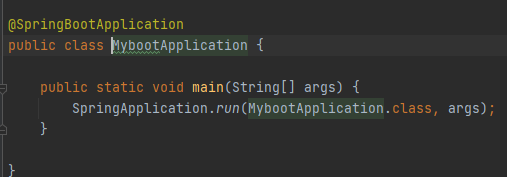

备注: 可直接上手开发

>补充 ->
>
>使用Spring Initailizr创建项目的完整流程 (可能会因idea的版本号不同,目前版本(2020.3.3)):
>
>第零步:	(检查idea中的maven配置)
>
>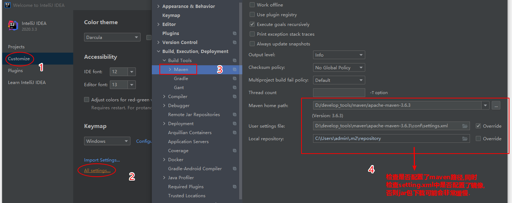
>
>第一步:	(直接点击new project -> springinitializr(next))
>
>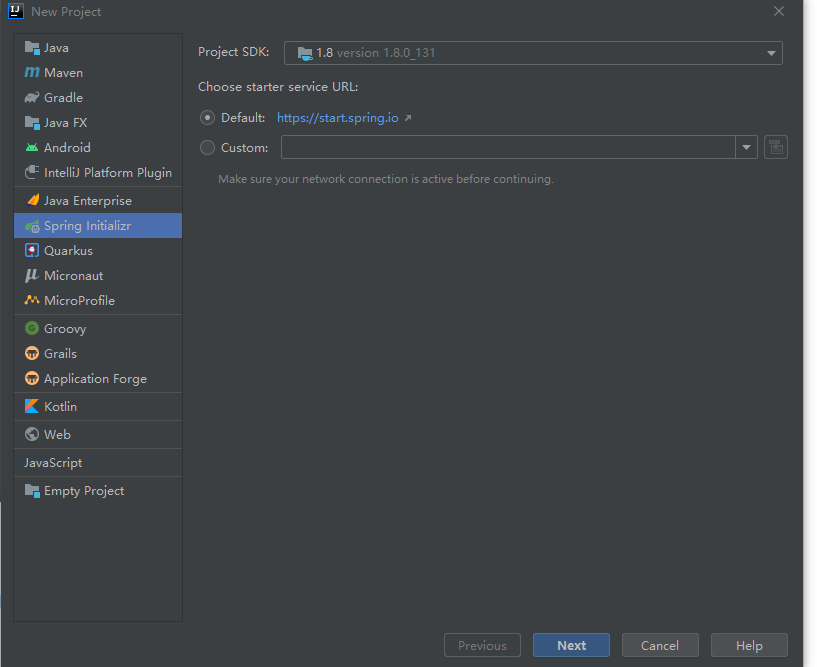
>
>第二步:	(通常需要设置Name,此Name并不是项目名称,项目名称在最后)
>
>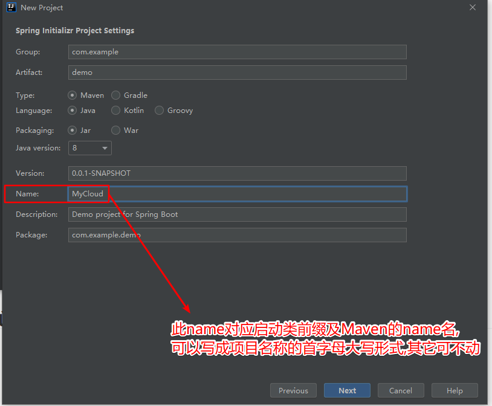
>
>​	此Name对应着创建项目后的以下几个位置:
>
>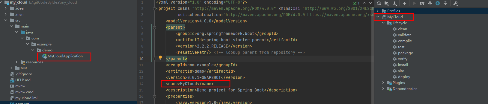
>
>第三步:
>
>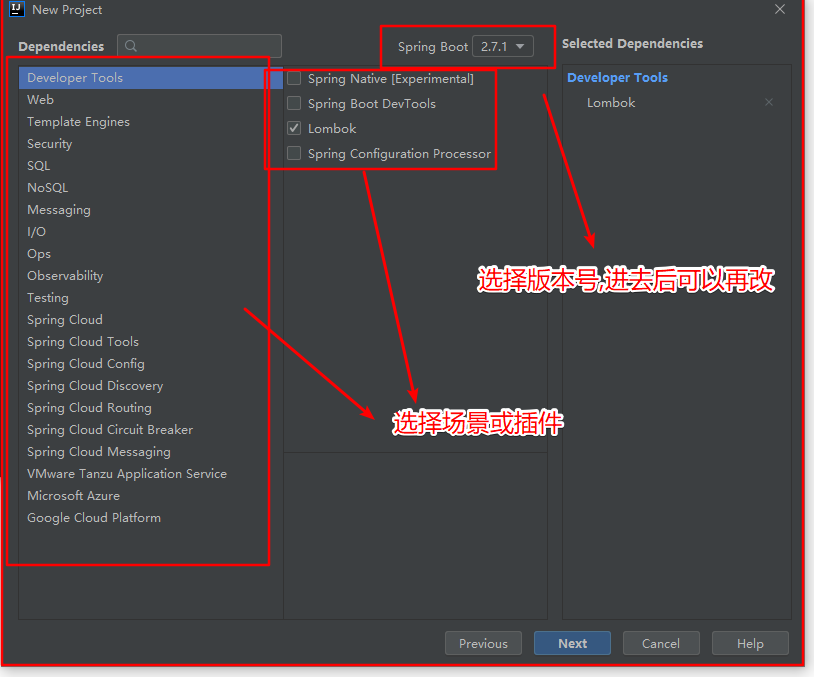
>
>第四步:
>
>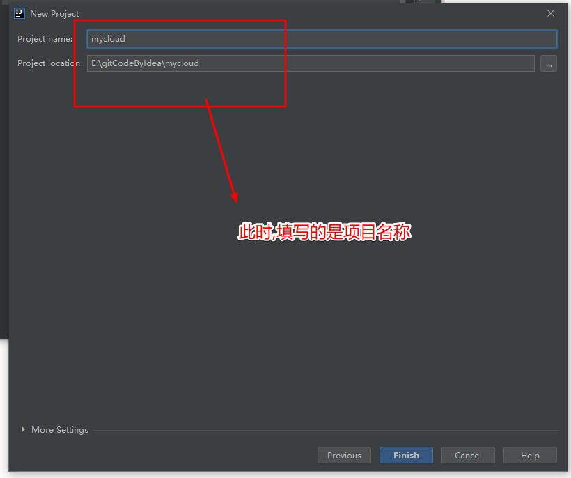
>
>
>
>创建完成,等待maven下载依赖(本地有就使用本地依赖,本地没有就从中央仓库下载; 若从中央仓库下载,当场景比较多时,即使配置镜像可能也会比较慢)
>
>


## 四、配置文件(核心功能)

### 1、文件类型

1.1、properties

同以前的properties用法

1.2、yaml

1.2.1、简介

YAML 是 "YAML Ain't Markup Language"（YAML 不是一种标记语言）的递归缩写。在开发的这种语言时，YAML 的意思其实是："Yet Another Markup Language"（仍是一种标记语言）。 

yaml非常适合用来做以数据为中心的配置文件


```
备注: 1. yaml简写yml
	 2. springboot会自动读取类路径下yaml(yml)或properties文件
```

1.2.2、基本语法

- key: value；kv之间有空格
- 大小写敏感
- 使用缩进表示层级关系
- 缩进不允许使用tab，只允许空格
- 缩进的空格数不重要，只要相同层级的元素左对齐即可
- '#'表示注释
- 字符串无需加引号，如果要加，''与""表示字符串内容 会被 转义/不转义

1.2.3、数据类型

- 字面量(常用)：单个的、不可再分的值。date、boolean、string、number、null

```
k: v
```

- 对象(常用)：键值对的集合。map、hash、set、object 

```
行内写法：  
k: {k1:v1,k2:v2,k3:v3}
#或
k: 
  k1: v1
  k2: v2
  k3: v3
```

- 数组(了解)：一组按次序排列的值。array、list、queue(了解)

```
行内写法：  k: [v1,v2,v3]
#或者
k:
 - v1
 - v2
 - v3
```

1.2.4、示例

	@Data
	public class Person {
	    private String userName;
	    private Boolean boss;
	    private Date birth;
	    private Integer age;
	    private Pet pet;
	    private String[] interests;
	    private List<String> animal;
	    private Map<String, Object> score;
	    private Set<Double> salarys;
	    private Map<String, List<Pet>> allPets;
	}
	@Data
	public class Pet {
		private String name;
		private Double weight;
	}
yaml中表示以上对象:

```
person:
  userName: zhangsan
  boss: false
  birth: 2019/12/12 20:12:33
  age: 18
  pet: 
    name: tomcat
    weight: 23.4
  interests: [篮球,游泳]
  animal: 
    - jerry
    - mario
  score:
    english: 
      first: 30
      second: 40
      third: 50
    math: [131,140,148]
    chinese: {first: 128,second: 136}
  salarys: [3999,4999.98,5999.99]
  allPets:
    sick:
      - {name: tom}
      - {name: jerry,weight: 47}
    health: [{name: mario,weight: 47}]
```


### 2、配置提示

由于 自定义的类和配置文件绑定一般没有提示,可以进行下面的配置,就可以有提示了

        // 作用: 对于自定义的类和配置文件绑定后,在配置文件中(yml/yaml/properties)就会出现提示
        <dependency>
            <groupId>org.springframework.boot</groupId>
            <artifactId>spring-boot-configuration-processor</artifactId>
            <optional>true</optional>
        </dependency>
        // 打包
         <build>
            <plugins>
                <plugin>
                    <groupId>org.springframework.boot</groupId>
                    <artifactId>spring-boot-maven-plugin</artifactId>
                    <configuration>
                    	// 打包时去掉场景spring-boot-configuration-processor,节省生产环境空间
                        <excludes>
                            <exclude>
                                <groupId>org.springframework.boot</groupId>
                                <artifactId>spring-boot-configuration-processor</artifactId>
                            </exclude>
                        </excludes>
                    </configuration>
                </plugin>
            </plugins>
        </build>

## 五、web开发

### 1、简单功能分析

#### 1.1、静态资源访问

1)静态资源目录

只要静态资源放在类路径下： /static ` (or ` /public` or `/resources ` or ` /META-INF/resources）

访问 ： 当前项目根路径/ + 静态资源名

原理： 静态映射/**。

请求进来，先去找Controller看能不能处理。不能处理的所有请求又都交给静态资源处理器。静态资源也找不到则响应404页面


改变默认的静态资源路径

```
spring:
  mvc:
    static-path-pattern: /res/**

  resources:
    static-locations: [classpath:/haha/]
```

2、静态资源访问前缀

默认无前缀

```
spring:
  mvc:
    static-path-pattern: /res/**
```

当前项目 + static-path-pattern + 静态资源名 = 静态资源文件夹下找

#### 1.2、欢迎页支持

- 静态资源路径下  index.html

- - 可以配置静态资源路径
  - 但是不可以配置静态资源的访问前缀。否则导致 index.html不能被默认访问

```
spring:
#  mvc:
#    static-path-pattern: /res/**   这个会导致welcome page功能失效

  resources:
    static-locations: [classpath:/haha/]
```

- controller能处理/index

#### 1.3、自定义 `Favicon`

favicon.ico 放在静态资源目录下即可

#### 1.4、静态资源配置原理

- SpringBoot启动默认加载  xxxAutoConfiguration 类（自动配置类）
- SpringMVC功能的自动配置类 WebMvcAutoConfiguration，生效

```
@Configuration(proxyBeanMethods = false)
@ConditionalOnWebApplication(type = Type.SERVLET)
@ConditionalOnClass({ Servlet.class, DispatcherServlet.class, WebMvcConfigurer.class })
@ConditionalOnMissingBean(WebMvcConfigurationSupport.class)
@AutoConfigureOrder(Ordered.HIGHEST_PRECEDENCE + 10)
@AutoConfigureAfter({ DispatcherServletAutoConfiguration.class, TaskExecutionAutoConfiguration.class,
		ValidationAutoConfiguration.class })
public class WebMvcAutoConfiguration {}
```

- 给容器中配了什么。

```
	@Configuration(proxyBeanMethods = false)
	@Import(EnableWebMvcConfiguration.class)
	@EnableConfigurationProperties({ WebMvcProperties.class, ResourceProperties.class })
	@Order(0)
	public static class WebMvcAutoConfigurationAdapter implements WebMvcConfigurer {}
```

- 配置文件的相关属性和xxx进行了绑定。WebMvcProperties==**spring.mvc**、ResourceProperties==**spring.resources**

下面四个原理略

1、配置类只有一个有参构造器

2、资源处理的默认规则

3、欢迎页的处理规则

4、favicon

### 2、请求参数处理

#### 0、请求映射及原理(略)

#### 1、普通参数与基本注解

1.1、注解

@PathVariable、@RequestHeader、@ModelAttribute、@RequestParam、@MatrixVariable、@CookieValue、@RequestBody

```
@RestController
public class ParameterTestController {


    //  car/2/owner/zhangsan
    @GetMapping("/car/{id}/owner/{username}")
    public Map<String,Object> getCar(@PathVariable("id") Integer id,
                                     @PathVariable("username") String name,
                                     @PathVariable Map<String,String> pv,
                                     @RequestHeader("User-Agent") String userAgent,
                                     @RequestHeader Map<String,String> header,
                                     @RequestParam("age") Integer age,
                                     @RequestParam("inters") List<String> inters,
                                     @RequestParam Map<String,String> params,
                                     @CookieValue("_ga") String _ga,
                                     @CookieValue("_ga") Cookie cookie){


        Map<String,Object> map = new HashMap<>();

//        map.put("id",id);
//        map.put("name",name);
//        map.put("pv",pv);
//        map.put("userAgent",userAgent);
//        map.put("headers",header);
        map.put("age",age);
        map.put("inters",inters);
        map.put("params",params);
        map.put("_ga",_ga);
        System.out.println(cookie.getName()+"===>"+cookie.getValue());
        return map;
    }


    @PostMapping("/save")
    public Map postMethod(@RequestBody String content){
        Map<String,Object> map = new HashMap<>();
        map.put("content",content);
        return map;
    }


    //1、语法： 请求路径：/cars/sell;low=34;brand=byd,audi,yd
    //2、SpringBoot默认是禁用了矩阵变量的功能
    //      手动开启：原理。对于路径的处理。UrlPathHelper进行解析。
    //              removeSemicolonContent（移除分号内容）支持矩阵变量的
    //3、矩阵变量必须有url路径变量才能被解析
    @GetMapping("/cars/{path}")
    public Map carsSell(@MatrixVariable("low") Integer low,
                        @MatrixVariable("brand") List<String> brand,
                        @PathVariable("path") String path){
        Map<String,Object> map = new HashMap<>();

        map.put("low",low);
        map.put("brand",brand);
        map.put("path",path);
        return map;
    }

    // /boss/1;age=20/2;age=10

    @GetMapping("/boss/{bossId}/{empId}")
    public Map boss(@MatrixVariable(value = "age",pathVar = "bossId") Integer bossAge,
                    @MatrixVariable(value = "age",pathVar = "empId") Integer empAge){
        Map<String,Object> map = new HashMap<>();

        map.put("bossAge",bossAge);
        map.put("empAge",empAge);
        return map;

    }

}
```

1.2、Servlet API：

WebRequest、ServletRequest、MultipartRequest、 HttpSession、javax.servlet.http.PushBuilder、Principal、InputStream、Reader、HttpMethod、Locale、TimeZone、ZoneId


**ServletRequestMethodArgumentResolver  以上的部分参数**

```
@Override
	public boolean supportsParameter(MethodParameter parameter) {
		Class<?> paramType = parameter.getParameterType();
		return (WebRequest.class.isAssignableFrom(paramType) ||
				ServletRequest.class.isAssignableFrom(paramType) ||
				MultipartRequest.class.isAssignableFrom(paramType) ||
				HttpSession.class.isAssignableFrom(paramType) ||
				(pushBuilder != null && pushBuilder.isAssignableFrom(paramType)) ||
				Principal.class.isAssignableFrom(paramType) ||
				InputStream.class.isAssignableFrom(paramType) ||
				Reader.class.isAssignableFrom(paramType) ||
				HttpMethod.class == paramType ||
				Locale.class == paramType ||
				TimeZone.class == paramType ||
				ZoneId.class == paramType);
	}
```

1.3、复杂参数：

**Map**、**Model（map、model里面的数据会被放在request的请求域  request.setAttribute）、**Errors/BindingResult、**RedirectAttributes（ 重定向携带数据）**、**ServletResponse（response）**、SessionStatus、UriComponentsBuilder、ServletUriComponentsBuilder

1.4、自定义对象参数：

可以自动类型转换与格式化，可以级联封装。

#### 2、POJO封装过程

- **ServletModelAttributeMethodProcessor**

#### 3、参数处理原理

- HandlerMapping中找到能处理请求的Handler（Controller.method()）
- 为当前Handler 找一个适配器 HandlerAdapter； **RequestMappingHandlerAdapter**
- 适配器执行目标方法并确定方法参数的每一个值

#### 4、返回值处理器(略)

#### 5、如何确定目标方法每一个参数的值(略)

#### 6、目标方法执行完成

将所有的数据都放在 **ModelAndViewContainer**；包含要去的页面地址View。还包含Model数据

#### 7、处理派发结果

```
processDispatchResult**(processedRequest, response, mappedHandler, mv, dispatchException);
renderMergedOutputModel(mergedModel, getRequestToExpose(request), response);
```

### 3、数据响应与内容协商

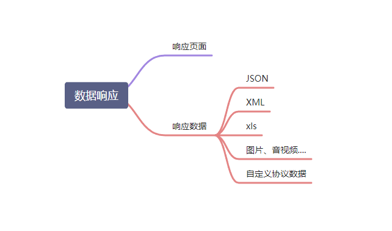

#### 1、响应JSON

1.1、jackson.jar+@ResponseBody

```
       <dependency>
            <groupId>org.springframework.boot</groupId>
            <artifactId>spring-boot-starter-web</artifactId>
        </dependency>
	<!-- web场景自动引入了json场景 -->
    <dependency>
      <groupId>org.springframework.boot</groupId>
      <artifactId>spring-boot-starter-json</artifactId>
      <version>2.3.4.RELEASE</version>
      <scope>compile</scope>
    </dependency>
```

1)、返回值解析器(略)

2)、返回值解析器原理(略)

1.2、SpringMVC到底支持哪些返回值

```
ModelAndView
Model
View
ResponseEntity 
ResponseBodyEmitter
StreamingResponseBody
HttpEntity
HttpHeaders
Callable
DeferredResult
ListenableFuture
CompletionStage
WebAsyncTask
有 @ModelAttribute 且为对象类型的
@ResponseBody 注解 ---> RequestResponseBodyMethodProcessor；
```

1.3、HTTPMessageConverter原理

1、MessageConverter规范(略)

2、默认的MessageConverter(略)

#### 2、内容协商

根据客户端接收能力不同，返回不同媒体类型的数据。

1、引入xml依赖

```
 <dependency>
            <groupId>com.fasterxml.jackson.dataformat</groupId>
            <artifactId>jackson-dataformat-xml</artifactId>
</dependency>
```

2、postman分别测试返回json和xml

只需要改变请求头中Accept字段。Http协议中规定的，告诉服务器本客户端可以接收的数据类型。

#### 3、开启浏览器参数方式内容协商功能

为了方便内容协商，开启基于请求参数的内容协商功能

```
spring:
    contentnegotiation:
      favor-parameter: true  #开启请求参数内容协商模式
```

发请求： http://localhost:8080/test/person?format=json

[http://localhost:8080/test/person?format=](http://localhost:8080/test/person?format=json)xml

#### 4、内容协商原理(略)

#### 5、自定义 MessageConverter(略)

### 4、视图解析与模板引擎

视图解析：**SpringBoot默认不支持 JSP，需要引入第三方模板引擎技术实现页面渲染。**

#### 1、视图解析

试图处理方式包括 转发、重定向、自定义视图

1)、视图解析原理流程(略)

#### 2、模板引擎-Thymeleaf

1、thymeleaf简介

**现代化、服务端Java模板引擎**

2、基本语法

1)、表达式

| 表达式名字 | 语法   | 用途                               |
| :--------- | ------ | ---------------------------------- |
| 变量取值   | ${...} | 获取请求域、session域、对象等值    |
| 选择变量   | *{...} | 获取上下文对象值                   |
| 消息       | #{...} | 获取国际化等值                     |
| 链接       | @{...} | 生成链接                           |
| 片段表达式 | ~{...} | jsp:include 作用，引入公共页面片段 |

2)、字面量

文本值: **'one text'** **,** **'Another one!'** **,…**数字: **0** **,** **34** **,** **3.0** **,** **12.3** **,…**布尔值: **true** **,** **false**

空值: **null**

变量： one，two，.... 变量不能有空格

3)、文本操作

字符串拼接: **+**

变量替换: **|The name is ${name}|** 

4)、数学运算

运算符: + , - , * , / , %

5)、布尔运算

运算符:  **and** **,** **or**

一元运算: **!** **,** **not** 

6)、比较运算

比较: **>** **,** **<** **,** **>=** **,** **<=** **(** **gt** **,** **lt** **,** **ge** **,** **le** **)**等式: **==** **,** **!=** **(** **eq** **,** **ne** **)** 

7)、条件运算

If-then: **(if) ? (then)**

If-then-else: **(if) ? (then) : (else)**

Default: (value) **?: (defaultvalue)** 

8)、特殊操作

无操作： _


3、设置属性值-th:attr(略)

4、迭代(略)

5、条件运算(略)

6、属性优先级(略)

#### 3、thymeleaf使用

1、引入Starter

```
  <dependency>
            <groupId>org.springframework.boot</groupId>
            <artifactId>spring-boot-starter-thymeleaf</artifactId>
	</dependency>
```

2、自动配置好了thymeleaf

@Configuration(proxyBeanMethods = false)
@EnableConfigurationProperties(ThymeleafProperties.class)
@ConditionalOnClass({ TemplateMode.class, SpringTemplateEngine.class })
@AutoConfigureAfter({ WebMvcAutoConfiguration.class, WebFluxAutoConfiguration.class })
public class ThymeleafAutoConfiguration { }

自动配好的策略

- 1、所有thymeleaf的配置值都在 ThymeleafProperties
- 2、配置好了 **SpringTemplateEngine** 
- **3、配好了** **ThymeleafViewResolver** 
- 4、我们只需要直接开发页面

```
	public static final String DEFAULT_PREFIX = "classpath:/templates/";

	public static final String DEFAULT_SUFFIX = ".html";  //xxx.html
```

3、页面开发

```
<!DOCTYPE html>
<html lang="en" xmlns:th="http://www.thymeleaf.org">
<head>
    <meta charset="UTF-8">
    <title>Title</title>
</head>
<body>
<h1 th:text="${msg}">哈哈</h1>
<h2>
    <a href="www.atguigu.com" th:href="${link}">去百度</a>  <br/>
    <a href="www.atguigu.com" th:href="@{link}">去百度2</a>
</h2>
</body>
</html>
```

#### 4、构建后台管理系统

1、项目创建

thymeleaf、web-starter、devtools、lombok

2、静态资源处理

自动配置好，我们只需要把所有静态资源放到 static 文件夹下

3、路径构建

th:action="@{/login}"

4、模板抽取

th:insert/replace/include

5、页面跳转

```
    // 未使用拦截器、过滤器的简陋验证用户是否登陆:
    @PostMapping("/login")
    public String main(User user, HttpSession session, Model model){

        if(StringUtils.hasLength(user.getUserName()) && "123456".equals(user.getPassword())){
            //把登陆成功的用户保存起来
            session.setAttribute("loginUser",user);
            //登录成功重定向到main.html;  重定向防止表单重复提交
            return "redirect:/main.html";
        }else {
            model.addAttribute("msg","账号密码错误");
            //回到登录页面
            return "login";
        }

    }
```

6、数据渲染(略)

### 5、拦截器(重点)

#### 1、HandlerInterceptor 接口

```
/**
 * 登录检查
 * 1、配置好拦截器要拦截哪些请求
 * 2、把这些配置放在容器中
 */
@Slf4j
public class LoginInterceptor implements HandlerInterceptor {

    /**
     * 目标方法执行之前
     * @param request
     * @param response
     * @param handler
     * @return
     * @throws Exception
     */
    @Override
    public boolean preHandle(HttpServletRequest request, HttpServletResponse response, Object handler) throws Exception {

        String requestURI = request.getRequestURI();
        log.info("preHandle拦截的请求路径是{}",requestURI);

        //登录检查逻辑
        HttpSession session = request.getSession();

        Object loginUser = session.getAttribute("loginUser");

        if(loginUser != null){
            //放行
            return true;
        }

        //拦截住。未登录。跳转到登录页
        request.setAttribute("msg","请先登录");
//        re.sendRedirect("/");
        request.getRequestDispatcher("/").forward(request,response);
        return false;
    }

    /**
     * 目标方法执行完成以后
     * @param request
     * @param response
     * @param handler
     * @param modelAndView
     * @throws Exception
     */
    @Override
    public void postHandle(HttpServletRequest request, HttpServletResponse response, Object handler, ModelAndView modelAndView) throws Exception {
        log.info("postHandle执行{}",modelAndView);
    }

    /**
     * 页面渲染以后
     * @param request
     * @param response
     * @param handler
     * @param ex
     * @throws Exception
     */
    @Override
    public void afterCompletion(HttpServletRequest request, HttpServletResponse response, Object handler, Exception ex) throws Exception {
        log.info("afterCompletion执行异常{}",ex);
    }
}
```

#### 2、配置拦截器

```
/**
 * 1、编写一个拦截器实现HandlerInterceptor接口
 * 2、拦截器注册到容器中（实现WebMvcConfigurer的addInterceptors）
 * 3、指定拦截规则【如果是拦截所有，静态资源也会被拦截】
 */
@Configuration
public class AdminWebConfig implements WebMvcConfigurer {

    @Override
    public void addInterceptors(InterceptorRegistry registry) {
        registry.addInterceptor(new LoginInterceptor())
                .addPathPatterns("/**")  //所有请求都被拦截包括静态资源
                .excludePathPatterns("/","/login","/css/**","/fonts/**","/images/**","/js/**"); //放行的请求
    }
}
```

#### 3、拦截器原理(重点)(spring mvc也有笔记)

1、根据当前请求，找到**HandlerExecutionChain【**可以处理请求的handler以及handler的所有 拦截器】

2、先来**顺序执行** 所有拦截器的 preHandle方法

- 1、如果当前拦截器prehandler返回为true。则执行下一个拦截器的preHandle
- 2、如果当前拦截器返回为false。直接    倒序执行所有已经执行了的拦截器的  afterCompletion；

**3、如果任何一个拦截器返回false。直接跳出不执行目标方法**

**4、所有拦截器都返回True。执行目标方法**

**5、倒序执行所有拦截器的postHandle方法。**

**6、前面的步骤有任何异常都会直接倒序触发** afterCompletion

7、页面成功渲染完成以后，也会倒序触发 afterCompletion

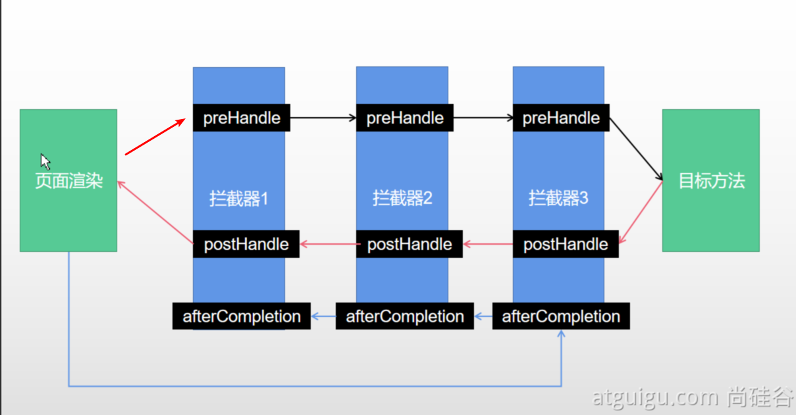

### 6、文件上传

#### 1、页面表单

<form method="post" action="/upload" enctype="multipart/form-data">
    <input type="file" name="file"><br>
    <input type="submit" value="提交">
</form>

#### 2、文件上传代码

    /**
     * MultipartFile 自动封装上传过来的文件
     * @param email
     * @param username
     * @param headerImg
     * @param photos
     * @return
     */
    @PostMapping("/upload")
    public String upload(@RequestParam("email") String email,
                         @RequestParam("username") String username,
                         @RequestPart("headerImg") MultipartFile headerImg,
                         @RequestPart("photos") MultipartFile[] photos) throws IOException {
    
        log.info("上传的信息：email={}，username={}，headerImg={}，photos={}",
                email,username,headerImg.getSize(),photos.length);
    
        if(!headerImg.isEmpty()){
            //保存到文件服务器，OSS服务器
            String originalFilename = headerImg.getOriginalFilename();
            headerImg.transferTo(new File("H:\\cache\\"+originalFilename));
        }
    
        if(photos.length > 0){
            for (MultipartFile photo : photos) {
                if(!photo.isEmpty()){
                    String originalFilename = photo.getOriginalFilename();
                    photo.transferTo(new File("H:\\cache\\"+originalFilename));
                }
            }
        }
        return "main";
    }

#### 3、自动配置原理

**文件上传自动配置类-MultipartAutoConfiguration-****MultipartProperties**

- 自动配置好了 **StandardServletMultipartResolver   【文件上传解析器】**
- **原理步骤**

- - **1、请求进来使用文件上传解析器判断（**isMultipart**）并封装（**resolveMultipart，**返回**MultipartHttpServletRequest**）文件上传请求**
  - **2、参数解析器来解析请求中的文件内容封装成MultipartFile**
  - **3、将request中文件信息封装为一个Map；**MultiValueMap<String, MultipartFile>

**FileCopyUtils**。实现文件流的拷贝

```
    @PostMapping("/upload")
    public String upload(@RequestParam("email") String email,
                         @RequestParam("username") String username,
                         @RequestPart("headerImg") MultipartFile headerImg,
                         @RequestPart("photos") MultipartFile[] photos)
```

### 7、异常处理

#### 1、错误处理

1、默认规则

- 默认情况下，Spring Boot提供`/error`处理所有错误的映射
- 对于机器客户端，它将生成JSON响应，其中包含错误，HTTP状态和异常消息的详细信息。对于浏览器客户端，响应一个“ whitelabel”错误视图，以HTML格式呈现相同的数据

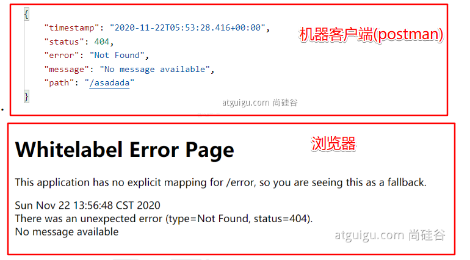

- **要对其进行自定义，添加`**View**`解析为`**error**``****
  **`
- 要完全替换默认行为，可以实现 `ErrorController `并注册该类型的Bean定义，或添加`ErrorAttributes类型的组件`以使用现有机制但替换其内容。

- **类路径下的 templates/error/下的4xx，5xx页面会被自动解析；**

#### 2、定制错误处理逻辑

- 自定义错误页

- - error/404.html   error/5xx.html；有精确的错误状态码页面就匹配精确，没有就找 4xx.html；如果都没有就触发白页

#### 3、异常处理自动配置原理(略)

#### 4、异常处理步骤流程(略)

### 8、Web原生组件注入（Servlet、Filter、Listener）

#### 1、使用Servlet API

```
@ServletComponentScan(basePackages = **"com.atguigu.admin"**) :指定原生Servlet组件都放在那里
@WebServlet(urlPatterns = **"/my"**)：效果：直接响应，**没有经过Spring的拦截器？**
@WebFilter(urlPatterns={**"/css/\*"**,**"/images/\*"**})
@WebListener
```

扩展：DispatchServlet 如何注册进来

- 容器中自动配置了  DispatcherServlet  属性绑定到 WebMvcProperties；对应的配置文件配置项是 **spring.mvc。**
- **通过** **ServletRegistrationBean**<DispatcherServlet> 把 DispatcherServlet  配置进来。
- 默认映射的是 / 路径。

Tomcat-Servlet；

多个Servlet都能处理到同一层路径，精确优选原则

A： /my/

B： /my/1

#### 2、使用RegistrationBean

```
ServletRegistrationBean`, `FilterRegistrationBean`, and `ServletListenerRegistrationBean
```

```
@Configuration
public class MyRegistConfig {

    @Bean
    public ServletRegistrationBean myServlet(){
        MyServlet myServlet = new MyServlet();

        return new ServletRegistrationBean(myServlet,"/my","/my02");
    }


    @Bean
    public FilterRegistrationBean myFilter(){

        MyFilter myFilter = new MyFilter();
//        return new FilterRegistrationBean(myFilter,myServlet());
        FilterRegistrationBean filterRegistrationBean = new FilterRegistrationBean(myFilter);
        filterRegistrationBean.setUrlPatterns(Arrays.asList("/my","/css/*"));
        return filterRegistrationBean;
    }

    @Bean
    public ServletListenerRegistrationBean myListener(){
        MySwervletContextListener mySwervletContextListener = new MySwervletContextListener();
        return new ServletListenerRegistrationBean(mySwervletContextListener);
    }
}
```

### 9、嵌入式Servlet容器

#### 1、切换嵌入式Servlet容器

- 默认支持的webServer

- - `Tomcat`, `Jetty`, or `Undertow` (默认的web-starter导入tomcat包)
  - `ServletWebServerApplicationContext 容器启动寻找ServletWebServerFactory 并引导创建服务器`

- 切换服务器


```
<dependency>
    <groupId>org.springframework.boot</groupId>
    <artifactId>spring-boot-starter-web</artifactId>
    <exclusions>
        <exclusion>
            <groupId>org.springframework.boot</groupId>
            <artifactId>spring-boot-starter-tomcat</artifactId>
        </exclusion>
    </exclusions>
</dependency>
```

- 原理

- - SpringBoot应用启动发现当前是Web应用。web场景包-导入tomcat
  - web应用会创建一个web版的ioc容器 `ServletWebServerApplicationContext` 
  - `ServletWebServerApplicationContext` 启动的时候寻找 `**ServletWebServerFactory**``（Servlet 的web服务器工厂---> Servlet 的web服务器）` 
  - SpringBoot底层默认有很多的WebServer工厂；`TomcatServletWebServerFactory`, `JettyServletWebServerFactory`, or `UndertowServletWebServerFactory`
  - `底层直接会有一个自动配置类。ServletWebServerFactoryAutoConfiguration`
  - `ServletWebServerFactoryAutoConfiguration导入了ServletWebServerFactoryConfiguration（配置类）`
  - `ServletWebServerFactoryConfiguration 配置类 根据动态判断系统中到底导入了那个Web服务器的包。（默认是web-starter导入tomcat包），容器中就有 TomcatServletWebServerFactory`
  - `TomcatServletWebServerFactory 创建出Tomcat服务器并启动；TomcatWebServer 的构造器拥有初始化方法initialize---this.tomcat.start();`
  - `内嵌服务器，就是手动把启动服务器的代码调用（tomcat核心jar包存在）`

#### 2、定制Servlet容器

- 实现  **WebServerFactoryCu**stomizer<ConfigurableServletWebServerFactory> 

- - 把配置文件的值和`**ServletWebServerFactory 进行绑定**`

- 修改配置文件 **server.xxx**
- 直接自定义 **ConfigurableServletWebServerFactory** 


**xxxxx****Customizer****：定制化器，可以改变xxxx的默认规则**

```
import org.springframework.boot.web.server.WebServerFactoryCustomizer;
import org.springframework.boot.web.servlet.server.ConfigurableServletWebServerFactory;
import org.springframework.stereotype.Component;

@Component
public class CustomizationBean implements WebServerFactoryCustomizer<ConfigurableServletWebServerFactory> {

    @Override
    public void customize(ConfigurableServletWebServerFactory server) {
        server.setPort(9000);
    }

}
```

### 10、定制化原理

#### 1、定制化的常见方式 

- 修改配置文件；
- **xxxxxCustomizer；**
- **编写自定义的配置类   xxxConfiguration；+** **@Bean替换、增加容器中默认组件；视图解析器** 
- **Web应用 编写一个配置类实现** **WebMvcConfigurer 即可定制化web功能；+ @Bean给容器中再扩展一些组件**

```
@Configuration
public class AdminWebConfig implements WebMvcConfigurer
```

- @EnableWebMvc + WebMvcConfigurer —— @Bean  可以全面接管SpringMVC，所有规则全部自己重新配置； 实现定制和扩展功能

- - 原理
  - 1、WebMvcAutoConfiguration  默认的SpringMVC的自动配置功能类。静态资源、欢迎页.....
  - 2、一旦使用 @EnableWebMvc 、。会 @Import(DelegatingWebMvcConfiguration.**class**)
  - 3、**DelegatingWebMvcConfiguration** 的 作用，只保证SpringMVC最基本的使用

- - - 把所有系统中的 WebMvcConfigurer 拿过来。所有功能的定制都是这些 WebMvcConfigurer  合起来一起生效
    - 自动配置了一些非常底层的组件。**RequestMappingHandlerMapping**、这些组件依赖的组件都是从容器中获取
    - **public class** DelegatingWebMvcConfiguration **extends** **WebMvcConfigurationSupport**

- - 4、**WebMvcAutoConfiguration** 里面的配置要能生效 必须  @ConditionalOnMissingBean(**WebMvcConfigurationSupport**.**class**)
  - 5、@EnableWebMvc  导致了 **WebMvcAutoConfiguration  没有生效。**

- ... ...

#### 2、原理分析套路

**场景starter** **- xxxxAutoConfiguration - 导入xxx组件 - 绑定xxxProperties --** **绑定配置文件项** 

## 六、数据访问

 

### 1、SQL

#### 1、数据源的自动配置-**HikariDataSource**

1)、导入JDBC场景

        <dependency>
            <groupId>org.springframework.boot</groupId>
            <artifactId>spring-boot-starter-data-jdbc</artifactId>
        </dependency>

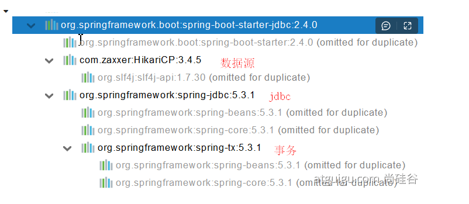

数据库驱动？

为什么导入JDBC场景，官方不导入驱动？因为官方不知道我们接下要操作什么数据库。

数据库版本和驱动版本对应

```
默认版本：<mysql.version>8.0.22</mysql.version>

        <dependency>
            <groupId>mysql</groupId>
            <artifactId>mysql-connector-java</artifactId>
<!--            <version>5.1.49</version>-->
        </dependency>
<!--  想要修改版本
	   1、直接依赖引入具体版本（maven的就近依赖原则）
	   2、重新声明版本（maven的属性的就近优先原则）-->
    <properties>
        <java.version>1.8</java.version>
        <mysql.version>5.1.49</mysql.version>
    </properties>
```

2)、分析自动配置

自动配置的类:

- DataSourceAutoConfiguration ： 数据源的自动配置

- - 修改数据源相关的配置：**spring.datasource**
  - **数据库连接池的配置，是自己容器中没有DataSource才自动配置的**
  - 底层配置好的连接池是：**HikariDataSource**

	@Configuration(proxyBeanMethods = false)
	@Conditional(PooledDataSourceCondition.class)
	@ConditionalOnMissingBean({ DataSource.class, XADataSource.class })
	@Import({ DataSourceConfiguration.Hikari.class, DataSourceConfiguration.Tomcat.class,
			DataSourceConfiguration.Dbcp2.class, DataSourceConfiguration.OracleUcp.class,
			DataSourceConfiguration.Generic.class, DataSourceJmxConfiguration.class })
	protected static class PooledDataSourceConfiguration
- DataSourceTransactionManagerAutoConfiguration： 事务管理器的自动配置
- JdbcTemplateAutoConfiguration： **JdbcTemplate的自动配置，可以来对数据库进行crud**

- - 可以修改这个配置项@ConfigurationProperties(prefix = **"spring.jdbc"**) 来修改JdbcTemplate
  - @Bean@Primary    JdbcTemplate；容器中有这个组件

- JndiDataSourceAutoConfiguration： jndi的自动配置
- XADataSourceAutoConfiguration： 分布式事务相关的

30、修改配置项

```
spring:
  datasource:
    url: jdbc:mysql://localhost:3306/db_account
    username: root
    password: 123456
    driver-class-name: com.mysql.jdbc.Driver
```

4)、测试

```
@Slf4j
@SpringBootTest
class Boot05WebAdminApplicationTests {

    @Autowired
    JdbcTemplate jdbcTemplate;


    @Test
    void contextLoads() {

//        jdbcTemplate.queryForObject("select * from account_tbl")
//        jdbcTemplate.queryForList("select * from account_tbl",)
        Long aLong = jdbcTemplate.queryForObject("select count(*) from account_tbl", Long.class);
        log.info("记录总数：{}",aLong);
    }

}
```

#### 2、使用Druid数据源

2.1、druid官方github地址

https://github.com/alibaba/druid


整合第三方技术的两种方式

- 自定义
- 找starter

2.2、自定义方式(略)


2.3、使用官方starter方式

1)、引入druid-starter

```
        <dependency>
            <groupId>com.alibaba</groupId>
            <artifactId>druid-spring-boot-starter</artifactId>
            <version>1.1.17</version>
        </dependency>
```

2)、分析自动配置

- 扩展配置项 **spring.datasource.druid**
- DruidSpringAopConfiguration.**class**,   监控SpringBean的；配置项：**spring.datasource.druid.aop-patterns**
- DruidStatViewServletConfiguration.**class**, 监控页的配置：**spring.datasource.druid.stat-view-servlet；默认开启**
-  DruidWebStatFilterConfiguration.**class**, web监控配置；**spring.datasource.druid.web-stat-filter；默认开启**
- DruidFilterConfiguration.**class**}) 所有Druid自己filter的配置

```
    private static final String FILTER_STAT_PREFIX = "spring.datasource.druid.filter.stat";
    private static final String FILTER_CONFIG_PREFIX = "spring.datasource.druid.filter.config";
    private static final String FILTER_ENCODING_PREFIX = "spring.datasource.druid.filter.encoding";
    private static final String FILTER_SLF4J_PREFIX = "spring.datasource.druid.filter.slf4j";
    private static final String FILTER_LOG4J_PREFIX = "spring.datasource.druid.filter.log4j";
    private static final String FILTER_LOG4J2_PREFIX = "spring.datasource.druid.filter.log4j2";
    private static final String FILTER_COMMONS_LOG_PREFIX = "spring.datasource.druid.filter.commons-log";
    private static final String FILTER_WALL_PREFIX = "spring.datasource.druid.filter.wall";
```

3)、配置示例

```
spring:
  datasource:
    url: jdbc:mysql://localhost:3306/db_account
    username: root
    password: 123456
    driver-class-name: com.mysql.jdbc.Driver

    druid:
      aop-patterns: com.atguigu.admin.*  #监控SpringBean
      filters: stat,wall     # 底层开启功能，stat（sql监控），wall（防火墙）

      stat-view-servlet:   # 配置监控页功能
        enabled: true
        login-username: admin
        login-password: admin
        resetEnable: false

      web-stat-filter:  # 监控web
        enabled: true
        urlPattern: /*
        exclusions: '*.js,*.gif,*.jpg,*.png,*.css,*.ico,/druid/*'


      filter:
        stat:    # 对上面filters里面的stat的详细配置
          slow-sql-millis: 1000
          logSlowSql: true
          enabled: true
        wall:
          enabled: true
          config:
            drop-table-allow: false

```

SpringBoot配置示例

https://github.com/alibaba/druid/tree/master/druid-spring-boot-starter


配置项列表[https://github.com/alibaba/druid/wiki/DruidDataSource%E9%85%8D%E7%BD%AE%E5%B1%9E%E6%80%A7%E5%88%97%E8%A1%A8](https://github.com/alibaba/druid/wiki/DruidDataSource配置属性列表)

#### 3、整合MyBatis操作

https://github.com/mybatis

starter

SpringBoot官方的Starter：spring-boot-starter-*

第三方的： *-spring-boot-starter

        <dependency>
            <groupId>org.mybatis.spring.boot</groupId>
            <artifactId>mybatis-spring-boot-starter</artifactId>
            <version>2.1.4</version>
        </dependency>
3.1、配置模式

- 全局配置文件
- SqlSessionFactory: 自动配置好了
- SqlSession：自动配置了 **SqlSessionTemplate 组合了SqlSession**
- @Import(**AutoConfiguredMapperScannerRegistrar**.**class**）；
- Mapper： 只要我们写的操作MyBatis的接口标准了 **@Mapper 就会被自动扫描进来**

```
@EnableConfigurationProperties(MybatisProperties.class) ： MyBatis配置项绑定类。
@AutoConfigureAfter({ DataSourceAutoConfiguration.class, MybatisLanguageDriverAutoConfiguration.class })
public class MybatisAutoConfiguration{}

@ConfigurationProperties(prefix = "mybatis")
public class MybatisProperties
```

可以修改配置文件中 mybatis 开始的所有；

配置mybatis规则:

yml中:

```
mybatis:
  config-location: classpath:mybatis/mybatis-config.xml  #全局配置文件位置
  mapper-locations: classpath:mybatis/mapper/*.xml  #sql映射文件位置
```

xml中:

```
<mapper namespace="com.atguigu.admin.mapper.AccountMapper">
<!--    public Account getAcct(Long id); -->
    <select id="getAcct" resultType="com.atguigu.admin.bean.Account">
        select * from  account_tbl where  id=#{id}
    </select>
</mapper>
```

配置 **private** Configuration **configuration**; mybatis.**configuration下面的所有，就是相当于改mybatis全局配置文件中的值**

```
# 配置mybatis规则
mybatis:
#  config-location: classpath:mybatis/mybatis-config.xml
  mapper-locations: classpath:mybatis/mapper/*.xml
  configuration:
    map-underscore-to-camel-case: true
    
备注:  1.可以不写全局配置文件，所有全局配置文件的配置都放在configuration配置项中即可(建议)
	  2.写了configuration配置,就不用再写全局配置文件
```

- 导入mybatis官方starter
- 编写mapper接口。标准@Mapper注解
- 编写sql映射文件并绑定mapper接口
- 在application.yaml中指定Mapper配置文件的位置，以及指定全局配置文件的信息 （建议；**配置在mybatis.configuration**）

3.2、注解模式

```
@Mapper
public interface CityMapper {

	// 可以不在xml中写sql,而是在注解中写(适合简单情况)
    @Select("select * from city where id=#{id}")
    public City getById(Long id);

    public void insert(City city);
}
```

3.3、混合模式

```
@Mapper
public interface CityMapper {

    @Select("select * from city where id=#{id}")
    public City getById(Long id);

    public void insert(City city);

}
```

```
最佳实战：
● 引入mybatis-starter
● 配置application.yaml中，指定mapper-location位置即可
● 编写Mapper接口并标注@Mapper注解
● 简单方法直接注解方式
● 复杂方法编写mapper.xml进行绑定映射
● @MapperScan("com.atguigu.admin.mapper") 简化，其他的接口就可以不用标注@Mapper注解
```

#### 4、整合 MyBatis-Plus 完成CRUD

4.1、什么是MyBatis-Plus

[MyBatis-Plus](https://github.com/baomidou/mybatis-plus)（简称 MP）是一个 [MyBatis](http://www.mybatis.org/mybatis-3/) 的增强工具，在 MyBatis 的基础上只做增强不做改变，为简化开发、提高效率而生。

[mybatis plus 官网](https://baomidou.com/)

建议安装 **MybatisX** 插件 


4.2、整合MyBatis-Plus

        <dependency>
            <groupId>com.baomidou</groupId>
            <artifactId>mybatis-plus-boot-starter</artifactId>
            <version>3.4.1</version>
        </dependency>
自动配置

- MybatisPlusAutoConfiguration 配置类，MybatisPlusProperties 配置项绑定。**mybatis-plus：xxx 就是对****mybatis-plus的定制**
- **SqlSessionFactory 自动配置好。底层是容器中默认的数据源**
- **mapperLocations 自动配置好的。有默认值。****classpath\*:/mapper/\**/\*.xml；任意包的类路径下的所有mapper文件夹下任意路径下的所有xml都是sql映射文件。  建议以后sql映射文件，放在 mapper下**
- **容器中也自动配置好了** **SqlSessionTemplate**
- **@Mapper 标注的接口也会被自动扫描；建议直接** @MapperScan(**"com.atguigu.admin.mapper"**) 批量扫描就行

**优点：**

-  只需要我们的Mapper继承 **BaseMapper** 就可以拥有crud能力

4.3、CRUD功能

```
    @GetMapping("/user/delete/{id}")
    public String deleteUser(@PathVariable("id") Long id,
                             @RequestParam(value = "pn",defaultValue = "1")Integer pn,
                             RedirectAttributes ra){

        userService.removeById(id);

        ra.addAttribute("pn",pn);
        return "redirect:/dynamic_table";
    }


    @GetMapping("/dynamic_table")
    public String dynamic_table(@RequestParam(value="pn",defaultValue = "1") Integer pn,Model model){
        //表格内容的遍历
//        response.sendError
//     List<User> users = Arrays.asList(new User("zhangsan", "123456"),
//                new User("lisi", "123444"),
//                new User("haha", "aaaaa"),
//                new User("hehe ", "aaddd"));
//        model.addAttribute("users",users);
//
//        if(users.size()>3){
//            throw new UserTooManyException();
//        }
        //从数据库中查出user表中的用户进行展示

        //构造分页参数
        Page<User> page = new Page<>(pn, 2);
        //调用page进行分页
        Page<User> userPage = userService.page(page, null);


//        userPage.getRecords()
//        userPage.getCurrent()
//        userPage.getPages()


        model.addAttribute("users",userPage);

        return "table/dynamic_table";
    }
```

```
@Service
public class UserServiceImpl extends ServiceImpl<UserMapper,User> implements UserService {


}

public interface UserService extends IService<User> {

}

@Mapper
public interface UserMapper extends BaseMapper<User> {

}
```

### 2、NoSQL

Redis 是一个开源（BSD许可）的，内存中的数据结构存储系统，它可以用作数据库、**缓存**和消息中间件。 它支持多种类型的数据结构，如 [字符串（strings）](http://www.redis.cn/topics/data-types-intro.html#strings)， [散列（hashes）](http://www.redis.cn/topics/data-types-intro.html#hashes)， [列表（lists）](http://www.redis.cn/topics/data-types-intro.html#lists)， [集合（sets）](http://www.redis.cn/topics/data-types-intro.html#sets)， [有序集合（sorted sets）](http://www.redis.cn/topics/data-types-intro.html#sorted-sets) 与范围查询， [bitmaps](http://www.redis.cn/topics/data-types-intro.html#bitmaps)， [hyperloglogs](http://www.redis.cn/topics/data-types-intro.html#hyperloglogs) 和 [地理空间（geospatial）](http://www.redis.cn/commands/geoadd.html) 索引半径查询。 Redis 内置了 [复制（replication）](http://www.redis.cn/topics/replication.html)，[LUA脚本（Lua scripting）](http://www.redis.cn/commands/eval.html)， [LRU驱动事件（LRU eviction）](http://www.redis.cn/topics/lru-cache.html)，[事务（transactions）](http://www.redis.cn/topics/transactions.html) 和不同级别的 [磁盘持久化（persistence）](http://www.redis.cn/topics/persistence.html)， 并通过 [Redis哨兵（Sentinel）](http://www.redis.cn/topics/sentinel.html)和自动 [分区（Cluster）](http://www.redis.cn/topics/cluster-tutorial.html)提供高可用性（high availability）。

#### 1、Redis自动配置

```
        <dependency>
            <groupId>org.springframework.boot</groupId>
            <artifactId>spring-boot-starter-data-redis</artifactId>
        </dependency>
```

自动配置：

- RedisAutoConfiguration 自动配置类。RedisProperties 属性类 --> **spring.redis.xxx是对redis的配置**
- 连接工厂是准备好的。**Lettuce**ConnectionConfiguration、**Jedis**ConnectionConfiguration
- **自动注入了RedisTemplate**<**Object**, **Object**> ： xxxTemplate；
- **自动注入了StringRedisTemplate；k：v都是String**
- **key：value**
- **底层只要我们使用** **StringRedisTemplate、****RedisTemplate就可以操作redis**

#### 2、RedisTemplate与Lettuce

    @Test
    void testRedis(){
        ValueOperations<String, String> operations = redisTemplate.opsForValue();
    
        operations.set("hello","world");
    
        String hello = operations.get("hello");
        System.out.println(hello);
    }
#### 3、切换至jedis

```
        <dependency>
            <groupId>org.springframework.boot</groupId>
            <artifactId>spring-boot-starter-data-redis</artifactId>
        </dependency>

<!--        导入jedis-->
        <dependency>
            <groupId>redis.clients</groupId>
            <artifactId>jedis</artifactId>
        </dependency>
```

```
spring:
  redis:
      host: r-bp1nc7reqesxisgxpipd.redis.rds.aliyuncs.com
      port: 6379
      password: lfy:Lfy123456
      client-type: jedis
      jedis:
        pool:
          max-active: 10
```

## 七、单元测试

### 1、JUnit5 的变化 

Spring Boot 2.2.0 版本开始引入 JUnit 5 作为单元测试默认库

作为最新版本的JUnit框架，JUnit5与之前版本的Junit框架有很大的不同。由三个不同子项目的几个不同模块组成。

JUnit 5 = JUnit Platform + JUnit Jupiter + JUnit Vintage

JUnit Platform: Junit Platform是在JVM上启动测试框架的基础，不仅支持Junit自制的测试引擎，其他测试引擎也都可以接入。

JUnit Jupiter: JUnit Jupiter提供了JUnit5的新的编程模型，是JUnit5新特性的核心。内部 包含了一个测试引擎，用于在Junit Platform上运行。

JUnit Vintage: 由于JUint已经发展多年，为了照顾老的项目，JUnit Vintage提供了兼容JUnit4.x,Junit3.x的测试引擎。

注意：

**SpringBoot 2.4 以上版本移除了默认对** **Vintage 的依赖。如果需要兼容junit4需要自行引入

```
// 如果需要继续兼容junit4需要自行引入(了解)
// 
<dependency>
    <groupId>org.junit.vintage</groupId>
    <artifactId>junit-vintage-engine</artifactId>
    <scope>test</scope>
    <exclusions>
        <exclusion>
            <groupId>org.hamcrest</groupId>
            <artifactId>hamcrest-core</artifactId>
        </exclusion>
    </exclusions>
</dependency>
```


junit5场景引入:

```
<dependency>
  <groupId>org.springframework.boot</groupId>
  <artifactId>spring-boot-starter-test</artifactId>
  <scope>test</scope>
</dependency>
```

现在版本：

```
@SpringBootTest
class Boot05WebAdminApplicationTests {


    @Test
    void contextLoads() {

    }
}

备注: 使用时注意区分@Test的版本(Jupiter包下的是junit5的)
```

以前：

@SpringBootTest + @RunWith(SpringTest.class)


SpringBoot整合Junit以后。

- 编写测试方法：@Test标注（注意需要使用junit5版本的注解）
- Junit类具有Spring的功能，@Autowired、比如 @Transactional 标注测试方法，测试完成后自动回滚


### 2、JUnit5常用注解

JUnit5的注解与JUnit4的注解有所变化(了解)

https://junit.org/junit5/docs/current/user-guide/#writing-tests-annotations

- **@Test :**表示方法是测试方法。但是与JUnit4的@Test不同，他的职责非常单一不能声明任何属性，拓展的测试将会由Jupiter提供额外测试
- **@ParameterizedTest :**表示方法是参数化测试，下方会有详细介绍
- **@RepeatedTest :**表示方法可重复执行，下方会有详细介绍
- **@DisplayName :**为测试类或者测试方法设置展示名称
- **@BeforeEach :**表示在每个单元测试之前执行
- **@AfterEach :**表示在每个单元测试之后执行
- **@BeforeAll :**表示在所有单元测试之前执行
- **@AfterAll :**表示在所有单元测试之后执行
- **@Tag :**表示单元测试类别，类似于JUnit4中的@Categories
- **@Disabled :**表示测试类或测试方法不执行，类似于JUnit4中的@Ignore
- **@Timeout :**表示测试方法运行如果超过了指定时间将会返回错误
- **@ExtendWith :**为测试类或测试方法提供扩展类引用

```
import org.junit.jupiter.api.Test; //注意这里使用的是jupiter的Test注解！！


public class TestDemo {

  @Test
  @DisplayName("第一次测试")
  public void firstTest() {
      System.out.println("hello world");
  }
```

### 3、断言（assertions）

断言（assertions）是测试方法中的核心部分，用来对测试需要满足的条件进行验证。**这些断言方法都是 org.junit.jupiter.api.Assertions 的静态方法**。JUnit 5 内置的断言可以分成如下几个类别：

**检查业务逻辑返回的数据是否合理。**

**所有的测试运行结束以后，会有一个详细的测试报告；**

#### 1、简单断言

用来对单个值进行简单的验证。如：

| 方法            | 说明                                 |
| --------------- | ------------------------------------ |
| assertEquals    | 判断两个对象或两个原始类型是否相等   |
| assertNotEquals | 判断两个对象或两个原始类型是否不相等 |
| assertSame      | 判断两个对象引用是否指向同一个对象   |
| assertNotSame   | 判断两个对象引用是否指向不同的对象   |
| assertTrue      | 判断给定的布尔值是否为 true          |
| assertFalse     | 判断给定的布尔值是否为 false         |
| assertNull      | 判断给定的对象引用是否为 null        |
| assertNotNull   | 判断给定的对象引用是否不为 null      |

```
@Test
@DisplayName("simple assertion")
public void simple() {
     assertEquals(3, 1 + 2, "simple math");
     assertNotEquals(3, 1 + 1);

     assertNotSame(new Object(), new Object());
     Object obj = new Object();
     assertSame(obj, obj);

     assertFalse(1 > 2);
     assertTrue(1 < 2);

     assertNull(null);
     assertNotNull(new Object());
}
```

#### 2、数组断言

通过 assertArrayEquals 方法来判断两个对象或原始类型的数组是否相等

```
@Test
@DisplayName("array assertion")
public void array() {
 assertArrayEquals(new int[]{1, 2}, new int[] {1, 2});
}
```

#### 3、组合断言

assertAll 方法接受多个 org.junit.jupiter.api.Executable 函数式接口的实例作为要验证的断言，可以通过 lambda 表达式很容易的提供这些断言

```
@Test
@DisplayName("assert all")
public void all() {
 assertAll("Math",
    () -> assertEquals(2, 1 + 1),
    () -> assertTrue(1 > 0)
 );
}
```

#### 4、异常断言

在JUnit4时期，想要测试方法的异常情况时，需要用**@Rule**注解的ExpectedException变量还是比较麻烦的。而JUnit5提供了一种新的断言方式**Assertions.assertThrows()** ,配合函数式编程就可以进行使用。

```
@Test
@DisplayName("异常测试")
public void exceptionTest() {
    ArithmeticException exception = Assertions.assertThrows(
           //扔出断言异常
            ArithmeticException.class, () -> System.out.println(1 % 0));

}
```

#### 5、超时断言

Junit5还提供了**Assertions.assertTimeout()** 为测试方法设置了超时时间

```
@Test
@DisplayName("超时测试")
public void timeoutTest() {
    //如果测试方法时间超过1s将会异常
    Assertions.assertTimeout(Duration.ofMillis(1000), () -> Thread.sleep(500));
}
```

#### 6、快速失败

通过 fail 方法直接使得测试失败

```
@Test
@DisplayName("fail")
public void shouldFail() {
 fail("This should fail");
}
```

### 4、前置条件（assumptions）

JUnit 5 中的前置条件（**assumptions【假设】**）类似于断言，不同之处在于**不满足的断言会使得测试方法失败**，而不满足的**前置条件只会使得测试方法的执行终止**。前置条件可以看成是测试方法执行的前提，当该前提不满足时，就没有继续执行的必要。

```
@DisplayName("前置条件")
public class AssumptionsTest {
 private final String environment = "DEV";
 
 @Test
 @DisplayName("simple")
 public void simpleAssume() {
    assumeTrue(Objects.equals(this.environment, "DEV"));
    assumeFalse(() -> Objects.equals(this.environment, "PROD"));
 }
 
 @Test
 @DisplayName("assume then do")
 public void assumeThenDo() {
    assumingThat(
       Objects.equals(this.environment, "DEV"),
       () -> System.out.println("In DEV")
    );
 }
}
```

assumeTrue 和 assumFalse 确保给定的条件为 true 或 false，不满足条件会使得测试执行终止。assumingThat 的参数是表示条件的布尔值和对应的 Executable 接口的实现对象。只有条件满足时，Executable 对象才会被执行；当条件不满足时，测试执行并不会终止。

### 5、嵌套测试

JUnit 5 可以通过 Java 中的内部类和@Nested 注解实现嵌套测试，从而可以更好的把相关的测试方法组织在一起。在内部类中可以使用@BeforeEach 和@AfterEach 注解，而且嵌套的层次没有限制。

```
@DisplayName("A stack")
class TestingAStackDemo {

    Stack<Object> stack;

    @Test
    @DisplayName("is instantiated with new Stack()")
    void isInstantiatedWithNew() {
        new Stack<>();
    }

    @Nested
    @DisplayName("when new")
    class WhenNew {

        @BeforeEach
        void createNewStack() {
            stack = new Stack<>();
        }

        @Test
        @DisplayName("is empty")
        void isEmpty() {
            assertTrue(stack.isEmpty());
        }

        @Test
        @DisplayName("throws EmptyStackException when popped")
        void throwsExceptionWhenPopped() {
            assertThrows(EmptyStackException.class, stack::pop);
        }

        @Test
        @DisplayName("throws EmptyStackException when peeked")
        void throwsExceptionWhenPeeked() {
            assertThrows(EmptyStackException.class, stack::peek);
        }

        @Nested
        @DisplayName("after pushing an element")
        class AfterPushing {

            String anElement = "an element";

            @BeforeEach
            void pushAnElement() {
                stack.push(anElement);
            }

            @Test
            @DisplayName("it is no longer empty")
            void isNotEmpty() {
                assertFalse(stack.isEmpty());
            }

            @Test
            @DisplayName("returns the element when popped and is empty")
            void returnElementWhenPopped() {
                assertEquals(anElement, stack.pop());
                assertTrue(stack.isEmpty());
            }

            @Test
            @DisplayName("returns the element when peeked but remains not empty")
            void returnElementWhenPeeked() {
                assertEquals(anElement, stack.peek());
                assertFalse(stack.isEmpty());
            }
        }
    }
}
```

### 6、参数化测试

参数化测试是JUnit5很重要的一个新特性，它使得用不同的参数多次运行测试成为了可能，也为我们的单元测试带来许多便利。


利用**@ValueSource**等注解，指定入参，我们将可以使用不同的参数进行多次单元测试，而不需要每新增一个参数就新增一个单元测试，省去了很多冗余代码。


**@ValueSource**: 为参数化测试指定入参来源，支持八大基础类以及String类型,Class类型

**@NullSource**: 表示为参数化测试提供一个null的入参

**@EnumSource**: 表示为参数化测试提供一个枚举入参

**@CsvFileSource**：表示读取指定CSV文件内容作为参数化测试入参

**@MethodSource**：表示读取指定方法的返回值作为参数化测试入参(注意方法返回需要是一个流)

当然如果参数化测试仅仅只能做到指定普通的入参还达不到让我觉得惊艳的地步。让我真正感到他的强大之处的地方在于他可以支持外部的各类入参。如:CSV,YML,JSON 文件甚至方法的返回值也可以作为入参。只需要去实现**ArgumentsProvider**接口，任何外部文件都可以作为它的入参。

```
@ParameterizedTest
@ValueSource(strings = {"one", "two", "three"})
@DisplayName("参数化测试1")
public void parameterizedTest1(String string) {
    System.out.println(string);
    Assertions.assertTrue(StringUtils.isNotBlank(string));
}


@ParameterizedTest
@MethodSource("method")    //指定方法名
@DisplayName("方法来源参数")
public void testWithExplicitLocalMethodSource(String name) {
    System.out.println(name);
    Assertions.assertNotNull(name);
}

static Stream<String> method() {
    return Stream.of("apple", "banana");
}
```

### 7、迁移指南

在进行迁移的时候需要注意如下的变化：

- 注解在 org.junit.jupiter.api 包中，断言在 org.junit.jupiter.api.Assertions 类中，前置条件在 org.junit.jupiter.api.Assumptions 类中。
- 把@Before 和@After 替换成@BeforeEach 和@AfterEach。
- 把@BeforeClass 和@AfterClass 替换成@BeforeAll 和@AfterAll。
- 把@Ignore 替换成@Disabled。
- 把@Category 替换成@Tag。
- 把@RunWith、@Rule 和@ClassRule 替换成@ExtendWith。

## 八、指标监控

### 1、SpringBoot Actuator

#### 1.简介

未来每一个微服务在云上部署以后，我们都需要对其进行监控、追踪、审计、控制等。SpringBoot就抽取了Actuator场景，使得我们每个微服务快速引用即可获得生产级别的应用监控、审计等功能。

```
        <dependency>
            <groupId>org.springframework.boot</groupId>
            <artifactId>spring-boot-starter-actuator</artifactId>
        </dependency>
```

#### 2、1.x与2.x的不同(略)

#### 3、如何使用

- 引入场景
- 访问 http://localhost:8080/actuator/**
- 暴露所有监控信息为HTTP

```
management:
  endpoints:
    enabled-by-default: true #暴露所有端点信息
    web:
      exposure:
        include: '*'  #以web方式暴露
```

- 测试

http://localhost:8080/actuator/beans

http://localhost:8080/actuator/configprops

http://localhost:8080/actuator/metrics

http://localhost:8080/actuator/metrics/jvm.gc.pause

[http://localhost:8080/actuator/](http://localhost:8080/actuator/metrics)endpointName/detailPath
。。。。。。

#### 4、可视化

https://github.com/codecentric/spring-boot-admin

### 2、Actuator Endpoint

#### 1、最常使用的端点

| ID                 | 描述                                                         |
| ------------------ | ------------------------------------------------------------ |
| `auditevents`      | 暴露当前应用程序的审核事件信息。需要一个`AuditEventRepository组件`。 |
| `beans`            | 显示应用程序中所有Spring Bean的完整列表。                    |
| `caches`           | 暴露可用的缓存。                                             |
| `conditions`       | 显示自动配置的所有条件信息，包括匹配或不匹配的原因。         |
| `configprops`      | 显示所有`@ConfigurationProperties`。                         |
| `env`              | 暴露Spring的属性`ConfigurableEnvironment`                    |
| `flyway`           | 显示已应用的所有Flyway数据库迁移。 需要一个或多个`Flyway`组件。 |
| `health`           | 显示应用程序运行状况信息。                                   |
| `httptrace`        | 显示HTTP跟踪信息（默认情况下，最近100个HTTP请求-响应）。需要一个`HttpTraceRepository`组件。 |
| `info`             | 显示应用程序信息。                                           |
| `integrationgraph` | 显示Spring `integrationgraph` 。需要依赖`spring-integration-core`。 |
| `loggers`          | 显示和修改应用程序中日志的配置。                             |
| `liquibase`        | 显示已应用的所有Liquibase数据库迁移。需要一个或多个`Liquibase`组件。 |
| `metrics`          | 显示当前应用程序的“指标”信息。                               |
| `mappings`         | 显示所有`@RequestMapping`路径列表。                          |
| `scheduledtasks`   | 显示应用程序中的计划任务。                                   |
| `sessions`         | 允许从Spring Session支持的会话存储中检索和删除用户会话。需要使用Spring Session的基于Servlet的Web应用程序。 |
| `shutdown`         | 使应用程序正常关闭。默认禁用。                               |
| `startup`          | 显示由`ApplicationStartup`收集的启动步骤数据。需要使用`SpringApplication`进行配置`BufferingApplicationStartup`。 |
| `threaddump`       | 执行线程转储。                                               |

如果您的应用程序是Web应用程序（Spring MVC，Spring WebFlux或Jersey），则可以使用以下附加端点：

| ID           | 描述                                                         |
| ------------ | ------------------------------------------------------------ |
| `heapdump`   | 返回`hprof`堆转储文件。                                      |
| `jolokia`    | 通过HTTP暴露JMX bean（需要引入Jolokia，不适用于WebFlux）。需要引入依赖`jolokia-core`。 |
| `logfile`    | 返回日志文件的内容（如果已设置`logging.file.name`或`logging.file.path`属性）。支持使用HTTP`Range`标头来检索部分日志文件的内容。 |
| `prometheus` | 以Prometheus服务器可以抓取的格式公开指标。需要依赖`micrometer-registry-prometheus`。 |

最常用的Endpoint

- **Health：监控状况**
- **Metrics：运行时指标**
- **Loggers：日志记录**

#### 2、Health Endpoint

健康检查端点，我们一般用于在云平台，平台会定时的检查应用的健康状况，我们就需要Health Endpoint可以为平台返回当前应用的一系列组件健康状况的集合。

重要的几点：

- health endpoint返回的结果，应该是一系列健康检查后的一个汇总报告
- 很多的健康检查默认已经自动配置好了，比如：数据库、redis等
- 可以很容易的添加自定义的健康检查机制

#### 3、Metrics Endpoint

提供详细的、层级的、空间指标信息，这些信息可以被pull（主动推送）或者push（被动获取）方式得到；

- 通过Metrics对接多种监控系统
- 简化核心Metrics开发
- 添加自定义Metrics或者扩展已有Metrics

#### 4、管理Endpoints

1、开启与禁用Endpoints

- 默认所有的Endpoint除过shutdown都是开启的。
- 需要开启或者禁用某个Endpoint。配置模式为  **management.endpoint.****<endpointName>****.enabled = true**

```
management:
  endpoint:
    beans:
      enabled: true
```

- 或者禁用所有的Endpoint然后手动开启指定的Endpoint

```
management:
  endpoints:
    enabled-by-default: false
  endpoint:
    beans:
      enabled: true
    health:
      enabled: true
```

### 2、暴露Endpoints

支持的暴露方式

- HTTP：默认只暴露**health**和**info** Endpoint
- **JMX**：默认暴露所有Endpoint
- 除过health和info，剩下的Endpoint都应该进行保护访问。如果引入SpringSecurity，则会默认配置安全访问规则

| ID                 | JMX  | Web  |
| ------------------ | ---- | ---- |
| `auditevents`      | Yes  | No   |
| `beans`            | Yes  | No   |
| `caches`           | Yes  | No   |
| `conditions`       | Yes  | No   |
| `configprops`      | Yes  | No   |
| `env`              | Yes  | No   |
| `flyway`           | Yes  | No   |
| `health`           | Yes  | Yes  |
| `heapdump`         | N/A  | No   |
| `httptrace`        | Yes  | No   |
| `info`             | Yes  | Yes  |
| `integrationgraph` | Yes  | No   |
| `jolokia`          | N/A  | No   |
| `logfile`          | N/A  | No   |
| `loggers`          | Yes  | No   |
| `liquibase`        | Yes  | No   |
| `metrics`          | Yes  | No   |
| `mappings`         | Yes  | No   |
| `prometheus`       | N/A  | No   |
| `scheduledtasks`   | Yes  | No   |
| `sessions`         | Yes  | No   |
| `shutdown`         | Yes  | No   |
| `startup`          | Yes  | No   |
| `threaddump`       | Yes  | No   |

### 3、定制 Endpoint

#### 1、定制 Health 信息

```java
import org.springframework.boot.actuate.health.Health;
import org.springframework.boot.actuate.health.HealthIndicator;
import org.springframework.stereotype.Component;

@Component
public class MyHealthIndicator implements HealthIndicator {

    @Override
    public Health health() {
        int errorCode = check(); // perform some specific health check
        if (errorCode != 0) {
            return Health.down().withDetail("Error Code", errorCode).build();
        }
        return Health.up().build();
    }

}

构建Health
Health build = Health.down()
                .withDetail("msg", "error service")
                .withDetail("code", "500")
                .withException(new RuntimeException())
                .build();
```

```yml
management:
    health:
      enabled: true
      show-details: always #总是显示详细信息。可显示每个模块的状态信息
```

```
@Component
public class MyComHealthIndicator extends AbstractHealthIndicator {

    /**
     * 真实的检查方法
     * @param builder
     * @throws Exception
     */
    @Override
    protected void doHealthCheck(Health.Builder builder) throws Exception {
        //mongodb。  获取连接进行测试
        Map<String,Object> map = new HashMap<>();
        // 检查完成
        if(1 == 2){
//            builder.up(); //健康
            builder.status(Status.UP);
            map.put("count",1);
            map.put("ms",100);
        }else {
//            builder.down();
            builder.status(Status.OUT_OF_SERVICE);
            map.put("err","连接超时");
            map.put("ms",3000);
        }


        builder.withDetail("code",100)
                .withDetails(map);

    }
}
```

#### 2、定制info信息

常用两种方式

1、编写配置文件

```
info:
  appName: boot-admin
  version: 2.0.1
  mavenProjectName: @project.artifactId@  #使用@@可以获取maven的pom文件值
  mavenProjectVersion: @project.version@
```

2、编写InfoContributor

```
import java.util.Collections;

import org.springframework.boot.actuate.info.Info;
import org.springframework.boot.actuate.info.InfoContributor;
import org.springframework.stereotype.Component;

@Component
public class ExampleInfoContributor implements InfoContributor {

    @Override
    public void contribute(Info.Builder builder) {
        builder.withDetail("example",
                Collections.singletonMap("key", "value"));
    }

}
```

http://localhost:8080/actuator/info 会输出以上方式返回的所有info信息

#### 3、定制Metrics信息

1、SpringBoot支持自动适配的Metrics

2、增加定制Metrics

```
class MyService{
    Counter counter;
    public MyService(MeterRegistry meterRegistry){
         counter = meterRegistry.counter("myservice.method.running.counter");
    }

    public void hello() {
        counter.increment();
    }
}


//也可以使用下面的方式
@Bean
MeterBinder queueSize(Queue queue) {
    return (registry) -> Gauge.builder("queueSize", queue::size).register(registry);
}
```

### 4、定制Endpoint

```
@Component
@Endpoint(id = "container")
public class DockerEndpoint {


    @ReadOperation
    public Map getDockerInfo(){
        return Collections.singletonMap("info","docker started...");
    }

    @WriteOperation
    private void restartDocker(){
        System.out.println("docker restarted....");
    }

}
```

场景：开发**ReadinessEndpoint**来管理程序是否就绪，或者**Liveness****Endpoint**来管理程序是否存活；

当然，这个也可以直接使用 https://docs.spring.io/spring-boot/docs/current/reference/html/production-ready-features.html#production-ready-kubernetes-probes


更多内容参照：大厂学院

## 九、原理解析

### 1、Profile功能

 

为了方便多环境适配，springboot简化了profile功能。

#### 1、application-profile功能

 

●默认配置文件  application.yaml；任何时候都会加载

●指定环境配置文件  application-{env}.yaml

●激活指定环境

○配置文件激活: (默认文件中激活dev)

```
spring:
  profiles:
    include: dev
```

○命令行激活：java -jar xxx.jar --spring.profiles.active=prod  --person.name=haha

```
打包之后,启动文件时可以指定为prod,此时 application-dev.yaml不再生效(并且除了指定为prod,还可以传别的参数)
```

**■**修改配置文件的任意值，命令行优先

●默认配置与环境配置同时生效

●同名配置项，profile配置优先

```
备注:	1.默认配置文件中指定为dev,启动时可以通过命令指定为prod,这样每次打包之前不需要再改此配置
	 2.命令行启动时,除了指定为prod,还可以传别的参数,springboot的启动类中的main(String[] args)会用args来接受命令行参数
```


#### 2、@Profile条件装配功能

```
@Configuration(proxyBeanMethods = false)
@Profile("production")
public class ProductionConfiguration {

    // ...

}
```

#### 3、profile分组

```
spring.profiles.group.production[0]=proddb
spring.profiles.group.production[1]=prodmq

使用：--spring.profiles.active=production  激活
```

### 2、外部化配置

https://docs.spring.io/spring-boot/docs/current/reference/html/spring-boot-features.html#boot-features-external-config

#### 1、外部配置源

常用：**Java属性文件**、**YAML文件**、**环境变量**、**命令行参数**；


#### 2、配置文件查找位置

(1) classpath 根路径

(2) classpath 根路径下config目录

(3) jar包当前目录

(4) jar包当前目录的config目录

(5) /config子目录的直接子目录

#### 3、配置文件加载顺序：

1. 　当前jar包内部的application.properties和application.yml
2. 　当前jar包内部的application-{profile}.properties 和 application-{profile}.yml
3. 　引用的外部jar包的application.properties和application.yml
4. 　引用的外部jar包的application-{profile}.properties 和 application-{profile}.yml

#### 4、指定环境优先，外部优先，后面的可以覆盖前面的同名配置项


### 3、自定义starter

#### 1、starter启动原理

- starter-pom引入 autoconfigurer 包

- autoconfigure包中配置使用 **META-INF/spring.factories** 中 **EnableAutoConfiguration 的值，使得项目启动加载指定的自动配置类**
- **编写自动配置类 xxxAutoConfiguration -> xxxxProperties**

- - **@Configuration**
  - **@Conditional**
  - **@EnableConfigurationProperties**
  - **@Bean**
  - ......

**引入starter** **--- xxxAutoConfiguration --- 容器中放入组件 ---- 绑定xxxProperties ----** **配置项**


#### 2、自定义starter

**atguigu-hello-spring-boot-starter（启动器）**

**atguigu-hello-spring-boot-starter-autoconfigure（自动配置包）**


### 4、SpringBoot原理

Spring原理【[Spring注解](https://www.bilibili.com/video/BV1gW411W7wy?p=1)】、**SpringMVC**原理、**自动配置原理**、SpringBoot原理

#### 1、SpringBoot启动过程

```
● 创建 SpringApplication
  ○ 保存一些信息。
  ○ 判定当前应用的类型。ClassUtils。Servlet
  ○ bootstrappers：初始启动引导器（List<Bootstrapper>）：去spring.factories文件中找 org.springframework.boot.Bootstrapper
  ○ 找 ApplicationContextInitializer；去spring.factories找 ApplicationContextInitializer
    ■ List<ApplicationContextInitializer<?>> initializers
  ○ 找 ApplicationListener  ；应用监听器。去spring.factories找 ApplicationListener
    ■ List<ApplicationListener<?>> listeners
● 运行 SpringApplication
  ○ StopWatch
  ○ 记录应用的启动时间
  ○ 创建引导上下文（Context环境）createBootstrapContext()
    ■ 获取到所有之前的 bootstrappers 挨个执行 intitialize() 来完成对引导启动器上下文环境设置
  ○ 让当前应用进入headless模式。java.awt.headless
  ○ 获取所有 RunListener（运行监听器）【为了方便所有Listener进行事件感知】
    ■ getSpringFactoriesInstances 去spring.factories找 SpringApplicationRunListener. 
  ○ 遍历 SpringApplicationRunListener 调用 starting 方法；
    ■ 相当于通知所有感兴趣系统正在启动过程的人，项目正在 starting。
  ○ 保存命令行参数；ApplicationArguments
  ○ 准备环境 prepareEnvironment（）;
    ■ 返回或者创建基础环境信息对象。StandardServletEnvironment
    ■ 配置环境信息对象。
      ● 读取所有的配置源的配置属性值。
    ■ 绑定环境信息
    ■ 监听器调用 listener.environmentPrepared()；通知所有的监听器当前环境准备完成
  ○ 创建IOC容器（createApplicationContext（））
    ■ 根据项目类型（Servlet）创建容器，
    ■ 当前会创建 AnnotationConfigServletWebServerApplicationContext
  ○ 准备ApplicationContext IOC容器的基本信息   prepareContext()
    ■ 保存环境信息
    ■ IOC容器的后置处理流程。
    ■ 应用初始化器；applyInitializers；
      ● 遍历所有的 ApplicationContextInitializer 。调用 initialize.。来对ioc容器进行初始化扩展功能
      ● 遍历所有的 listener 调用 contextPrepared。EventPublishRunListenr；通知所有的监听器contextPrepared
    ■ 所有的监听器 调用 contextLoaded。通知所有的监听器 contextLoaded；
  ○ 刷新IOC容器。refreshContext
    ■ 创建容器中的所有组件（Spring注解）
  ○ 容器刷新完成后工作？afterRefresh
  ○ 所有监听 器 调用 listeners.started(context); 通知所有的监听器 started
  ○ 调用所有runners；callRunners()
    ■ 获取容器中的 ApplicationRunner 
    ■ 获取容器中的  CommandLineRunner
    ■ 合并所有runner并且按照@Order进行排序
    ■ 遍历所有的runner。调用 run 方法
  ○ 如果以上有异常，
    ■ 调用Listener 的 failed
  ○ 调用所有监听器的 running 方法  listeners.running(context); 通知所有的监听器 running 
  ○ running如果有问题。继续通知 failed 。调用所有 Listener 的 failed；通知所有的监听器 failed
```

#### 2、Application Events and Listeners

https://docs.spring.io/spring-boot/docs/current/reference/html/spring-boot-features.html#boot-features-application-events-and-listeners

**ApplicationContextInitializer**

**ApplicationListener**

**SpringApplicationRunListener**


#### 3、ApplicationRunner 与 CommandLineRunner(略)