SpringCloud

## 一、理解springcloud

springcloud ≠ 微服务

springcloud包含很多组件,是用来解决单一架构到微服务所带来的一部分问题(并不能解决所有痛点)

springcloud生态包含如下:

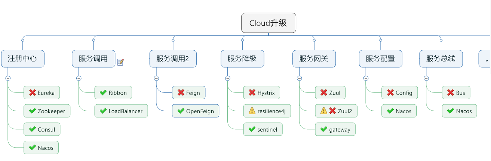 

(上图中×表示已经停更但不停用, √表示替代方案及未来可能的大趋势)

springcloud官网: https://spring.io/

springcloud中文官网: https://www.bookstack.cn/read/spring-cloud-docs/docs-index.md


引入springcloud组件之前, 先建立一个多模块的springboot项目

1、首先建立一个普通的springboot项目(创建过程可参考springboot笔记)

​	需要注意的有以下几点:

​	1) 刚开始创建的项目作为父工程,因此不需要src,并且不过如果不需要使用git的前提下,git相关的也可以删掉,只剩下如下结构:

​		

​	上图中父工程中只剩下了pom文件和各个子模块及 .idea和.iml文件(没显示),  子模块只剩下了pom文件和src及 .idea和.iml文件(没显示)

​	2) 作为父工程,在<dependencies>外面可以套一层<dependencyManagement>,两者区别就是前者会实际引入,而加上后者只是声明,不会实际引入依赖, 便于子工程引入后<dependcy>中不需要再写版本号(version)及本子工程不需要再写g和v,只写a就够了

​			

​	3) 在创建子模块时,要保证package相同,并且artifactid要和子模块的项目名要保持一致,Name也要保持一致(idea版本高了之后可能不需要写Name)


```
备注: 1、 在创建多模块工程时, 只要关注pom文件;  约定 > 配置 > 编码
	 2、 创建每个子模块的流程: 1)建moudle -> 2)改pom -> 3)写yml  -> 4) 编码(业务类) 
	 3、 关于springboot和springcloud的详细版本选择可以参考https://start.spring.io/actuator/info,得到json字符串可以在https://tool.lu/中查看
```

2、建好一个多模块的springboot项目之后, 就可以开始逐步引入springcloud生态的各个组件了

## 二、引入Eureka(服务注册与发现)

### 0、前提

​	 1) 随着模块的增加,人为地记录模块之间的调用关系将非常困难,所以需要springcloud进行服务治理,首先引出Eureka(服务注册)

​	 2) **Eureka早已停更, 未来的趋势可能是后续的Zookeeper、Consul、Nacos; 所以本节重在学习思想,了解过程**

### 1、Eureka基础知识

	1) 什么是服务治理　　
	  Spring Cloud 封装了 Netflix 公司开发的 Eureka 模块来实现服务治理
	  在传统的rpc远程调用框架中，管理每个服务与服务之间依赖关系比较复杂，管理比较复杂，所以需要使用服务治理，管理服务于服务之间依赖关系，可以实现服务调用、负载均衡、容错等，实现服务发现与注册。
	2) 什么是服务注册与发现
		Eureka采用了CS的设计架构，Eureka Server 作为服务注册功能的服务器，它是服务注册中心。而系统中的其他微服务，使用 Eureka的客户端连接到 Eureka Server并维持心跳连接。这样系统的维护人员就可以通过 Eureka Server 来监控系统中各个微服务是否正常运行。
		在服务注册与发现中，有一个注册中心。当服务器启动的时候，会把当前自己服务器的信息 比如 服务地址通讯地址等以别名方式注册到注册中心上。另一方（消费者|服务提供者），以该别名的方式去注册中心上获取到实际的服务通讯地址，然后再实现本地RPC调用RPC远程调用框架核心设计思想：在于注册中心，因为使用注册中心管理每个服务与服务之间的一个依赖关系(服务治理概念)。在任何rpc远程框架中，都会有一个注册中心(存放服务地址相关信息(接口地址))
	3) Eureka包含两个组件：Eureka Server和Eureka Client
		Eureka Server提供服务注册服务
	各个微服务节点通过配置启动后，会在EurekaServer中进行注册，这样EurekaServer中的服务注册表中将会存储所有可用服务节点的信息，服务节点的信息可以在界面中直观看到。
		EurekaClient通过注册中心进行访问
	是一个Java客户端，用于简化Eureka Server的交互，客户端同时也具备一个内置的、使用轮询(round-robin)负载算法的负载均衡器。在应用启动后，将会向Eureka Server发送心跳(默认周期为30秒)。如果Eureka Server在多个心跳周期内没有接收到某个节点的心跳，EurekaServer将会从服务注册表中把这个服务节点移除（默认90秒）
### 2、单机Eureka构建步骤

#### 1、注册中心构建(Eureka Server)

1) 建moudle(建一个子模块作为注册中心)
2) 改pom
	在注册中心的pom中加入eureka-server场景:

```
	     <!--eureka-server-->
        <dependency>
            <groupId>org.springframework.cloud</groupId>
            <artifactId>spring-cloud-starter-netflix-eureka-server</artifactId>
        </dependency>
```

3) 写yml

```
server:
  port: 7001
eureka:
  instance:
    hostname: localhost		#eureka服务端的实例名称
  client:
    register-with-eureka: false     #false表示不向注册中心注册自己。
    fetch-registry: false     		#false表示自己端就是注册中心，我的职责就是维护服务实例，并不需要去检索服务
    service-url:
      defaultZone: http://${eureka.instance.hostname}:${server.port}/eureka/
      #或直接写 defaultZone: http://localhost:7001/eureka/
```

4) 主启动类上加上@EnableEurekaServer注解

```
@SpringBootApplication
@EnableEurekaServer
public class CloudEurekaServer7001Application {
    public static void main(String[] args) {
        SpringApplication.run(CloudEurekaServer7001Application.class, args);
    }

```

5) 测试

 访问 http://localhost:7001/的结果页面:


#### 2、客户端构建(Eureka Client)

1) 建moudle或选一个moudle(作为客户端)

​	Eureka的客户端可能是一个已经存在业务的模块

2) 改pom
	在注册中心的pom中加入eureka-client场景:

```
        <!--eureka-client-->
        <dependency>
            <groupId>org.springframework.cloud</groupId>
            <artifactId>spring-cloud-starter-netflix-eureka-client</artifactId>
        </dependency>
```

3) 写yml(重点关注配置项server和eureka)

```
server:
  port: 8001

spring:
  application:
    name: cloud-payment-service			# 该名字一定要配置,这个名字就是在注册中心
  datasource:
    type: com.alibaba.druid.pool.DruidDataSource            # 当前数据源操作类型
    driver-class-name: org.gjt.mm.mysql.Driver              # mysql驱动包
    url: jdbc:mysql://localhost:3306/db2019?useUnicode=true&characterEncoding=utf-8&useSSL=false
    username: root
    password: 123456

eureka:
  client:
    #表示是否将自己注册进EurekaServer默认为true。
    register-with-eureka: true
    #是否从EurekaServer抓取已有的注册信息，默认为true。单节点无所谓，集群必须设置为true才能配合ribbon使用负载均衡
    fetchRegistry: true
    service-url:
      defaultZone: http://localhost:7001/eureka


mybatis:
  mapperLocations: classpath:mapper/*.xml
  type-aliases-package: com.atguigu.springcloud.entities    # 所有Entity别名类所在包
```

4)主启动类上加上注解@EnableEurekaClient (实测: 不加该注解也没出问题)

```
@SpringBootApplication
@EnableEurekaClient
public class PaymentMain8001
{
    public static void main(String[] args)
    {
        SpringApplication.run(PaymentMain8001.class,args);
    }
}
```

5) 测试 (访问之前先要启动EurekaServer)

​	再次访问http://localhost:7001/ 的结果页面


​	注: Application下的名称对应配置项spring.application.name (客户端的别名)


​	此时, 该客户端已经在注册中心注册成功

### 3、集群Eureka构建步骤

#### 1、eureka集群原理:


问题：微服务RPC远程服务调用最核心的是什么 
       高可用，试想你的注册中心只有一个only one， 它出故障了那就呵呵(￣▽￣)"了，会导致整个为服务环境不可用，所以

解决办法：搭建Eureka注册中心集群 ，实现负载均衡+故障容错

#### 2、EurekaServer集群环境构建步骤

1) 新建moudle作为第二个注册中心(参考第一个注册中心)

2) 改pom(加入eureka-server)

```
        <!--eureka-server-->
        <dependency>
            <groupId>org.springframework.cloud</groupId>
            <artifactId>spring-cloud-starter-netflix-eureka-server</artifactId>
        </dependency>
```

3) 修改映射配置

​	找到C:\Windows\System32\drivers\etc路径下的hosts文件, 在文件中添加以下信息:


​	这一步操作是由于学习阶段, 只用一台电脑来模拟多个主机;

4) 写yml

注: 相比单机版, 重点关注配置项eureka.instance.hostname和eureka.client.service-url.defaultZone的变化

端口为7001的子模块的yml(第一台Eureka Server端):

```
server:
  port: 7001

eureka:
  instance:
    hostname: eureka7001.com #eureka服务端的实例名称
  client:
    register-with-eureka: false     #false表示不向注册中心注册自己。
    fetch-registry: false     #false表示自己端就是注册中心，我的职责就是维护服务实例，并不需要去检索服务
    service-url:
      defaultZone: http://eureka7002.com:7002/eureka/
```

端口为7002的子模块的yml(第二台Eureka Server端):

```
server:
  port: 7002

eureka:
  instance:
    hostname: eureka7002.com #eureka服务端的实例名称
  client:
    register-with-eureka: false     #false表示不向注册中心注册自己。
    fetch-registry: false     #false表示自己端就是注册中心，我的职责就是维护服务实例，并不需要去检索服务
    service-url:
      defaultZone: http://eureka7001.com:7001/eureka/
```

特点: 端口7001的server端观望7002端, 端口7002的server端观望7001端 (互相观望)

这个实例中注册中心集群只包含两个主机(实际上是一个, 但修改映射配置后可以认为是两个); 如果需要三个及以上的注册中心集群,那么可以在配置项eureka.client.service-url.defaultZone中, 写两个或以上的地址:

```
#示例:
defaultZone: http://eureka7001.com:7001/eureka/,http://eureka7003.com:7003/eureka/  #这是两个地址, 中间用逗号隔开
```

> 注:      yml中a: [b,c] 这种写法才是数组, 上面并没有加中括号[],加了会报错, 而这种写法算不算数组还尚未知

5) 所有注册中心的主启动类上都需要添加注解 @EnableEurekaServer

此时,注册中心有两台主机,已经是集群了,但是其它模块的yml中配置的还是单机版,所以还需要继续修改

6) 为了模拟真实场景, 也为了感受Eureka内置的轮询负载功能, 将支付微服务也变成集群:

​	新建端口为8002模块moudle -> 改pom -> 写yml -> 编写业务类 (这几个步骤可以直接copy 8001的)

​	建好之后, 此时有两个集群,一个注册中心集群、一个支付服务集群,另外还有订单服务和公用模块;


>注: 此时注册中心包含 7001、7002, 客户端包含 80、8001、8002, 公用模块不需要加入到客户端;

7) 改订单服务和支付服务的yml

80:

```
server:
  port: 80

spring:
    application:
        name: cloud-order-service

eureka:
  client:
    #表示是否将自己注册进EurekaServer默认为true。
    register-with-eureka: true
    #是否从EurekaServer抓取已有的注册信息，默认为true。单节点无所谓，集群必须设置为true才能配合ribbon使用负载均衡
    fetchRegistry: true
    service-url:
      #defaultZone: http://localhost:7001/eureka
      defaultZone: http://eureka7001.com:7001/eureka,http://eureka7002.com:7002/eureka  # 集群版
```

8001(8002同理,目前只有配置项server.port不同):

```
server:
  port: 8001

spring:
  application:
    name: cloud-payment-service
  datasource:
    type: com.alibaba.druid.pool.DruidDataSource            # 当前数据源操作类型
    driver-class-name: org.gjt.mm.mysql.Driver              # mysql驱动包
    url: jdbc:mysql://localhost:3306/db2019?useUnicode=true&characterEncoding=utf-8&useSSL=false
    username: root
    password: 123456

eureka:
  client:
    #表示是否将自己注册进EurekaServer默认为true。
    register-with-eureka: true
    #是否从EurekaServer抓取已有的注册信息，默认为true。单节点无所谓，集群必须设置为true才能配合ribbon使用负载均衡
    fetchRegistry: true
    service-url:
      defaultZone: http://eureka7001.com:7001/eureka,http://eureka7002.com:7002/eureka  # 集群版
      #defaultZone: http://localhost:7001/eureka  # 单机版


mybatis:
  mapperLocations: classpath:mapper/*.xml
  type-aliases-package: com.atguigu.springcloud.entities    # 所有Entity别名类所在包
```

>注: 8001和8002的配置项spring.application.name: cloud-payment-service都是 cloud-payment-service

8) 使用Euraka Client的负载轮询

使用Euraka Client依赖中的一个注解@LoadBalanced来赋予RestTemplate负载均衡的能力


>注: 1、在@Bean的方法上加上@LoadBalanced注解
>
>​	  2、restTemplate发送的url参数不能写死, 应写成如上图形式

此时,已经完成集群环境的基本搭建

9) 测试

>1、先要启动EurekaServer，7001/7002服务	->	再要启动服务提供者provider，8001/8002服务	->	再要启动服务消费者consumer，80服务	->
>
>访问80 http://localhost/consumer/payment/get/123, 123是存在于数据库的id;	->	 如果返回该id对应的实体类,且8001和8002交替出现,则测试成功;
>
>2、访问eureka的用户界面http://eureka7001.com:7001/或http://eureka7002.com:7002/进行测试

### 4、actuator微服务信息完善

1、主机名称:服务名称修改

问题: 


解决:

yml中加入:

```
eureka.instance.instance-id=payment8001			#8002同理,名字可以自定义
```

加入后完整yml

```
server:
  port: 8001

spring:
  application:
    name: cloud-payment-service
  datasource:
    type: com.alibaba.druid.pool.DruidDataSource            # 当前数据源操作类型
    driver-class-name: org.gjt.mm.mysql.Driver              # mysql驱动包
    url: jdbc:mysql://localhost:3306/db2019?useUnicode=true&characterEncoding=utf-8&useSSL=false
    username: root
    password: 123456

eureka:
  client:
    #表示是否将自己注册进EurekaServer默认为true。
    register-with-eureka: true
    #是否从EurekaServer抓取已有的注册信息，默认为true。单节点无所谓，集群必须设置为true才能配合ribbon使用负载均衡
    fetchRegistry: true
    service-url:
      defaultZone: http://eureka7001.com:7001/eureka,http://eureka7002.com:7002/eureka  # 集群版
      #defaultZone: http://localhost:7001/eureka  # 单机版
  instance:
    instance-id: payment8001

mybatis:
  mapperLocations: classpath:mapper/*.xml
  type-aliases-package: com.atguigu.springcloud.entities    # 所有Entity别名类所在包
```

2、访问信息有IP信息提示

问题:	鼠标放到Status下面的项上面时, 没有ip提示

解决:

yml中加入:

```
eureka.instance.prefer-ip-address=true 		#8002同理	
```

加入后完整yml:

```
server:
  port: 8001

spring:
  application:
    name: cloud-payment-service
  datasource:
    type: com.alibaba.druid.pool.DruidDataSource            # 当前数据源操作类型
    driver-class-name: org.gjt.mm.mysql.Driver              # mysql驱动包
    url: jdbc:mysql://localhost:3306/db2019?useUnicode=true&characterEncoding=utf-8&useSSL=false
    username: root
    password: 123456

eureka:
  client:
    #表示是否将自己注册进EurekaServer默认为true。
    register-with-eureka: true
    #是否从EurekaServer抓取已有的注册信息，默认为true。单节点无所谓，集群必须设置为true才能配合ribbon使用负载均衡
    fetchRegistry: true
    service-url:
      defaultZone: http://eureka7001.com:7001/eureka,http://eureka7002.com:7002/eureka  # 集群版
      #defaultZone: http://localhost:7001/eureka  # 单机版
  instance:
    instance-id: payment8001
    prefer-ip-address: true     #访问路径可以显示IP地址

mybatis:
  mapperLocations: classpath:mapper/*.xml
  type-aliases-package: com.atguigu.springcloud.entities    # 所有Entity别名类所在包
```

### 5、服务发现Discovery

0、对于注册进eureka里面的微服务，可以通过服务发现来获得该服务的信息, 实现步骤如下

1、选择一个已经注册进eureka的微服务,比如8001,修改其controller

1) 注入DiscoveryClient

```
    @Resource
    private DiscoveryClient discoveryClient;
```

需要注意的是, 周阳老师的2019/2020年视频及讲义里注入的是上面的DiscoveryClient, 但是现在经实操发现,应该注入如下:

```
    @Resource
    private EurekaDiscoveryClient discoveryClient;
```

2) 主启动类上加上注解@EnableDiscoveryClient,开启服务发现 (实测发现, 和@EnableEurekaClient相似, 不加@EnableDiscoveryClient注解也测试通过)

```
@SpringBootApplication
@MapperScan("com.example.demo.dao")
@EnableEurekaClient
@EnableDiscoveryClient //开启服务发现
public class CloudProviderPayment8001Application {

    public static void main(String[] args) {
        SpringApplication.run(CloudProviderPayment8001Application.class, args);
    }

}
```

2、测试

先要启动两个EurekaServer	->	再启动8001主启动类	->	访问 http://localhost:8001/payment/discovery

打印结果:


### 6、自我保护

#### 0、概述及自我保护相关的几个问题

保护模式主要用于一组客户端和Eureka Server之间存在网络分区场景下的保护。一旦进入保护模式，
Eureka Server将会尝试保护其服务注册表中的信息，不再删除服务注册表中的数据，也就是不会注销任何微服务。

如果在Eureka Server的首页看到以下这段提示，则说明Eureka进入了保护模式：

```
EMERGENCY! EUREKA MAY BE INCORRECTLY CLAIMING INSTANCES ARE UP WHEN THEY'RE NOT. 
RENEWALS ARE LESSER THAN THRESHOLD AND HENCE THE INSTANCES ARE NOT BEING EXPIRED JUST TO BE SAFE 
```

1) 问题1: 什么是自我保护模式？或者 为什么会有自我保护机制？
	默认情况下，如果EurekaServer在一定时间内没有接收到某个微服务实例的心跳，EurekaServer将会注销该实例（默认90秒）。但是当网络分区故障发生(延时、卡顿、拥挤)时或者开发测试时频繁重启了微服务实例，微服务与EurekaServer之间无法正常通信，以上行为可能变得非常危险了——因为微服务本身其实是健康的，此时本不应该注销这个微服务。Eureka通过“自我保护模式”来解决这个问题——当EurekaServer节点在短时间内丢失过多客户端时（可能发生了网络分区故障），那么这个节点就会进入自我保护模式。

2) 问题2(问题1的简化版): 什么情况下会触发自我保护模式?

​	eureka server在短时间内丢失过多的客户端心跳时，会进入自我保护模式;

​	导致这种情况出现可能是由于网络故障或者是开发测试时频繁重启了微服务实例,该模式下, eureka会保护注册表中的信息，不在注销任何微服务，当网络故障恢复后，eureka会自动退出保护模式。那么,在开发测试时可以在yml中将eureka的自我保护模式关闭,生产环境的话不建议关闭.

3) 问题3(问题1简化) 自我保护有什么作用?

​	开启自我保护模式后, 某时刻某一个微服务不可用了，Eureka不会立刻清理，依旧会对该微服务的信息进行保存

>注: eureka自我保护模式属于属于CAP里面的AP分支

#### 1、怎么禁止自我保护机制?

出厂默认，自我保护机制是开启的

```
#在注册中心的yml中加入以下配置(实际加入时写成层级关系)
eureka.server.enable-self-preservation=false
```

> 备注:  默认开启的意思是, 满足短时间内丢失过多心跳会开启自我保护模式, 禁止自我保护模式的意思是 即使满足条件也不会开启自我保护

关闭之后,页面显示:

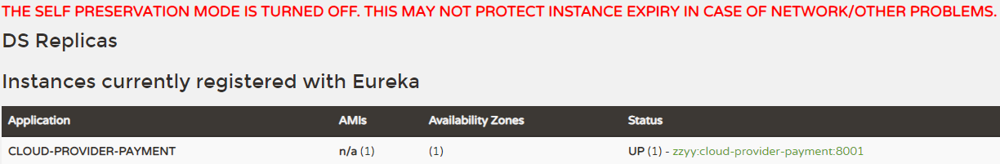

#### 2、自我保护的心跳配置

1、在微服务8001的yml中加入

```
eureka.instance.lease-renewal-interval-in-seconds=30		#默认30秒发送一次心跳
eureka.instance.lease-expiration-duration-in-seconds=90		#默认90秒收不到心跳就在注册中心销毁该实例
```

加入后完整yml:

```
server:
  port: 8001

###服务名称(服务注册到eureka名称)
spring:
    application:
        name: cloud-provider-payment

eureka:
  client: #服务提供者provider注册进eureka服务列表内
    service-url:
      register-with-eureka: true
      fetch-registry: true
      # cluster version
      #defaultZone: http://eureka7001.com:7001/eureka,http://eureka7002.com:7002/eureka,http://eureka7003.com:7003/eureka
      # singleton version
      defaultZone: http://eureka7001.com:7001/eureka
#心跳检测与续约时间
#开发时设置小些，保证服务关闭后注册中心能即使剔除服务
  instance:
  #Eureka客户端向服务端发送心跳的时间间隔，单位为秒(默认是30秒)
    lease-renewal-interval-in-seconds: 1
  #Eureka服务端在收到最后一次心跳后等待时间上限，单位为秒(默认是90秒)，超时将剔除服务
    lease-expiration-duration-in-seconds: 2
```

2、在注册中心的yml中加入

```
eureka.server.enable-self-preservation=false 		#关闭自我保护机制，保证不可用服务被及时踢除
eureka.server.eviction-interval-timer-in-ms=2000	#单位毫秒,作用和上面的2秒貌似一样, 实测发现若没有这一项上面的2秒不起作用
```

加入后完整yml

```
server:
  port: 7001


eureka:
  instance:
    hostname: eureka7001.com #eureka服务端的实例名称
  client:
    register-with-eureka: false     #false表示不向注册中心注册自己。
    fetch-registry: false     #false表示自己端就是注册中心，我的职责就是维护服务实例，并不需要去检索服务
    service-url:
      defaultZone: http://eureka7002.com:7002/eureka/
  server:
    #关闭自我保护机制，保证不可用服务被及时踢除
    enable-self-preservation: false
    eviction-interval-timer-in-ms: 2000
```

#### 3、测试

7001和8001都配置完成后	->	先启动7001(7002)再启动8001,	->	然后关闭8001	->	2秒或者稍大于两秒后刷新页面发现,8001服务被剔除了

## 三、Zookeeper(服务注册与发现)

### 1、概念

zookeeper是一个分布式协调工具，可以实现注册中心功能, 需要在linux系统安装好该软件, 然后在系统中连接, 安装过程见笔记中linux下安装zookeeper;

### 2、使用Zookeeper步骤

#### 1、新建module

```
1)名称cloud-provider-payment8004
2)改pom:
#主要增加
        <!-- SpringBoot整合zookeeper客户端 -->
        <dependency>
            <groupId>org.springframework.cloud</groupId>
            <artifactId>spring-cloud-starter-zookeeper-discovery</artifactId>
        </dependency>
3)改yml:
#8004表示注册到zookeeper服务器的支付服务提供者端口号
server:
  port: 8004
#服务别名----注册zookeeper到注册中心名称
spring:
  application:
    name: cloud-provider-payment
  cloud:
    zookeeper:
      connect-string: 121.41.87.233:2181	#ip为linux服务器的公网ip, 2181是zookeeper的默认端口号
注: 此ip需要在本地能ping通,并且telnet ip 端口号 也得通,当然前提需要linux打开2181端口或者直接关闭防火墙同时在云安全组也要放开2181端口
4)主启动类上加注解@EnableDiscoveryClient
5)编写业务类
```

#### 2、启动

进入zookeeper安装目录中的启动目录bin下,/opt/zookeeper/apache-zookeeper-3.5.10-bin/bin

启动zookeeper服务器, 命令: ./zkServer.sh start (更多相关见linux下安装软件的笔记)

然后启动此moudle,自动加入到注册中心

#### 3、测试

测试需要在linux中查看(zookeeper的用户界面支持不友好)

还是进入zookeeper安装目录中的启动目录bin下,/opt/zookeeper/apache-zookeeper-3.5.10-bin/bin

然后启动客户端,命令:  ./zkCli.sh

连接上之后, 通过ls命令查看:


出现别名,说明注册成功

```
备注: 1、zookeeper目前只演示了单机版, 集群版的代码部分和eureka大同小异
	 2、eureka的注册中心就是某一个或多个moudle, 而zookeeper的注册中心则需要下载后运行, 可运行在多台主机然后形成集群,consul亦是;
```

## 四、Consul(服务注册与发现)

### 1、概念

Consul 是一套开源的分布式服务发现和配置管理系统，由 HashiCorp 公司用 Go 语言开发。

提供了微服务系统中的服务治理、配置中心、控制总线等功能。这些功能中的每一个都可以根据需要单独使用，也可以一起使用以构建全方位的服务网格，总之Consul提供了一种完整的服务网格解决方案。

主要功能:  服务发现、健康监测、KV存储、多数据中心、可视化Web界面

### 2、使用Consul步骤

#### 0、下载并启动

下载网址: https://www.consul.io/downloads.html

可选window, linux, mac版, 以window为例:

下载完成后只有一个consul.exe文件，硬盘路径下输入cmd打开window命令行窗口,

然后输入consul --version查看版本号, 再输入consul agent -dev开发模式启动consul;

启动后, 可先在浏览器中访问: http://localhost:8500

接下来的新建module就基本zookeeper一致了

#### 1、新建module

```
1)module名称cloud-providerconsul-payment8006
2)改pom:
#主要增加
        <!--SpringCloud consul-server -->
        <dependency>
            <groupId>org.springframework.cloud</groupId>
            <artifactId>spring-cloud-starter-consul-discovery</artifactId>
        </dependency>
3)改yml:
###consul服务端口号
server:
  port: 8006

spring:
  application:
    name: consul-provider-payment
####consul注册中心地址
  cloud:
    consul:
      host: localhost			#由于consul运行在本地, 所以这里可以填localhost
      port: 8500				#consul默认端口为8500, consul在本地启动后直接访问 http://localhost:8500
      discovery:
        #hostname: 127.0.0.1
        service-name: ${spring.application.name}
4)主启动类上加注解@EnableDiscoveryClient
5)编写业务类
```

#### 2、启动

输入consul agent -dev开发模式启动consul;

启动后, 可先在浏览器中访问: http://localhost:8500

然后启动本地module,刷新浏览器


#### 3、测试

上图就已经说明注册成功;

#### 4、三个注册中心的异同点

首先延伸cap理论:

```
CAP->
C:Consistency（强一致性）
A:Availability（可用性）
P:Partition tolerance（分区容错性）
CAP理论关注粒度是数据，而不是整体系统设计的策略

CAP理论的核心是：一个分布式系统不可能同时很好的满足一致性，可用性和分区容错性这三个需求，
因此，根据 CAP 原理将 NoSQL 数据库分成了满足 CA 原则、满足 CP 原则和满足 AP 原则三 大类：
CA - 单点集群，满足一致性，可用性的系统，通常在可扩展性上不太强大。
CP - 满足一致性，分区容忍必的系统，通常性能不是特别高。
AP - 满足可用性，分区容忍性的系统，通常可能对一致性要求低一些。

最多只能同时较好的满足两个。
```

1、eureka遵循ap理论, 而zookeeper和consul遵循cp理论

2、

...(其它的暂无笔记)


## 五、Ribbon(负载均衡服务调用)

### 1、概念

Spring Cloud Ribbon是基于Netflix Ribbon实现的一套客户端 负载均衡的工具。

(Ribbon目前也进入维护模式)

```
Ribbon本地负载均衡客户端 VS Nginx服务端负载均衡区别

 Nginx是服务器负载均衡，客户端所有请求都会交给nginx，然后由nginx实现转发请求。即负载均衡是由服务端实现的。
 Ribbon本地负载均衡，在调用微服务接口时候，会在注册中心上获取注册信息服务列表之后缓存到JVM本地，从而在本地实现RPC远程服务调用技术。
```

> ribbon作用一句话: 负载均衡+RestTemplate调用

注: 由于eureka-client的jar包中已经引入了Ribbon, 所以不用再单独引入Ribbon的jar包了(引入也无妨)

### 2、使用

在前面Eureka使用的负载均衡用的就是ribbon, 默认的负载均衡策略是轮询(每个微服务依次进行访问,比例一样)

ribbon负载均衡策略有:

​	1) 轮询(默认)

​	2) 随机

​	3) 响应时间越快,选择权重越大

​	4) ... (其它可看附件中springcloud2020.mmap)

替换机制步骤;

 1) 新建package和class

​	需要注意的是,这个新建的规则类所处位置需要满足: 不能在springboot主程序类所在包之下

​	正确位置比如:


规则类示例:

```
@Configuration
public class MySelfRule
{
    @Bean
    public IRule myRule()
    {
        return new RandomRule();//定义为随机
    }
}
```

​	2)主程序添加注解@RibbonClient

```
@SpringBootApplication
@EnableEurekaClient
@RibbonClient(name = "CLOUD-PAYMENT-SERVICE",configuration=MySelfRule.class)
public class OrderMain80
{
    public static void main(String[] args)
    {
        SpringApplication.run(OrderMain80.class,args);
    }
}
```

3) 测试

开启多个支付端服务后,再开启消费端服务,访问服务端

http://localhost/consumer/payment/get/31 观察是否是随机效果(需要注意, url不能写死, 需要写注册中心的服务名, 这样才能动态访问多个服务)

### 3、LoadBalanced

1、可以通过在获取RestTemplate方法上加@LoadBalanced注解方式让RestTemplate获取负载均衡效果

```
@Configuration
public class ApplicationContextBean
{
    @Bean
    @LoadBalanced
    public RestTemplate getRestTemplate()
    {
        return new RestTemplate();
    }
}
```

2、手写一个MyLB本地负载均衡器

过...

## 六、OpenFeign(服务调用)

### 1、Feign

Feign和OpenFeign都是spring could生态的,  后者可以理解为前者的升级版,OpenFeign更加强大

Feign:

>Feign是一个声明式WebService客户端。使用Feign能让编写Web Service客户端更加简单。
>
>它的使用方法是定义一个服务接口然后在上面添加注解。
>
>Feign可以与Eureka和Ribbon组合使用以支持负载均衡。

### 2、Feign和OpenFeign两者区别

|                            Feign                             |                          OpenFeign                           |
| :----------------------------------------------------------: | :----------------------------------------------------------: |
| Feign是Spring Cloud组件中的一个轻量级RESTful的HTTP服务客户端<br/>Feign内置了Ribbon，用来做客户端负载均衡，去调用服务注册中心的服务。Feign的使用方式是：使用Feign的注解定义接口，调用这个接口，就可以调用服务注册中心的服务 | OpenFeign是Spring Cloud 在Feign的基础上支持了SpringMVC的注解，如@RequesMapping等等。OpenFeign的@FeignClient可以解析SpringMVC的@RequestMapping注解下的接口，并通过动态代理的方式产生实现类，实现类中做负载均衡并调用其他服务。 |
| <dependency><br/>    <groupId>org.springframework.cloud</groupId>    <artifactId>spring-cloud-starter-feign</artifactId><br/></dependency> | <dependency><br/>    <groupId>org.springframework.cloud</groupId><br/>    <artifactId>spring-cloud-starter-openfeign</artifactId><br/></dependency> |

主要区别: OpenFeign在Feign的基础上支持SpringMVC的@RequestMapping注解,并通过动态代理的方式产生实现类，实现类中做负载均衡并调用其他服务。

### 3、使用

先回顾之前服务调用的方法:

​	只需要使用RestTemplate来达到消费端访问支付端, 如下图:

​	

那么如何使用OpenFeign组件的方式来达到服务调用?

OpenFeign使用步骤:

1、建module

新建一个客户端服务 如上图cloud-consumer-feign-order80 (Feign需要在消费端即调用端使用)

2、改pom

```
        <!--openfeign-->
        <dependency>
            <groupId>org.springframework.cloud</groupId>
            <artifactId>spring-cloud-starter-openfeign</artifactId>
        </dependency>
```

3、改yml

```
server:
  port: 80

eureka:
  client:
    register-with-eureka: false
    service-url:
      defaultZone: http://eureka7001.com:7001/eureka/,http://eureka7002.com:7002/eureka/  #写一个也行
```

4、主启动类

添加注解@EnableFeignClients

5、业务类

把原来的controller层copy过来, 并且改造成如下:

```
@RestController
public class OrderFeignController
{
    @Resource
    private PaymentFeignService paymentFeignService;

    @GetMapping(value = "/consumer/payment/get/{id}")
    public CommonResult<Payment> getPaymentById(@PathVariable("id") Long id)
    {
        return paymentFeignService.getPaymentById(id);
    }
}

备注: 相比原来, 去掉了RestTemplate,而是调用service,把服务调用的职责转交给service
```

新建service层

```
@Component
@FeignClient(value = "CLOUD-PAYMENT-SERVICE")	// 要去访问的服务名称
public interface PaymentFeignService
{
    @GetMapping(value = "/payment/get/{id}")	// 要访问的接口路径
    CommonResult<Payment> getPaymentById(@PathVariable("id") Long id);
    
    //可以写多个方法 ...
}
```

> 备注: 
>
> 1、接口上需要添加注解@FeignClient, value的值为要去访问的服务名称(此处为支付服务端)
>
> 2、方法上@GetMapping注解的值为要访问的接口路径, 此处为支付服务端;需要注意service层的@GetMapping注解并不是用来接收请求的,而是要去访问的路径,  controller上的@GetMapping才是用来接收请求的
>
> 3、和原来不使用OpenFeign相比, 使用了OpenFeign之后, 其实相当于把服务调用放到了有@FeignClient注解的接口中.
>
> 4、此时,不再使用RestTemplate方式访问其它服务, 而是通过动态代理的方式产生实现类，实现类中做负载均衡并调用其他服务。

6、测试

先启动2个eureka集群7001/7002

再启动2个微服务8001/8002

启动OpenFeign启动

访问http://localhost/consumer/payment/get/31

Feign自带负载均衡配置项

### 4、OpenFeign超时控制

OpenFeign默认等待1秒钟，超过后报错 

模拟超时情况:

1、服务提供方8001故意写暂停程序:

    @GetMapping(value = "/payment/feign/timeout")
    public String paymentFeignTimeOut()
    {
        System.out.println("*****paymentFeignTimeOut from port: "+serverPort);
        //暂停几秒钟线程
        try { TimeUnit.SECONDS.sleep(3); } catch (InterruptedException e) { e.printStackTrace(); }
        return serverPort;
    }
2、服务消费方80添加超时方法PaymentFeignService

```
    @GetMapping(value = "/payment/feign/timeout")
    String paymentFeignTimeOut();
```

3、服务消费方80添加超时方法OrderFeignController

    @GetMapping(value = "/consumer/payment/feign/timeout")
    public String paymentFeignTimeOut()
    {
        return paymentFeignService.paymentFeignTimeOut();
    }
4、测试: 访问http://localhost/consumer/payment/feign/timeout

此时出现白页并报超时错误

5、解决

配置yaml(配置ribbon的超时时间)

```
server:
  port: 80

eureka:
  client:
    register-with-eureka: false
    service-url:
      defaultZone: http://eureka7001.com:7001/eureka/,http://eureka7002.com:7002/eureka/

#设置feign客户端超时时间(OpenFeign默认支持ribbon)
ribbon:
#指的是建立连接所用的时间，适用于网络状况正常的情况下,两端连接所用的时间
  ReadTimeout: 5000
#指的是建立连接后从服务器读取到可用资源所用的时间
  ConnectTimeout: 5000
```

### 5、OpenFeign日志打印功能

> Feign 提供了日志打印功能，我们可以通过配置来调整日志级别，从而了解 Feign 中 Http 请求的细节。
> 说白了就是对Feign接口的调用情况进行监控和输出

日志级别:

```
NONE：默认的，不显示任何日志；
 
BASIC：仅记录请求方法、URL、响应状态码及执行时间；
 
HEADERS：除了 BASIC 中定义的信息之外，还有请求和响应的头信息；
 
FULL：除了 HEADERS 中定义的信息之外，还有请求和响应的正文及元数据。
```

配置日志bean:

```
package com.atguigu.springcloud.cfgbeans;

import org.springframework.context.annotation.Bean;
import org.springframework.context.annotation.Configuration;
import feign.Logger;

@Configuration
public class FeignConfig
{
    @Bean
    Logger.Level feignLoggerLevel()
    {
        return Logger.Level.FULL;
    }
}
```

配置yml:

```
logging:
  level:
    # feign日志以什么级别监控哪个接口
    com.atguigu.springcloud.service.PaymentFeignService: debug
```

后台查看日志:


## 七、Hystrix (断路器)

### 1、概述

前情提要: 

最开始说过,springcloud包含很多组件,是用来解决单一架构到微服务所带来的一部分问题(并不能解决所有痛点);

那么,springcloud组件中的Hystrix就是用来解决其中一个痛点问题的(这个痛点问题就是'服务雪崩')。

但是呢, Hystrix已经停止更新,只维护了;而且国内现在更趋向于使用下面章节的SpringCloud Alibaba Sentinel;因此重点学习Sentinel,;

对于Hystrix,由于Hystrix的经典,所以重点学习其思想;

概念:

> 服务雪崩
>
> 多个微服务之间调用的时候，假设微服务A调用微服务B和微服务C，微服务B和微服务C又调用其它的微服务，这就是所谓的“扇出”。如果扇出的链路上某个微服务的调用响应时间过长或者不可用，对微服务A的调用就会占用越来越多的系统资源，进而引起系统崩溃，所谓的“雪崩效应”
>
> 是什么
>
> Hystrix是一个用于处理分布式系统的延迟和容错的开源库，在分布式系统里，许多依赖不可避免的会调用失败，比如超时、异常等，Hystrix能够保证在一个依赖出问题的情况下，不会导致整体服务失败，避免级联故障，以提高分布式系统的弹性。
>
> 断路器
>
> “断路器”本身是一种开关装置，当某个服务单元发生故障之后，通过断路器的故障监控（类似熔断保险丝），向调用方返回一个符合预期的、可处理的备选响应（FallBack），而不是长时间的等待或者抛出调用方无法处理的异常，这样就保证了服务调用方的线程不会被长时间、不必要地占用，从而避免了故障在分布式系统中的蔓延，乃至雪崩。
>
> Hystrix作用
>
> 1、服务降级	2、服务熔断	3、服务限流	4、接近实时的监控	5、......
>
> 对于Hystrix中三个重要概念的理解(了解):
>
> 服务降级:
>
> 服务器忙，请稍后再试，不让客户端等待并立刻返回一个友好提示，fallback;
>
> 触发服务降级的几种情况:	
>
> 1)程序运行异常	2)超时	3)服务熔断触发服务降级	4)线程池/信号量打满也会导致服务降级
>
> 服务熔断:
>
> 类比保险丝达到最大服务访问后，直接拒绝访问，拉闸限电，然后调用服务降级的方法并返回友好提示
>
> 服务的降级->进而熔断->恢复调用链路
>
> 服务限流:
>
> 秒杀高并发等操作，严禁一窝蜂的过来拥挤，大家排队，一秒钟N个，有序进行

备注: 本章重点学习 服务降级、服务熔断, 对于服务限流到后续的Sentinel再学习, 同时了解Hystrix的服务监控

### 2、构建步骤

思路:

首先建一个普通的module并注册进Eureka => 写几个简单的接口并成功测试 => 使用Jmeter进行高并发的压力测试(简称压测)并发现问题(访问非压测接口也变得缓慢) =>  引出Hysrix的解决方案: 服务降级、服务熔断、(服务限流)

#### 1、新建普通module

1) 建module

cloud-provider-hystrix-payment8001

2) 改pom

相比前面不使用Hystrix的module增加了一个Hystix依赖:

```
        <!--hystrix-->
        <dependency>
            <groupId>org.springframework.cloud</groupId>
            <artifactId>spring-cloud-starter-netflix-hystrix</artifactId>
        </dependency>
        // 备注: 本示例中,其它依赖比如eureka-client、starter-web等也必不可少;
```

3)改yml

```
server:
  port: 8001

spring:
  application:
    name: cloud-provider-hystrix-payment

eureka:
  client:
    register-with-eureka: true
    fetch-registry: true
    service-url:
      #defaultZone: http://eureka7001.com:7001/eureka,http://eureka7002.com:7002/eureka
      defaultZone: http://eureka7001.com:7001/eureka
```

4)主启动类加注解 @EnableEurekaClient

```
@SpringBootApplication
@EnableEurekaClient //本服务启动后会自动注册进eureka服务中
public class PaymentHystrixMain8001
{
    public static void main(String[] args)
    {
        SpringApplication.run(PaymentHystrixMain8001.class,args);
    }
}
```

4) 业务类:

service层:

```
@Service
public class PaymentService
{
    /**
     * 正常访问，一切OK
     * @param id
     * @return
     */
    public String paymentInfo_OK(Integer id)
    {
        return "线程池:"+Thread.currentThread().getName()+"paymentInfo_OK,id: "+id+"\t"+"O(∩_∩)O";
    }

    /**
     * 超时访问，演示降级
     * @param id
     * @return
     */
    public String paymentInfo_TimeOut(Integer id)
    {
        try { TimeUnit.SECONDS.sleep(5); } catch (InterruptedException e) { e.printStackTrace(); }
        return "线程池:"+Thread.currentThread().getName()+"paymentInfo_TimeOut,id: "+id+"\t"+"O(∩_∩)O，耗费3秒";
    }
}
```

controller层:

```
@RestController
@Slf4j
public class PaymentController
{
    @Autowired
    private PaymentService paymentService;

    @Value("${server.port}")
    private String serverPort;


    @GetMapping("/payment/hystrix/ok/{id}")
    public String paymentInfo_OK(@PathVariable("id") Integer id)
    {
        String result = paymentService.paymentInfo_OK(id);
        log.info("****result: "+result);
        return result;
    }

    @GetMapping("/payment/hystrix/timeout/{id}")
    public String paymentInfo_TimeOut(@PathVariable("id") Integer id) throws InterruptedException
    {
        String result = paymentService.paymentInfo_TimeOut(id);
        log.info("****result: "+result);
        return result;
    }
}
```

备注: 目前两个方法, 一个是不超时方法, 另一个会模拟超时

5) 正常测试

启动eureka7001(集群版就启动多个)

启动本服务cloud-provider-hystrix-payment8001(启动后自动注入进eureka)

访问不超时方法 http://localhost:8001/payment/hystrix/ok/31	=>	速度很快	无延迟

访问超时方法 http://localhost:8001/payment/hystrix/timeout/31	=>	速度在5秒以上	达到预期

结论: 目前对于该服务的简单测试发现不了什么问题

#### 2、压测(使用 Jmeter )

1、压测8001

上述在非高并发情形下，还能勉强满足, 但是如果在并发情况下呢?

开启Jmeter	=>	设置好访问路径, 并且来它个几万个请求(比如50000个请求, 每秒500个,连续发100秒)	=>	50000个请求都去访问paymentInfo_TimeOut服务 ( 注意: 1、Jmeter下载见csdn收藏或直接百度  2、去访问的是超时的接口,而不是正常的接口)


> 此时, 不用想本来就设置着超时的接口现在更加超时了,那么,之前正常无延迟的接口还依然正常吗?
>
> Jmeter压测结果:	访问后发现原本正常的接口也不再正常了,也开始转圈圈有延迟了 (如果依然没延迟,可能是配置较高可以加大每秒请求量)
>
> 故障原因:	tomcat的默认的工作线程数被打满 了，没有多余的线程来分解压力和处理。


上面还是服务提供者8001自己测试，假如此时外部的消费者80也来访问，
那消费者只能干等，最终导致消费端80不满意，服务端8001直接被拖死

2、加入消费端80

1)  新建cloud-consumer-feign-hystrix-order80

2) 改pom

加入hystrix, 其它的依赖可以参考上一个80端口(cloud-consumer-feign-order80 )

```
        <!--hystrix-->
        <dependency>
            <groupId>org.springframework.cloud</groupId>
            <artifactId>spring-cloud-starter-netflix-hystrix</artifactId>
        </dependency>
```

3)改yml

```
server:
  port: 80

eureka:
  client:
    register-with-eureka: false
    service-url:
      defaultZone: http://eureka7001.com:7001/eureka/
ribbon:
  ReadTimeout: 8000
  ConnectTimeout: 8000
```

3) 主启动类

```
@SpringBootApplication
@EnableFeignClients
public class OrderHystrixMain80
{
    public static void main(String[] args)
    {
        SpringApplication.run(OrderHystrixMain80.class,args);
    }
}
```

4)业务类

service层

```
@Component
@FeignClient(value = "CLOUD-PROVIDER-HYSTRIX-PAYMENT")
public interface PaymentHystrixService
{
    @GetMapping("/payment/hystrix/ok/{id}")
    String paymentInfo_OK(@PathVariable("id") Integer id);

    @GetMapping("/payment/hystrix/timeout/{id}")
    String paymentInfo_TimeOut(@PathVariable("id") Integer id);
}
```

controller层

```
@RestController
@Slf4j
public class OrderHystirxController
{
    @Resource
    private PaymentHystrixService paymentHystrixService;

    @GetMapping("/consumer/payment/hystrix/ok/{id}")
    public String paymentInfo_OK(@PathVariable("id") Integer id)
    {
        String result = paymentHystrixService.paymentInfo_OK(id);
        return result;
    }

    @GetMapping("/consumer/payment/hystrix/timeout/{id}")
    public String paymentInfo_TimeOut(@PathVariable("id") Integer id)
    {
        String result = paymentHystrixService.paymentInfo_TimeOut(id);
        return result;
    }
}
```

5)测试

正常测试

访问 http://localhost/consumer/payment/hystrix/ok/31	=>	无延迟

访问 http://localhost/consumer/payment/hystrix/timeout/31	=>	五秒延迟以上(需要yml中进行ribbon的超时配置)

高并发测试

5W个线程压8001的超时接口	=>	再去访问 http://localhost/consumer/payment/hystrix/ok/31	=> 要么转圈圈等待,要么要么消费端报超时错误


故障现象和导致原因:

8001同一层次的其它接口服务被困死，因为tomcat线程池里面的工作线程已经被挤占完毕;

80此时调用8001，客户端访问响应缓慢，转圈圈


解决:	使用Hystrix的服务降级、服务熔断、(服务限流)			--千呼万唤始出来


### 3、服务降级

#### 1、降级的解决的主要场景

1)超时导致服务器变慢(转圈)	=>	超时不再等待

2)出错(宕机或程序运行出错)	=>	出错要有兜底


> 服务降级注解:	@HystrixCommand


> 降级思路:	
>
> 8001先从自身找问题,设置自身调用超时时间的峰值，峰值内可以正常运行，
> 超过了需要有兜底的方法处理，作服务降级fallback

#### 2、落地解决代码

1、业务类

(service层的超时接口增加一个兜底方法)

```
@Service
public class PaymentService
{
    /**
     * 正常访问，一切OK
     * @param id
     * @return
     */
    public String paymentInfo_OK(Integer id)
    {
        return "线程池:"+Thread.currentThread().getName()+"paymentInfo_OK,id: "+id+"\t"+"O(∩_∩)O";
    }

    /**
     * 超时访问，演示降级
     * @param id
     * @return
     */
    @HystrixCommand(fallbackMethod = "paymentInfo_TimeOutHandler",commandProperties = {
            @HystrixProperty(name="execution.isolation.thread.timeoutInMilliseconds",value="3000")
    })
    public String paymentInfo_TimeOut(Integer id)
    {
        int second = 5;
        try { TimeUnit.SECONDS.sleep(second); } catch (InterruptedException e) { e.printStackTrace(); }
        return "线程池:"+Thread.currentThread().getName()+"paymentInfo_TimeOut,id: "+id+"\t"+"O(∩_∩)O，耗费秒: "+second;
    }
    // 此方法作为兜底的方法
    public String paymentInfo_TimeOutHandler(Integer id){
        return "/(ㄒoㄒ)/调用支付接口超时或异常：\t"+ "\t当前线程池名字" + Thread.currentThread().getName();
    }
}
```

重点:	1、主方法和兜底方法相似(参数列表和返回类型相同, 方法名不同)

​			2、当主方法发生异常或者超时后, 会自动降级重新调用兜底方法

2、主启动类激活

添加新注解@EnableCircuitBreaker


此时,就已经简单地实现了服务降级:	

无非就是由于主胎善变, 因此写个备胎方法, 通过@HystrixCommand注解搭配注解内的@HystrixProperty注解一起实现当主胎变心时, 去调用备胎的效果,

从而避免服务雪崩

 3、可以照葫芦画瓢对80也进行服务降级

80降级(略)

#### 3、对降级的理解

虽然没在80写服务降级, 但是实际应用中服务降级通常重点是在消费端,即服务的上游来控制的;

比如服务A调用服务B和C, 而B和C又调用其它服务(比如B调用D、E、F, C调用G、H、I、J, 这些服务可能还有下一层),

此时应该在相对上游的A、B、C进行服务降级配置; 这样才能从整体的负载考虑, 当某个链路负荷过重时,可以使其降级,从而保证核心业务的正常运行及整体服务不宕机;

```
以下是三者主要区别:

降级：服务分优先级，牺牲非核心服务（不可用），保证核心服务稳定；从整体负荷考虑；

熔断：依赖的下游服务故障触发熔断，避免引发本系统崩溃；系统自动执行和恢复

限流：限制并发的请求访问量，超过阈值则拒绝；
```

因此, 降级通常在服务相对上游位置控制, 一下控制一个链路多个服务,

​	而, 熔断通常在具体某个服务控制, 也就是相对下游进行控制;

#### 4、解决膨胀和混乱

掌握了服务降级的方法之后, 又产生了新的问题:

1、每个方法配置一个？？？膨胀

如果很多接口都有可能超时或者报错,难道每个都写个兜底的方法吗? 有没有为大部分方法设置通用兜底方法,只为个别方法进行定制的一种方案呢?

有;可以在类上使用@DefaultProperties(defaultFallback = ""):


如上, 如果@HystrixCommand注解指定了兜底方法就用指定的, 如果写了@HystrixCommand注解但没指定兜底方法,就用默认的,没写注解就是没有使用服务降级

> 备注:	1、接口较多时推荐这样方式	2、如果controller使用降级也是同理


2、和业务逻辑混一起？？？混乱

可以看到, 上面的兜底方法总是和正常的方法混淆在一起, 看起来比较混乱

首先, 由于服务降级通常在服务的上游进行控制, 而上游的服务调用通常又搭配Feign(OpenFeign使用),因此可以为使用@FeignClient注解的接口写一个实现类,

这个实现类专门写兜底方法, 从而实现解耦

具体实现:

1) 首先在80服务修改yml

```
feign:
  hystrix:
   enabled: true #在Feign中开启Hystrix
```

2) 原有Feign接口中的@FeignClient注解中增加fallback, 指定降级方法所在类

```
@Component
@FeignClient(value = "CLOUD-PROVIDER-HYSTRIX-PAYMENT",fallback = PaymentFallbackService.class)
public interface PaymentFeignClientService
{
    @GetMapping("/payment/hystrix/{id}")
    public String getPaymentInfo(@PathVariable("id") Integer id);
}
```

3) 编写实现类

```
@Component //必须加 
public class PaymentFallbackService implements PaymentFeignClientService
{
    @Override
    public String getPaymentInfo(Integer id)
    {
        return "服务调用失败，提示来自：cloud-consumer-feign-order80";
    }
}
```

至此,  实现了解耦版的服务降级方案, 也是相对完美的方案

4) 测试

单个eureka先启动7001

8001启动

正常访问 http://localhost/consumer/payment/hystrix/ok/31

此时关闭8001(模拟8001宕机)

此时服务端已经down了，但是我们做了服务降级处理，
让客户端在服务端不可用时也会获得提示信息而不会挂起耗死服务器


### 4、服务熔断


#### 1、熔断机制概述(重点)

>熔断机制概述
>熔断机制是应对雪崩效应的一种微服务链路保护机制。当扇出链路的某个微服务出错不可用或者响应时间太长时，
>会进行服务的降级，进而熔断该节点微服务的调用，快速返回错误的响应信息。
>当检测到该节点微服务调用响应正常后，恢复调用链路。

```
熔断相关的参数解析:
  1、快照时间窗: 断路器确定是否打开需要统计一些请求和错误数据,而统计的时间范围就是快照时间,默认为最近的10秒
  2、请求总数阈值: 在快照时间窗时间内,必须满足请求总数阈值才有资格熔断,默认是10,以为着在10秒内,如果hystrix的调用次数不足10次,即使所有的请求都超时或者其他原因失败,断路器都不会打开。
  3、错误百分比阈值: 当请求总数在快照时间窗内超过了阈值,比如发生了调用30次,如果30次中有15次发生了超时,则就是超过了50%的错误百分比,在默认设定50%的阈值情况下,这时候会将断路器打开。
  4、休眠时间窗: 当开启断路器时,所以得请求都不会进行转发,而是直接进入服务降级指定的fallback方法中,一段时间后(默认是5秒),这个时间断路器时半开状态,会让其中的一个请求进行转发,如果成功,断路器会关闭,如果失败,则继续开启,且熔断时间重新计时。
```

重点:	1、熔断和降级都是针对雪崩的一种微服务保护机制

​			2、熔断后会进入降级方法,但是一段时间后会恢复调用链路

​			3、熔断的触发条件: 默认最近10秒内10次及以上请求调用失败达到50%就会启动熔断机制,5秒后,进入半熔断状态,会让其中一个请求转发,如果成功,断路器会关闭,如果失败,则继续开启,且熔断时间重新计时。(四个关键参数: 10秒 10次 50% 5秒; 另外这些参数都是可配置的) 

​			

>个人理解:	
>
>1、相比考虑整体负载的服务降级, 服务熔断则是主要考虑出问题的服务,重点关照某个出问题的服务;
>
>2、当某个服务的某个接口负载过大触发设置的熔断条件时,该接口将触发服务降级, 但是 稍后就会进入半熔断状态,此状态会放一个正常请求进入原方法,如果成功就慢慢开放原方法, 如果失败就在稍后继续进入半熔断直至恢复
>
>不那么恰当的比喻:	
>
>1、熔断相当于保险丝,
>
>2、熔断是一种特殊的降级					


#### 2、落地代码实现

服务熔断的代码实现和服务降级都是使用@HystrixCommand注解搭配@HystrixProperty注解, 不同的是, 熔断需要写如下的@HystrixProperty(name = "circuitBreaker.enabled",value = "true")表示开启服务熔断

1、service层

增加两个熔断方法用于测试

```
//=========服务熔断
@HystrixCommand(fallbackMethod = "paymentCircuitBreaker_fallback",commandProperties = {
        @HystrixProperty(name = "circuitBreaker.enabled",value = "true"),
        @HystrixProperty(name = "circuitBreaker.requestVolumeThreshold",value = "10"), // 对应上面参数中的'请求总数阈值'
        @HystrixProperty(name = "circuitBreaker.sleepWindowInMilliseconds",value = "10000"), // 对应上面参数中的'休眠时间窗'
        @HystrixProperty(name = "circuitBreaker.errorThresholdPercentage",value = "60"), // 对应上面参数中的'请求总数阈值'
})
public String paymentCircuitBreaker(@PathVariable("id") Integer id)
{
    if(id < 0)	// 负数时抛出异常,用于测试异常发生后是否会调用兜底方法
    {
        throw new RuntimeException("******id 不能负数");
    }
    String serialNumber = IdUtil.simpleUUID();

    return Thread.currentThread().getName()+"\t"+"调用成功，流水号: " + serialNumber;
}
public String paymentCircuitBreaker_fallback(@PathVariable("id") Integer id)
{
    return "id 不能负数，请稍后再试，/(ㄒoㄒ)/~~   id: " +id;
}
```

和服务降级类似, 当系统出故障、宕机、超时的情况下,就会触发服务熔断

2、controller层

增加一个'熔断'方法

```
@GetMapping("/payment/circuit/{id}")
public String paymentCircuitBreaker(@PathVariable("id") Integer id)
{
    String result = paymentService.paymentCircuitBreaker(id);
    log.info("****result: "+result);
    return result;
}
```

3、简单测试

id为正数访问 http://localhost:8001/payment/circuit/31	=>	此时访问主方法

id为负数访问 http://localhost:8001/payment/circuit/-31	=>	此时主方法报错后调用兜底方法

一次成功一次'错误'

4、重点测试

首先多次,用正数id访问, 并无异常

然后根据熔断参数配置发送请求: 	在10秒内(默认), 发送10个或以上的请求,并60%以上的请求要是id为负数的;	=>	

此时,触发熔断机制同时触发降级,	=>	10秒内, 即使id为正数, 依旧调用的是降级后的方法	=>	10秒后,进入半熔断状态,此时使用id为正数重新访问	=>	

随后恢复链路,不再使用完全使用降级方法


此时,基本实现熔断机制的演示, 相比服务降级,无非也就是在@HystrixCommand中开启了熔断机制, 两者使用的注解是完全一样的;


#### 3、小结

熔断类型:

> 熔断打开
>
> 请求不再进行调用当前服务，内部设置时钟一般为MTTR（平均故障处理时间)，当打开时长达到所设时钟则进入半熔断状态
>
> 熔断关闭
>
> 熔断关闭不会对服务进行熔断
>
> 熔断半开
>
> 部分请求根据规则调用当前服务，如果请求成功且符合规则则认为当前服务恢复正常，关闭熔断

断路器开启或者关闭的条件:

> 1、当满足一定的阀值的时候（默认10秒内超过20个请求次数）
>
> 2、当失败率达到一定的时候（默认10秒内超过50%的请求失败）
>
> 3、到达以上阀值，断路器将会开启
>
> 4、当开启的时候，所有请求都不会进行转发
>
> 5、一段时间之后（默认是5秒），这个时候断路器是半开状态，会让其中一个请求进行转发。
> 如果成功，断路器会关闭，若失败，继续开启。重复4和5

断路器打开之后的流程:

>1：再有请求调用的时候，将不会调用主逻辑，而是直接调用降级fallback。通过断路器，实现了自动地发现错误并将降级逻辑切换为主逻辑，减少响应延迟的效果。
>
>2：原来的主逻辑要如何恢复呢？
>对于这一问题，hystrix也为我们实现了自动恢复功能。
>当断路器打开，对主逻辑进行熔断之后，hystrix会启动一个休眠时间窗，在这个时间窗内，降级逻辑是临时的成为主逻辑，
>当休眠时间窗到期，断路器将进入半开状态，释放一次请求到原来的主逻辑上，如果此次请求正常返回，那么断路器将继续闭合，
>主逻辑恢复，如果这次请求依然有问题，断路器继续进入打开状态，休眠时间窗重新计时。

@HystrixCommand注解的All配置(了解):

```
//========================All
@HystrixCommand(fallbackMethod = "str_fallbackMethod",
        groupKey = "strGroupCommand",
        commandKey = "strCommand",
        threadPoolKey = "strThreadPool",
        commandProperties = {
                // 设置隔离策略，THREAD 表示线程池 SEMAPHORE：信号池隔离
                @HystrixProperty(name = "execution.isolation.strategy", value = "THREAD"),
                // 当隔离策略选择信号池隔离的时候，用来设置信号池的大小（最大并发数）
                @HystrixProperty(name = "execution.isolation.semaphore.maxConcurrentRequests", value = "10"),
                // 配置命令执行的超时时间
                @HystrixProperty(name = "execution.isolation.thread.timeoutinMilliseconds", value = "10"),
                // 是否启用超时时间
                @HystrixProperty(name = "execution.timeout.enabled", value = "true"),
                // 执行超时的时候是否中断
                @HystrixProperty(name = "execution.isolation.thread.interruptOnTimeout", value = "true"),
                // 执行被取消的时候是否中断
                @HystrixProperty(name = "execution.isolation.thread.interruptOnCancel", value = "true"),
                // 允许回调方法执行的最大并发数
                @HystrixProperty(name = "fallback.isolation.semaphore.maxConcurrentRequests", value = "10"),
                // 服务降级是否启用，是否执行回调函数
                @HystrixProperty(name = "fallback.enabled", value = "true"),
                // 是否启用断路器
                @HystrixProperty(name = "circuitBreaker.enabled", value = "true"),
                // 该属性用来设置在滚动时间窗中，断路器熔断的最小请求数。例如，默认该值为 20 的时候，
                // 如果滚动时间窗（默认10秒）内仅收到了19个请求， 即使这19个请求都失败了，断路器也不会打开。
                @HystrixProperty(name = "circuitBreaker.requestVolumeThreshold", value = "20"),
                // 该属性用来设置在滚动时间窗中，表示在滚动时间窗中，在请求数量超过
                // circuitBreaker.requestVolumeThreshold 的情况下，如果错误请求数的百分比超过50,
                // 就把断路器设置为 "打开" 状态，否则就设置为 "关闭" 状态。
                @HystrixProperty(name = "circuitBreaker.errorThresholdPercentage", value = "50"),
                // 该属性用来设置当断路器打开之后的休眠时间窗。 休眠时间窗结束之后，
                // 会将断路器置为 "半开" 状态，尝试熔断的请求命令，如果依然失败就将断路器继续设置为 "打开" 状态，
                // 如果成功就设置为 "关闭" 状态。
                @HystrixProperty(name = "circuitBreaker.sleepWindowinMilliseconds", value = "5000"),
                // 断路器强制打开
                @HystrixProperty(name = "circuitBreaker.forceOpen", value = "false"),
                // 断路器强制关闭
                @HystrixProperty(name = "circuitBreaker.forceClosed", value = "false"),
                // 滚动时间窗设置，该时间用于断路器判断健康度时需要收集信息的持续时间
                @HystrixProperty(name = "metrics.rollingStats.timeinMilliseconds", value = "10000"),
                // 该属性用来设置滚动时间窗统计指标信息时划分"桶"的数量，断路器在收集指标信息的时候会根据
                // 设置的时间窗长度拆分成多个 "桶" 来累计各度量值，每个"桶"记录了一段时间内的采集指标。
                // 比如 10 秒内拆分成 10 个"桶"收集这样，所以 timeinMilliseconds 必须能被 numBuckets 整除。否则会抛异常
                @HystrixProperty(name = "metrics.rollingStats.numBuckets", value = "10"),
                // 该属性用来设置对命令执行的延迟是否使用百分位数来跟踪和计算。如果设置为 false, 那么所有的概要统计都将返回 -1。
                @HystrixProperty(name = "metrics.rollingPercentile.enabled", value = "false"),
                // 该属性用来设置百分位统计的滚动窗口的持续时间，单位为毫秒。
                @HystrixProperty(name = "metrics.rollingPercentile.timeInMilliseconds", value = "60000"),
                // 该属性用来设置百分位统计滚动窗口中使用 “ 桶 ”的数量。
                @HystrixProperty(name = "metrics.rollingPercentile.numBuckets", value = "60000"),
                // 该属性用来设置在执行过程中每个 “桶” 中保留的最大执行次数。如果在滚动时间窗内发生超过该设定值的执行次数，
                // 就从最初的位置开始重写。例如，将该值设置为100, 滚动窗口为10秒，若在10秒内一个 “桶 ”中发生了500次执行，
                // 那么该 “桶” 中只保留 最后的100次执行的统计。另外，增加该值的大小将会增加内存量的消耗，并增加排序百分位数所需的计算时间。
                @HystrixProperty(name = "metrics.rollingPercentile.bucketSize", value = "100"),
                // 该属性用来设置采集影响断路器状态的健康快照（请求的成功、 错误百分比）的间隔等待时间。
                @HystrixProperty(name = "metrics.healthSnapshot.intervalinMilliseconds", value = "500"),
                // 是否开启请求缓存
                @HystrixProperty(name = "requestCache.enabled", value = "true"),
                // HystrixCommand的执行和事件是否打印日志到 HystrixRequestLog 中
                @HystrixProperty(name = "requestLog.enabled", value = "true"),
        },
        threadPoolProperties = {
                // 该参数用来设置执行命令线程池的核心线程数，该值也就是命令执行的最大并发量
                @HystrixProperty(name = "coreSize", value = "10"),
                // 该参数用来设置线程池的最大队列大小。当设置为 -1 时，线程池将使用 SynchronousQueue 实现的队列，
                // 否则将使用 LinkedBlockingQueue 实现的队列。
                @HystrixProperty(name = "maxQueueSize", value = "-1"),
                // 该参数用来为队列设置拒绝阈值。 通过该参数， 即使队列没有达到最大值也能拒绝请求。
                // 该参数主要是对 LinkedBlockingQueue 队列的补充,因为 LinkedBlockingQueue
                // 队列不能动态修改它的对象大小，而通过该属性就可以调整拒绝请求的队列大小了。
                @HystrixProperty(name = "queueSizeRejectionThreshold", value = "5"),
        }
)
public String strConsumer() {
    return "hello 2020";
}
public String str_fallbackMethod()
{
    return "*****fall back str_fallbackMethod";
}
```

注意:	Hystrix的详细工作流程见springcloud2020.mmap中

### 5、服务限流(略)

后面高级篇讲解alibaba的Sentinel说明

### 6、服务监控hystrixDashboard(了解)

除了隔离依赖服务的调用以外，Hystrix还提供了准实时的调用监控（Hystrix Dashboard），Hystrix会持续地记录所有通过Hystrix发起的请求的执行信息，并以统计报表和图形的形式展示给用户，包括每秒执行多少请求多少成功，多少失败等。Netflix通过hystrix-metrics-event-stream项目实现了对以上指标的监控。Spring Cloud也提供了Hystrix Dashboard的整合，对监控内容转化成可视化界面。

#### 1、仪表盘9001

1) 新建cloud-consumer-hystrix-dashboard9001

2)改pom

```
    // 增加
    <dependency>
            <groupId>org.springframework.cloud</groupId>
            <artifactId>spring-cloud-starter-netflix-hystrix-dashboard</artifactId>
        </dependency>
```

3)改yml

```
server:
  port: 9001
```

4)主启动类

加注解@EnableHystrixDashboard

```
@SpringBootApplication
@EnableHystrixDashboard
public class HystrixDashboardMain9001
{
    public static void main(String[] args)
    {
        SpringApplication.run(MainApp9001.class,args);
    }
}
```

4) 所有Provider微服务提供类(8001/8002/8003)都需要监控依赖配置

```
   <!-- actuator监控信息完善 -->
<dependency>
    <groupId>org.springframework.boot</groupId>
    <artifactId>spring-boot-starter-actuator</artifactId>
</dependency>
```

启动cloud-consumer-hystrix-dashboard9001该微服务后续将监控微服务8001

#### 2、演示步骤:

1)修改cloud-provider-hystrix-payment8001

注意:新版本Hystrix需要在主启动类MainAppHystrix8001中指定监控路径:

```
@SpringBootApplication
@EnableEurekaClient //本服务启动后会自动注册进eureka服务中
@EnableCircuitBreaker//对hystrixR熔断机制的支持
public class MainAppHystrix8001
{
    public static void main(String[] args)
    {
        SpringApplication.run(MainAppHystrix8001.class,args);
    }

/**
 *此配置是为了服务监控而配置，与服务容错本身无关，springcloud升级后的坑
 *ServletRegistrationBean因为springboot的默认路径不是"/hystrix.stream"，
 *只要在自己的项目里配置上下面的servlet就可以了
 */
@Bean
public ServletRegistrationBean getServlet() {
    HystrixMetricsStreamServlet streamServlet = new HystrixMetricsStreamServlet();
    ServletRegistrationBean registrationBean = new ServletRegistrationBean(streamServlet);
    registrationBean.setLoadOnStartup(1);
    registrationBean.addUrlMappings("/hystrix.stream");
    registrationBean.setName("HystrixMetricsStreamServlet");
    return registrationBean;
}

}
```

2)监控测试

启动1个eureka或者3个eureka集群均可

观察监控窗口:

先访问: localhost:9001/hystrix	=>	填写监控地址: http://localhost:8001/hystrix.stream


测试地址:

http://localhost:8001/payment/circuit/31

http://localhost:8001/payment/circuit/-31

上述测试通过

先访问正确地址，再访问错误地址，再正确地址，会发现图示断路器都是慢慢放开的。

监控结果，成功:


监控结果，失败:


#### 3、看图

整图说明1:


整图说明2:


搞懂一个才能看懂复杂的:


## 八、Gateway (新一代网关)

### 1、概述

Gateway是在Spring生态系统之上构建的API网关服务，基于Spring 5，Spring Boot 2和 Project Reactor等技术。
Gateway旨在提供一种简单而有效的方式来对API进行路由，以及提供一些强大的过滤器功能， 例如：熔断、限流、重试等

>Spring Cloud Gateway的目标提供统一的路由方式且基于 Filter 链的方式提供了网关基本的功能，例如：安全，监控/指标，和限流。

背景:

> Cloud全家桶中有个很重要的组件就是网关，在1.x版本中都是采用的Zuul网关；
> 但在2.x版本中，zuul的升级一直跳票，SpringCloud最后自己研发了一个网关替代Zuul，
> 那就是SpringCloud Gateway, 一句话：gateway是原zuul1.x版的替代

1、Gateway的几个用途:	

1)反向代理	2)鉴权	3)流量控制	4)熔断	5)日志监控	6)......

2、微服务架构中网关在哪里:


3、为什么选择Gateway

> SpringCloud Gateway具有如下特性
>
> 基于Spring Framework 5, Project Reactor 和 Spring Boot 2.0 进行构建；
> 动态路由：能够匹配任何请求属性；
> 可以对路由指定 Predicate（断言）和 Filter（过滤器）；
> 集成Hystrix的断路器功能；
> 集成 Spring Cloud 服务发现功能；
> 易于编写的 Predicate（断言）和 Filter（过滤器）；
> 请求限流功能；
> 支持路径重写。
>
> Spring Cloud Gateway 与 Zuul的区别
>
> 1、Zuul 1.x，是一个基于阻塞 I/ O 的 API Gateway
> 2、Zuul 1.x 基于Servlet 2. 5使用阻塞架构它不支持任何长连接(如 WebSocket) Zuul 的设计模式和Nginx较像，每次 I/ O 操作都是从工作线程中选择一个执行，请求线程被阻塞到工作线程完成，但是差别是Nginx 用C++ 实现，Zuul 用 Java 实现，而 JVM 本身会有第一次加载较慢的情况，使得Zuul 的性能相对较差。
> 3、Zuul 2.x理念更先进，想基于Netty非阻塞和支持长连接，但SpringCloud目前还没有整合。 Zuul 2.x的性能较 Zuul 1.x 有较大提升。在性能方面，根据官方提供的基准测试， Spring Cloud Gateway 的 RPS（每秒请求数）是Zuul 的 1. 6 倍。
> 4、Spring Cloud Gateway 建立 在 Spring Framework 5、 Project Reactor 和 Spring Boot 2 之上， 使用非阻塞 API。
> 5、Spring Cloud Gateway 还 支持 WebSocket， 并且与Spring紧密集成拥有更好的开发体验

Gateway是基于spring webflux构建的, 而spring webflux这个框架是区别于spring mvc,前者是异步非阻塞的响应式的;(关于webflux,在spring笔记中相对更详细)

需要注意的是, 实际开发导入依赖的时候,需要注意 webflux依赖和mvc依赖不能共存, 否则无法启动;(start-web包含mvc依赖,所以不能导入)

### 2、Gateway三大核心

**Route**(路由):

> 路由是构建网关的基本模块，它由ID，目标URI，一系列的断言和过滤器组成，如果断言为true则匹配该路由

**Predicate**(断言):

> 参考的是Java8的java.util.function.Predicate
> 开发人员可以匹配HTTP请求中的所有内容(例如请求头或请求参数)，如果请求与断言相匹配则进行路由

**Filter**(过滤):

> 指的是Spring框架中GatewayFilter的实例，使用过滤器，可以在请求被路由前或者之后对请求进行修改。

总体:


> web请求，通过一些匹配条件，定位到真正的服务节点。并在这个转发过程的前后，进行一些精细化控制。
> predicate就是我们的匹配条件；
> 而filter，就可以理解为一个无所不能的拦截器。有了这两个元素，再加上目标uri，就可以实现一个具体的路由了

Gateway工作流程:


>客户端向 Spring Cloud Gateway 发出请求。然后在 Gateway Handler Mapping 中找到与请求相匹配的路由，将其发送到 Gateway Web Handler。
>
>Handler 再通过指定的过滤器链来将请求发送到我们实际的服务执行业务逻辑，然后返回。
>过滤器之间用虚线分开是因为过滤器可能会在发送代理请求之前（“pre”）或之后（“post”）执行业务逻辑。
>
>Filter在“pre”类型的过滤器可以做参数校验、权限校验、流量监控、日志输出、协议转换等，
>在“post”类型的过滤器中可以做响应内容、响应头的修改，日志的输出，流量监控等有着非常重要的作用。

​	工作流程的核心逻辑: 路由转发+执行过滤器链

### 3、落地代码实现(入门配置)

1、新建gateway模块

1) 新建cloud-gateway-gateway9527

2) 改pom

加入依赖gateway; 需要注意的是此时pom中需要去掉springboot的start-web依赖,因为其中包含了spring-mvc依赖,而springcloud gateway包含了spring webflux依赖,mvc和webflux是冲突的,所以需要去掉start-web;否则启动报错

```
        <!--gateway-->
        <dependency>
            <groupId>org.springframework.cloud</groupId>
            <artifactId>spring-cloud-starter-gateway</artifactId>
        </dependency>
```

3) 改yml

将gateway加入eureka:

```
server:
  port: 9527

spring:
  application:
    name: cloud-gateway

eureka:
  instance:
    hostname: cloud-gateway-service
  client: #服务提供者provider注册进eureka服务列表内
    service-url:
      register-with-eureka: true
      fetch-registry: true
      defaultZone: http://eureka7001.com:7001/eureka
```

需要注意的是,这里的9527不是默认端口,更多的是致敬星爷,如果不写,那端口自然默认就是8080了;

4) 主启动类

```
@SpringBootApplication
@EnableEurekaClient
public class GateWayMain9527
{
    public static void main(String[] args)
    {
        SpringApplication.run(GateWayMain9527.class,args);
    }
}
```

最基本的gateway这就搭建好了,但是开启后没有任何效果, 如果想要使用上,那么就需要在yml中进行网关配置了(在下面);

5) 业务类

gateway模块暂时不需要添加业务类,

但是为了测试网关的效果,找一个支付模块(比如cloud-provider-payment8001),在controller新建一两个接口用来测试:

cloud-provider-payment8001的controller中新增如下:

```
    @Value("${server.port}")
    private String serverPort;
    
    // 原来就有,用于简单测试网关效果
    @GetMapping(value = "/payment/get/{id}")
    public CommonResult<Payment> getPaymentById(@PathVariable("id") Long id)
    {
        Payment payment = paymentService.getPaymentById(id);
        log.info("*****查询结果:{}",payment);
        if (payment != null) {
            return new CommonResult(200,"查询成功,serverPort: "+serverPort,payment);
        }else{
            return new CommonResult(444,"没有对应记录,查询ID: "+id,null);
        }
    }
    //新增的,用于测试动态路由
    @GetMapping(value = "/payment/lb")
    public String lb()
    {
        return serverPort;
    }
```

此时, gateway环境有了, 并且8001也准备了两个接口, 但是怎么映射上类?

接下来就需要在gateway服务模块的yml中进行网关配置;

6) 映射 (gateway中二改yml)

加入网关配置(加入spring.cloud.gateway.routes):

```
server:
  port: 9527

spring:
  application:
    name: cloud-gateway
  cloud:
    gateway:
      routes:
        - id: payment_routh #payment_route    #路由的ID，没有固定规则但要求唯一，建议配合服务名
          uri: http://localhost:8001          #匹配后提供服务的路由地址
          predicates:
            - Path=/payment/get/**         # 断言，路径相匹配的进行路由

        - id: payment_routh2 #payment_route    #路由的ID，没有固定规则但要求唯一，建议配合服务名
          uri: http://localhost:8001          #匹配后提供服务的路由地址
          predicates:
            - Path=/payment/lb/**         # 断言，路径相匹配的进行路由

eureka:
  instance:
    hostname: cloud-gateway-service
  client: #服务提供者provider注册进eureka服务列表内
    service-url:
      register-with-eureka: true
      fetch-registry: true
      defaultZone: http://eureka7001.com:7001/eureka
```

那么至此, 入门配置完成;

7) 测试

启动7001	=>	启动8001(cloud-provider-payment8001)	=>	启动9527网关

访问前说明:


结果:

添加网关前	->	访问地址: http://localhost:8001/payment/get/31

添加网关后	->	访问地址: http://localhost:9527/payment/get/31	或原来的 http://localhost:8001/payment/get/31

结果就是可以通过访问9527映射到8001去,原来的也不影响访问

2、YML配置说明(了解)

Gateway网关路由有两种配置方式, 上面的方式是yml配置方式(也是推荐的方式), 另外还有一种配置类的方式(了解)

方式一: 见上面

方式二: 配置bean(容器中注入RouteLocator, 实现效果和方式一样)

```
@Configuration
public class GateWayConfig
{
    /**
     * 配置了一个id为route-name的路由规则，
     * 当访问地址 http://localhost:9527/guonei时会自动转发到地址：http://news.baidu.com/guonei
     * @param builder
     * @return
     */
    @Bean
    public RouteLocator customRouteLocator(RouteLocatorBuilder builder)
    {
        RouteLocatorBuilder.Builder routes = builder.routes();

        routes.route("path_route_atguigu", r -> r.path("/guonei").uri("http://news.baidu.com/guonei")).build();

        return routes.build();

    }
    @Bean
    public RouteLocator customRouteLocator2(RouteLocatorBuilder builder)
    {
        RouteLocatorBuilder.Builder routes = builder.routes();
        routes.route("path_route_atguigu2", r -> r.path("/guoji").uri("http://news.baidu.com/guoji")).build();
        return routes.build();
    }
}
```


### 4、动态路由

0、通过微服务名实现动态路由

上面的入门配置已经实现一对一的精确路由映射, 那么一对多的动态路由怎么搞呢?

和前面搞集群学负载均衡时的方法一样,也是 **通过微服务名实现动态路由**;

>默认情况下Gateway会根据注册中心注册的服务列表，
>以注册中心上微服务名为路径创建动态路由进行转发，从而实现动态路由的功能

1、构建

1) 为了演示动态效果, 8001一个微服务显然不够,所以加入8002(cloud-provider-payment8002)

而且, 8002的接口要和8001保持一致(都要有lb接口,用来演示负载均衡效果);

2) 修改gateway的yml配置(主要是把写死的地址,修改为动态的地址):

```
server:
  port: 9527

spring:
  application:
    name: cloud-gateway
  cloud:
    gateway:
      discovery:
        locator:
          enabled: true #开启从注册中心动态创建路由的功能，利用微服务名进行路由
      routes:
        - id: payment_routh #payment_route    #路由的ID，没有固定规则但要求唯一，建议配合服务名
          # uri: http://localhost:8001          #匹配后提供服务的路由地址
          uri: lb://cloud-payment-service #匹配后提供服务的路由地址
          predicates:
            - Path=/payment/get/**         # 断言，路径相匹配的进行路由

        - id: payment_routh2 #payment_route    #路由的ID，没有固定规则但要求唯一，建议配合服务名
          # uri: http://localhost:8001          #匹配后提供服务的路由地址
          uri: lb://cloud-payment-service #匹配后提供服务的路由地址
          predicates:
            - Path=/payment/lb/**         # 断言，路径相匹配的进行路由

eureka:
  instance:
    hostname: cloud-gateway-service
  client: #服务提供者provider注册进eureka服务列表内
    service-url:
      register-with-eureka: true
      fetch-registry: true
      defaultZone: http://eureka7001.com:7001/eureka

```

注意: 

> 1、需要注意的是uri的协议为lb，表示启用Gateway的负载均衡功能。
>
> 2、lb://serviceName是spring cloud gateway在微服务中自动为我们创建的负载均衡uri


3、测试动态路由

1)启动:	一个eureka7001 + 两个服务提供者8001/8002

2)启动 gateway(9527)

访问: http://localhost:9527/payment/lb	=>	8001/8002两个端口切换

动态效果已经实现

### 5、Predicate的使用

0、理解

在启动gateway服务模块的时候,观察启动日志可以发现如下图:


有十几个Route Predicate Factories[*] 被启用(加载)

那这些是什么东西类? 

官网: 


>Spring Cloud Gateway将路由匹配作为Spring WebFlux HandlerMapping基础架构的一部分。
>Spring Cloud Gateway包括许多内置的Route Predicate工厂。所有这些Predicate都与HTTP请求的不同属性匹配。多个Route Predicate工厂可以进行组合
>
>Spring Cloud Gateway 创建 Route 对象时， 使用 RoutePredicateFactory 创建 Predicate 对象，Predicate 对象可以赋值给 Route。 Spring Cloud Gateway 包含许多内置的Route Predicate Factories。
>
>所有这些谓词都匹配HTTP请求的不同属性。多种谓词工厂可以组合，并通过逻辑and。

1、落地

yml中配置predicates(可配置多个)

1)After Route Predicate


   我们的问题是：上述这个After好懂，这个时间串串？？？

​	打印ZonedDateTime对象, 结果就是上面的时间串

```
public class ZonedDateTimeDemo
{
    public static void main(String[] args)
    {
        ZonedDateTime zbj = ZonedDateTime.now(); // 默认时区
        System.out.println(zbj);
//        ZonedDateTime zny = ZonedDateTime.now(ZoneId.of("America/New_York")); // 用指定时区获取当前时间
//        System.out.println(zny);
    }
}
```

2) Before Route Predicate


3) Between Route Predicate

```
server:
  port: 9527

spring:
  application:
    name: cloud-gateway
  cloud:
    gateway:
      discovery:
        locator:
          enabled: true #开启从注册中心动态创建路由的功能
      routes:
        - id: payment_routh #payment_route    #路由的ID，没有固定规则但要求唯一，建议配合服务名
          uri: lb://cloud-payment-service #匹配后提供服务的路由地址
          predicates:
            - Path=/payment/get/**         # 断言，路径相匹配的进行路由

        - id: payment_routh2 #payment_route    #路由的ID，没有固定规则但要求唯一，建议配合服务名
          uri: lb://cloud-payment-service #匹配后提供服务的路由地址
          predicates:
            - Path=/payment/lb/**         # 断言，路径相匹配的进行路由
            #- After=2020-02-05T15:10:03.685+08:00[Asia/Shanghai]         # 断言，路径相匹配的进行路由
            #- Before=2020-02-05T15:10:03.685+08:00[Asia/Shanghai]         # 断言，路径相匹配的进行路由
            - Between=2020-02-02T17:45:06.206+08:00[Asia/Shanghai],2020-03-25T18:59:06.206+08:00[Asia/Shanghai]
```


4)......

小结:上面只是从springcloud2020.mmap中copy了三种简单类型,重在观察写法

更多的见springcloud2020.mmap:


或者看官网:

https://cloud.spring.io/spring-cloud-static/spring-cloud-gateway/2.2.1.RELEASE/reference/html/#gateway-request-predicates-factories


### 6、Filter的使用

1、理解

>路由过滤器可用于修改进入的HTTP请求和返回的HTTP响应，路由过滤器只能指定路由进行使用。
>
>Spring Cloud Gateway 内置了多种路由过滤器，他们都由GatewayFilter的工厂类来产生

Spring Cloud Gateway的Filter:

> 生命周期，Only Two:	1)pre	2)pre
>
> 种类，Only Two:	1)GatewayFilter 	2)GlobalFilter

2、常用的GatewayFilter和GlobalFilter

```
注: 两者都去见官网
```

1)GatewayFilter:

官网地址: 

https://cloud.spring.io/spring-cloud-static/spring-cloud-gateway/2.2.1.RELEASE/reference/html/#the-addrequestparameter-gatewayfilter-factory


2)GlobalFilter:

官网地址:

https://cloud.spring.io/spring-cloud-static/spring-cloud-gateway/2.2.1.RELEASE/reference/html/#global-filters


3) 示例

GatewayFilter下面得其中一种:AddRequestParameter

```
 
server:
  port: 9588

spring:
  application:
    name: cloud-gateway
  cloud:
    gateway:
      discovery:
        locator:
          enabled: true #开启从注册中心动态创建路由的功能
          lower-case-service-id: true #使用小写服务名，默认是大写
      routes:
        - id: payment_routh #payment_route #路由的ID，没有固定规则但要求唯一，建议配合服务名
          uri: lb://cloud-provider-payment #匹配后的目标服务地址，供服务的路由地址
          filters:
            - AddRequestParameter=X-Request-Id,1024 #过滤器工厂会在匹配的请求头加上一对请求头，名称为X-Request-Id值为1024
          predicates:
            - Path=/paymentInfo/**        # 断言，路径相匹配的进行路由
            - Method=GET,POST
```

这里只写了一个,实际上仅仅GatewayFilter有几十个类型,这还是得看下官网了;

3、自定义过滤器

只演示自定义全局GlobalFilter:


如图,定义一个自定义类作为过滤器, 需要实现两个接口: GlobalFilter,Ordered, 并实现其中两个方法filter()和getOrder()

其中,filter方法写过滤逻辑, getOrder()返回过滤优先级,0最高

上面的过滤逻辑很简单,就是,请求路径中如果包含uname就放行, 不包含就过滤掉;

启动:

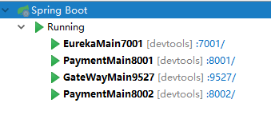

测试:

正确的路径(包含uname:	http://localhost:9527/payment/lb?uname=z3	->	可以访问

错误的路径(不包含uname):	http://localhost:9527/payment/lb	->	无法正常使用转发

测试完成,自定义过滤器以实现其效果;


## 九、SpringCloud Config (分布式配置中心)

### 1、概念

> 微服务意味着要将单体应用中的业务拆分成一个个子服务，每个服务的粒度相对较小，因此系统中会出现大量的服务。由于每个服务都需要必要的配置信息才能运行，所以一套集中式的、动态的配置管理设施是必不可少的。
>
> SpringCloud提供了ConfigServer来解决这个问题，我们每一个微服务自己带着一个application.yml，上百个配置文件的管理......


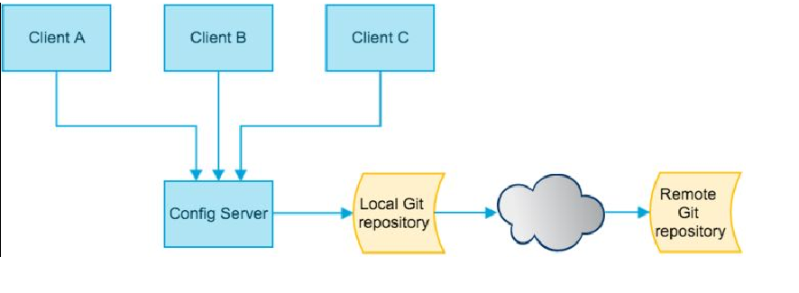

是什么

> SpringCloud Config为微服务架构中的微服务提供集中化的外部配置支持，配置服务器为各个不同微服务应用的所有环境提供了一个中心化的外部配置。

> 这个外部配置除了可以是git, 还可以是svn(可以忽略)或者本地文件(了解);  代码里只展示了与github的整合;

怎么玩

> SpringCloud Config分为服务端和客户端两部分。
>
> ​	服务端也称为分布式配置中心，它是一个独立的微服务应用，用来连接配置服务器并为客户端提供获取配置信息，加密/解密信息等访问接口
>
> ​	客户端则是通过指定的配置中心来管理应用资源，以及与业务相关的配置内容，并在启动的时候从配置中心获取和加载配置信息配置服务器默认采用git来存储配置信息，这样就有助于对环境配置进行版本管理，并且可以通过git客户端工具来方便的管理和访问配置内容。

能干嘛

> 1、集中管理配置文件
>
> 2、当配置发生变动时，服务不需要重启即可感知到配置的变化并应用新的配置
>
> 3、将配置信息以REST接口的形式暴露
>
> 注:  服务端(配置中心)不需要重启不需要通知, 但客户端不需要重启却需要用post方式的curl通知才能动态更新

官网

> https://cloud.spring.io/spring-cloud-static/spring-cloud-config/2.2.1.RELEASE/reference/html/

------

### 2、Config服务端配置(配置中心)

#### 1、github上建文件 

搭建服务端之前,先准备好"外部配置", 这里选择在github上建几个yml文件作为外部配置:)


特别注意: 

​		关于github, 主分支已经改为main而不是master, 因此push到github的命令是git push origin main,而不再是git push origin master

​		(可能是2020年就改了)

> 注意: 1、稍后可以直接在github上直接修改yml文件(推荐) , 也可以通过可以clone到本地再推送上去的方式来修改;
>
> ​		  2、后续使用git地址时, 使用https或者ssh方式都可以


#### 2、新建服务端模块作为配置中心

还是熟悉配方熟悉的套路:

1) 新建module

cloud-config-center-3344

2) 改yml

增加如下依赖

```
        <dependency>
            <groupId>org.springframework.cloud</groupId>
            <artifactId>spring-cloud-config-server</artifactId>
        </dependency>
```

3) 改yml

重点: 增加spring.cloud.config和spring.cloud.label配置

```
server:
  port: 3344

spring:
  application:
    name:  cloud-config-center 
  cloud:
    config:
      server:
        git:
          uri: https://github.com/github-dreamer/springcloud-config.git  #GitHub上面的git仓库名字, 也可以用ssh地址
          search-paths:													 ####搜索目录
            - springcloud-config
      label: main                                                        ####读取分支

eureka:
  client:
    service-url:
      defaultZone: http://localhost:7001/eureka

```

> 注: 以上新增的配置的作用:  配置中心 和 github上main分支(label指定的)下的springcloud-config目录下(search-paths指定的)配置文件进行绑定,

4) 主启动类

增加注解@EnableConfigServer

```
@SpringBootApplication
@EnableConfigServer
public class ConfigCenterMain3344
{
    public static void main(String[] args) {
            SpringApplication.run(ConfigCenterMain3344.class, args);
    }
}
```

4.1) 修改hosts文件

这一步可忽略, 若忽略, 则用localhost访问配置中心;

windows下修改hosts文件，增加如下映射, 增加方法和eureka增加映射时相同;

```
127.0.0.1  config-3344.com
```

5) 测试

查看github上config-test.yml文件:


启动服务,访问 http://config-3344.com:3344/main/config-test.yml

访问结果:


通过访问结果发现, github上config-test.yml文件的所有配置都呈现在浏览器界面了; 访问其它配置文件同理;

测试通过;

6) 配置读取规则

```
1、 /{label}/{application}-{profile}.yml		(推荐)
例: http://config-3344.com:3344/main/config-dev.yml  (mian分支config-dev文件)
	http://config-3344.com:3344/dev/config-test.yml	 (dev分支config-test文件)
2、/{application}-{profile}.yml
例: http://config-3344.com:3344/config-dev.yml	(默认main分支)
3、/{application}/{profile}[/{label}]
例: http://config-3344.com:3344/config/test/main

备注: 直接关注第一种即可, 而且其它两个测试没通过 ...
```

小结: 

> 目前为止, 已经成功把外部配置(github)和配置中心(3344)绑定在一起, 并且当github上配置文件更新时, 配置中心不用重启不用通知刷新即可,
>
> 下面准备客户端,并演示客户端和服务端的交互和区别

### 3、Config客户端配置

#### 1、新建客户端并测试

1) 新建cloud-config-client-3355

2) 改pom

```
        #注意artifactId, 服务端的是spring-cloud-config-server, 客户端是spring-cloud-starter-config
        <dependency>
            <groupId>org.springframework.cloud</groupId>
            <artifactId>spring-cloud-starter-config</artifactId>
        </dependency>
```

3) yml

增加一个bootstrap.yml, 原先的application.yml去掉, (可以共存但这里暂不需要后者)

bootstrap.yml和application.yml 两者区别:

>applicaiton.yml是用户级的资源配置项
>bootstrap.yml是系统级的，优先级更加高
>
>Spring Cloud会创建一个“Bootstrap Context”，作为Spring应用的`Application Context`的父上下文。初始化的时候，`Bootstrap Context`负责从外部源加载配置属性并解析配置。这两个上下文共享一个从外部获取的`Environment`。
>
>`Bootstrap`属性有高优先级，默认情况下，它们不会被本地配置覆盖。 `Bootstrap context`和`Application Context`有着不同的约定，所以新增了一个`bootstrap.yml`文件，保证`Bootstrap Context`和`Application Context`配置的分离。
>
>要将Client模块下的application.yml文件改为bootstrap.yml,这是很关键的，
>因为bootstrap.yml是比application.yml先加载的。bootstrap.yml优先级高于application.yml

bootstrap.yml的内容:

(重点关注spring.cloud.config)

```
server:
  port: 3355

spring:
  application:
    name: config-client
  cloud:
    #Config客户端配置
    config:
      label: main #分支名称
      name: config #配置文件名称
      profile: dev #读取后缀名称 
      				#上述3个综合：master分支上config-dev.yml的配置文件被读取http://config-3344.com:3344/main/config-dev.yml
      uri: http://localhost:3344 #配置中心地址k

#服务注册到eureka地址
eureka:
  client:
    service-url:
      defaultZone: http://localhost:7001/eureka
```

4) 主启动类

```
@EnableEurekaClient
@SpringBootApplication
public class ConfigClientMain3355
{
    public static void main(String[] args)
    {
        SpringApplication.run(ConfigClientMain3355.class,args);
    }
}
```

5) 业务类

增加一个controller用于测试访问配置config.info

```
@RestController
public class ConfigClientController
{
    @Value("${config.info}")
    private String configInfo;

    @GetMapping("/configInfo")
    public String getConfigInfo() 
    {
        return configInfo;
    }
}
```

需要注意的是, 此时客户端3355的yml中是没有配置config.info这项配置的, 但是ConfigClientController类里直接@Value("${config.info}")读取了,那么这个值实际上就是要从配置中心获取; 接下来,测试一下是否能读取到该项配置

6) 测试

首先启动配置中心3344, 并先对3344自测: http://config-3344.com:3344/main/config-test.yml  -> 结果: 获取到github上的config-test.yml配置文件的所有信息

然后启动客户端3355, 并访问: http://localhost:3355/configInfo	->	结果: 获取到config.info的配置项信息

(注意: 当前示例中,服务端访问到的是某个配置文件的所有配置项, 而客户端访问到的是某个配置项的信息)

此时, 3344和3355的yml中都是没有config.info这一项的,只有外部配置github上有, 但是3344和3355都访问到了;

而且3344是和github直连的,3355是和3355直连;

结论: 成功实现了客户端3355访问SpringCloud Config, 3344通过GitHub获取配置信息

#### 2、客户端之动态刷新

通过上面测试发现, 配置中心直连外部配置, 当外部配置即github上的配置改变时, 配置中心无需重启就可以获取最新的配置;

但是客户端却还显示改变之前的配置, 此时必须要重启才能刷新出新的配置出来;

那么怎么动态刷新(不用重启)客户端就可以从配置中心获取最新配置呢?

这就需要对3355模块(客户端)进行修改了:

1) pom:

确认pom文件需要是否有: actuator(一般和start-web一起使用)

```
<dependency>
    <groupId>org.springframework.boot</groupId>
    <artifactId>spring-boot-starter-actuator</artifactId>
</dependency>
```

2) yml:

```
# 暴露监控端点
management:
  endpoints:
    web:
      exposure:
        include: "*"
```

3) 业务类Controller修改:

加上注解@RefreshScope

```
@RestController
@RefreshScope
public class ConfigClientController
{
    @Value("${config.info}")
    private String configInfo;

    @GetMapping("/configInfo")
    public String getConfigInfo() {
        return configInfo;
    }
}
```

此时, 修改完成

4) 测试

启动3344, 3355,修改github配置信息, 访问服务端 http://config-3344.com:3344/main/config-test.yml, -> 结果不用想肯定是最新的配置;  

但是访问客户端 http://localhost:3355/configInfo 结果没有更新;

5) 通知

修改客户端配置之后, 需要再发post方式的curl通知客户端:

curl -X POST "http://localhost:3355/actuator/refresh"

然后, 重新访问 http://localhost:3355/configInfo , 得到最新的配置!

至此,已经实现客户端也不需要重启就能从配置中心获取最新配置!

> 小结: 可以发现,当外部配置改变时, 服务端即配置中心既不需要重启也不需要通知就可以获取最新配置, 但客户端虽不需要重启了, 但仍需要通知; 

新的问题:

> 如果有多个config客户端(事实上很可能), 那么难道当修改外部配置时, 需要依次对每个客户端进行通知吗? 那这岂不是把开发人员重启的工作交给了运维人员去通知了吗? 虽然比重启效率高了,但有没有更好的方法呢?	
>
> 透露: 可以使用springcloud config+springcloud bus结合使用来解决, 或者直接 使用springcloud alibaba nacos(自动刷新无需重启无需通知)

6) 新建3366、3377 (可忽略,到了bus再创建也不迟)

仿照3355, 新建3366和3377作为另外两个客户端:

启动3344、3355、3366、3377

测试发现: 当修改外部配置时,需要依次通知每个客户端才可以让客户端获取最新配置信息

问题: 可否广播，即一次通知，处处生效呢？

答: 使用springcloud bus消息总线

## 十、SpringCloud Bus 消息总线

### 1、概述

是什么?

> Spring Cloud Bus是用来将分布式系统的节点与轻量级消息系统链接起来的框架，
> 它整合了Java的事件处理机制和消息中间件的功能。
> **Spring Clud Bus目前支持RabbitMQ和Kafka。**

能干嘛?

> Spring Cloud Bus能管理和传播分布式系统间的消息，就像一个分布式执行器，可用于广播状态更改、事件推送等，也可以当作微服务间的通信通道。
>
> 分布式自动刷新配置功能
>
> Spring Cloud Bus 配合 Spring Cloud Config 使用可以实现配置的动态刷新。


什么是总线

> 在微服务架构的系统中，通常会使用轻量级的消息代理来构建一个共用的消息主题，并让系统中所有微服务实例都连接上来。由于该主题中产生的消息会被所有实例监听和消费，所以称它为消息总线。在总线上的各个实例，都可以方便地广播一些需要让其他连接在该主题上的实例都知道的消息。

基本原理

> ConfigClient实例都监听MQ中同一个topic(默认是springCloudBus)。当一个服务刷新数据的时候，它会把这个信息放入到Topic中，这样其它监听同一Topic的服务就能得到通知，然后去更新自身的配置。


### 2、RabbitMQ环境配置

1、安装Erlang，下载地址：

https://www.erlang.org/downloads  	(下载好之后安装, 安装时无脑下一步即可)

2、安装RabbitMQ，下载地址：

https://www.rabbitmq.com/install-windows.html#installer  (也是无脑安装)

注意: 两个外网,下载极慢, 用了梯子能好很多

3、进入RabbitMQ安装目录下的sbin目录

打开cmd, 输入命令: rabbitmq-plugins enable rabbitmq_management

示例:


执行之后, 出现如下所示的可执行插件:


访问地址查看是否安装成功：	http://localhost:15672/

出现如下说明安装成功:

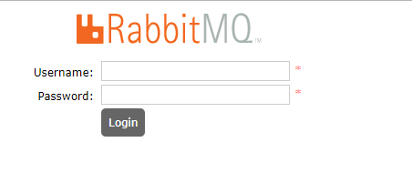

此时, rabbitmq环境准备就绪;

然后, 输入账号密码并登录：guest guest

### 3、SpringCloud Bus动态刷新全局广播

> 注:在进行这一步之前需要先准备好上面的 rabbitmq环境;

#### 0、设计思想

1) 利用消息总线触发一个客户端/bus/refresh,而刷新所有客户端的配置:


2) 利用消息总线触发一个服务端ConfigServer的/bus/refresh端点，而刷新所有客户端的配置:

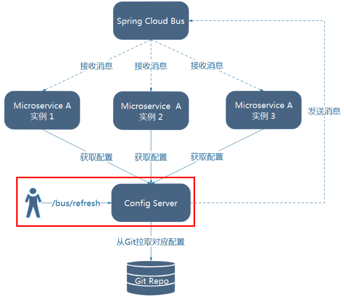

那么选择哪种呢?

图二的架构显然更加适合!

图一不适合的原因如下(了解):

> 1、打破了微服务的职责单一性，因为微服务本身是业务模块，它本不应该承担配置刷新的职责。
>
> 2、破坏了微服务各节点的对等性。
>
> 3、有一定的局限性。例如，微服务在迁移时，它的网络地址常常会发生变化，此时如果想要做到自动刷新，那就会增加更多的修改

#### 1、新增客户端

为了演示广播效果，增加复杂度，再以3355为模板再制作一个3366(或多个[3366、3377、3388、...])

3366可完全copy3355

#### 2、给服务添加消息总线支持

1、给cloud-config-center-3344配置中心服务端添加消息总线支持

1) pom:

```
<!--添加消息总线RabbitMQ支持-->
<dependency>
    <groupId>org.springframework.cloud</groupId>
    <artifactId>spring-cloud-starter-bus-amqp</artifactId>
</dependency>
```

2) yml:

重点关注:  spring.rabbitmq和management.endpoints

```
server:
  port: 3344

spring:
  application:
    name:  cloud-config-center #注册进Eureka服务器的微服务名
  cloud:
    config:
      server:
        git:
          uri: git@github.com:zzyybs/springcloud-config.git #GitHub上面的git仓库名字
        ####搜索目录
          search-paths:
            - springcloud-config
      ####读取分支
      label: master
 #rabbitmq相关配置
  rabbitmq:
    host: localhost
    port: 5672
    username: guest
    password: guest

#服务注册到eureka地址
eureka:
  client:
    service-url:
      defaultZone: http://localhost:7001/eureka


##rabbitmq相关配置,暴露bus刷新配置的端点
management:
  endpoints: #暴露bus刷新配置的端点
    web:
      exposure:
        include: 'bus-refresh'
```

2、给cloud-config-client-3355客户端添加消息总线支持

1) pom:

```
<!--添加消息总线RabbitMQ支持-->
<dependency>
    <groupId>org.springframework.cloud</groupId>
    <artifactId>spring-cloud-starter-bus-amqp</artifactId>
</dependency>
```

2) yml:

重点关注:  spring.rabbitmq和management.endpoints

```
server:
  port: 3355

spring:
  application:
    name: config-client
  cloud:
    #Config客户端配置
    config:
      label: master #分支名称
      name: config #配置文件名称
      profile: dev #读取后缀名称   上述3个综合：master分支上config-dev.yml的配置文件被读取
      uri: http://localhost:3344 #配置中心地址k
  #rabbitmq相关配置 15672是Web管理界面的端口；5672是MQ访问的端口
  rabbitmq:
    host: localhost
    port: 5672
    username: guest
    password: guest

#服务注册到eureka地址
eureka:
  client:
    service-url:
      defaultZone: http://localhost:7001/eureka
# 暴露监控端点
management:
  endpoints:
    web:
      exposure:
        include: "*"   # 包含'refresh'
```

3、给cloud-config-client-3366客户端添加消息总线支持

1) pom:

```
<!--添加消息总线RabbitMQ支持-->
<dependency>
    <groupId>org.springframework.cloud</groupId>
    <artifactId>spring-cloud-starter-bus-amqp</artifactId>
</dependency>
```

2) yml:

重点关注:  spring.rabbitmq和management.endpoints

```
server:
  port: 3366

spring:
  application:
    name: config-client
  cloud:
    #Config客户端配置
    config:
      label: master #分支名称
      name: config #配置文件名称
      profile: dev #读取后缀名称   上述3个综合：master分支上config-dev.yml的配置文件被读取
      uri: http://localhost:3344 #配置中心地址k
#rabbitmq相关配置 15672是Web管理界面的端口；5672是MQ访问的端口
  rabbitmq:
    host: localhost
    port: 5672
    username: guest
    password: guest

#服务注册到eureka地址
eureka:
  client:
    service-url:
      defaultZone: http://localhost:7001/eureka
# 暴露监控端点
management:
  endpoints:
    web:
      exposure:
        include: "*"   # 包含'refresh'
```


> 注:上面三个服务添加消息总线支持的操作 其实都是进行了相同的操作:
>
> 都是pom增加start-bus-amqp, yml中增加了spring.rabbitmq和management.endpoints

#### 3、通知

此时, 上面三个服务已经添加消息总线支持;

接下来, 采用第二种设计思想: 当外部配置改变时, 对配置中心3344进行一次通知,然后实现3355、3366等多个客户端更新配置的目的;

即一次通知, 处处生效;

通知命令:

curl -X POST "http://localhost:3344/actuator/bus-refresh"

#### 4、测试

1) 修改github上配置文件内容

2) 访问各客户端接口,查看配置是否更新	->  没有更新

3) 通知配置中心: curl -X POST "http://localhost:3344/actuator/bus-refresh"

4) 重新访问各客户端, 发现配置已经更新;

成功实现一次通知,处处生效!

### 4、SpringCloud Bus动态刷新定点通知

> 注: 定点通知作为全局通知的一个补充, 它的作用见名知意: 只通知具体某个服务,而非全部

通知公式：http://localhost:配置中心的端口号/actuator/bus-refresh/{destination}

相比全局: 在后面加了个/{destination}	(destination = 微服务名:端口号)

示例:

只通知3355, 不通知3366:

curl -X POST "http://localhost:3344/actuator/bus-refresh/config-client:3355";

当然也可以用之前config中通知的方式(直接通知3355):

curl -X POST "http://localhost:3355/actuator/refresh"

## 十一、SpringCloud Stream 消息驱动

### 1、概述

1) 什么是SpringCloudStream

> 官方定义 Spring Cloud Stream 是一个构建消息驱动微服务的框架。
>
> 应用程序通过 inputs 或者 outputs 来与 Spring Cloud Stream中binder对象交互。
> 通过我们配置来binding(绑定) ，而 Spring Cloud Stream 的 binder对象负责与消息中间件交互。
> 所以，我们只需要搞清楚如何与 Spring Cloud Stream 交互就可以方便使用消息驱动的方式。
>
> 通过使用Spring Integration来连接消息代理中间件以实现消息事件驱动。
> Spring Cloud Stream 为一些供应商的消息中间件产品提供了个性化的自动化配置实现，引用了发布-订阅、消费组、分区的三个核心概念。
>
> **目前仅支持RabbitMQ、Kafka**。

以上, 一句话概括:  屏蔽底层消息中间件的差异,降低切换成本，统一消息的编程模型

2)设计思想

标准MQ:	

> 生产者/消费者之间靠消息媒介传递信息内容
>
> 消息必须走特定的通道,(消息通道MessageChannel)
>
> 消息通道MessageChannel的子接口SubscribableChannel，由MessageHandler消息处理器所订阅

那么, 为什么用Cloud Stream

> 比方说我们用到了RabbitMQ和Kafka，由于这两个消息中间件的架构上的不同，
> 像RabbitMQ有exchange，kafka有Topic和Partitions分区，

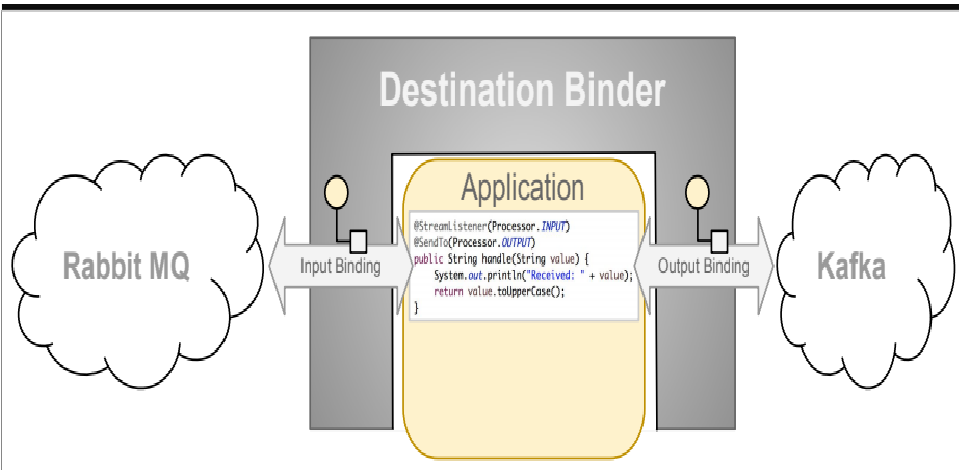

> 这些中间件的差异性导致我们实际项目开发给我们造成了一定的困扰，我们如果用了两个消息队列的其中一种，后面的业务需求，我想往另外一种消息队列进行迁移，这时候无疑就是一个灾难性的，一大堆东西都要重新推倒重新做，因为它跟我们的系统耦合了，这时候springcloud Stream给我们提供了一种解耦合的方式。

那么, stream凭什么可以统一底层差异？

>在没有绑定器这个概念的情况下，我们的SpringBoot应用要直接与消息中间件进行信息交互的时候，
>由于各消息中间件构建的初衷不同，它们的实现细节上会有较大的差异性
>通过定义绑定器作为中间层，完美地实现了应用程序与消息中间件细节之间的隔离。
>通过向应用程序暴露统一的Channel通道，使得应用程序不需要再考虑各种不同的消息中间件实现。

**通过定义绑定器Binder作为中间层，实现了应用程序与消息中间件细节之间的隔离。**

那么, 什么是Binder?

> 在没有绑定器这个概念的情况下，我们的SpringBoot应用要直接与消息中间件进行信息交互的时候，由于各消息中间件构建的初衷不同，它们的实现细节上会有较大的差异性，通过定义绑定器作为中间层，完美地实现了应用程序与消息中间件细节之间的隔离。Stream对消息中间件的进一步封装，可以做到代码层面对中间件的无感知，甚至于动态的切换中间件(rabbitmq切换为kafka)，使得微服务开发的高度解耦，服务可以关注更多自己的业务流程


> Binder可以生成Binding，Binding用来绑定消息容器的生产者和消费者，它有两种类型，INPUT和OUTPUT，INPUT对应于消费者，OUTPUT对应于生产者。

**INPUT对应于消费者, OUTPUT对应于生产者**

Stream中的消息通信方式遵循了发布-订阅模式, Topic主题进行广播, 在RabbitMQ就是Exchange, 在Kakfa中就是Topic;


Spring Cloud Stream标准流程套路?

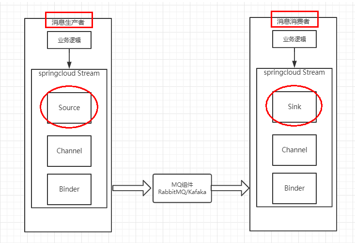

> Binder:	很方便的连接中间件，屏蔽差异
>
> Channel:	通道，是队列Queue的一种抽象，在消息通讯系统中就是实现存储和转发的媒介，通过Channel对队列进行配置
>
> Source和Sink:	简单的可理解为参照对象是Spring Cloud Stream自身，从Stream发布消息就是输出，接受消息就是输入。


编码API和常用注解: 


### 2、案例说明

使用之前需要先准备好rabbit或者kafka环境; 这里使用前面springcloudbus已经装好rabbit;

工程中需要新建三个模块:

> cloud-stream-rabbitmq-provider8801， 作为生产者进行发消息模块
>
> cloud-stream-rabbitmq-consumer8802，作为消息接收模块
>
> cloud-stream-rabbitmq-consumer8803  作为消息接收模块

下面会依次新建这三个模块

### 3、消息驱动之生产者

新建一个模块作为生产者(发送消息)

1) 新建module

cloud-stream-rabbitmq-provider8801

2) 改pom

        <dependency>
            <groupId>org.springframework.cloud</groupId>
            <artifactId>spring-cloud-starter-stream-rabbit</artifactId>
        </dependency>
3) 改yml

重点关注spring.cloud.stream.binders 和 spring.cloud.stream.bindings

```
server:
  port: 8801

spring:
  application:
    name: cloud-stream-provider
  cloud:
      stream:
        binders: # 在此处配置要绑定的rabbitmq的服务信息；
          defaultRabbit: # 表示定义的名称，用于于binding整合
            type: rabbit # 消息组件类型
            environment: # 设置rabbitmq的相关的环境配置
              spring:
                rabbitmq:
                  host: localhost
                  port: 5672
                  username: guest
                  password: guest
        bindings: # 服务的整合处理
          output: # 这个名字是一个通道的名称
            destination: studyExchange # 表示要使用的Exchange名称定义
            content-type: application/json # 设置消息类型，本次为json，文本则设置“text/plain”
            binder: defaultRabbit # 设置要绑定的消息服务的具体设置

eureka:
  client: # 客户端进行Eureka注册的配置
    service-url:
      defaultZone: http://localhost:7001/eureka
  instance:
    lease-renewal-interval-in-seconds: 2 # 设置心跳的时间间隔（默认是30秒）
    lease-expiration-duration-in-seconds: 5 # 如果现在超过了5秒的间隔（默认是90秒）
    instance-id: send-8801.com  # 在信息列表时显示主机名称
    prefer-ip-address: true     # 访问的路径变为IP地址

```

3.1) 主启动类可不用更改

4) 业务类


发送消息接口:

```
public interface IMessageProvider
{
    public String send() ;
}
```

发送消息接口实现类:

```
@EnableBinding(Source.class) // 可以理解为是一个消息的发送管道的定义
public class MessageProviderImpl implements IMessageProvider
{
    @Resource
    private MessageChannel output; // 消息的发送管道

    @Override
    public String send()
    {
        String serial = UUID.randomUUID().toString();
        this.output.send(MessageBuilder.withPayload(serial).build()); // 创建并发送消息
        System.out.println("***serial: "+serial);

        return serial;
    }
}
```

Controller:

```
@RestController
public class SendMessageController
{
    @Resource
    private IMessageProvider messageProvider;

    @GetMapping(value = "/sendMessage")
    public String sendMessage()
    {
        return messageProvider.send();
    }
}
```

5) 测试

启动7001eureka	->	启动rabbitmq(见十.2)	->	启动8801

测试rabbitmq的可视化界面:


> 注:这个studyExchange的名称是yml中定义的

接下来

访问:  http://localhost:8801/sendMessage	->	浏览器显示随机的uuid,后台有打印	->	测试成功


### 4、消息驱动之消费者

新建一个模块作为消费者(接受消息)

1) 新建module

cloud-stream-rabbitmq-consumer8802

2) 改pom

```
		<dependency>
            <groupId>org.springframework.cloud</groupId>
            <artifactId>spring-cloud-starter-stream-rabbit</artifactId>
        </dependency>
```

3) 改yml

重点关注spring.cloud.stream.binders 和 spring.cloud.stream.bindings  (和生产者8801的yml大同小异)

```
server:
  port: 8802

spring:
  application:
    name: cloud-stream-consumer
  cloud:
      stream:
        binders: # 在此处配置要绑定的rabbitmq的服务信息；
          defaultRabbit: # 表示定义的名称，用于于binding整合
            type: rabbit # 消息组件类型
            environment: # 设置rabbitmq的相关的环境配置
              spring:
                rabbitmq:
                  host: localhost
                  port: 5672
                  username: guest
                  password: guest
        bindings: # 服务的整合处理
          input: # 这个名字是一个通道的名称
            destination: studyExchange # 表示要使用的Exchange名称定义
            content-type: application/json # 设置消息类型，本次为对象json，如果是文本则设置“text/plain”
            binder: defaultRabbit # 设置要绑定的消息服务的具体设置

eureka:
  client: # 客户端进行Eureka注册的配置
    service-url:
      defaultZone: http://localhost:7001/eureka
  instance:
    lease-renewal-interval-in-seconds: 2 # 设置心跳的时间间隔（默认是30秒）
    lease-expiration-duration-in-seconds: 5 # 如果现在超过了5秒的间隔（默认是90秒）
    instance-id: receive-8802.com  # 在信息列表时显示主机名称
    prefer-ip-address: true     # 访问的路径变为IP地址

```

3.1) 主启动类可忽略

4)业务类

```
@Component
@EnableBinding(Sink.class)
public class ReceiveMessageListener
{
    @Value("${server.port}")
    private String serverPort;

    @StreamListener(Sink.INPUT)
    public void input(Message<String> message)
    {
        System.out.println("消费者1号，------->接收到的消息：" + message.getPayload()+"\t port: "+serverPort);
    }
}
```

5) 测试

测试8801发送8802接收消息	->	http://localhost:8801/sendMessage


### 5、分组消费与持久化

1、依照8802，clone出来一份运行8803

cloud-stream-rabbitmq-consumer8803

此时, 有一个生产者8801,有两个消费者8802、8803

2、启动并测试

​	 启动:  

​	访问 http://localhost:8801/sendMessage   ->   结果: 8802 和 8803都收到了相同的消息

3、问题&解决思路&案例

运行后有两个问题:

1) 有重复消费问题

2) 消息持久化问题

> 注: 多数情况下重复消费也就是多个服务收到一个消息 是需要解决的问题, 少数场景下,可能正需要这样的效果,所以也可能不是个问题;

解决思路:

**分组和持久化属性group**

实际案例:

比如在如下场景中，订单系统我们做集群部署，都会从RabbitMQ中获取订单信息，
那如果一个订单同时被两个服务获取到，那么就会造成数据错误，我们得避免这种情况。
这时我们就可以使用Stream中的消息分组来解决

 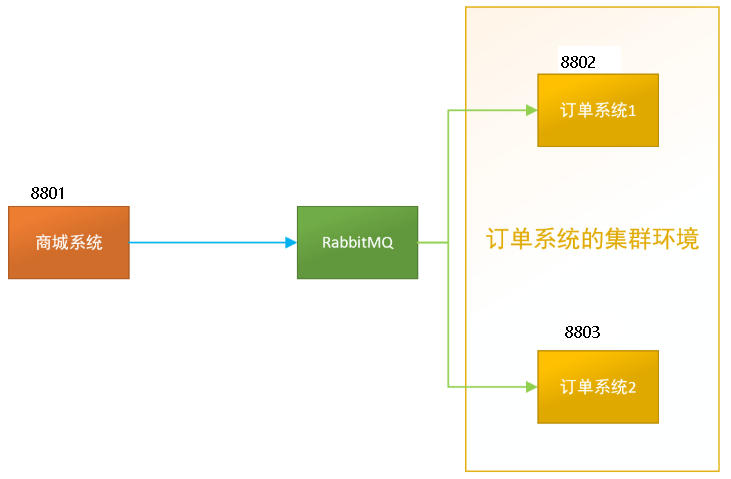

注意在Stream中处于同一个group中的多个消费者是竞争关系，就能够保证消息只会被其中一个应用消费一次。
不同组是可以全面消费的(重复消费)，
同一组内会发生竞争关系，只有其中一个可以消费。

4、分组

原理:

> 微服务应用放置于同一个group中，就能够保证消息只会被其中一个应用消费一次。
> 不同的组是可以消费的，同一个组内会发生竞争关系，只有其中一个可以消费。

因此, 想要避免重复消费, 就把8802和8803放到同一个组, 让他们成为竞争关系;

​		想要持久化, 只需要分组(指定group)就可以了, 换句话说是不是一组无所谓, 只有写了group就具有持久化能力了;


那么, 默认情况下, 也就是没有指定group时, 多个微服务属于不同组, 而且不具有持久化能力;

接下来,演示指定group的情况下, 8802和8803在不同组和在同一组的情况:

1) 不同组:

8802修改YML(增加下面这一项):

```
spring.cloud.stream.bindings.input.group=atguiguA
```

8803修改YML(和上面同理):

```
spring.cloud.stream.bindings.input.group=atguiguB
```

打开rabbitmq页面发现:

 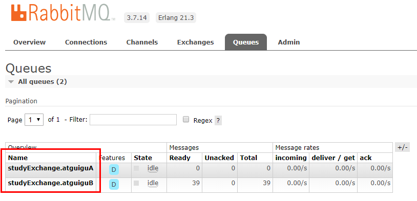

此时, 存在两个自定义的组;

> 注:多数情况，生产者发送消息给某个具体微服务时只希望被消费一次，按照上面我们启动两个应用的例子，虽然它们同属一个应用，
> 但是这个消息出现了被重复消费两次的情况。为了解决这个问题，在Spring Cloud Stream中提供了消费组的概念。

访问 http://localhost:8801/sendMessage, 发现8802和8803都受到了相同消息,因此重复问题还是存在的(因为在不同组)


2)同一组:

8802 & 8803 修改yml(增加下面这一项):

```
spring.cloud.stream.bindings.input.group=atguigu
```

此时, 两个消费者在同一组,  测试发现, 访问http://localhost:8801/sendMessage, 每次8002/8003只有一个能收到消息;重复问题解决;

结论: 同一个组的多个微服务实例，每次只会有一个拿到 (竞争关系)

5、持久化

通过上述，解决了重复消费问题，再看看持久化;

上面写过, 服务只要指定group, 那消息就已经持久化了;

下面演示:

1) 首先, 关闭所有相关服务,

2) 在上面配置基础上, 8801/8803配置不动,8002去掉分组group:atguigu;

> 注:此时, 8002采用默认分组, 8003指定了分组(atguigu);

3) 启动7001,启动rabbitmq	->	启动8801 (此时,8802/8803保持关闭状态,暂不启动)	->	8801先发送4条消息到rabbitmq(这一步就相当于上面访问8801接口),那么,此时rabbitmq中存在8801发来的四条消息	->	启动8802(无分组属性配置)	->	结果:后台没有打出来消息	->	启动8803(有分组属性配置)	->	结果:后台成功打出来四条消息

结论:	配置了group分组属性的服务在启动后可以收到rabbitmq的消息(也就是具有持久化能力),

​			反之, 没有配置group分组属性的服务在启动后无法收到rabbitmq的消息(也就是不具有持久化能力);

> 注:	持久化测试中, 8802/8803都是后启动的, 而前面非持久化测试中, 8802/8803都是提前启动好的.


## 十二、SpringCloud Sleuth 分布式请求链路跟踪

为什么会出现这个技术？
需要解决哪些问题？

> 在微服务框架中，一个由客户端发起的请求在后端系统中会经过多个不同的的服务节点调用来协同产生最后的请求结果，每一个前段请求都会形成一条复杂的分布式服务调用链路，链路中的任何一环出现高延时或错误都会引起整个请求最后的失败。

> 当微服务数量较多时, 如果人工地来记录各个服务直接的调用关系和记录是非常困难的, 使用Sleuth(分布式请求链路跟踪) + zipkin(负责页面展现) 来进行界面展示服务之前的调用关系是很有必要的;

术语

> Trace:类似于树结构的Span集合，表示一条调用链路，存在唯一标识
>
> span:表示调用链路来源，通俗的理解span就是一次请求信息

### 1、下载zipkin并运行

下载地址:	https://repo1.maven.org/maven2/io/zipkin/zipkin-server/2.15.0/     --zhf(2022)

下载之后出现jar, 然后在cmd中运行:	java -jar zipkin-server-2.12.9-exec.jar, 运行成功界面如下

 

然后访问: http://localhost:9411/zipkin/ 测试是否成功;

下面将演示如何将两个服务和sleuth联系上, 并且在一个服务调用另一个服务后, 如何在zipkin提供的可视化界面查看

### 2、新建服务提供者和服务调用者

1)、服务提供者

1、修改module 

cloud-provider-payment8001(这个模块是上面Eureka已经存在的)

2、改pom

        <!--包含了sleuth+zipkin-->
        <dependency>
            <groupId>org.springframework.cloud</groupId>
            <artifactId>spring-cloud-starter-zipkin</artifactId>
        </dependency>
3、改yml

重点关注spring.zipkin 和 spring.sleuth

```

server:
  port: 8001

spring:
  application:
    name: cloud-payment-service
  zipkin:
    base-url: http://localhost:9411
  sleuth:
    sampler:
      #采样率值介于 0 到 1 之间，1 则表示全部采集
      probability: 1
  datasource:
    type: com.alibaba.druid.pool.DruidDataSource
    driver-class-name: com.mysql.cj.jdbc.Driver
    url: jdbc:mysql://localhost:3306/test_cloud?useUnicode=true&characterEncoding=utf-8&serverTimezone=Asia/Shanghai
    username: root
    password: 123456


eureka:
  client:
    #表示是否将自己注册进EurekaServer默认为true。
    register-with-eureka: true
    #是否从EurekaServer抓取已有的注册信息，默认为true。单节点无所谓，集群必须设置为true才能配合ribbon使用负载均衡
    fetchRegistry: true
    service-url:
      defaultZone: http://localhost:7001/eureka
#      defaultZone: http://eureka7001.com:7001/eureka,http://eureka7002.com:7002/eureka  # 集群版
  instance:
    instance-id: payment8001
    prefer-ip-address: true
    #Eureka客户端向服务端发送心跳的时间间隔，单位为秒(默认是30秒)
    lease-renewal-interval-in-seconds: 1
    #Eureka服务端在收到最后一次心跳后等待时间上限，单位为秒(默认是90秒)，超时将剔除服务
    lease-expiration-duration-in-seconds: 2
#MyBatis-Plus
mybatis-plus:
  configuration:
    #打印日志
    log-impl: org.apache.ibatis.logging.stdout.StdOutImpl
```

4、业务类PaymentController

controller增加

```
@GetMapping("/payment/zipkin")
public String paymentZipkin()
{
    return "hi ,i'am paymentzipkin server fall back，welcome to atguigu，O(∩_∩)O哈哈~";
}
```

2) 服务消费者(调用方)

1、修改cloud-consumer-order80

上面存在的

2、改pom

```
        <!--包含了sleuth+zipkin-->
        <dependency>
            <groupId>org.springframework.cloud</groupId>
            <artifactId>spring-cloud-starter-zipkin</artifactId>
        </dependency>
```

3、改yml

原来基础上增加下面

```
spring:
    application:
        name: cloud-order-service
    zipkin:
      base-url: http://localhost:9411
    sleuth:
      sampler:
        probability: 1
```

4、业务类OrderController

```
// ====================> zipkin+sleuth
@GetMapping("/consumer/payment/zipkin")
public String paymentZipkin()
{
    String result = restTemplate.getForObject("http://localhost:8001"+"/payment/zipkin/", String.class);
    return result;
}
```

### 3、测试

依次启动eureka7001/8001/80

80调用8001几次测试下,打开浏览器访问：http://localhost:9411

会出现以下界面:

 

查看:

 

查看依赖关系:

 


## 十三、SpringCloud Alibaba入门简介

### 1、为什么会出现SpringCloud alibaba

Spring Cloud Netflix项目进入维护模式!

>进入维护模式意味着Spring Cloud Netflix 将不再开发新的组件, 并且只修复 block 级别的 bug 以及安全问题

并非所有组件,而是其中很多组件进入维护模式比如 Eureka、Feign、Hystrix、Zuul、Config、Bus等;

这几个当中, Feign和Zuul 已经分别被SpringCloudNetflix自己的OpenFeign和GateWay所替代;

Eureka亦可以有代替方案 zookeeper或consul; 但是另几个没有好的方案, 所以就出现了springcloudalibaba;

### 2、SpringCloud alibaba带来了什么

此时阿里巴巴推出属于SpringCloudAlibaba的一系列组件, 比如**nacos、sentinel、seata**(这三个接下来会学习); 

SpringCloudAlibaba系列除了上面这三个组件, 还包括RocketMP、Dubbo、Alibaba Cloud SMS等等;详细看官网;

其中, nacos ≈ eureka + config + bus; sentinel ≈ hystrix; seata用来处理分布式事务;

下面的两张图很形象, 如下:

 

 


官网地址: https://github.com/alibaba/spring-cloud-alibaba

## 十四、SpringCloud Alibaba Nacos (服务注册和配置中心)

### 1、Nacos简介

为什么叫Nacos

> 前四个字母分别为Naming和Configuration的前两个字母，最后的s为Service。

是什么

> 一个更易于构建云原生应用的动态服务发现、配置管理和服务管理平台。
>
> Nacos: Dynamic Naming and Configuration Service

Nacos就是注册中心 + 配置中心的组合; 即**Nacos = Eureka+Config +Bus**

去哪下

> https://github.com/alibaba/Nacos

 各种注册中心比较

 

### 2、下载、安装并运行Nacos

1、下载地址: https://github.com/alibaba/nacos/releases/tag/2.0.3

> 下载的nacos的版本是2.0.3 (老师用的1.1.4, 太老, 所以换成较新的, 但也因此在学习过程中遇到很多坑,下面会说)

 

先下载window版用来学习, 生产环境使用linux版(后面演示集群效果时会演示)

2、启动

解压安装包，直接运行bin目录下的startup.cmd

运行命令:  1) startup.cmd  -m  standalone  (使用命令指定启动方式为单机版(standalone))

​					2) 先修改启动脚本文件startup.cmd,修改为如下,修改后可直接双击启动 (修改脚本中默认启动方式, 默认为cluster集群, 修改为standalone)


> 注:  1) 启动脚本 startup.cmd所在目录不能含有中文, 否则会报错(亲测)
>
> ​	   2) 目前初学时, 修改了可以用修改启动脚本文件方式后双击启动, 但生产环境可能用集群, 自然就不必修改了

启动成功后:


正确启动后最后一行:  


命令运行成功后直接浏览器访问http://localhost:8848/nacos  (默认账号密码都是nacos, 默认访问端口是8848(可修改))

成功结果页面:

 


### 3、Nacos作为服务注册中心演示

思路: 两个sheng

#### 1、基于Nacos的服务提供者

1) 新建Module

```
cloudalibaba-provider-payment9001
```

2) 改pom

父POM:

增加alibaba.cloud依赖

```
            <dependency>
                <groupId>com.alibaba.cloud</groupId>
                <artifactId>spring-cloud-alibaba-dependencies</artifactId>
                <version>2.1.0.RELEASE</version>
                <type>pom</type>
                <scope>import</scope>
            </dependency>
```

本模块POM:

增加如下依赖:

```
        <!--SpringCloud ailibaba nacos -->
        <dependency>
            <groupId>com.alibaba.cloud</groupId>
            <artifactId>spring-cloud-starter-alibaba-nacos-discovery</artifactId>
        </dependency>
```

3) 改YML

```
server:
  port: 9001

spring:
  application:
    name: nacos-payment-provider
  cloud:
    nacos:
      discovery:
        server-addr: localhost:8848 #配置Nacos地址

management:
  endpoints:
    web:
      exposure:
        include: '*'
```

4) 主启动

```
@EnableDiscoveryClient
@SpringBootApplication
public class PaymentMain9001
{
    public static void main(String[] args) {
            SpringApplication.run(PaymentMain9001.class, args);
    }
}
```

5) 业务类

```
@RestController
public class PaymentController
{
    @Value("${server.port}")
    private String serverPort;

    @GetMapping(value = "/payment/nacos/{id}")
    public String getPayment(@PathVariable("id") Integer id)
    {
        return "nacos registry, serverPort: "+ serverPort+"\t id"+id;
    }
}
```

6) 测试

先启动本地nacos(window下单机模式)

访问 http://localhost:9001/payment/nacos/1  

观察控制台:    

此时, 可以在界面上发现服务列表多了一个服务;

这说明 nacos服务注册中心+服务提供者9001都OK了

7) 新建9002

为了下一章节演示nacos的负载均衡，参照9001新建9002(步骤几乎一样);

7.1) 拷贝虚拟端口映射 (了解)

除了新建一个真实的9002模块之外, 还可以 直接拷贝虚拟端口映射; 效果相同;步骤如下

 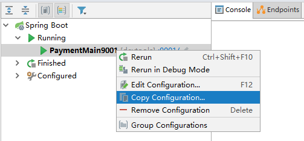

 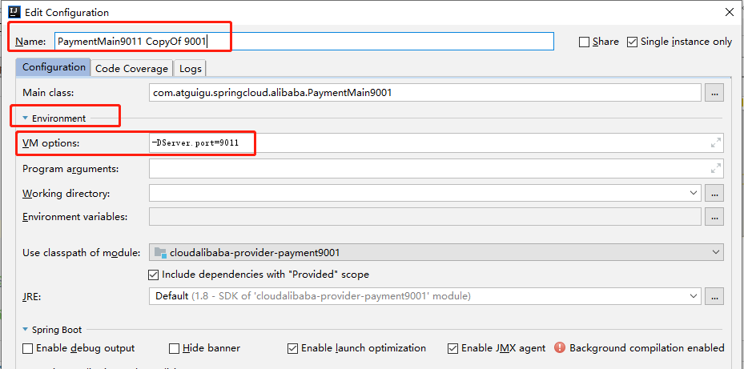

 

这相当于利用9001模块模拟出一个虚拟的9011来, 这样相比较新建9002更省事一点;

#### 2、基于Nacos的服务消费者

1) 新建Module

cloudalibaba-consumer-nacos-order83

2) 改pom

增加如下依赖

```
        <!--SpringCloud ailibaba nacos -->
        <dependency>
            <groupId>com.alibaba.cloud</groupId>
            <artifactId>spring-cloud-starter-alibaba-nacos-discovery</artifactId>
        </dependency>
```

引申: 为什么nacos支持负载均衡?

如下图, 引入alibaba-nacos-discovery这个starter之后, 自动包含了ribbon;

  

3) 改yml

```
server:
  port: 83


spring:
  application:
    name: nacos-order-consumer
  cloud:
    nacos:
      discovery:
        server-addr: localhost:8848


#消费者将要去访问的微服务名称(注册成功进nacos的微服务提供者)
service-url:
  nacos-user-service: http://nacos-payment-provider 
```

4) 主启动

```
@EnableDiscoveryClient
@SpringBootApplication
public class OrderNacosMain83
{
    public static void main(String[] args)
    {
        SpringApplication.run(OrderNacosMain83.class,args);
    }
} 
```

5) 业务类

controller层:

```
@RestController
public class PaymentController
{
    @Value("${server.port}")
    private String serverPort;

    @GetMapping(value = "/payment/{id}")
    public String getPayment(@PathVariable("id") Integer id)
    {
        return "nacos registry, serverPort: "+ serverPort+"\t id"+id;
    }
}
```

```
@RestController
public class OrderNacosController
{
    @Resource
    private RestTemplate restTemplate;

    @Value("${service-url.nacos-user-service}")
    private String serverURL;

    @GetMapping("/consumer/payment/nacos/{id}")
    public String paymentInfo(@PathVariable("id") Long id)
    {
        return restTemplate.getForObject(serverURL+"/payment/nacos/"+id,String.class);
    }

}
```

config下

```
@Configuration
public class ApplicationContextBean
{
    @Bean
    @LoadBalanced
    public RestTemplate getRestTemplate()
    {
        return new RestTemplate();
    }
}
```

6) 测试

观察nacos控制台可以发现:


访问接口: http://localhost:83/consumer/payment/nacos/13   ->  观察页面发现 83访问9001/9002，轮询负载OK

#### 3、服务注册中心对比

各种注册中心对比

 

 


#### 4、Nacos 支持AP和CP模式的切换

**简单地说 Nacos可以根据配置识别为CP模式或AP模式，默认是AP模式。**


C是所有节点在同一时间看到的数据是一致的；而A的定义是所有的请求都会收到响应。


何时选择使用何种模式？
一般来说，
如果不需要存储服务级别的信息且服务实例是通过nacos-client注册，并能够保持心跳上报，那么就可以选择AP模式。当前主流的服务如 Spring cloud 和 Dubbo 服务，都适用于AP模式，AP模式为了服务的可能性而减弱了一致性，因此AP模式下只支持注册临时实例。

如果需要在服务级别编辑或者存储配置信息，那么 CP 是必须，K8S服务和DNS服务则适用于CP模式。
CP模式下则支持注册持久化实例，此时则是以 Raft 协议为集群运行模式，该模式下注册实例之前必须先注册服务，如果服务不存在，则会返回错误。


切换模式通知命令:  curl -X PUT '$NACOS_SERVER:8848/nacos/v1/ns/operator/switches?entry=serverMode&value=CP'

### 4、Nacos作为服务配置中心演示

#### 1、Nacos作为配置中心-基础配置

1) 新建cloudalibaba-config-nacos-client3377

2) 改pom

重点关注 spring-cloud-starter-alibaba-nacos-config, 

(通常使用nacos的话, nacos-discovery 和 nacos-config 要同时引入)

```
<?xml version="1.0" encoding="UTF-8"?>
<project xmlns="http://maven.apache.org/POM/4.0.0"
         xmlns:xsi="http://www.w3.org/2001/XMLSchema-instance"
         xsi:schemaLocation="http://maven.apache.org/POM/4.0.0 http://maven.apache.org/xsd/maven-4.0.0.xsd">
    <parent>
        <groupId>com.example</groupId>
        <artifactId>MyCloud</artifactId>
        <version>0.0.1-SNAPSHOT</version>
    </parent>
    <modelVersion>4.0.0</modelVersion>

    <artifactId>cloudalibaba-config-nacos-client3377</artifactId>


    <dependencies>
        <!--nacos-config-->
        <dependency>
            <groupId>com.alibaba.cloud</groupId>
            <artifactId>spring-cloud-starter-alibaba-nacos-config</artifactId>
        </dependency>
        <!--nacos-discovery-->
        <dependency>
            <groupId>com.alibaba.cloud</groupId>
            <artifactId>spring-cloud-starter-alibaba-nacos-discovery</artifactId>
        </dependency>
        <!-- 引入自己定义的api通用包，可以使用Payment支付Entity -->
        <dependency>
            <groupId>com.example</groupId>
            <artifactId>cloud-api-commons</artifactId>
            <version>${project.version}</version>
        </dependency>
        <dependency>
            <groupId>org.projectlombok</groupId>
            <artifactId>lombok</artifactId>
            <optional>true</optional>
        </dependency>
        <dependency>
            <groupId>org.springframework.boot</groupId>
            <artifactId>spring-boot-starter-test</artifactId>
            <scope>test</scope>
        </dependency>
    </dependencies>
</project>
```

3) YML

需要注意的是, yml需要配置至少两种: bootstrap.yml 和 application.yml

Nacos同springcloud-config一样，在项目初始化时，要保证先从配置中心进行配置拉取;

拉取配置之后，才能保证项目的正常启动。

springboot中配置文件的加载是存在优先级顺序的，bootstrap优先级高于application

bootstrap:

```
# nacos配置
server:
  port: 3377

spring:
  application:
    name: nacos-config-client
  cloud:
    nacos:
      discovery:
        server-addr: localhost:8848 #Nacos服务注册中心地址
      config:
        server-addr: localhost:8848 #Nacos作为配置中心地址
        file-extension: yaml #指定yaml格式的配置
 
 
# ${spring.application.name}-${spring.profile.active}.${spring.cloud.nacos.config.file-extension}
```

application:

```
spring:
  profiles:
    active: dev # 表示开发环境
```

4) 主启动

```
@EnableDiscoveryClient
@SpringBootApplication
public class NacosConfigClientMain3377
{
    public static void main(String[] args) {
            SpringApplication.run(NacosConfigClientMain3377.class, args);
    }
}
```

5) 业务类

controller层:

通过springcloud原生注解@RefreshScope实现配置自动更新

```
@RestController
@RefreshScope //在控制器类加入@RefreshScope注解使当前类下的配置支持Nacos的动态刷新功能。
public class ConfigClientController
{
    @Value("${config.info}")
    private String configInfo;

    @GetMapping("/config/info")
    public String getConfigInfo() {
        return configInfo;
    }
}
```

6) 在Nacos中添加配置信息

6.1) 理论

Nacos中的匹配规则 

官网: https://nacos.io/zh-cn/docs/quick-start-spring-cloud.html

Nacos中的dataid的组成格式及与SpringBoot配置文件中的匹配规则(下图截自官网):

 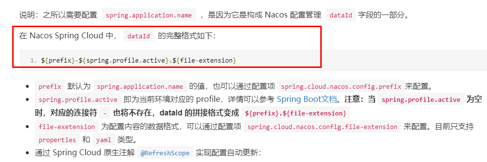

 最后公式：
**${spring.application.name}-${spring.profiles.active}.${spring.cloud.nacos.config.file-extension}**

6.2) 实操

配置新增(在浏览器界面上操作-点加号):


Nacos界面配置对应:

 

其中,设置DataId需要注意:

> 公式: ${spring.application.name}-${spring.profiles.active}.${spring.cloud.nacos.config.file-extension}
>
> 公式中,  prefix 默认为 spring.application.name 的值
>
> ​			   spring.profile.active 即为当前环境对应的 profile，可以通过配置项 spring.profile.active 来配置。
>
> ​			   file-exetension 为配置内容的数据格式，可以通过配置项 spring.cloud.nacos.config.file-extension 来配置

简单来说,  DataId 要和 3377模块的yml中的配置保持完全一致,如下: 

 

历史配置:

> Nacos会记录配置文件的历史版本默认保留30天，此外还有一键回滚功能，回滚操作将会触发配置更新;

回滚: 


7) 测试一

启动前需要在nacos客户端-配置管理-配置管理栏目下有对应的yaml配置文件

运行cloud-config-nacos-client3377的主启动类

调用接口查看配置信息:  http://localhost:3377/config/info	->	观察发现, 成功显示出config.info; 

(注: nacos的外部配置是可以直接配在nacos控制台的, 而springcloudconfig是配在gihub等地方)

8) 测试二

自带动态刷新:

> 修改下Nacos中的yaml配置文件，再次调用查看配置的接口，就会发现配置已经刷新(这里就体现出nacos的配置中心 ≈ config + bus)


#### 2、Nacos作为配置中心-分类配置

问题(多环境多项目管理)

问题1：

> 实际开发中，通常一个系统会准备
> dev开发环境
> test测试环境
> prod生产环境。
> 如何保证指定环境启动时服务能正确读取到Nacos上相应环境的配置文件呢？

问题2：

> 一个大型分布式微服务系统会有很多微服务子项目，
> 每个微服务项目又都会有相应的开发环境、测试环境、预发环境、正式环境......
> 那怎么对这些微服务配置进行管理呢？

Nacos的图形化管理界面:

配置管理:

 

命名空间:

 

Namespace+Group+Data ID三者关系？为什么这么设计？

1 是什么

> 最外层的namespace是可以用于区分部署环境的，Group和DataID逻辑上区分两个目标对象。

2 三者情况

 

默认情况：
Namespace=public，Group=DEFAULT_GROUP, 默认Cluster是DEFAULT


>Nacos默认的命名空间是public，Namespace主要用来实现隔离。
>比方说我们现在有三个环境：开发、测试、生产环境，我们就可以创建三个Namespace，不同的Namespace之间是隔离的。
>
>Group默认是DEFAULT_GROUP，Group可以把不同的微服务划分到同一个分组里面去
>
>Service就是微服务；一个Service可以包含多个Cluster（集群），Nacos默认Cluster是DEFAULT，Cluster是对指定微服务的一个虚拟划分。
>比方说为了容灾，将Service微服务分别部署在了杭州机房和广州机房，
>这时就可以给杭州机房的Service微服务起一个集群名称（HZ），
>给广州机房的Service微服务起一个集群名称（GZ），还可以尽量让同一个机房的微服务互相调用，以提升性能。
>
>最后是Instance，就是微服务的实例。
>
>Namespace+Group+Data ID 对应一个具体配置;


三种方案加载配置:

1、DataID方案:

指定spring.profile.active和配置文件的DataID来使不同环境下读取不同的配置;

默认空间+默认分组+新建dev和test两个DataID(如下): 

> 注: 下图public右边的dev和test是自定义的命名空间, 和dataid中的dev和test是两个概念, 不必纠结;


命名空间都是默认的public, group都是默认的default_group, 但dataid是不同的, 分别是dev和test, 

这两种dataid对应的代码配置yml中的spring.profile.active(如下):

 

测试:  http://localhost:3377/config/info   ->    

2、Group方案:

通过Group实现环境区分:

代码配置:

> 在config下增加一条group的配置即可。可配置为DEV_GROUP或TEST_GROUP

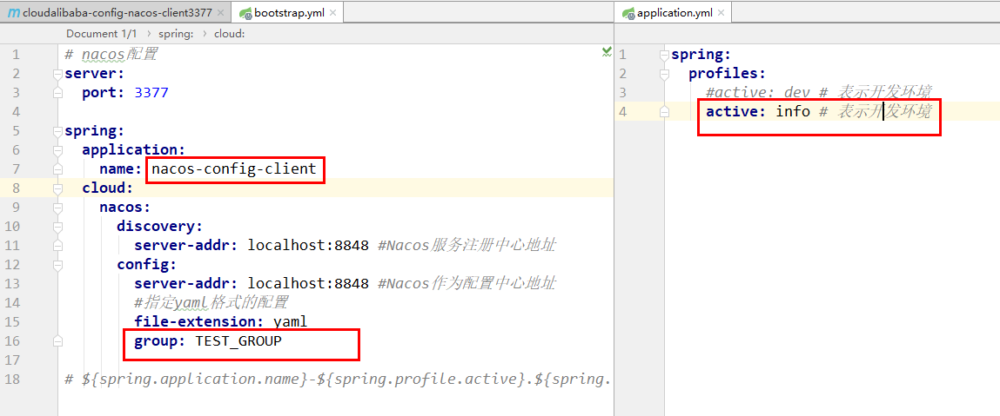

nacos控制台:


上图中, 命名空间使用的默认的public, dataID相同, 但group不同, 分别是自定义的dev_group和自定义的test_group; 这样也可以代表两个开发环境;

3、Namespace方案

新建dev/test的Namespace

nacos控制台: 


新建成功后, 回到服务管理-服务列表查看:

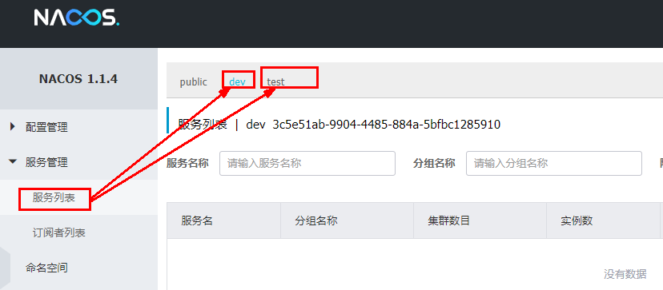 

此时, 可以向dev或者test空间添加不同组不同dataid;

代码配置: 

 

config下再增加一个配置项namespace, 和group同级, namespace的值要和nacos控制台的命名空间id保持一致;

 

> 小结: namespace、group、dataid都可以自定义, 三者都可以新建多个以区分不同环境;


### 5、Nacos集群和持久化配置（重要）

#### 1、官网+理论

1) 官网(nacos集群部署说明): https://nacos.io/zh-cn/docs/cluster-mode-quick-start.html

架构图:

 

在部署nacos集群之前,有关数据库的重要一点是 **Nacos默认自带的是嵌入式数据库derby**, 各个nacos的数据是不相通的;

也就是说默认Nacos使用嵌入式数据库实现数据的存储。所以，如果启动多个默认配置下的Nacos节点，数据存储是存在一致性问题的。
为了解决这个问题，Nacos采用了集中式存储的方式来支持集群化部署，目前只支持MySQL的存储。

2) nacos三种部署模式:

 

3) 部署前环境准备(截图自官网):

 

注: 上面环境都是必备品, linux、jdk、maven; 另外需要持久化和集群 也需要下载mysql8(nacos除了默认自带的derby之外, 目前也只支持mysql), 

​	  至于三个nacos节点, 由于服务器有限, 所以采用伪集群效果(一台服务器三个端口3333、4444、5555); 

#### 2、Nacos持久化配置解释

再次强调, Nacos默认自带的是嵌入式数据库derby, 如果不使用nacos集群也不需要对数据进行持久化, 那么使用默认的derby或者配置mysql数据库都是可以的;

但是如果需要持久化或者需要配置集群, 那么就必须得配置mysql数据库了;


下面进行window下的nacos的配置操作

1) **nacos修改数据库**(从自带的嵌入式数据库derby切换到外部的mysql数据库)**:**

在nacos\conf目录下找到application.properties这个配置文件,

新增mysql相关配置:

```
### If use MySQL as datasource:
spring.datasource.platform=mysql

### Count of DB:
db.num=1

### Connect URL of DB:
db.url.0=jdbc:mysql://localhost:3306/nacos_config?characterEncoding=utf8&connectTimeout=1000&allowPublicKeyRetrieval=true&socketTimeout=3000&autoReconnect=true&useUnicode=true&useSSL=false&serverTimezone=UTC
db.user.0=root
db.password.0=123456
```

> 注: 	1、可能上面的配置项是出厂就默认存在的,只是注释了, 那只需要打开注释并修改值;
>
> ​		  2、上述配置是基于mysql8.0的, 学习视频和资料中是基于mysql5.0的, 所以配置有所不同(主要是db.url.0中的参数不同, 其中,上面这个db.url.0需要注意的是: allowPublicKeyRetrieval=true  和 serverTimezone=UTC)
>
> ​		  3、我自己使用 nacos2.0.3 + mysql 8.0, 学习视频及笔记中使用nacos1.1.4 + mysql 5.6.x, 因此在学习过程中遇到很多坑

2) **执行nacos自带sql脚本:**

nacos\conf目录下找到sql脚本nacos-mysql.sql, 然后执行

需要注意的是, sql脚本中创建的数据库和上面application.properties这个配置文件中的指定数据库(nacos_config)要相同;

window下启动Nacos并访问nacos控制台(http://{ip}:8848/nacos)，可以看到是个全新的空记录界面，因为以前是记录进derby;

> 这一步是window下的简单测试; 下面是linux下的较复杂操作;

#### 3、Linux版Nginx+Nacos集群+MySQL生产环境配置(实操)

这一节主要来配置linux下nacos集群

预计需要，1个Nginx+3个nacos+1个mysql

首先, 保证linux服务上拥有nginx、mysql(8.0.x)并能访问或连接

1、下载linux版nacos

上面都是在window下使用nacos,下面在生产环境linux下使用nacos

下载地址: https://github.com/alibaba/nacos/releases/tag/2.0.3

linux下依旧使用2.0.3版本, 更多版本: https://github.com/alibaba/nacos/tags


下载上图中的nacos-server-2.0.3.tar.gz, 并上传到linux服务器的 /opt/下;

> 注: nacos、sentinel、seata等都可以在alibaba官网 https://github.com/alibaba/spring-cloud-alibaba 下载;

2、解压并准备三个nacos节点

新建目录 /usr/local/soft/mynacos, ->   然后将nacos-server-2.0.3.tar.gz然后解压到/usr/local/soft/mynacos下  

->  将解压出的nacos再cv出来三份,如下:

 

目前实际上是准备了四个nacos节点(三个也够), 此时这四个端口都是默认8848, 并且也都还是自带的嵌入式derby数据库;

 接下来nacos集群部署就在这个基础上进行;

> 注:	在学习视频和springcloud2020.mmap中只需要建一份nacos文件夹, 通过传参启动多个nacos服务,这种方式是传了不同端口号等参数的方式来实现一台服务器三个nacos节点的nacos伪集群效果; 但那是nacos1.1.4, 经实践发现较新版(nacos2.0.3)需要直接cv多个nacos文件夹,并分别启动的方式来达到伪集群的效果;

**3、集群配置步骤(重点)**

上面至少三个nacos文件准备好了就可以继续配置nacos集群, 下面也是配置的重点

0) 粗略流程:  ①先执行sql   ->   ②配置application.properties   ->    ③配置cluster.conf    ->     ④配置startup.sh	->	测试、配置nginx、再测试

注: **其中①②③的文件位置都在nacos/conf下**,如下图:

 

1) Linux服务器上mysql数据库配置

找到nacos自带的sql脚本:  (nacos/conf/nacos-mysql.sql)

接下来将sql语句在linux下的mysql中执行; 

具体流程就是先打开navicat, 连接到linux下的mysql, 新建查询并执行nacos-mysql.sql文件中的sql语句;

执行成功之后:

 

> naacos1.1.4有11个表, nacos2.0.3有12个表

2) 配置application.properties

文件位置在nacos/conf下; 首先将 application.properties.example复制一份application.properties, 然后对application.properties进行修改

在其中添加如下(和上面nacos持久化配置解释中一样)

```
### If use MySQL as datasource:
spring.datasource.platform=mysql

### Count of DB:
db.num=1

### Connect URL of DB:
db.url.0=jdbc:mysql://localhost:3306/nacos_config?characterEncoding=utf8&connectTimeout=1000&allowPublicKeyRetrieval=true&socketTimeout=3000&autoReconnect=true&useUnicode=true&useSSL=false&serverTimezone=UTC
db.user.0=root
db.password.0=123456
```

3) 配置cluster.conf

文件位置在nacos/conf下; 首先将 cluster.conf.example复制一份cluster.conf, 然后对cluster.conf进行修改

清空原本内容,新增如下内容:

```
172.20.82.120:3333
172.20.82.120:4444
172.20.82.120:5555
```

> 注:  172.20.82.120是服务器私有ip; 且这个IP不能写127.0.0.1，必须是Linux命令hostname -i能够识别的IP

4) 编辑Nacos的启动脚本startup.sh, 修改默认端口和启动参数

> 注: 这一步的修改主要是由于我只有一台服务器用的是伪集群, 而且我的服务器内存不足以支持三台nacos(每台nacos启动参数需要2g, 我的服务一共4g, 因此学习过程中服务器崩了几次! 


此时, 四个nacos文件夹, 分别为nacos、nacos1、nacos2、nacos3; 可以看作四台nacos服务;

那么四台服务的对应的端口如下:

​		nacos => 8848(默认)

​		nacos1 => 3333

​		nacos2 => 4444

​		nacos3 => 5555

nacos用于单独测试, nacos1、nacos2、nacos3用于测试集群

> 注:  1、需要关闭防火墙, 或者说打开以上四个端口  2、需要阿里云的配置规则中新增以上四个端口

首先使用nacos测试, 配置mysql数据源之前测试成功的话,说明下载的没问题;(浏览器能访问nacos控制台 {ip}:8848/nacos 就说明成功) 

​									配置mysql数据源之后测试成功的话,说明mysql配置没问题(这个很重要);


如果nacos配置数据源mysql之后可以启动并访问, 那么接下来可以先关闭nacos这台, 紧接着开始配置nacos1、nacos2、nacos3;

4.1) 修改启动参数:

nacos1、nacos2、nacos3需要依次进行下面的修改,  至于nacos无所谓, 但要保证nacos和另外三个不能同时启动, 否则也可能崩掉;

位置: nacos/bin下的startup.sh;

修改前及参数说明:

 


修改后:


也就是将启动参数修改到了512ms;

内存不足的情况下,这一步是很有必要的, 比如我的内存4g, 在启动两台之后再也无法启动第三台了, 如果手速较快地去启动三台, 那可能导致系统崩掉!


> 关于启动脚本startup.sh的修改的补充(了解):
>
> 在视频和资料中还有一步, 目的就是可以通过传参的方式来将一个nacos文件启动多次;但那是nacos1.1.4版本,而现在使用的是nacos2.0.3版本, 已经出厂自带可以传端口号启动了; 再但是, 2.0.3版本端口传参发现不好用, 所以复制粘贴出来新的几个文件并修改默认端口号来依次启动;
>
> 上面简单来说两个版本的区别:  nacos1.1.4 =>  一个nacos文件夹就够 + 配置传端口配置  =>  指定端口方式启动如./startup.sh -p 3333
>
> ​						  						   nacos2.0.4 =>  至少三个nacos文件夹 + 分别配置默认端口  =>  直接在对应文件夹下启动如./startup.sh

4.2) 修改默认端口

nacos1、nacos2、nacos3分别修改默认端口号为3333、4444、5555; nacos使用默认的8848即可;

位置: nacos1/conf下的application.properties;

 

另外两个nacos2、nacos3同理,分别设置为4444、5555

此时,  nacos的伪集群已经配置完成;


5) 测试一

测试之前, 先保证 

1) mysql处于开启状态, 且使用nacos(8848)这台配置mysql源之后能测试成功

2) nginx处于关闭状态(防止收到nginx干扰) 

3) 需要关闭防火墙, 或者说打开上面四个端口  

4) 需要阿里云的配置规则中新增上面四个端口

5) 保证nacos服务也就是8848那台处于关闭状态, 因为它启动的话直接占了2g内存, 可能导致后续三个不能全部启动

然后依次启动:

进入 nacos1/bin下,输入./startup.sh, 

再进入 nacos2/bin下,输入./startup.sh,  

再进入 nacos3/bin下,输入./startup.sh

之后几秒后输入lsof  -i:3333, 查看3333是或否被占用, 被占用则说明已经启动; 另外两个端口也是同理;

然后依次访问:

依次访问每个nacos服务:  {ip}:{port}/nacos

http://121.41.87.233:3333/nacos      http://121.41.87.233:4444/nacos      http://121.41.87.233:5555/nacos

如果都进入到nacos控制台, 则说明nacos集群已经配置成功!!!

6) 启动并配置nginx

到上面第5)步为止, 关于nacos的集群实际上已经配置结束;

但是集群需要用nginx来自动负载均衡的; 所以在nacos集群的基础上再添加上nginx;

找到nginx.conf配置文件进行修改(在/usr/local/nginx/conf下)

 


```
	upstream cluster{
        server 127.0.0.1:3333;
        server 127.0.0.1:4444;
        server 127.0.0.1:5555;
    }
    server {
        listen       1111;
        server_name  localhost;
        #charset koi8-r;
        #access_log  logs/host.access.log  main;
        location / {
            #root   html;
            #index  index.html index.htm;
            proxy_pass http://cluster;
        }
.......省略
```

配置之后, 按照指定配置文件方式启动nginx:  

```
cd  /usr/local/nginx/sbin

./nginx -c /usr/local/nginx/conf/nginx.conf
```

启动nginx之后, 直接访问  http://121.41.87.233/nacos  , 已经实现nginx对nacos集群的负载均衡效果

7) 测试二

接着上面, 在启动三台nacos和nginx后, 

先通过nginx的80端口登录nacos的控制台, 此时进入的是nacos集群的某一个端口;

接下来新增一个nacos的配置文件:

 

然后依次通过3333、4444、5555三个端口再登录nacos控制台;

可以发现 都有了上面配置;

并且数据库中可以发现多了一条配置记录:


至此, nacos集群及其持久化已经全部配置完成!!!

8) nacos集群配置时踩过的坑(了解)

学习时遇到的问题和解决方案存到了有道云的临时笔记夹, 现在直接从有道云笔记中拷过来:

>nacos集群部署注意点:
>
>1、除了nginx、jdk、mysql、还需要有maven(一定要有maven)
>
>2、mysql数据库的配置: 
>
>db.url.0=jdbc:mysql://localhost:3306/nacos_config?characterEncoding=utf8&connectTimeout=1000&allowPublicKeyRetrieval=true&socketTimeout=3000&autoReconnect=true&useUnicode=true&useSSL=false&serverTimezone=UTC
>
>上面这个需要注意的是: allowPublicKeyRetrieval=true  和 serverTimezone=UTC
>
>3、springcloud2020.mmap中是一份nacos文件夹, 通过传参启动多个nacos服务;
>
>但是较新版需要多个nacos文件夹(可能)
>
>具体看csdn博客(抱怀疑态度观看):
>
>https://blog.csdn.net/sinat_27956747/article/details/119020113
>
>
>
>问题
>
>4、即使如此, 1)目前最多启动了两个集群, 就启动不起来第三个了
>
>​						2)而且nginx运行之后,无法负载均衡无法访问(可能配置不对) 因此,尚未实现,暂时继续往下学习, 未来有待继续研究;
>
>
>
>新发现
>
>5、nacos单个启动都要2g内存, 这可能就是我启动两个服务之后,再也启动不来第三个的原因;
>
>解决办法大概就是得更改nacos得启动参数了:
>
>参考csdn博客: https://blog.csdn.net/weixin_45705552/article/details/119820393
>
>
>
>成功
>
>6、 上面第五点从尚硅谷视频弹幕发现得, 实在是宝藏, 改了启动参数后, 三台集群都访问成功了;
>
>然后nginx配置完成之后,  需要用 公网ip/nacos  访问;之前是直接用 公网ip 访问,没写 /nacos;
>
>至此问题解决, 实现了nacos集群效果(伪集群,一台服务三个端口)
>
>nginx	->	nacos(3333/4444/5555)	  ->	 mysql


## 十五、SpringCloud Alibaba Sentinel实现熔断与限流

### 1、Sentinel简介

官网:  https://github.com/alibaba/Sentinel

是什么

> 一句话解释，之前我们讲解过的Hystrix

去哪下

> https://github.com/alibaba/Sentinel/releases

能干嘛

> 服务雪崩、服务熔断、服务限流

### 2、安装Sentinel控制台

sentinel组件由2部分构成:   前台8080 和 后台

 

安装步骤:

1) 下载: https://github.com/alibaba/Sentinel/releases ,  选择其中的sentinel-dashboard-1.7.0.jar下载到本地

2) 运行命令:  打开cmd窗口, 直接执行 java -jar sentinel-dashboard-1.7.0.jar;

> 注: 运行前保证有jdk环境且8080端口没有被占用

访问sentinel管理界面:

http://localhost:8080   (登录账号密码均为sentinel)

 

### 3、初始化演示工程

1、 在本地启动Nacos8848成功, 并访问http://localhost:8848/nacos

2、 新建module

​	1) cloudalibaba-sentinel-service8401

​	2) pom:

     ```
<?xml version="1.0" encoding="UTF-8"?>
<project xmlns="http://maven.apache.org/POM/4.0.0"
         xmlns:xsi="http://www.w3.org/2001/XMLSchema-instance"
         xsi:schemaLocation="http://maven.apache.org/POM/4.0.0 http://maven.apache.org/xsd/maven-4.0.0.xsd">
    <parent>
        <groupId>com.example</groupId>
        <artifactId>MyCloud</artifactId>
        <version>0.0.1-SNAPSHOT</version>
    </parent>
    <modelVersion>4.0.0</modelVersion>

    <artifactId>cloudalibaba-sentinel-service8401</artifactId>


    <dependencies>
        <!--SpringCloud ailibaba nacos -->
        <dependency>
            <groupId>com.alibaba.cloud</groupId>
            <artifactId>spring-cloud-starter-alibaba-nacos-discovery</artifactId>
        </dependency>
    
        <!--SpringCloud ailibaba sentinel-datasource-nacos 后续做持久化用到-->
        <dependency>
            <groupId>com.alibaba.csp</groupId>
            <artifactId>sentinel-datasource-nacos</artifactId>
        </dependency>
        <!--SpringCloud ailibaba sentinel -->
        <dependency>
            <groupId>com.alibaba.cloud</groupId>
            <artifactId>spring-cloud-starter-alibaba-sentinel</artifactId>
        </dependency>
        <!--openfeign-->
        <dependency>
            <groupId>org.springframework.cloud</groupId>
            <artifactId>spring-cloud-starter-openfeign</artifactId>
        </dependency>
        <dependency><!-- 引入自己定义的api通用包，可以使用Payment支付Entity -->
            <groupId>com.example</groupId>
            <artifactId>cloud-api-commons</artifactId>
            <version>0.0.1-SNAPSHOT</version>
        </dependency>
        <dependency>
            <groupId>org.springframework.boot</groupId>
            <artifactId>spring-boot-starter-test</artifactId>
            <scope>test</scope>
        </dependency>
        <dependency>
            <groupId>cn.hutool</groupId>
            <artifactId>hutool-all</artifactId>
            <version>4.6.3</version>
        </dependency>
        <dependency>
            <groupId>org.projectlombok</groupId>
            <artifactId>lombok</artifactId>
            <optional>true</optional>
        </dependency>
    
    </dependencies>

</project>
     ```

​	3) YML:

```
server:
  port: 8401

spring:
  application:
    name: cloudalibaba-sentinel-service
  cloud:
    nacos:
      discovery:
        #Nacos服务注册中心地址
        server-addr: localhost:8848
    sentinel:
      transport:
        #配置Sentinel dashboard地址
        dashboard: localhost:8080
        #默认8719端口，假如被占用会自动从8719开始依次+1扫描,直至找到未被占用的端口
        port: 8719

management:
  endpoints:
    web:
      exposure:
        include: '*'
```

​	4) 主启动

```
@EnableDiscoveryClient
@SpringBootApplication
public class MainApp8401
{
    public static void main(String[] args) {
        SpringApplication.run(MainApp8401.class, args);
    }
}
```

​	5) 业务类

controller层新增如下

```
@RestController
public class FlowLimitController
{

    @GetMapping("/testA")
    public String testA()
    {
        return "------testA";
    }

    @GetMapping("/testB")
    public String testB()
    {
        return "------testB";
    }
}
```

3、启动Sentinel8080, (java -jar sentinel-dashboard-1.7.0.jar) 

4、启动微服务8401, 然后查看sentienl控制台,   ->   发现 空空如也，啥都没有

 这是因为 Sentinel采用的懒加载,  执行一次访问即可   - >  http://localhost:8401/testA  ,   http://localhost:8401/testB

效果: 

 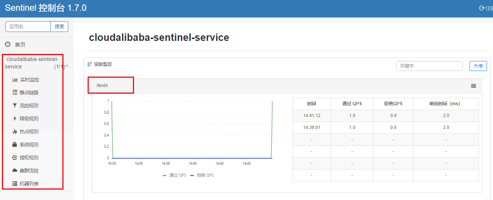

结论: sentinel8080正在监控微服务8401


------

接下来对上图中的几个规则重点介绍:

流控规则	->	降级规则	->	热点规则	->	系统规则(前三个规则重点, 最后一个了解)

### 4、流控规则

1、新增流控规则页面:

 

2、解释说明:

 

3、流控模式

流控模式包括直接(默认)、关联、链路

1) 直接

直接+快速失败 (系统默认)

配置及说明:

表示1秒钟内查询1次就是OK，若超过次数1，就直接-快速失败，报默认错误

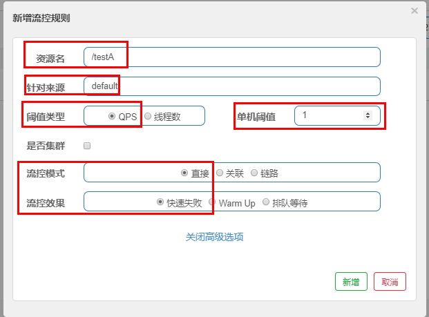 

测试:

快速点击访问 http://localhost:8401/testA	->	结果: 浏览器显示 Blocked by Sentinel (flow limiting)

当快速访问的时候, /testA接口在一秒钟内收到了多个请求, 所以只有第一个请求被处理, 后续都返回默认错误信息(Blocked by Sentinel (flow limiting))

当然,如果对默认报错信息不满意, 也可以自定义(在后续)

2) 关联

是什么:

> 当关联的资源达到阈值时，就限流自己
>
> 当与A关联的资源B达到阀值后，就限流A自己
>
> B惹事，A挂了

配置及说明:

当关联资源/testB的qps阀值超过1时，就限流/testA的Rest访问地址，当关联资源到阈值后限制配置好的资源名

 

> 注: 需要注意的是 留空吗
>
> 关联时阈值是为testB接口设置的

测试:

postman模拟并发密集访问testB  (使用jmeter也可以)


访问testB成功:

 

postman里新建多线程集合组:

 

将访问地址添加进新新线程组:

 


Run:

 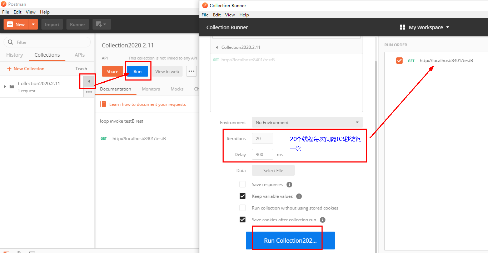


此时, 大量请求在访问testB接口, 且已经超过阈值;

点击访问http://localhost:8401/testA	->	结果: Blocked by Sentinel (flow limiting)

 结果:  大批量线程高并发访问B(超出设置的阈值)，导致A失效了

3) 链路

多个请求调用了同一个微服务

学习视频和资料中对于链路限流直接略了...

下面截取官网一段描述:

`NodeSelectorSlot` 中记录了资源之间的调用链路，这些资源通过调用关系，相互之间构成一棵调用树。这棵树的根节点是一个名字为 `machine-root` 的虚拟节点，调用链的入口都是这个虚节点的子节点。

一棵典型的调用树如下图所示：

```
     	          machine-root
                    /       \
                   /         \
             Entrance1     Entrance2
                /             \
               /               \
      DefaultNode(nodeA)   DefaultNode(nodeA)
```

上图中来自入口 `Entrance1` 和 `Entrance2` 的请求都调用到了资源 `NodeA`，Sentinel 允许只根据某个入口的统计信息对资源限流。比如我们可以设置 `strategy` 为 `RuleConstant.STRATEGY_CHAIN`，同时设置 `refResource` 为 `Entrance1` 来表示只有从入口 `Entrance1` 的调用才会记录到 `NodeA` 的限流统计当中，而不关心经 `Entrance2` 到来的调用。

4、流控效果

1) 直接+快速失败(默认的流控处理)

上面演示的就是快速失败

直接失败，抛出异常:   Blocked by Sentinel (flow limiting)

源码:	com.alibaba.csp.sentinel.slots.block.flow.controller.DefaultController

2) 直接+预热 (Warm Up)

说明:	阈值除以coldFactor(默认值为3),经过预热时长后才会达到阈值

官网:	https://github.com/alibaba/sentinel/wiki/流量控制

> Warm Up（`RuleConstant.CONTROL_BEHAVIOR_WARM_UP`）方式，即预热/冷启动方式。当系统长期处于低水位的情况下，当流量突然增加时，直接把系统拉升到高水位可能瞬间把系统压垮。通过"冷启动"，让通过的流量缓慢增加，在一定时间内逐渐增加到阈值上限，给冷系统一个预热的时间，避免冷系统被压垮。

案例，阀值为10, 预热时长设置5秒。
系统初始化的阀值为10 / 3 约等于3,即阀值刚开始为3；然后过了5秒后阀值才慢慢升高恢复到10;

 


测试:  多次点击http://localhost:8401/testB	->	发现刚开始不行，后续慢慢OK, 这也说明了, 刚开始阈值并不是10, 是慢慢加上去的. 即预热

应用场景

如：秒杀系统在开启的瞬间，会有很多流量上来，很有可能把系统打死，预热方式就是把为了保护系统，可慢慢的把流量放进来，慢慢的把阀值增长到设置的阀值。

3) 排队等待

理解: 排队等待其实就是"削峰填谷", 它可以把某一瞬时的大量请求匀速地进行处理!

匀速排队:	让请求以均匀的速度通过，阀值类型必须设成QPS，否则无效。
设置含义：/testA每秒1次请求，超过的话就排队等待，等待的超时时间为20000毫秒。

 


测试:  使用jmeter或postman在一秒内对/testA接口访问十次或以上; 

问题

> 界面上设置的是1秒只能访问一次, 但是测试中一秒访问了十次多, 那么多的那些请求会直接请求失败吗?

结果

> 其它请求并不会直接失败, 而是等待下一秒, 以每秒一个的速度处理下去; 至于超时时间什么作用, 还不清楚, 没测试出来, 有待后续继续研究;

### 5、降级规则

> 注: 这里的降级规则指 服务降级+服务熔断

官网:  https://github.com/alibaba/Sentinel/wiki/熔断降级

新增降级规则页面:

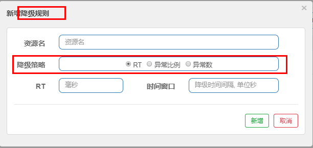 

解释:

RT（平均响应时间，秒级）
      平均响应时间   超出阈值  且   在时间窗口内通过的请求>=5，两个条件同时满足后触发降级
      窗口期过后关闭断路器
      RT最大4900（更大的需要通过-Dcsp.sentinel.statistic.max.rt=XXXX才能生效）

异常比列（秒级）
    QPS >= 5 且异常比例（秒级统计）超过阈值时，触发降级；时间窗口结束后，关闭降级

异常数（分钟级）
     异常数（分钟统计）超过阈值时，触发降级；时间窗口结束后，关闭降级


进一步说明

>Sentinel 熔断降级会在调用链路中某个资源出现不稳定状态时（例如调用超时或异常比例升高），对这个资源的调用进行限制，
>让请求快速失败，避免影响到其它的资源而导致级联错误。
>
>当资源被降级后，在接下来的降级时间窗口之内，对该资源的调用都自动熔断（默认行为是抛出 DegradeException）。


 需要注意的是:   Sentinel的断路器是没有半开状态的 (而前面学的hystrix的熔断是有半开状态的)

降级策略实战:

1) RT:

 

测试:

代码:

```
@GetMapping("/testD")
public String testD()
{
    //暂停几秒钟线程
    try { TimeUnit.SECONDS.sleep(1); } catch (InterruptedException e) { e.printStackTrace(); }
    log.info("testD 测试RT");
    return "------testD";
}
```

配置:

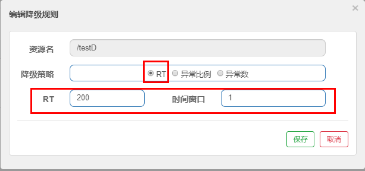 

jmeter压测:

 

结论:

按照上述配置,

永远一秒钟打进来10个线程（大于5个了）调用testD，我们希望平均每个请求在200毫秒处理完本次任务，
如果平均时间超过200毫秒还没处理完，在未来1秒钟的时间窗口内，断路器打开(保险丝跳闸)微服务不可用，保险丝跳闸断电了

后续我停止jmeter，没有这么大的访问量了，断路器关闭(保险丝恢复)，微服务恢复OK

2) 异常比例:

 

测试:

代码:

```
@GetMapping("/testD")
public String testD()
{
    log.info("testD 测试异常比例");
    int age = 10/0;
    return "------testD";
}
```

配置

 

jmeter压测:

 

结论:

按照上述配置，
单独访问一次，必然来一次报错一次(int age  = 10/0)，调一次错一次；

开启jmeter后，直接高并发发送请求，多次调用达到我们的配置条件了。
断路器开启(保险丝跳闸)，微服务不可用了，不再报错error而是服务降级了。

3) 异常数

> 异常数是按照分钟统计的

 

测试:

代码:

```
@GetMapping("/testE")
public String testE()
{
    log.info("testE 测试异常数");
    int age = 10/0;
    return "------testE 测试异常数";
}
```

配置:

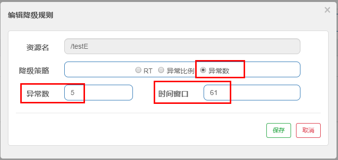 

jmeter压测:

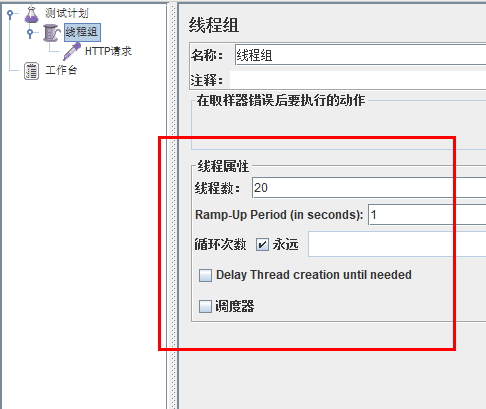 

结论:

按照上述配置, 对 /testE接口61秒内的超过五次失败请求, 就会进入熔断状态;

实际上是 一秒内发了20个请求,全是异常的, 61秒后, 微服务不可用了;


小结:

> 简单地说, RT、异常比例、异常数分别是根据一段时间内的平均响应时间、请求失败比例、请求失败数量来决定是否进入熔断状态;


### 6、热点规则

何为热点
热点即经常访问的数据，很多时候我们希望统计或者限制某个热点数据中访问频次最高的TopN数据，并对其访问进行限流或者其它操作

新增热点规则页面:

 


官网:   https://github.com/alibaba/Sentinel/wiki/热点参数限流

0) 关键注解**@SentinelResource**:

从Hystrix的核心注解@HystrixCommand 到Sentinel的核心注解@SentinelResource,  两个注解大同小异

下面会详解

1) 更改错误提示

> 兜底方法分为系统默认和客户自定义两种
>
> 之前的例子，限流出问题后，都是用sentinel系统默认的提示：Blocked by Sentinel (flow limiting)
>
>
> 那么我们能不能自定?类似hystrix，某个方法出问题了，就找对应的兜底降级方法？当然可以!


代码:

```
@GetMapping("/testHotKey")
@SentinelResource(value = "testHotKey",blockHandler = "dealHandler_testHotKey")
public String testHotKey(@RequestParam(value = "p1",required = false) String p1, 
                         @RequestParam(value = "p2",required = false) String p2){
    return "------testHotKey";
}
public String dealHandler_testHotKey(String p1,String p2,BlockException exception)
{
    return "-----dealHandler_testHotKey";
}
```

 sentinel系统默认的提示：Blocked by Sentinel (flow limiting)

但是按照上述代码, 如果正常会提示 "------testHotKey", 如果走降级方法 会返回 "-----dealHandler_testHotKey" ;这就轻松自定义了错误提示;

2) 代码+配置(对应):


说明:

>限流模式只支持QPS模式，固定写死了。（这才叫热点）
>@SentinelResource注解的方法参数索引，0代表第一个参数，1代表第二个参数，以此类推
>单机阀值以及统计窗口时长表示在此窗口时间超过阀值就限流。
>上面的抓图就是第一个参数有值的话，1秒的QPS为1，超过就限流，限流后调用dealHandler_testHotKey支持方法。

方法testHotKey里面第一个参数只要QPS超过每秒1次，马上降级处理

3) 测试

快速多次访问:

参数只有p1时:  http://localhost:8401/testHotKey?p1=abc     ->    触发降级

参数有p1、p2时:   http://localhost:8401/testHotKey?p1=abc&p2=33	->	触发降级

参数只有p2时:  http://localhost:8401/testHotKey?p2=abc	->	不会触发降级

结论:  页面配置中的索引0绑定的是代码中的第一个参数, 而不是绑定访问地址中的第一个参数!

4) 参数例外项

上述案例演示了第一个参数p1，当QPS超过1秒1次点击后马上被限流

问题

> 那么能不能在限制p1参数的前提下, 放宽某些特殊值呢? 比如p1=5时, 限流规则放宽一些, 允许一秒内通过更多请求呢?

特例情况

> 普通:	超过1秒钟一个后，达到阈值1后马上被限流
>
> 我们期望p1参数当它是某个特殊值时，它的限流值和平时不一样
>
> 特例:	假如当p1的值等于5时，它的阈值可以达到200

配置

 

> 注:  参数例外项填好之后, 需要在保存之前, 先点击添加按钮, 否则没配置上!

上图中, 参数例外项的配置意思就是当p1的值为5时, 允许每秒通过200个请求;

测试

快速多次访问:

http://localhost:8401/testHotKey?p1=5	->	不会触发降级(因为没有达到设置的200阈值)

http://localhost:8401/testHotKey?p1=3	->	触发降级

结论:	当p1等于5的时候，阈值变为200, 当p1不等于5的时候，阈值就是平常的1

**注意点:  热点参数的注意点，参数必须是基本类型或者String**

5) 预告

上面触发降级的情况都是违反了页面的配置, 那如果在代码添加异常呢?

@SentinelResource
处理的是Sentinel控制台配置的违规情况，有blockHandler方法配置的兜底处理；


RuntimeException
int age = 10/0,这个是java运行时报出的运行时异常RunTimeException，@SentinelResource不管

总结
 @SentinelResource主管配置出错，运行出错该走异常走异常

### 7、系统规则

官网: https://github.com/alibaba/Sentinel/wiki/系统规则

各项配置参数说明

 

### 8、@SentinelResource

**1、 按资源名称限流+后续处理**

启动Nacos成功,  (能够访问http://localhost:8848/nacos/#/login)

启动Sentinel成功,  (能够访问http://localhost:8080)

 建一个新module

1) cloudalibaba-sentinel-service8401

2) pom

```
    <dependencies>
        <!--SpringCloud ailibaba nacos -->
        <dependency>
            <groupId>com.alibaba.cloud</groupId>
            <artifactId>spring-cloud-starter-alibaba-nacos-discovery</artifactId>
        </dependency>
        <dependency><!-- 引入自己定义的api通用包，可以使用Payment支付Entity -->
            <groupId>com.atguigu.springcloud</groupId>
            <artifactId>cloud-api-commons</artifactId>
            <version>${project.version}</version>
        </dependency>
        <!--SpringCloud ailibaba sentinel-datasource-nacos 后续做持久化用到-->
        <dependency>
            <groupId>com.alibaba.csp</groupId>
            <artifactId>sentinel-datasource-nacos</artifactId>
        </dependency>
        <!--SpringCloud ailibaba sentinel -->
        <dependency>
            <groupId>com.alibaba.cloud</groupId>
            <artifactId>spring-cloud-starter-alibaba-sentinel</artifactId>
        </dependency>
        <!--openfeign-->
        <dependency>
            <groupId>org.springframework.cloud</groupId>
            <artifactId>spring-cloud-starter-openfeign</artifactId>
        </dependency>
        <!-- SpringBoot整合Web组件+actuator -->
        <dependency>
            <groupId>org.springframework.boot</groupId>
            <artifactId>spring-boot-starter-web</artifactId>
        </dependency>
        <dependency>
            <groupId>org.springframework.boot</groupId>
            <artifactId>spring-boot-starter-actuator</artifactId>
        </dependency>
        <!--日常通用jar包配置-->
        <dependency>
            <groupId>org.springframework.boot</groupId>
            <artifactId>spring-boot-devtools</artifactId>
            <scope>runtime</scope>
            <optional>true</optional>
        </dependency>
        <dependency>
            <groupId>cn.hutool</groupId>
            <artifactId>hutool-all</artifactId>
            <version>4.6.3</version>
        </dependency>
        <dependency>
            <groupId>org.projectlombok</groupId>
            <artifactId>lombok</artifactId>
            <optional>true</optional>
        </dependency>
        <dependency>
            <groupId>org.springframework.boot</groupId>
            <artifactId>spring-boot-starter-test</artifactId>
            <scope>test</scope>
        </dependency>

    </dependencies>
```

3) yml

```
server:
  port: 8401

spring:
  application:
    name: cloudalibaba-sentinel-service
  cloud:
    nacos:
      discovery:
        server-addr: localhost:8848 #Nacos服务注册中心地址
    sentinel:
      transport:
        dashboard: localhost:8080 #配置Sentinel dashboard地址
        port: 8719

management:
  endpoints:
    web:
      exposure:
        include: '*'
```

4) 业务类RateLimitController

```
@RestController
public class RateLimitController
{
    @GetMapping("/byResource")
    @SentinelResource(value = "byResource",blockHandler = "handleException")
    public CommonResult byResource()
    {
        return new CommonResult(200,"按资源名称限流测试OK",new Payment(2020L,"serial001"));
    }
    public CommonResult handleException(BlockException exception)
    {
        return new CommonResult(444,exception.getClass().getCanonicalName()+"\t 服务不可用");
    }
}
```

5) 主启动

```
@EnableDiscoveryClient
@SpringBootApplication
public class MainApp8401
{
    public static void main(String[] args) {
        SpringApplication.run(MainApp8401.class, args);
    }
}
```

------

配置流控规则

配置步骤


图形配置和代码关系


上述配置表示 如果1秒钟内查询次数大于1，就跑到我们自定义的处流，限流

测试:

1秒钟点击1下，OK

超过上述，疯狂点击，返回了自己定义的限流处理信息，限流发生:


额外问题

> 此时关闭问服务8401看看
>
> Sentinel控制台，流控规则消失了？？？？？
>
> 说明没有持久化存储, 这个在后面说明;


**2、按照Url地址限流+后续处理**

通过访问的URL来限流，会返回Sentinel自带默认的限流处理信息

业务类RateLimitController

```
@RestController
public class RateLimitController
{
    @GetMapping("/byResource")
    @SentinelResource(value = "byResource",blockHandler = "handleException")
    public CommonResult byResource()
    {
        return new CommonResult(200,"按资源名称限流测试OK",new Payment(2020L,"serial001"));
    }
    public CommonResult handleException(BlockException exception)
    {
        return new CommonResult(444,exception.getClass().getCanonicalName()+"\t 服务不可用");
    }

    @GetMapping("/rateLimit/byUrl")
    @SentinelResource(value = "byUrl")
    public CommonResult byUrl()
    {
        return new CommonResult(200,"按url限流测试OK",new Payment(2020L,"serial002"));
    }
}
```

先访问一次

http://localhost:8401/rateLimit/byUrl

Sentinel控制台配置

 

测试

疯狂点击http://localhost:8401/rateLimit/byUrl

结果

会返回Sentinel自带的限流处理结果

 

**3、上面兜底方案面临的问题**

>1   系统默认的，没有体现我们自己的业务要求。
>
>2  依照现有条件，我们自定义的处理方法又和业务代码耦合在一块，不直观。
>
>3  每个业务方法都添加一个兜底的，那代码膨胀加剧。
>
>4  全局统一的处理方法没有体现。

**4、客户自定义限流处理逻辑**

创建CustomerBlockHandler类用于自定义限流处理逻辑:

```
public class CustomerBlockHandler
{
    public static CommonResult handleException(BlockException exception){
        return new CommonResult(2020,"自定义的限流处理信息......CustomerBlockHandler");
    }
}
```

​       

RateLimitController中使用自定义通用的限流处理方法(最下面方法):

```
@RestController
public class RateLimitController
{
    @GetMapping("/byResource")
    @SentinelResource(value = "byResource",blockHandler = "handleException")
    public CommonResult byResource()
    {
        return new CommonResult(200,"按资源名称限流测试OK",new Payment(2020L,"serial001"));
    }
    public CommonResult handleException(BlockException exception)
    {
        return new CommonResult(444,exception.getClass().getCanonicalName()+"\t 服务不可用");
    }

    @GetMapping("/rateLimit/byUrl")
    @SentinelResource(value = "byUrl")
    public CommonResult byUrl()
    {
        return new CommonResult(200,"按url限流测试OK",new Payment(2020L,"serial002"));
    }

    /**
     * 使用自定义通用的限流处理逻辑，
     blockHandlerClass = CustomerBlockHandler.class
     blockHandler = handleException2
     上述配置：找CustomerBlockHandler类里的handleException2方法进行兜底处理
     */
    /**
     * 使用自定义通用的限流处理逻辑
     */
    @GetMapping("/rateLimit/customerBlockHandler")
    @SentinelResource(value = "customerBlockHandler",
            blockHandlerClass = CustomerBlockHandler.class, blockHandler = "handleException2")
    public CommonResult customerBlockHandler()
    {
        return new CommonResult(200,"按客户自定义限流处理逻辑");
    }

}
```

启动微服务后先调用一次

http://localhost:8401/rateLimit/customerBlockHandler

Sentinel控制台配置:

 

测试后我们自定义的出来了

进一步说明

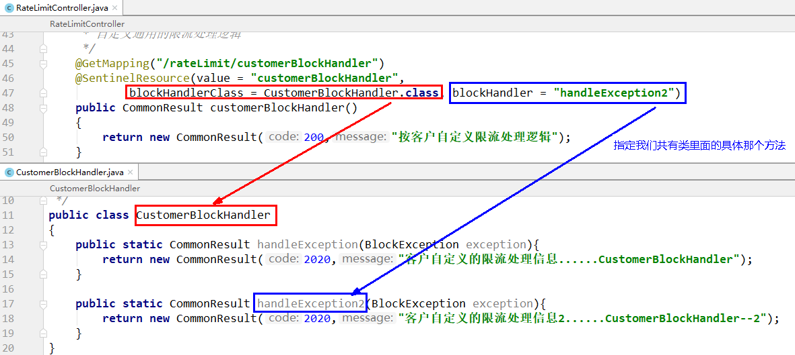


**5、更多注解属性说明**(了解)

 

> Sentinel主要有三个核心Api:
>
> SphU定义资源
>
> Tracer定义统计
>
> ContextUtil定义了上下文


### 9、服务熔断功能

sentinel整合ribbon+openFeign+fallback

1、Ribbon系列

0) 首先启动nacos和sentinel

1.1、提供者9003/9004

1) 新建cloudalibaba-provider-payment9003/9004两个一样的做法

2) POM

(nacos的依赖中内置了ribbon)

```
    <dependencies>
        <!--SpringCloud ailibaba nacos -->
        <dependency>
            <groupId>com.alibaba.cloud</groupId>
            <artifactId>spring-cloud-starter-alibaba-nacos-discovery</artifactId>
        </dependency>
        <dependency><!-- 引入自己定义的api通用包，可以使用Payment支付Entity -->
            <groupId>com.atguigu.springcloud</groupId>
            <artifactId>cloud-api-commons</artifactId>
            <version>${project.version}</version>
        </dependency>
        <!-- SpringBoot整合Web组件 -->
        <dependency>
            <groupId>org.springframework.boot</groupId>
            <artifactId>spring-boot-starter-web</artifactId>
        </dependency>
        <dependency>
            <groupId>org.springframework.boot</groupId>
            <artifactId>spring-boot-starter-actuator</artifactId>
        </dependency>
        <dependency>
            <groupId>org.projectlombok</groupId>
            <artifactId>lombok</artifactId>
            <optional>true</optional>
        </dependency>
        <dependency>
            <groupId>org.springframework.boot</groupId>
            <artifactId>spring-boot-starter-test</artifactId>
            <scope>test</scope>
        </dependency>
    </dependencies>
```

3) yml

(记得修改不同的端口号)

```
server:
  port: 9003

spring:
  application:
    name: nacos-payment-provider
  cloud:
    nacos:
      discovery:
        server-addr: localhost:8848 #配置Nacos地址

management:
  endpoints:
    web:
      exposure:
        include: '*'
```

4) 主启动

```
@SpringBootApplication
@EnableDiscoveryClient
public class PaymentMain9003
{
    public static void main(String[] args) {
            SpringApplication.run(PaymentMain9003.class, args);
    }
}
```

5) 业务类

````
@RestController
public class PaymentController
{
    @Value("${server.port}")
    private String serverPort;

    public static HashMap<Long,Payment> hashMap = new HashMap<>();
    static
    {
        hashMap.put(1L,new Payment(1L,"28a8c1e3bc2742d8848569891fb42181"));
        hashMap.put(2L,new Payment(2L,"bba8c1e3bc2742d8848569891ac32182"));
        hashMap.put(3L,new Payment(3L,"6ua8c1e3bc2742d8848569891xt92183"));
    }

    @GetMapping(value = "/paymentSQL/{id}")
    public CommonResult<Payment> paymentSQL(@PathVariable("id") Long id)
    {
        Payment payment = hashMap.get(id);
        CommonResult<Payment> result = new CommonResult(200,"from mysql,serverPort:  "+serverPort,payment);
        return result;
    }

}
````

6) 测试地址

http://localhost:9003/paymentSQL/1

1.2、消费者84

1) 新建cloudalibaba-consumer-nacos-order84

2) pom

```
    <dependencies>
        <!--SpringCloud ailibaba nacos -->
        <dependency>
            <groupId>com.alibaba.cloud</groupId>
            <artifactId>spring-cloud-starter-alibaba-nacos-discovery</artifactId>
        </dependency>
        <!--SpringCloud ailibaba sentinel -->
        <dependency>
            <groupId>com.alibaba.cloud</groupId>
            <artifactId>spring-cloud-starter-alibaba-sentinel</artifactId>
        </dependency>
        <!-- 引入自己定义的api通用包，可以使用Payment支付Entity -->
        <dependency>
            <groupId>com.atguigu.springcloud</groupId>
            <artifactId>cloud-api-commons</artifactId>
            <version>${project.version}</version>
        </dependency>
        <!-- SpringBoot整合Web组件 -->
        <dependency>
            <groupId>org.springframework.boot</groupId>
            <artifactId>spring-boot-starter-web</artifactId>
        </dependency>
        <dependency>
            <groupId>org.springframework.boot</groupId>
            <artifactId>spring-boot-starter-actuator</artifactId>
        </dependency>
        <!--日常通用jar包配置-->
        <dependency>
            <groupId>org.springframework.boot</groupId>
            <artifactId>spring-boot-devtools</artifactId>
            <scope>runtime</scope>
            <optional>true</optional>
        </dependency>
        <dependency>
            <groupId>org.projectlombok</groupId>
            <artifactId>lombok</artifactId>
            <optional>true</optional>
        </dependency>
        <dependency>
            <groupId>org.springframework.boot</groupId>
            <artifactId>spring-boot-starter-test</artifactId>
            <scope>test</scope>
        </dependency>
    </dependencies>
```

2) yml

```
server:
  port: 84


spring:
  application:
    name: nacos-order-consumer
  cloud:
    nacos:
      discovery:
        server-addr: localhost:8848
    sentinel:
      transport:
        #配置Sentinel dashboard地址
        dashboard: localhost:8080
        #默认8719端口，假如被占用会自动从8719开始依次+1扫描,直至找到未被占用的端口
        port: 8719


#消费者将要去访问的微服务名称(注册成功进nacos的微服务提供者)
service-url:
  nacos-user-service: http://nacos-payment-provider
```

3) 主启动

```
@EnableDiscoveryClient
@SpringBootApplication
public class OrderNacosMain84
{
    public static void main(String[] args) {
            SpringApplication.run(OrderNacosMain84.class, args);
    }
}
```

4) 业务类

ApplicationContextConfig:

```
@Configuration
public class ApplicationContextConfig
{
    @Bean
    @LoadBalanced
    public RestTemplate getRestTemplate()
    {
        return new RestTemplate();
    }
}
```

**CircleBreakerController (重点展开):**

目的: 证明 fallback管运行异常, blockHandler管配置违规

测试地址:  http://localhost:84/consumer/fallback/1

**1) 没有任何配置:**

```
@RestController
@Slf4j
public class CircleBreakerController
{
    public static final String SERVICE_URL = "http://nacos-payment-provider";

    @Resource
    private RestTemplate restTemplate;

    @RequestMapping("/consumer/fallback/{id}")
    @SentinelResource(value = "fallback") 
    public CommonResult<Payment> fallback(@PathVariable Long id)
    {
        CommonResult<Payment> result = restTemplate.getForObject(SERVICE_URL + "/paymentSQL/"+id,CommonResult.class,id);

        if (id == 4) {
            throw new IllegalArgumentException ("IllegalArgumentException,非法参数异常....");
        }else if (result.getData() == null) {
            throw new NullPointerException ("NullPointerException,该ID没有对应记录,空指针异常");
        }

        return result;
    }
}
```

结果: 给客户error页面，不友好


2) **只配置fallback (只配置兜底方法, 本例sentinel无页面配置):**

```
@RestController
@Slf4j
public class CircleBreakerController
{
    public static final String SERVICE_URL = "http://nacos-payment-provider";

    @Resource
    private RestTemplate restTemplate;

    @RequestMapping("/consumer/fallback/{id}")
    @SentinelResource(value = "fallback",fallback = "handlerFallback") //fallback负责业务异常
    public CommonResult<Payment> fallback(@PathVariable Long id)
    {
        CommonResult<Payment> result = restTemplate.getForObject(SERVICE_URL + "/paymentSQL/"+id,CommonResult.class,id);

        if (id == 4) {
            throw new IllegalArgumentException ("IllegalArgumentException,非法参数异常....");
        }else if (result.getData() == null) {
            throw new NullPointerException ("NullPointerException,该ID没有对应记录,空指针异常");
        }

        return result;
    }
    // 添加兜底方法
    public CommonResult handlerFallback(@PathVariable  Long id,Throwable e) {
        Payment payment = new Payment(id,"null");
        return new CommonResult<>(444,"兜底异常handlerFallback,exception内容  "+e.getMessage(),payment);
    }
}
```

图说:


结果:

当访问地址中的id为1、4、5时:

(id为1时是可以查到结果的, 其它值时result.getData()等于null)

 


**3) 只配置blockHandler**

编码 (fallback 和 blockHandler方法都有, 但是只用了blockHandler)

> 注: 上面只配置fallback时, @SentinelResource注解中使用的是value和fallback, 
>
> ​	  下面只配置blockHandler时, @SentinelResource注解中使用的是value和blockHandler

```
@RestController
@Slf4j
public class CircleBreakerController
{
    public static final String SERVICE_URL = "http://nacos-payment-provider";

    @Resource
    private RestTemplate restTemplate;

    @RequestMapping("/consumer/fallback/{id}")
    @SentinelResource(value = "fallback",blockHandler = "blockHandler") //blockHandler负责在sentinel里面配置的降级限流
    public CommonResult<Payment> fallback(@PathVariable Long id)
    {
        CommonResult<Payment> result = restTemplate.getForObject(SERVICE_URL + "/paymentSQL/"+id,CommonResult.class,id);
        if (id == 4) {
            throw new IllegalArgumentException ("非法参数异常....");
        }else if (result.getData() == null) {
            throw new NullPointerException ("NullPointerException,该ID没有对应记录");
        }
        return result;
    }
    public CommonResult handlerFallback(@PathVariable  Long id,Throwable e) {
        Payment payment = new Payment(id,"null");
        return new CommonResult<>(444,"fallback,无此流水,exception  "+e.getMessage(),payment);
    }
    public CommonResult blockHandler(@PathVariable  Long id,BlockException blockException) {
        Payment payment = new Payment(id,"null");
        return new CommonResult<>(445,"blockHandler-sentinel限流,无此流水: blockException  "+blockException.getMessage(),payment);
    }

}
```

图说:


本例sentinel需配置:

 

 异常超过2次后，断路器打开，断电跳闸，系统被保护

快速多次访问 http://localhost:84/consumer/fallback/4

结果:

 

> 由于配置违规, 走的降级方法blockHandler()

**4) fallback和blockHandler都配置**

编码(都配置体现在代码上就是,  @SentinelResource注解中既有fallback也有blockHandler, 前者管异常, 后者管配置违规)

```
@RestController
@Slf4j
public class CircleBreakerController
{
    public static final String SERVICE_URL = "http://nacos-payment-provider";

    @Resource
    private RestTemplate restTemplate;

    @RequestMapping("/consumer/fallback/{id}")
    @SentinelResource(value = "fallback",fallback = "handlerFallback",blockHandler = "blockHandler")
    public CommonResult<Payment> fallback(@PathVariable Long id)
    {
        CommonResult<Payment> result = restTemplate.getForObject(SERVICE_URL + "/paymentSQL/"+id,CommonResult.class,id);
        if (id == 4) {
            throw new IllegalArgumentException ("非法参数异常....");
        }else if (result.getData() == null) {
            throw new NullPointerException ("NullPointerException,该ID没有对应记录");
        }
        return result;
    }
    public CommonResult handlerFallback(@PathVariable  Long id,Throwable e) {
        Payment payment = new Payment(id,"null");
        return new CommonResult<>(444,"fallback,无此流水,exception  "+e.getMessage(),payment);
    }
    public CommonResult blockHandler(@PathVariable  Long id,BlockException blockException) {
        Payment payment = new Payment(id,"null");
        return new CommonResult<>(445,"blockHandler-sentinel限流,无此流水: blockException  "+blockException.getMessage(),payment);
    }

}
```

图说


本例sentinel需配置

 

快速多次访问 http://localhost:84/consumer/fallback/4

结果

 

若 blockHandler 和 fallback 都进行了配置，则被限流降级而抛出 BlockException 时只会进入 blockHandler 处理逻辑。

5) 忽略属性

exceptionsToIgnore: 指定发生某个异常时, 不必降级 

编码

```
@RestController
@Slf4j
public class CircleBreakerController
{
    public static final String SERVICE_URL = "http://nacos-payment-provider";

    @Resource
    private RestTemplate restTemplate;

    @RequestMapping("/consumer/fallback/{id}")
    @SentinelResource(value = "fallback", fallback = "handlerFallback", blockHandler = "blockHandler",
            exceptionsToIgnore = {IllegalArgumentException.class})
    public CommonResult<Payment> fallback(@PathVariable Long id)
    {
        CommonResult<Payment> result = restTemplate.getForObject(SERVICE_URL + "/paymentSQL/"+id,CommonResult.class,id);
        if (id == 4) {
            throw new IllegalArgumentException ("非法参数异常....");
        }else if (result.getData() == null) {
            throw new NullPointerException ("NullPointerException,该ID没有对应记录");
        }
        return result;
    }
    public CommonResult handlerFallback(@PathVariable  Long id,Throwable e) {
        Payment payment = new Payment(id,"null");
        return new CommonResult<>(444,"fallback,无此流水,exception  "+e.getMessage(),payment);
    }
    public CommonResult blockHandler(@PathVariable  Long id,BlockException blockException) {
        Payment payment = new Payment(id,"null");
        return new CommonResult<>(445,"blockHandler-sentinel限流,无此流水: blockException  "+blockException.getMessage(),payment);
    }
}
```

图说


本例sentinel无配置


结果

 

如上, 没有走降级方法, 而是抛出默认报错页面(白页),   当然 程序异常打到前台了，对用户不友好


2、Feign系列

这里的Feign指的就是OpenFeign;

接下来在上面的基础上稍作修改, 目的就是 将远程调用改为OpenFeign

修改84模块:

> 84消费者调用提供者9003,  Feign组件一般是消费侧

1) POM

在原来基础上加入openfeign

```
    <dependencies>
        <!--SpringCloud ailibaba nacos -->
        <dependency>
            <groupId>com.alibaba.cloud</groupId>
            <artifactId>spring-cloud-starter-alibaba-nacos-discovery</artifactId>
        </dependency>
        <!--SpringCloud ailibaba sentinel -->
        <dependency>
            <groupId>com.alibaba.cloud</groupId>
            <artifactId>spring-cloud-starter-alibaba-sentinel</artifactId>
        </dependency>
        <!--SpringCloud openfeign -->
        <dependency>
            <groupId>org.springframework.cloud</groupId>
            <artifactId>spring-cloud-starter-openfeign</artifactId>
        </dependency>
        <!-- 引入自己定义的api通用包，可以使用Payment支付Entity -->
        <dependency>
            <groupId>com.atguigu.springcloud</groupId>
            <artifactId>cloud-api-commons</artifactId>
            <version>${project.version}</version>
        </dependency>
        <!-- SpringBoot整合Web组件 -->
        <dependency>
            <groupId>org.springframework.boot</groupId>
            <artifactId>spring-boot-starter-web</artifactId>
        </dependency>
        <dependency>
            <groupId>org.springframework.boot</groupId>
            <artifactId>spring-boot-starter-actuator</artifactId>
        </dependency>
        <!--日常通用jar包配置-->
        <dependency>
            <groupId>org.springframework.boot</groupId>
            <artifactId>spring-boot-devtools</artifactId>
            <scope>runtime</scope>
            <optional>true</optional>
        </dependency>
        <dependency>
            <groupId>org.projectlombok</groupId>
            <artifactId>lombok</artifactId>
            <optional>true</optional>
        </dependency>
        <dependency>
            <groupId>org.springframework.boot</groupId>
            <artifactId>spring-boot-starter-test</artifactId>
            <scope>test</scope>
        </dependency>
    </dependencies>
```

2) yml

激活Sentinel对Feign的支持(在原来基础上增加(feign.sentinel.enabled=true )

```
server:
  port: 84

spring:
  application:
    name: nacos-order-consumer
  cloud:
    nacos:
      discovery:
        #Nacos服务注册中心地址
        server-addr: localhost:8848
    sentinel:
      transport:
        #配置Sentinel dashboard地址
        dashboard: localhost:8080
        #默认8719端口，假如被占用会自动从8719开始依次+1扫描,直至找到未被占用的端口
        port: 8719

management:
  endpoints:
    web:
      exposure:
        include: '*'
        
# 激活Sentinel对Feign的支持
feign:
  sentinel:
    enabled: true  
```

3) 业务类

带@FeignClient注解的业务接口

```
@FeignClient(value = "nacos-payment-provider",fallback = PaymentFallbackService.class)//调用中关闭9003服务提供者
public interface PaymentService
{
    @GetMapping(value = "/paymentSQL/{id}")
    public CommonResult<Payment> paymentSQL(@PathVariable("id") Long id);
}
```

fallback = PaymentFallbackService.class

```
@Component
public class PaymentFallbackService implements PaymentService
{
    @Override
    public CommonResult<Payment> paymentSQL(Long id)
    {
        return new CommonResult<>(444,"服务降级返回,没有该流水信息",new Payment(id, "errorSerial......"));
    }
}
```

controller

```
@RestController
@Slf4j
public class CircleBreakerController
{
    public static final String SERVICE_URL = "http://nacos-payment-provider";

    @Resource
    private RestTemplate restTemplate;

    @RequestMapping("/consumer/fallback/{id}")
    //@SentinelResource(value = "fallback") //没有配置
    //@SentinelResource(value = "fallback",fallback = "handlerFallback") //fallback只负责业务异常
    //@SentinelResource(value = "fallback",blockHandler = "blockHandler") //blockHandler只负责sentinel控制台配置违规
    @SentinelResource(value = "fallback",fallback = "handlerFallback",blockHandler = "blockHandler",
            exceptionsToIgnore = {IllegalArgumentException.class})
    public CommonResult<Payment> fallback(@PathVariable Long id)
    {
        CommonResult<Payment> result = restTemplate.getForObject(SERVICE_URL + "/paymentSQL/"+id,CommonResult.class,id);

        if (id == 4) {
            throw new IllegalArgumentException ("IllegalArgumentException,非法参数异常....");
        }else if (result.getData() == null) {
            throw new NullPointerException ("NullPointerException,该ID没有对应记录,空指针异常");
        }

        return result;
    }
    //本例是fallback
    public CommonResult handlerFallback(@PathVariable  Long id,Throwable e) {
        Payment payment = new Payment(id,"null");
        return new CommonResult<>(444,"兜底异常handlerFallback,exception内容  "+e.getMessage(),payment);
    }
    //本例是blockHandler
    public CommonResult blockHandler(@PathVariable  Long id,BlockException blockException) {
        Payment payment = new Payment(id,"null");
        return new CommonResult<>(445,"blockHandler-sentinel限流,无此流水: blockException  "+blockException.getMessage(),payment);
    }

    //==================OpenFeign
    @Resource
    private PaymentService paymentService;

    @GetMapping(value = "/consumer/openfeign/{id}")
    public CommonResult<Payment> paymentSQL(@PathVariable("id") Long id)
    {
        if(id == 4)
        {
            throw new RuntimeException("没有该id");
        }
        return paymentService.paymentSQL(id);
    }

}
```

4) 主启动

添加@EnableFeignClients启动Feign的功能

```
@EnableDiscoveryClient
@SpringBootApplication
@EnableFeignClients
public class OrderNacosMain84
{
    public static void main(String[] args) {
            SpringApplication.run(OrderNacosMain84.class, args);
    }
}
```

5) 测试

访问 http://localhost:84/consumer/paymentSQL/1

测试84调用9003，此时故意关闭9003微服务提供者，看84消费侧自动降级，不会被耗死

------

熔断框架比较

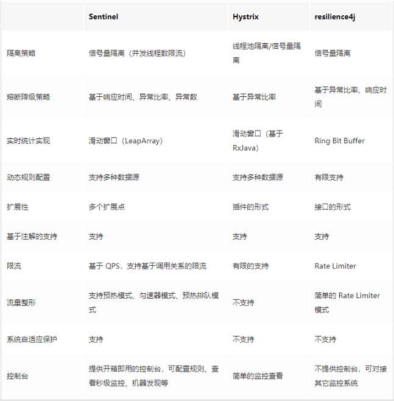 


### 10、规则持久化

是什么

> 一旦我们重启应用，sentinel规则将消失，生产环境需要将配置规则进行持久化

怎么玩

>将限流配置规则持久化进Nacos保存，只要刷新8401某个rest地址，sentinel控制台的流控规则就能看到，只要Nacos里面的配置不删除，针对8401上sentinel上的流控规则持续有效

步骤

1) 修改cloudalibaba-sentinel-service8401

2) pom

添加以下

```
<!--SpringCloud ailibaba sentinel-datasource-nacos -->
<dependency>
    <groupId>com.alibaba.csp</groupId>
    <artifactId>sentinel-datasource-nacos</artifactId>
</dependency>
```

3) yml

添加spring.cloud.sentinel.datasource

```
server:
  port: 8401

spring:
  application:
    name: cloudalibaba-sentinel-service
  cloud:
    nacos:
      discovery:
        server-addr: localhost:8848 #Nacos服务注册中心地址
    sentinel:
      transport:
        dashboard: localhost:8080 #配置Sentinel dashboard地址
        port: 8719
      datasource:
        ds1:
          nacos:
            server-addr: localhost:8848
            dataId: cloudalibaba-sentinel-service
            groupId: DEFAULT_GROUP
            data-type: json
            rule-type: flow

management:
  endpoints:
    web:
      exposure:
        include: '*'

feign:
  sentinel:
    enabled: true # 激活Sentinel对Feign的支持
```

4) 添加Nacos业务规则配置

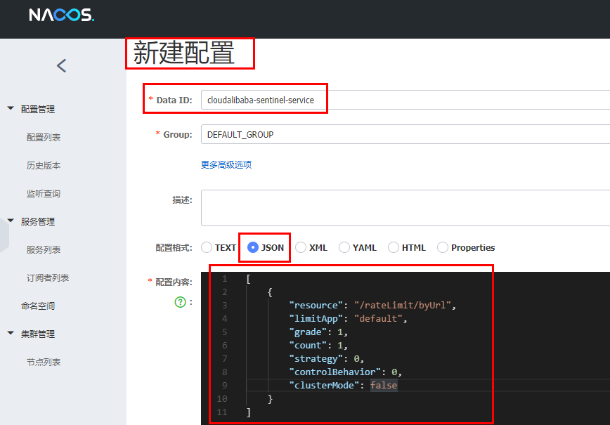 

内容解析:

```
[
    {
        "resource": "/rateLimit/byUrl",
        "limitApp": "default",
        "grade": 1,
        "count": 1,
        "strategy": 0,
        "controlBehavior": 0,
        "clusterMode": false
    }
]
```

 

5) 启动8401后刷新sentinel发现业务规则有了


6) 测试

快速访问测试接口:  http://localhost:8401/rateLimit/byUrl  

结果: 

 

停止8401再看sentinel


重新启动8401再看sentinel,  

多次调用接口 http://localhost:8401/rateLimit/byUrl

重新配置出现了，持久化验证通过

------

## 十六、SpringCloud Alibaba Seata处理分布式事务

### 1、分布式事务问题

分布式前

> 单机单库, 通常情况在serviceImpl层的实体类上写一个@Transactional注解就搞定事务问题了

分布式之后

> 多个服务多个数据库, 使用@Transactional注解无法搞定了

案例逻辑图:

 

>单体应用被拆分成微服务应用，原来的三个模块被拆分成三个独立的应用，分别使用三个独立的数据源，
>业务操作需要调用三个服务来完成。此时每个服务内部的数据一致性由本地事务来保证，但是全局的数据一致性问题没法保证。

一句话

> 一次业务操作需要跨多个数据源或需要跨多个系统进行远程调用，就会产生分布式事务问题

### 2、Seata简介

是什么

> Seata是一款开源的分布式事务解决方案，致力于在微服务架构下提供高性能和简单易用的分布式事务服务。

官网地址

> http://seata.io/zh-cn/

能干嘛

> 一个典型的分布式事务过程:
>
> ​		分布式事务处理过程的一ID+三组件模型:
>
> ​				Transaction ID XID: 全局唯一的事务ID
>
> ​						3组件概念:
>
> ​								Transaction Coordinator (TC):  事务协调器，维护全局事务的运行状态，负责协调并驱动全局事务的提交或回滚；
>
> ​								Transaction Manager (TM):  控制全局事务的边界，负责开启一个全局事务，并最终发起全局提交或全局回滚的决议;
>
> ​								Resource Manager (RM):  控制分支事务，负责分支注册、状态汇报，并接收事务协调器的指令，驱动分支（本地）事务的提交和回滚

处理过程(了解):

 

去哪下:

> 发布说明: https://github.com/seata/seata/releases

怎么玩

> 本地: @Transactional
>
> 全局: @GlobalTransactional

SEATA 的分布式交易解决方案:

 

------

### 3、Seata-Server安装

0) 本次seata是安装在window的

1) 下载版本

> 下载的是seata-server-0.9.0.zip
>
> 地址:  https://github.com/seata/seata/releases

**注:  本次学习使用的Seata-Server版本较旧，实际工作起码要使用1.0以后的版本了(且1.0之后与之前版本有较大不同, 所以下面的配置主要作为参考)**

2) 改配置

下载seata-server-0.9.0.zip解压到指定目录

> 注: 数据库相关配置, mysql5.x 和 mysql8.x有一些区别需要注意, 下面是按照8.x配置的

2.1)修改conf目录下的file.conf配置文件

先备份原始file.conf文件, 再修改该文件

主要修改：自定义事务组名称+事务日志存储模式为db+数据库连接信息 (如下)

service模块:

```
 service {
 
  vgroup_mapping.my_test_tx_group = "fsp_tx_group"
 
  default.grouplist = "127.0.0.1:8091"
  enableDegrade = false
  disable = false
  max.commit.retry.timeout = "-1"
  max.rollback.retry.timeout = "-1"
}
```

store模块:

> 注: 重点关注以下 
>
>   ```
> mode = "db"
>   ```
>
>     driver-class-name = "com.mysql.cj.jdbc.Driver"
>     url = "jdbc:mysql://127.0.0.1:3306/seata?characterEncoding=utf8&useSSL=false&serverTimezone=UTC&rewriteBatchedStatements=true"
>     user = "root"
>     password = "123456" ##你自己密码

```
 ## transaction log store
store {
  ## store mode: file、db
  mode = "db"
 
  ## file store
  file {
    dir = "sessionStore"
 
    # branch session size , if exceeded first try compress lockkey, still exceeded throws exceptions
    max-branch-session-size = 16384
    # globe session size , if exceeded throws exceptions
    max-global-session-size = 512
    # file buffer size , if exceeded allocate new buffer
    file-write-buffer-cache-size = 16384
    # when recover batch read size
    session.reload.read_size = 100
    # async, sync
    flush-disk-mode = async
  }
 
  ## database store
  db {
    ## the implement of javax.sql.DataSource, such as DruidDataSource(druid)/BasicDataSource(dbcp) etc.
    datasource = "dbcp"
    ## mysql/oracle/h2/oceanbase etc.
    db-type = "mysql"
    driver-class-name = "com.mysql.cj.jdbc.Driver"
    url = "jdbc:mysql://127.0.0.1:3306/seata?characterEncoding=utf8&useSSL=false&serverTimezone=UTC&rewriteBatchedStatements=true"
    user = "root"
    password = "123456" ##你自己密码
    min-conn = 1
    max-conn = 3
    global.table = "global_table"
    branch.table = "branch_table"
    lock-table = "lock_table"
    query-limit = 100
  }
}
```

2.2) 修改seata-server-0.9.0\seata\conf目录下的registry.conf配置文件

 

3) Seata0.9.0大坑之连接MySQL8.0

在Seata下载解压之后的lib包中包含了mysql-connector-java-5.1.30.jar包, 但我们使用的是mysql8.0.x版本, 所以需要更换jar包;

> 这个坑从发现到解决: 遇到问题  ->  看到弹幕提示jar包问题  ->  博客查找  ->  换掉mysql jar包  ->  问题解决

步骤:

> 1、通过命令`mysql --version`查看自己安装的mysql版本
>
> 2、下载对应的mysql驱动java包:  https://downloads.mysql.com/archives/c-j/   (win下zip)
>
> 
>
> 3、下载zip解压出mysql8的jar包, 并替换掉原来的mysql-connector-java-5.1.30.jar包(一定要删除原来的)
>
> 博客地址:  https://blog.csdn.net/stephen_curry300/article/details/121585707

4) 建库建表

使用mysql8.0数据库

新建库seata, 在seata库里建表, 建表语句默认在\seata-server-0.9.0\seata\conf目录里面:  db_store.sql  (sql语句直接复制到navicat执行即可)

 

5) 尝试启动

先启动Nacos端口号8848

再启动seata-server   (启动脚本在 seata-server-0.9.0\seata\bin下的 seata-server.bat)

如果seata-server启动后未报错, 说明连接mysql和nacos成功; 如果连接mysql报错可以再检查mysql配置

### 4、订单/库存/账户业务数据库准备

> 注: 以下微服务模块启动都需要先启动Nacos后启动Seata，保证两个都OK, 否则报错no available server to connect

1) 分布式事务业务说明

>这里我们会创建三个服务，一个订单服务，一个库存服务，一个账户服务。
>
>当用户下单时，会在订单服务中创建一个订单，然后通过远程调用库存服务来扣减下单商品的库存，
>再通过远程调用账户服务来扣减用户账户里面的余额，
>最后在订单服务中修改订单状态为已完成。
>
>该操作跨越三个数据库，有两次远程调用，很明显会有分布式事务问题。

业务核心流程:   下订单--->扣库存--->减账户(余额)

创建业务数据库:

> seata_order：存储订单的数据库；
>
> seata_storage：存储库存的数据库；
>
> seata_account：存储账户信息的数据库。
>
> 建库SQL:
>
> CREATE DATABASE seata_order;
>
> CREATE DATABASE seata_storage;
>
> CREATE DATABASE seata_account;

2) 按照上述3库分别建对应业务表

seata_order库下建t_order表:

```
CREATE TABLE t_order (
  `id` BIGINT(11) NOT NULL AUTO_INCREMENT PRIMARY KEY,
  `user_id` BIGINT(11) DEFAULT NULL COMMENT '用户id',
  `product_id` BIGINT(11) DEFAULT NULL COMMENT '产品id',
  `count` INT(11) DEFAULT NULL COMMENT '数量',
  `money` DECIMAL(11,0) DEFAULT NULL COMMENT '金额',
  `status` INT(1) DEFAULT NULL COMMENT '订单状态：0：创建中；1：已完结' 
) ENGINE=INNODB AUTO_INCREMENT=7 DEFAULT CHARSET=utf8;
 
SELECT * FROM t_order;
```

seata_storage库下建t_storage 表:

```
CREATE TABLE t_storage (
 `id` BIGINT(11) NOT NULL AUTO_INCREMENT PRIMARY KEY,
 `product_id` BIGINT(11) DEFAULT NULL COMMENT '产品id',
 `total` INT(11) DEFAULT NULL COMMENT '总库存',
 `used` INT(11) DEFAULT NULL COMMENT '已用库存',
 `residue` INT(11) DEFAULT NULL COMMENT '剩余库存'
) ENGINE=INNODB AUTO_INCREMENT=2 DEFAULT CHARSET=utf8;
 
 
INSERT INTO seata_storage.t_storage(`id`, `product_id`, `total`, `used`, `residue`)
VALUES ('1', '1', '100', '0', '100');
 
SELECT * FROM t_storage;
```

seata_account库下建t_account 表:

```
 
CREATE TABLE t_account (
  `id` BIGINT(11) NOT NULL AUTO_INCREMENT PRIMARY KEY COMMENT 'id',
  `user_id` BIGINT(11) DEFAULT NULL COMMENT '用户id',
  `total` DECIMAL(10,0) DEFAULT NULL COMMENT '总额度',
  `used` DECIMAL(10,0) DEFAULT NULL COMMENT '已用余额',
  `residue` DECIMAL(10,0) DEFAULT '0' COMMENT '剩余可用额度'
) ENGINE=INNODB AUTO_INCREMENT=2 DEFAULT CHARSET=utf8;
 
INSERT INTO seata_account.t_account(`id`, `user_id`, `total`, `used`, `residue`)  VALUES ('1', '1', '1000', '0', '1000');
 
SELECT * FROM t_account;
```

3) 按照上述3库分别建对应的回滚日志表(使用seata自带的):

订单-库存-账户3个库下都需要建各自的回滚日志表

找到\seata-server-0.9.0\seata\conf目录下的db_undo_log.sql

也就是下面的sql语句:

```
-- the table to store seata xid data
-- 0.7.0+ add context
-- you must to init this sql for you business databese. the seata server not need it.
-- 此脚本必须初始化在你当前的业务数据库中，用于AT 模式XID记录。与server端无关（注：业务数据库）
-- 注意此处0.3.0+ 增加唯一索引 ux_undo_log
DROP TABLE `undo_log`;
 
CREATE TABLE `undo_log` (
  `id` BIGINT(20) NOT NULL AUTO_INCREMENT,
  `branch_id` BIGINT(20) NOT NULL,
  `xid` VARCHAR(100) NOT NULL,
  `context` VARCHAR(128) NOT NULL,
  `rollback_info` LONGBLOB NOT NULL,
  `log_status` INT(11) NOT NULL,
  `log_created` DATETIME NOT NULL,
  `log_modified` DATETIME NOT NULL,
  `ext` VARCHAR(100) DEFAULT NULL,
  PRIMARY KEY (`id`),
  UNIQUE KEY `ux_undo_log` (`xid`,`branch_id`)
) ENGINE=INNODB AUTO_INCREMENT=1 DEFAULT CHARSET=utf8;
```

4) 最终效果

 


### 5、订单/库存/账户业务微服务准备

0、新建三个微服务

订单/库存/账户; 三个模块的步骤大同小异; 步骤概览如下:

 

业务核心流程:   **下订单--->扣库存--->减账户(余额)**

1、 新建订单Order-Module

1) 微服务名称:  seata-order-service2001

2) POM

    <?xml version="1.0" encoding="UTF-8"?>
    <project xmlns="http://maven.apache.org/POM/4.0.0"
             xmlns:xsi="http://www.w3.org/2001/XMLSchema-instance"
             xsi:schemaLocation="http://maven.apache.org/POM/4.0.0 http://maven.apache.org/xsd/maven-4.0.0.xsd">
        <parent>
            <groupId>com.example</groupId>
            <artifactId>MyCloud</artifactId>
            <version>0.0.1-SNAPSHOT</version>
        </parent>
        <modelVersion>4.0.0</modelVersion>
    
        <artifactId>seata-order-service2001</artifactId>
    
        <dependencies>
            <!--nacos-->
            <dependency>
                <groupId>com.alibaba.cloud</groupId>
                <artifactId>spring-cloud-starter-alibaba-nacos-discovery</artifactId>
            </dependency>
            <!--seata-->
            <dependency>
                <groupId>com.alibaba.cloud</groupId>
                <artifactId>spring-cloud-starter-alibaba-seata</artifactId>
                <exclusions>
                    <exclusion>
                        <artifactId>seata-all</artifactId>
                        <groupId>io.seata</groupId>
                    </exclusion>
                </exclusions>
            </dependency>
            <dependency>
                <groupId>io.seata</groupId>
                <artifactId>seata-all</artifactId>
                <version>0.9.0</version>
            </dependency>
            <!--feign-->
            <dependency>
                <groupId>org.springframework.cloud</groupId>
                <artifactId>spring-cloud-starter-openfeign</artifactId>
            </dependency>
            <!--web-actuator-->
            <dependency>
                <groupId>org.springframework.boot</groupId>
                <artifactId>spring-boot-starter-web</artifactId>
            </dependency>
            <dependency>
                <groupId>org.springframework.boot</groupId>
                <artifactId>spring-boot-starter-actuator</artifactId>
            </dependency>
            <!--mysql-druid-->
            <dependency>
                <groupId>mysql</groupId>
                <artifactId>mysql-connector-java</artifactId>
            </dependency>
            <dependency>
                <groupId>com.alibaba</groupId>
                <artifactId>druid-spring-boot-starter</artifactId>
                <version>1.1.10</version>
            </dependency>
            <dependency>
                <groupId>org.mybatis.spring.boot</groupId>
                <artifactId>mybatis-spring-boot-starter</artifactId>
                <version>2.0.0</version>
            </dependency>
            <dependency>
                <groupId>org.springframework.boot</groupId>
                <artifactId>spring-boot-starter-test</artifactId>
                <scope>test</scope>
            </dependency>
            <dependency>
                <groupId>org.projectlombok</groupId>
                <artifactId>lombok</artifactId>
                <optional>true</optional>
            </dependency>
        </dependencies>
    
    </project>
3) yml

```
server:
  port: 2001

spring:
  application:
    name: seata-order-service
  cloud:
    alibaba:
      seata:
        #自定义事务组名称需要与seata-server中的对应
        tx-service-group: fsp_tx_group
    nacos:
      discovery:
        server-addr: localhost:8848
  datasource:
    driver-class-name: com.mysql.cj.jdbc.Driver
    url: jdbc:mysql://127.0.0.1:3306/seata_order?characterEncoding=utf8&useSSL=false&serverTimezone=UTC&rewriteBatchedStatements=true&useInformationSchema=false
    username: root
    password: 123456

feign:
  hystrix:
    enabled: false

logging:
  level:
    io:
      seata: info

mybatis:
  mapperLocations: classpath:mapper/*.xml
  
```

> 注: Url里添加useInformationSchema=false, 否则可能报错 Failed to fetch schema of `order ``

4) resource下新增文件file.conf和registry.conf

注: seata自带file.conf和registry.conf, 但是修改稍加修改才能添加到微服务中使用, 修改后如下

file.conf:

```
transport {
  # tcp udt unix-domain-socket
  type = "TCP"
  #NIO NATIVE
  server = "NIO"
  #enable heartbeat
  heartbeat = true
  #thread factory for netty
  thread-factory {
    boss-thread-prefix = "NettyBoss"
    worker-thread-prefix = "NettyServerNIOWorker"
    server-executor-thread-prefix = "NettyServerBizHandler"
    share-boss-worker = false
    client-selector-thread-prefix = "NettyClientSelector"
    client-selector-thread-size = 1
    client-worker-thread-prefix = "NettyClientWorkerThread"
    # netty boss thread size,will not be used for UDT
    boss-thread-size = 1
    #auto default pin or 8
    worker-thread-size = 8
  }
  shutdown {
    # when destroy server, wait seconds
    wait = 3
  }
  serialization = "seata"
  compressor = "none"
}
service {
  #vgroup->rgroup
  vgroup_mapping.fsp_tx_group = "default"
  #only support single node
  default.grouplist = "127.0.0.1:8091"
  #degrade current not support
  enableDegrade = false
  #disable
  disable = false
  #unit ms,s,m,h,d represents milliseconds, seconds, minutes, hours, days, default permanent
  max.commit.retry.timeout = "-1"
  max.rollback.retry.timeout = "-1"
}

client {
  async.commit.buffer.limit = 10000
  lock {
    retry.internal = 10
    retry.times = 30
  }
  report.retry.count = 5
  tm.commit.retry.count = 1
  tm.rollback.retry.count = 1
}

## transaction log store
store {
  ## store mode: file、db
  mode = "db"

  ## file store
  file {
    dir = "sessionStore"

    # branch session size , if exceeded first try compress lockkey, still exceeded throws exceptions
    max-branch-session-size = 16384
    # globe session size , if exceeded throws exceptions
    max-global-session-size = 512
    # file buffer size , if exceeded allocate new buffer
    file-write-buffer-cache-size = 16384
    # when recover batch read size
    session.reload.read_size = 100
    # async, sync
    flush-disk-mode = async
  }

  ## database store
  db {
    ## the implement of javax.sql.DataSource, such as DruidDataSource(druid)/BasicDataSource(dbcp) etc.
    datasource = "dbcp"
    ## mysql/oracle/h2/oceanbase etc.
    db-type = "mysql"
    driver-class-name = "com.mysql.cj.jdbc.Driver"
    url = "jdbc:mysql://127.0.0.1:3306/seata?characterEncoding=utf8&useSSL=false&serverTimezone=UTC&rewriteBatchedStatements=true"
    user = "root"
    password = "123456"
    min-conn = 1
    max-conn = 3
    global.table = "global_table"
    branch.table = "branch_table"
    lock-table = "lock_table"
    query-limit = 100
  }
}
lock {
  ## the lock store mode: local、remote
  mode = "remote"

  local {
    ## store locks in user's database
  }

  remote {
    ## store locks in the seata's server
  }
}
recovery {
  #schedule committing retry period in milliseconds
  committing-retry-period = 1000
  #schedule asyn committing retry period in milliseconds
  asyn-committing-retry-period = 1000
  #schedule rollbacking retry period in milliseconds
  rollbacking-retry-period = 1000
  #schedule timeout retry period in milliseconds
  timeout-retry-period = 1000
}

transaction {
  undo.data.validation = true
  undo.log.serialization = "jackson"
  undo.log.save.days = 7
  #schedule delete expired undo_log in milliseconds
  undo.log.delete.period = 86400000
  undo.log.table = "undo_log"
}

## metrics settings
metrics {
  enabled = false
  registry-type = "compact"
  # multi exporters use comma divided
  exporter-list = "prometheus"
  exporter-prometheus-port = 9898
}

support {
  ## spring
  spring {
    # auto proxy the DataSource bean
    datasource.autoproxy = false
  }
}
```

registry.conf:

```
registry {
  # file 、nacos 、eureka、redis、zk、consul、etcd3、sofa
  type = "nacos"
 
  nacos {
    serverAddr = "localhost:8848"
    namespace = ""
    cluster = "default"
  }
  eureka {
    serviceUrl = "http://localhost:8761/eureka"
    application = "default"
    weight = "1"
  }
  redis {
    serverAddr = "localhost:6379"
    db = "0"
  }
  zk {
    cluster = "default"
    serverAddr = "127.0.0.1:2181"
    session.timeout = 6000
    connect.timeout = 2000
  }
  consul {
    cluster = "default"
    serverAddr = "127.0.0.1:8500"
  }
  etcd3 {
    cluster = "default"
    serverAddr = "http://localhost:2379"
  }
  sofa {
    serverAddr = "127.0.0.1:9603"
    application = "default"
    region = "DEFAULT_ZONE"
    datacenter = "DefaultDataCenter"
    cluster = "default"
    group = "SEATA_GROUP"
    addressWaitTime = "3000"
  }
  file {
    name = "file.conf"
  }
}
 
config {
  # file、nacos 、apollo、zk、consul、etcd3
  type = "file"
 
  nacos {
    serverAddr = "localhost"
    namespace = ""
  }
  consul {
    serverAddr = "127.0.0.1:8500"
  }
  apollo {
    app.id = "seata-server"
    apollo.meta = "http://192.168.1.204:8801"
  }
  zk {
    serverAddr = "127.0.0.1:2181"
    session.timeout = 6000
    connect.timeout = 2000
  }
  etcd3 {
    serverAddr = "http://localhost:2379"
  }
  file {
    name = "file.conf"
  }
}
```

5) domain

CommonResult

```
@Data
@AllArgsConstructor
@NoArgsConstructor
public class CommonResult<T>
{
    private Integer code;
    private String  message;
    private T       data;

    public CommonResult(Integer code, String message)
    {
        this(code,message,null);
    }
}
```

Order

```
@Data
@AllArgsConstructor
@NoArgsConstructor
public class Order
{
    private Long id;

    private Long userId;

    private Long productId;

    private Integer count;

    private BigDecimal money;

    /**
     * 订单状态：0：创建中；1：已完结
     */
    private Integer status;
}
```

6) Dao接口及实现

OrderDao

```
@Mapper
public interface OrderDao {

    /**
     * 创建订单
     */
    void create(Order order);

    /**
     * 修改订单金额
     */
    void update(@Param("userId") Long userId, @Param("status") Integer status);
}
```

OrderServiceImpl

resources文件夹下新建mapper文件夹后添加

```
<?xml version="1.0" encoding="UTF-8" ?>
<!DOCTYPE mapper PUBLIC "-//mybatis.org//DTD Mapper 3.0//EN" "http://mybatis.org/dtd/mybatis-3-mapper.dtd" >

<mapper namespace="com.atguigu.springcloud.alibaba.dao.OrderDao">

    <resultMap id="BaseResultMap" type="com.atguigu.springcloud.alibaba.domain.Order">
        <id column="id" property="id" jdbcType="BIGINT"/>
        <result column="user_id" property="userId" jdbcType="BIGINT"/>
        <result column="product_id" property="productId" jdbcType="BIGINT"/>
        <result column="count" property="count" jdbcType="INTEGER"/>
        <result column="money" property="money" jdbcType="DECIMAL"/>
        <result column="status" property="status" jdbcType="INTEGER"/>
    </resultMap>

    <insert id="create">
        INSERT INTO `t_order` (`id`, `user_id`, `product_id`, `count`, `money`, `status`)
        VALUES (NULL, #{userId}, #{productId}, #{count}, #{money}, 0);
    </insert>

    <update id="update">
        UPDATE `t_order`
        SET status = 1
        WHERE user_id = #{userId} AND status = #{status};
    </update>
</mapper>
```

7) Service接口及实现

OrderService

```
public interface OrderService {

    /**
     * 创建订单
     */
    void create(Order order);
}
```

OrderServiceImpl

```
@Service
@Slf4j
public class OrderServiceImpl implements OrderService
{
    @Resource
    private OrderDao orderDao;

    @Resource
    private StorageService storageService;

    @Resource
    private AccountService accountService;

    /**
     * 创建订单->调用库存服务扣减库存->调用账户服务扣减账户余额->修改订单状态
     * 简单说：
     * 下订单->减库存->减余额->改状态
     */
    @Override
    @GlobalTransactional(name = "fsp-create-order",rollbackFor = Exception.class)
    public void create(Order order) {
        log.info("------->下单开始");
        //本应用创建订单
        orderDao.create(order);

        //远程调用库存服务扣减库存
        log.info("------->order-service中扣减库存开始");
        storageService.decrease(order.getProductId(),order.getCount());
        log.info("------->order-service中扣减库存结束");

        //远程调用账户服务扣减余额
        log.info("------->order-service中扣减余额开始");
        accountService.decrease(order.getUserId(),order.getMoney());
        log.info("------->order-service中扣减余额结束");

        //修改订单状态为已完成
        log.info("------->order-service中修改订单状态开始");
        orderDao.update(order.getUserId(),0);
        log.info("------->order-service中修改订单状态结束");

        log.info("------->下单结束");
    }
}
```

StorageService

```
@FeignClient(value = "seata-storage-service")
public interface StorageService {

    /**
     * 扣减库存
     */
    @PostMapping(value = "/storage/decrease")
    CommonResult decrease(@RequestParam("productId") Long productId, @RequestParam("count") Integer count);
}
```

AccountService

```
@FeignClient(value = "seata-account-service")
public interface AccountService {

    /**
     * 扣减账户余额
     */
    //@RequestMapping(value = "/account/decrease", method = RequestMethod.POST, produces = "application/json; charset=UTF-8")
    @PostMapping("/account/decrease")
    CommonResult decrease(@RequestParam("userId") Long userId, @RequestParam("money") BigDecimal money);
}
```

8) Controller

```
@RestController
public class OrderController {

    @Autowired
    private OrderService orderService;

    /**
     * 创建订单
     */
    @GetMapping("/order/create")
    public CommonResult create( Order order) {
        orderService.create(order);
        return new CommonResult(200, "订单创建成功!");
    }
}
```

9) Config配置

MyBatisConfig

```
@Configuration
@MapperScan({"com.example.demo.dao})
public class MyBatisConfig {
}
```

DataSourceProxyConfig

```
@Configuration
public class DataSourceProxyConfig {

    @Value("${mybatis.mapperLocations}")
    private String mapperLocations;

    @Bean
    @ConfigurationProperties(prefix = "spring.datasource")
    public DataSource druidDataSource(){
        return new DruidDataSource();
    }

    @Bean
    public DataSourceProxy dataSourceProxy(DataSource dataSource) {
        return new DataSourceProxy(dataSource);
    }

    @Bean
    public SqlSessionFactory sqlSessionFactoryBean(DataSourceProxy dataSourceProxy) throws Exception {
        SqlSessionFactoryBean sqlSessionFactoryBean = new SqlSessionFactoryBean();
        sqlSessionFactoryBean.setDataSource(dataSourceProxy);
        sqlSessionFactoryBean.setMapperLocations(new PathMatchingResourcePatternResolver().getResources(mapperLocations));
        sqlSessionFactoryBean.setTransactionFactory(new SpringManagedTransactionFactory());
        return sqlSessionFactoryBean.getObject();
    }

}
```

10) 主启动

```
@EnableDiscoveryClient
@EnableFeignClients
@SpringBootApplication(exclude = DataSourceAutoConfiguration.class)//取消数据源的自动创建
public class SeataOrderMainApp2001
{

    public static void main(String[] args)
    {
        SpringApplication.run(SeataOrderMainApp2001.class, args);
    }
}
```

11) 小结

以上就是订单模块seata-order-service2001的创建步骤,  其中涉及到分布式事务的核心类在OrderServiceImpl中, 

其中调用了dao或service的四个方法:

> 1、orderDao.create()
>
> 2、storageService.decrease()
>
> 3、accountService.decrease()
>
> 4、orderDao.update()

这四个方法中1和4是调用自身的dao层, 使用的是seata_order库, 

而2是通过OpenFeign实际要去调用另一个微服务seata-storage-service2002的方法, 这个模块使用的库是seata_storage,

同理3是要去调用另一个微服务seata-account-service2003的方法, 这个模块使用的库是seata_account;(另外两个模块就在后续)


因此, 这块 **下订单--->扣库存--->减账户(余额)** 的逻辑涉及到了多服务多库; 也就是需要进行分布式事务处理;

------

2、新建库存Storage-Module

1) seata-storage-service2002

2) POM

和seata-order-service2001服务的pom基本一样

3) yml

和seata-order-service2001服务的yml区别不大, 区别主要是端口号、服务名、数据源

```
server:
  port: 2002

spring:
  application:
    name: seata-storage-service
  cloud:
    alibaba:
      seata:
        tx-service-group: fsp_tx_group
    nacos:
      discovery:
        server-addr: localhost:8848
  datasource:
    driver-class-name: com.mysql.cj.jdbc.Driver
    url: jdbc:mysql://127.0.0.1:3306/seata_storage?characterEncoding=utf8&useSSL=false&serverTimezone=UTC&rewriteBatchedStatements=true
    username: root
    password: 123456

logging:
  level:
    io:
      seata: info

mybatis:
  mapperLocations: classpath:mapper/*.xml
```

4) resource下新增文件file.conf和registry.conf

file.conf、registry.conf

内容和seata-order-service2001服务的file.conf、registry.conf一模一样, 可直接copy

5) domain

CommonResult

```
@Data
@AllArgsConstructor
@NoArgsConstructor
public class CommonResult<T>
{
    private Integer code;
    private String  message;
    private T       data;

    public CommonResult(Integer code, String message)
    {
        this(code,message,null);
    }
}
```

Storage 

```
@Data
public class Storage {

    private Long id;

    /**
     * 产品id
     */
    private Long productId;

    /**
     * 总库存
     */
    private Integer total;

    /**
     * 已用库存
     */
    private Integer used;

    /**
     * 剩余库存
     */
    private Integer residue;
}
```

6) Dao接口及实现

StorageDao

```
@Mapper
public interface StorageDao {

    /**
     * 扣减库存
     */
    void decrease(@Param("productId") Long productId, @Param("count") Integer count);
}
```

StorageMapper.xml

resources文件夹下新建mapper文件夹后添加

```
<?xml version="1.0" encoding="UTF-8" ?>
<!DOCTYPE mapper PUBLIC "-//mybatis.org//DTD Mapper 3.0//EN" "http://mybatis.org/dtd/mybatis-3-mapper.dtd" >


<mapper namespace="com.atguigu.springcloud.alibaba.dao.StorageDao">

    <resultMap id="BaseResultMap" type="com.atguigu.springcloud.alibaba.domain.Storage">
        <id column="id" property="id" jdbcType="BIGINT"/>
        <result column="product_id" property="productId" jdbcType="BIGINT"/>
        <result column="total" property="total" jdbcType="INTEGER"/>
        <result column="used" property="used" jdbcType="INTEGER"/>
        <result column="residue" property="residue" jdbcType="INTEGER"/>
    </resultMap>

    <update id="decrease">
        UPDATE t_storage
        SET used    = used + #{count},
            residue = residue - #{count}
        WHERE product_id = #{productId}
    </update>

</mapper>
```

7) Service接口及实现

StorageService

```
public interface StorageService {
    /**
     * 扣减库存
     */
    void decrease(Long productId, Integer count);
}
```

StorageServiceImpl 

```
@Service
public class StorageServiceImpl implements StorageService {

    private static final Logger LOGGER = LoggerFactory.getLogger(StorageServiceImpl.class);

    @Resource
    private StorageDao storageDao;

    /**
     * 扣减库存
     */
    @Override
    public void decrease(Long productId, Integer count) {
        LOGGER.info("------->storage-service中扣减库存开始");
        storageDao.decrease(productId,count);
        LOGGER.info("------->storage-service中扣减库存结束");
    }
}
```

8) Controller

```
@RestController
public class StorageController {

    @Autowired
    private StorageService storageService;

    /**
     * 扣减库存
     */
    @RequestMapping("/storage/decrease")
    public CommonResult decrease(Long productId, Integer count) {
        storageService.decrease(productId, count);
        return new CommonResult(200,"扣减库存成功！");
    }
}
```

9) Config配置

MyBatisConfig

```
@Configuration
@MapperScan({"com.example.demo.dao})
public class MyBatisConfig {
}
```

DataSourceProxyConfig

```
@Configuration
public class DataSourceProxyConfig {

    @Value("${mybatis.mapperLocations}")
    private String mapperLocations;

    @Bean
    @ConfigurationProperties(prefix = "spring.datasource")
    public DataSource druidDataSource(){
        return new DruidDataSource();
    }

    @Bean
    public DataSourceProxy dataSourceProxy(DataSource dataSource) {
        return new DataSourceProxy(dataSource);
    }

    @Bean
    public SqlSessionFactory sqlSessionFactoryBean(DataSourceProxy dataSourceProxy) throws Exception {
        SqlSessionFactoryBean sqlSessionFactoryBean = new SqlSessionFactoryBean();
        sqlSessionFactoryBean.setDataSource(dataSourceProxy);
        sqlSessionFactoryBean.setMapperLocations(new PathMatchingResourcePatternResolver().getResources(mapperLocations));
        sqlSessionFactoryBean.setTransactionFactory(new SpringManagedTransactionFactory());
        return sqlSessionFactoryBean.getObject();
    }

}
```

10) 主启动

```
@SpringBootApplication(exclude = DataSourceAutoConfiguration.class)
@EnableDiscoveryClient
@EnableFeignClients
public class SeataStorageServiceApplication2002 {

    public static void main(String[] args) {
        SpringApplication.run(SeataStorageServiceApplication2002.class, args);
    }

}
```


3、新建账户Account-Module

1) seata-account-service2003

2) POM

和seata-order-service2001服务的pom基本一样

3) yml

和seata-order-service2001服务的yml区别不大, 区别主要是端口号、服务名、数据源

```
server:
  port: 2003

spring:
  application:
    name: seata-account-service
  cloud:
    alibaba:
      seata:
        tx-service-group: fsp_tx_group
    nacos:
      discovery:
        server-addr: localhost:8848
  datasource:
    driver-class-name: com.mysql.cj.jdbc.Driver
    url: jdbc:mysql://127.0.0.1:3306/seata_account?characterEncoding=utf8&useSSL=false&serverTimezone=UTC&rewriteBatchedStatements=true
    username: root
    password: 123456

feign:
  hystrix:
    enabled: false

logging:
  level:
    io:
      seata: info

mybatis:
  mapperLocations: classpath:mapper/*.xml
```

4) resource下新增文件file.conf和registry.conf

file.conf、registry.conf

内容和seata-order-service2001服务的file.conf、registry.conf一模一样, 可直接copy

5) domain

CommonResult

```
@Data
@AllArgsConstructor
@NoArgsConstructor
public class CommonResult<T>
{
    private Integer code;
    private String  message;
    private T       data;

    public CommonResult(Integer code, String message)
    {
        this(code,message,null);
    }
}
```

Account

```
@Data
@AllArgsConstructor
@NoArgsConstructor
public class Account {

    private Long id;

    /**
     * 用户id
     */
    private Long userId;

    /**
     * 总额度
     */
    private BigDecimal total;

    /**
     * 已用额度
     */
    private BigDecimal used;

    /**
     * 剩余额度
     */
    private BigDecimal residue;
}
```

6) Dao接口及实现

AccountDao

```
@Mapper
public interface AccountDao {

    /**
     * 扣减账户余额
     */
    void decrease(@Param("userId") Long userId, @Param("money") BigDecimal money);
}
```

AccountMapper.xml

resources文件夹下新建mapper文件夹后添加

```
<?xml version="1.0" encoding="UTF-8" ?>
<!DOCTYPE mapper PUBLIC "-//mybatis.org//DTD Mapper 3.0//EN" "http://mybatis.org/dtd/mybatis-3-mapper.dtd" >

<mapper namespace="com.atguigu.springcloud.alibaba.dao.AccountDao">

    <resultMap id="BaseResultMap" type="com.atguigu.springcloud.alibaba.domain.Account">
        <id column="id" property="id" jdbcType="BIGINT"/>
        <result column="user_id" property="userId" jdbcType="BIGINT"/>
        <result column="total" property="total" jdbcType="DECIMAL"/>
        <result column="used" property="used" jdbcType="DECIMAL"/>
        <result column="residue" property="residue" jdbcType="DECIMAL"/>
    </resultMap>

    <update id="decrease">
        UPDATE t_account
        SET
          residue = residue - #{money},used = used + #{money}
        WHERE
          user_id = #{userId};
    </update>

</mapper>
```

7) Service接口及实现

AccountService

```
public interface AccountService {

    /**
     * 扣减账户余额
     * @param userId 用户id
     * @param money 金额
     */
    void decrease(@RequestParam("userId") Long userId, @RequestParam("money") BigDecimal money);
}
```

AccountServiceImpl 

```
@Service
public class AccountServiceImpl implements AccountService {

    private static final Logger LOGGER = LoggerFactory.getLogger(AccountServiceImpl.class);


    @Resource
    AccountDao accountDao;

    /**
     * 扣减账户余额
     */
    @Override
    public void decrease(Long userId, BigDecimal money) {
        LOGGER.info("------->account-service中扣减账户余额开始");
        //模拟超时异常，全局事务回滚
        //暂停几秒钟线程
        //try { TimeUnit.SECONDS.sleep(30); } catch (InterruptedException e) { e.printStackTrace(); }
        accountDao.decrease(userId,money);
        LOGGER.info("------->account-service中扣减账户余额结束");
    }
}
```

8) Controller

@RestController
public class AccountController {

    @Resource
    AccountService accountService;
    
    /**
     * 扣减账户余额
     */
    @RequestMapping("/account/decrease")
    public CommonResult decrease(@RequestParam("userId") Long userId, @RequestParam("money") BigDecimal money){
        accountService.decrease(userId,money);
        return new CommonResult(200,"扣减账户余额成功！");
    }
}

9)Config配置

MyBatisConfig

```
@Configuration
@MapperScan({"com.example.demo.dao})
public class MyBatisConfig {
}
```

DataSourceProxyConfig

```
@Configuration
public class DataSourceProxyConfig {

    @Value("${mybatis.mapperLocations}")
    private String mapperLocations;

    @Bean
    @ConfigurationProperties(prefix = "spring.datasource")
    public DataSource druidDataSource(){
        return new DruidDataSource();
    }

    @Bean
    public DataSourceProxy dataSourceProxy(DataSource dataSource) {
        return new DataSourceProxy(dataSource);
    }

    @Bean
    public SqlSessionFactory sqlSessionFactoryBean(DataSourceProxy dataSourceProxy) throws Exception {
        SqlSessionFactoryBean sqlSessionFactoryBean = new SqlSessionFactoryBean();
        sqlSessionFactoryBean.setDataSource(dataSourceProxy);
        sqlSessionFactoryBean.setMapperLocations(new PathMatchingResourcePatternResolver().getResources(mapperLocations));
        sqlSessionFactoryBean.setTransactionFactory(new SpringManagedTransactionFactory());
        return sqlSessionFactoryBean.getObject();
    }

}
```

10) 主启动

```
@SpringBootApplication(exclude = DataSourceAutoConfiguration.class)
@EnableDiscoveryClient
@EnableFeignClients
public class SeataAccountMainApp2003
{
    public static void main(String[] args)
    {
        SpringApplication.run(SeataAccountMainApp2003.class, args);
    }
}
```

11) 小结

至此, 一个涉及到分布式事务的几个微服务的准备工作已经做好, 下面开始测试

### 6、Test

0) 测试前, 先把上述代码中写的@GlobalTransactional注解去掉, 之后再加上, 以观察加不加该注解的区别;

1) 数据库初始情况:

 

2) 正常下单

访问即下单: http://localhost:2001/order/create?userId=1&productId=1&count=10&money=100

数据库情况

 

结果: 

可以发现

订单表已经成功创建一个新的订单, 

库存表使用加10, 余量减10

账户表使用加100, 余额减100

符合预期	->	正常

3) 超时异常，没加@GlobalTransactional

AccountServiceImpl添加超时   (打开超时相关代码的注解)

数据库情况:

 

故障情况:

当库存和账户金额扣减后，订单状态并没有设置为已经完成，没有从零改为1 (而且由于feign的重试机制，账户余额还有可能被多次扣减)

结果:

可以发现, 订单已经创建, 库存和账户的业务也执行了, 但是订单状态的不对, 

就是说客户花了钱, 库存在系统上也减少了, 但是却并没有真正下单;

分析:

 

4) 超时异常，添加@GlobalTransactional

AccountServiceImpl添加超时 (保持睡眠代码打开)

OrderServiceImpl中使用注解@GlobalTransactional

```
@GlobalTransactional(name = "fsp-create-order",rollbackFor = Exception.class)
public void create(Order order)
{
。。。。。。
}
```

结果:

下单后数据库数据并没有任何改变, 记录都添加不进来

这说明发生异常之后, 事务发生了回滚, 也就是说@GlobalTransactional注解起到了全局回滚的作用

(这里的全局指的是, 该注解可以控制多模块多数据库的事务)

### 7、一部分补充

0) Seata

> 2019年1月份蚂蚁金服和阿里巴巴共同开源的分布式事务解决方案
>
> Simple Extensible Autonomous Transaction Architecture，简单可扩展自治事务框架

> 注: 2020起始，参加工作后用1.0以后的版本

1) 再看TC/TM/RM三大组件

 

2) 分布式事务的执行流程

> TM 开启分布式事务（TM 向 TC 注册全局事务记录）
>
> 按业务场景，编排数据库、服务等事务内资源（RM 向 TC 汇报资源准备状态 ）
>
> TM 结束分布式事务，事务一阶段结束（TM 通知 TC 提交/回滚分布式事务）
>
> TC 汇总事务信息，决定分布式事务是提交还是回滚
>
> TC 通知所有 RM 提交/回滚 资源，事务二阶段结束

3) AT模式如何做到对业务的无侵入 (了解)

3.1) 是什么

 

3.2) 一阶段加载

 

3.2) 二阶段提交

 

3.2) 二阶段回滚

 

4) seata小结 

以上就是seata的介绍;

简单来说, 对于seata  使用相当简单, 配置较为复杂, 底层相当复杂


------

## 十七、预告

进阶:  k8s + docker