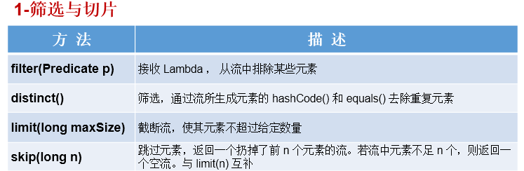
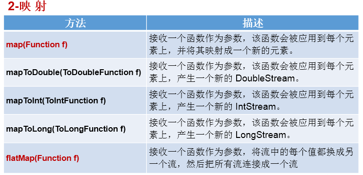
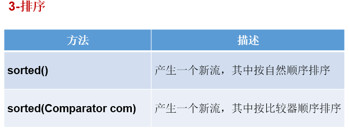
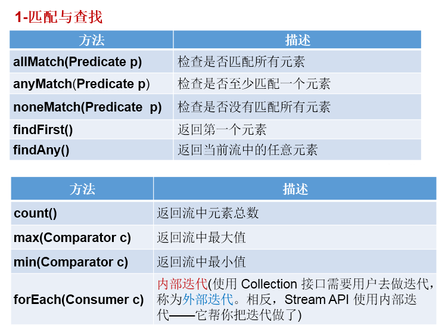
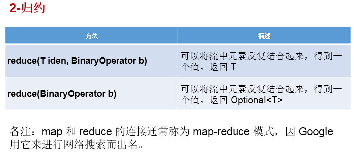
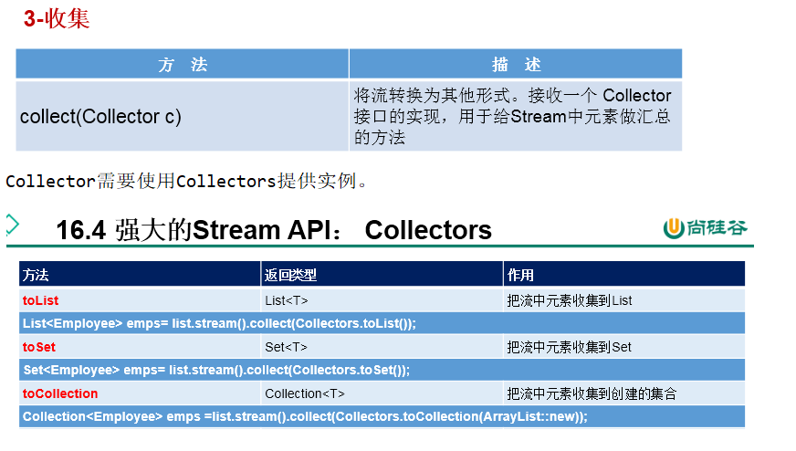

# java8的几个新特性

## 一、lambda表达式

```
语法： 1. () -> 执行语句;	
	  2. a -> 执行语句;
	  3. (a,b) -> 执行语句;
	  
格式:  -> :lambda操作符 或 箭头操作符
	  ->左边：lambda形参列表 （其实就是接口中的抽象方法的形参列表)
	  ->右边：lambda体 （其实就是重写的抽象方法的方法体)
	  
特点:	 ->左边：1)lambda形参列表的参数类型可以省略(类型推断)
			 2)如果lambda形参列表只一个参数，其一对()也可以省略
	  ->右边：1)执行语句可以用{}包裹起来,多条执行语句必须包裹,一条时可以省略{}
	  		 2)一条执行语句时,无论有没有返回值,{}都可以去掉,此时不需要且不能写return

本质:  Lambda表达式的本质：作为函数式接口的实例
	  (注: js、python等语言中的lambda是个函数,而java引进来后的lambda表达式是个对象)

场景:  当需要new一个接口的匿名实现类且该接口只有一个抽象方法时,可以使用lambda表达式
```

举例:

```
举例一：
@Test
public void test1(){

    Runnable r1 = new Runnable() {
        @Override
        public void run() {
            System.out.println("我爱北京天安门");
        }
    };

    r1.run();

    System.out.println("***********************");

    Runnable r2 = () -> System.out.println("我爱北京故宫");

    r2.run();
}

举例二：
@Test
public void test2(){

    Comparator<Integer> com1 = new Comparator<Integer>() {
        @Override
        public int compare(Integer o1, Integer o2) {
            return Integer.compare(o1,o2);
        }
    };

    int compare1 = com1.compare(12,21);
    System.out.println(compare1);

    System.out.println("***********************");
    //Lambda表达式的写法
    Comparator<Integer> com2 = (o1,o2) -> Integer.compare(o1,o2);

    int compare2 = com2.compare(32,21);
    System.out.println(compare2);


    System.out.println("***********************");
    //方法引用
    Comparator<Integer> com3 = Integer :: compare;

    int compare3 = com3.compare(32,21);
    System.out.println(compare3);
}
```

## 二、函数式接口

> 如果一个接口中，只声明了一个抽象方法，则此接口就称为函数式接口。
>
> 例如 
>
> ```
> @FunctionalInterface //声明为函数式接口,不写也是函数式接口
> public interface Runnable {
>     public abstract void run();
> }
> 或
> @FunctionalInterface
> public interface Comparator<T> {
>     int compare(T o1, T o2);
>     // 继承自object,不属于自身方法
>     boolean equals(Object obj);
>     // 默认方法
>     default Comparator<T> reversed() {
>         return Collections.reverseOrder(this);
>     }
>     ...
>     // 扩展: 1)jdk8中,接口中的方法并非都是抽象方法,除了defalut和static外,接口完全有可能重新声明Object类的方法，如toString或clone，这些声明有可能会让方法不再是抽象的。(java API中的一些接口会重新声明Object方法来附加javadoc注释)
>     		2)接口Comparator中的equals并不是抽象方法,它是重新声明的object的
>     		3)根据“类优先”规则，会忽略Comparator接口中的equals方法，故而只需实现compare方法即可
> }
> ```

> 我们可以在一个接口上使用 @FunctionalInterface 注解，这样做可以检查它是否是一个函数式接口。
>
> 注: 即使不写@FunctionalInterface也不影响他是个函数式接口,类似于@Override注解(不写也是重写),而写上注解可以起到检查作用

## 三、方法引用

```
理解:
	方法引用是lambda表达式的一个语法糖,可以看做是Lambda表达式进一步的简化形式,
	本质上，方法引用就是Lambda表达式，也就是函数式接口的一个实例。

格式：
	类(或对象) :: 方法名
	
分为如下的三种情况：
*    情况1     对象 :: 非静态方法
*    情况2     类 :: 静态方法
*
*    情况3     类 :: 非静态方法

要求：
	1)要求接口中的抽象方法的形参列表和返回值类型与方法引用的方法的形参列表和返回值类型相同！（针对于情况1和情况2）
	2)当函数式接口方法的第一个参数是需要引用方法的调用者，并且第二个参数是需要引用方法的参数(或无参数)时：ClassName::methodName（针对于情况3）

注: 1)方法引用和函数式接口的都是基于lambda表达式而存在的
	2) 可以理解为,满足一定条件后,匿名接口实现类的写法可以简写为lambda表达式,而再满足某些条件后,可以再次简写为方法引用形式
```

举例:

```
// 情况一：对象 :: 实例方法
//Consumer中的void accept(T t)
//PrintStream中的void println(T t)
@Test
public void test1() {
	Consumer<String> con1 = str -> System.out.println(str);
	con1.accept("北京");

	System.out.println("*******************");
	PrintStream ps = System.out;
	Consumer<String> con2 = ps::println;
	con2.accept("beijing");
}

// 情况二：类 :: 静态方法
//Comparator中的int compare(T t1,T t2)
//Integer中的int compare(T t1,T t2)
@Test
public void test3() {
	Comparator<Integer> com1 = (t1,t2) -> Integer.compare(t1,t2);
	System.out.println(com1.compare(12,21));

	System.out.println("*******************");

	Comparator<Integer> com2 = Integer::compare;
	System.out.println(com2.compare(12,3));

}

// 情况三：类 :: 实例方法  (有难度)
// Comparator中的int comapre(T t1,T t2)
// String中的int t1.compareTo(t2)
@Test
public void test5() {
	Comparator<String> com1 = (s1,s2) -> s1.compareTo(s2);
	System.out.println(com1.compare("abc","abd"));

	System.out.println("*******************");

	Comparator<String> com2 = String :: compareTo;
	System.out.println(com2.compare("abd","abm"));
}

// 情况三：类 :: 实例方法
// Function中的R apply(T t)
// Employee中的String getName();
@Test
public void test7() {
	Employee employee = new Employee(1001, "Jerry", 23, 6000);


	Function<Employee,String> func1 = e -> e.getName();
	System.out.println(func1.apply(employee));

	System.out.println("*******************");

	Function<Employee,String> func2 = Employee::getName;
	System.out.println(func2.apply(employee));

}
```

扩展: 构造器引用和数组引用

1.构造器引用格式：	类名::new

2.构造器引用使用要求：
和方法引用类似，函数式接口的抽象方法的形参列表和构造器的形参列表一致。抽象方法的返回值类型即为构造器所属的类的类型

3.构造器引用举例：

```
   @Test
   public void test1(){

       Supplier<Employee> sup = new Supplier<Employee>() {
           @Override
           public Employee get() {
               return new Employee();
           }
       };
       System.out.println("*******************");

       Supplier<Employee>  sup1 = () -> new Employee();
       System.out.println(sup1.get());

       System.out.println("*******************");

       Supplier<Employee>  sup2 = Employee :: new;
       System.out.println(sup2.get());
   }

//Function中的R apply(T t)
   @Test
   public void test2(){
       Function<Integer,Employee> func1 = id -> new Employee(id);
       Employee employee = func1.apply(1001);
       System.out.println(employee);

       System.out.println("*******************");

       Function<Integer,Employee> func2 = Employee :: new;
       Employee employee1 = func2.apply(1002);
       System.out.println(employee1);

   }

//BiFunction中的R apply(T t,U u)
   @Test
   public void test3(){
       BiFunction<Integer,String,Employee> func1 = (id,name) -> new Employee(id,name);
       System.out.println(func1.apply(1001,"Tom"));

       System.out.println("*******************");

       BiFunction<Integer,String,Employee> func2 = Employee :: new;
       System.out.println(func2.apply(1002,"Tom"));

   }
```

4.数组引用格式：
数组类型[] :: new

5.数组引用举例：
//Function中的R apply(T t)

```
@Test
public void test4(){
    Function<Integer,String[]> func1 = length -> new String[length];
    String[] arr1 = func1.apply(5);
    System.out.println(Arrays.toString(arr1));

    System.out.println("*******************");
    
    Function<Integer,String[]> func2 = String[] :: new;
    String[] arr2 = func2.apply(10);
    System.out.println(Arrays.toString(arr2));

}
```

注:  构造器引用和数组引用类似于方法引用, 效果上来看都是在lambda表达式上省略了形参(通过类型推断);

## 四、Stream Api

```
1.Stream API的理解：
	1.1 Stream关注的是对数据的运算，与CPU打交道
		集合关注的是数据的存储，与内存打交道
		
	1.2 java8提供了一套api,使用这套api可以对内存中的数据进行过滤、排序、映射、归约等操作。类似于sql对数据库中表的相关操作。


2.注意点：
* ①Stream 自己不会存储元素。
* ②Stream 不会改变源对象。相反，他们会返回一个持有结果的新Stream。
* ③Stream 操作是延迟执行的。这意味着他们会等到需要结果的时候才执行。

3.Stream的使用流程：
* ① Stream的实例化
* ② 一系列的中间操作（过滤、映射、...)
* ③ 终止操作

4.使用流程的注意点：
* 4.1 一个中间操作链，对数据源的数据进行处理
* 4.2 一旦执行终止操作，就执行中间操作链，并产生结果。之后，不会再被使用
* 4.3 stream的使用可以没有中间操作,但是一定有实例化和终止操作

5.步骤一：Stream实例化
//创建 Stream方式一：通过集合 
    @Test
    public void test1(){
        List<Employee> employees = EmployeeData.getEmployees();

		// default Stream<E> stream() : 返回一个顺序流
        Stream<Employee> stream = employees.stream();

		// 返回一个并行流
        Stream<Employee> parallelStream = employees.parallelStream();

    }

    //	创建 Stream方式二：通过数组 (直接Arrays.stream(arr)的方式创建流)
    @Test
    public void test2(){
        int[] arr = new int[]{1,2,3,4,5,6};
        //调用Arrays类的static <T> Stream<T> stream(T[] array): 返回一个流
        IntStream stream = Arrays.stream(arr);

        Employee e1 = new Employee(1001,"Tom");
        Employee e2 = new Employee(1002,"Jerry");
        Employee[] arr1 = new Employee[]{e1,e2};
        Stream<Employee> stream1 = Arrays.stream(arr1);

    }
    //创建 Stream方式三：通过Stream的of()  
    @Test
    public void test3(){

        Stream<Integer> stream = Stream.of(1, 2, 3, 4, 5, 6);

    }

    //创建 Stream方式四：创建无限流 (了解)(这种方式可以造数据)
    @Test
    public void test4(){

//      迭代
//      public static<T> Stream<T> iterate(final T seed, final UnaryOperator<T> f)
        //遍历前10个偶数
        Stream.iterate(0, t -> t + 2).limit(10).forEach(System.out::println);


//      生成
//      public static<T> Stream<T> generate(Supplier<T> s)
        Stream.generate(Math::random).limit(10).forEach(System.out::println);

    }
    总结: 创建stream流有四种方式,主要的创建方式是通过集合(直接list.stream()或list.parallelStream()的方式创建流)和数组(直接Arrays.stream(arr)的方式创建流)

```

6.步骤二：中间操作







7.步骤三：终止操作







## 五、Optional类的使用

1. 理解：为了解决java中的空指针问题而生！
   Optional<T> 类(java.util.Optional) 是一个容器类，它可以保存类型T的值，代表这个值存在。或者仅仅保存null
   ，表示这个值不存在。原来用 null 表示一个值不存在，现在 Optional 可以更好的表达这个概念。并且可以避
   免空指针异常。

2. 常用api:

```
//返回空的 Optional 实例。
static <T> Optional<T> empty()

//如果在这个Optional中包含这个值，返回值，否则抛出异常：NoSuchElementException
T get()

//如果值存在则方法会返回true，否则返回 false。
boolean isPresent()

//返回一个指定非null值的Optional。
static <T> Optional<T> of(T value)

//如果为非空，返回 Optional 描述的指定值，否则返回空的 Optional。
static <T> Optional<T> ofNullable(T value)

//T orElse(T other)
T orElse(T other)
```

> 总结:  以目前的水平来看此类,没有发现任何价值,像极了饮鸠止渴

备注: jdk8除了以上主要特性,还有一些其它如 新时间日期Api等.